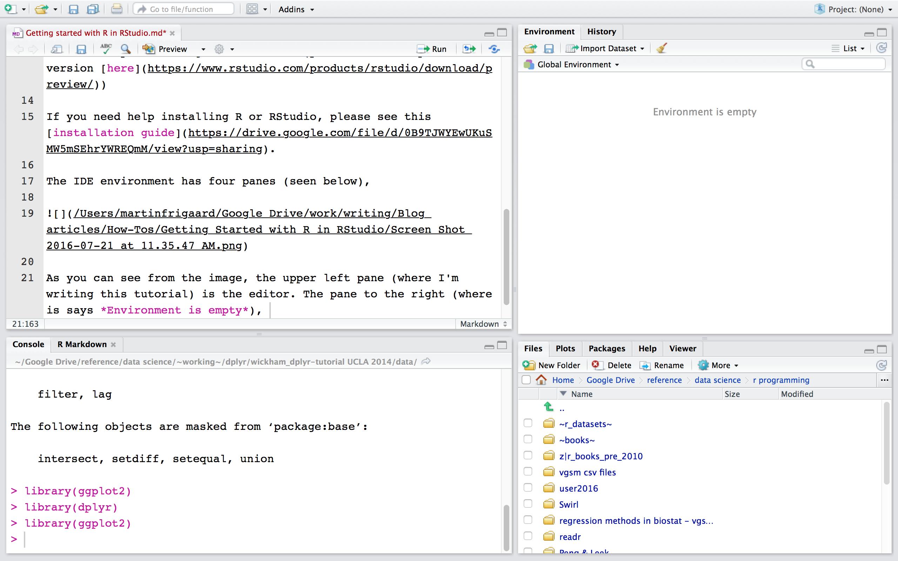
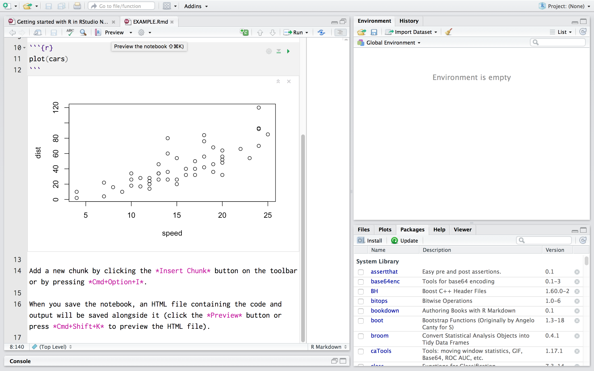

Getting Started in RStudio Notebooks
================
Martin Frigaard
2019-05-21

# Getting Started in RStudio Notebooks

R is a powerful statistical programming language for manipulating,
graphing, and modeling data. One of the major positive aspects of R is
that it’s open-source (free). But “free” in this case does not
necessarily mean “easy.” Learning to program in R is time-consuming and
occasionally frustrating, but, fortunately, the number of helpful tools
and packages is always growing.

## Enter RStudio

RStudio is an integrated development environment (IDE) that streamlines
the R programming workflow into an easy to read layout. RStudio also
includes useful tools (referred to as packages) for data manipulation
(`dplyr`), cleaning (`tidyr`), visualizations (`ggplot2`), report
writing (`rmarkdown` & `knitr`), and publishing to the web (`shiny` &
`ggviz`).

Just like R, RStudio is free. They’ve also recently released [R Markdown
Notebooks](http://rmarkdown.rstudio.com/r_notebooks.html), a seamless
integration of code, plain text, and results that can be exported into
PDF, .docx, or HTML formatted files.

## Getting started

Start out by installing [R](https://cran.r-project.org/bin/macosx/) and
RStudio (you’ll need the preview version
[here](https://www.rstudio.com/products/rstudio/download/preview/))

If you need help installing R or RStudio, please see [this installation
guide](https://drive.google.com/file/d/0B9TJWYEwUKuSMW5mSEhrYWREQmM/view).

The IDE environment has four panes (seen below),

<!-- -->

As you can see, the upper-left pane is the **editor**. The pane in the
upper-right, where it says “*Environment is empty*,” will show the
working dataset. The lower-left pane is called the **console**, which
runs the R code. And the pane in the bottom-right will display my
**results**.

To get a better understanding of the RStudio IDE, check out this
tutorial from
[Princeton](http://dss.princeton.edu/training/RStudio101.pdf).

## Opening a New Notebook

To get started, click on “**File**” \> “**New File**” \> “**R
Notebook**”. R Notebooks automatically start off with a title and some
sample code. The header is written in
[YAML](https://en.wikipedia.org/wiki/YAML), which stands is used to
configure the R markdown document. The rest of the file is written in R
Markdown, an R-flavored version of the markdown
[language](https://en.wikipedia.org/wiki/Markdown). To see how the code
snippets is woven into the .html, save the file and click on the small
“Play” arrow button right above “Run Current Chunk.”

<!-- -->

<!-- -->

R Notebook, as you can see, can generate an Html preview of your R
Notebook file that does a great job of combining markdown text, R code,
and results in a clean, crisp, easy-to-share finished product.

## Getting started with R: syntax, numbers and text

You can use RStudio as a calculator. Type 2 + 2 directly into the
console and press enter. You should see this:

``` r
2 + 2
```

    ## [1] 4

What is the `[1]`? This is the row number for our printed result.

You’re probably hoping to use RStudio for something slightly more
advanced than simple arithmetic. Fortunately R can calculate and store
multiple values in variables to reference later. This is done with the
`<-` assignment operator:

Now, put the same `2 + 2` up in the upper-left editor pane. Notice that
all R code must have a \`\`\` and {r} before it and a \`\`\` after it.
Add that by clicking *Insert* and “R”.

You’re probably hoping to use RStudio for something slightly more
advanced than simple arithmetic. Fortunately, R can calculate and store
multiple values in **variables** to reference later. This is done with
the `<-` assignment operator. Type the following and hit enter.

``` r
x <- 2 + 2
```

Notice the a Values table appear in the **working environment** – or
workspace – pane listing x as 4. (The `<-` is similar to the `=` sign.
In fact, the `=` sign does the same thing, but the typical convention in
R is the `<-`.)

To see the contents of `x`, enter it into the console and press enter.
You’ll see:

``` r
x
```

    ## [1] 4

You can also perform mathematical operations with variables. Store `4
+ 4` in a variable called `y` and add it the variable `x`

``` r
y <- 4 + 4
y + x
```

    ## [1] 12

R identifies numbers and text – or “string” - characters. Text can also
be stored into variables using the `<-` symbol and quotations.

``` r
a <- "human"
b <- "error"
```

Notice, as you add more values to your dataset, they’ll appear in the
upper-right pane.


## Basic manipulation of strings in R

Text strings are stored differently than numerical data in R. The
commands used to manipulate strings are also slightly different.

If you want to combine two strings, use the `paste` function:

``` r
paste(a, b)
```

    ## [1] "human error"

## Objects and data structures in R

R is an **object oriented** programming language, which means it
recognizes and works on **objects** according to their structure and
type. The most common objects in R are **atomic vectors** and **lists**.

### Atomic Vectors 1.1: numeric and integer vectors

Numeric vectors include “real” numbers with decimal places, while
integers are whole numbers. To create numeric vectors, use the `c()`
function which stands for concatenating (a term for combining that you
may know from Excel).

Below is an example of a numeric vector of odd numbers less than 10:

``` r
odd_vect <- c(1.3, 3.3, 5.5, 7.7, 9.9)
```

This statement is saying, “*combine these five numbers into a vector and
call it `odd_vect`*”

If I want to create an integer (or whole number) vector, I need to
follow each number with an `L`

The assignment operator also works in the other direction. Use it to
create another numeric vector named `even_vect` of even integers less
than or equal to 10.

``` r
c(2L, 4L, 6L, 8L, 10L) -> even_vect
```

The `c()` function works for combining separate numerical vectors, too.
Add these two variables together into a new vector called `ten_vect` and
print the contents:

``` r
ten_vect <- c(odd_vect, even_vect)
ten_vect
```

    ##  [1]  1.3  3.3  5.5  7.7  9.9  2.0  4.0  6.0  8.0 10.0

The final numeric vector (`ten_vect`) has combined *both* the odd *and*
even values into a single vector. See it in the upper-right working
dataset pane.

### Atomic vectors 1.2: logical and character vectors

Logical vectors return two possible values, `TRUE` or `FALSE`. We can
use `logic` to interrogate vectors in order to discover their type.

For example, we can use `is.numeric` to figure out if the `ten_vect`
vector we created ended up being numeric or integer.

``` r
is.numeric(ten_vect)
```

    ## [1] TRUE

Why did the combination of a numerical and integer vector end up being
numeric? This is referred to as `coercion`. When a less flexible data
type (numeric) is combined with a more flexible data type (integer), the
more flexible element is `coerced` into the less flexible type.

### Atomic vector 1.3: character vectors

In R, character vectors contain text strings. We can use character
vectors to construct a sentence using a combination of `c()` and `<-`
functions. We will start with a *preposition*:

``` r
prep_vect <- c("In")
```

then include a *noun*

``` r
noun_vect <- c("the Brothers Karamazov,")
```

throw in a *subject*,

``` r
sub_vect <- c("Dmitri")
```

sprinkle in a *verb*,

``` r
verb_vect <- c("kills")
```

and finish with an *object*

``` r
obj_vect <- c("his father")
```

Sentence construction can be a great way to learn how vector objects are
structured in R. **Atomic** **vectors** are always flat, so you can nest
them all…

``` r
sent_vect <- c("In",c("the Brothers Karamazov,",c("Dmitri",c("kills",c("his father")))))
sent_vect
```

    ## [1] "In"                      "the Brothers Karamazov,"
    ## [3] "Dmitri"                  "kills"                  
    ## [5] "his father"

Or enter them directly:

``` r
c("In","the Brothers Karamazov", "Dmitri", "kills", "his father")
```

    ## [1] "In"                     "the Brothers Karamazov"
    ## [3] "Dmitri"                 "kills"                 
    ## [5] "his father"

Both return the same result.

Finally, we can combine each part of the sentence together using
`paste`:

``` r
sent_vect <- paste(prep_vect, noun_vect, sub_vect, verb_vect, obj_vect)
sent_vect
```

    ## [1] "In the Brothers Karamazov, Dmitri kills his father"

## Lists

Unlike vectors – which only contain elements of a single type – lists
can contain elements of different types.

We will create a list that includes an integer vector (`even_vect`) a
logical vector (`TRUE`, `FALSE`), a full sentence (`sent_vect`), and a
numeric vector (`odd_vect`) and we will call it `my_list`

``` r
my_list <- list(even_vect, c(TRUE, FALSE), c(sent_vect), c(odd_vect))
```

``` r
str(my_list)
```

    ## List of 4
    ##  $ : int [1:5] 2 4 6 8 10
    ##  $ : logi [1:2] TRUE FALSE
    ##  $ : chr "In the Brothers Karamazov, Dmitri kills his father"
    ##  $ : num [1:5] 1.3 3.3 5.5 7.7 9.9

Lists can even contain other lists.

``` r
lists_on <- list(list(list(list())))
str(lists_on)
```

    ## List of 1
    ##  $ :List of 1
    ##   ..$ :List of 1
    ##   .. ..$ : list()

This feature separates Lists from the Atomic vectors described above.

So there you have it\! This how-to should give you some basics in R
programming. You can save it as HTML, pdf, or Docx file for future
reference.

Here is the [R
Notebook](http://www.storybench.org/wp-content/uploads/2016/08/RNotebook.htm)
for this tutorial.
