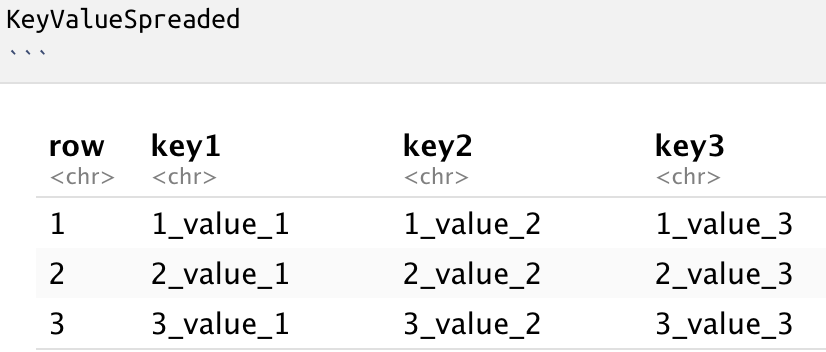

Getting Started with tidyverse
================
Martin Frigaard
2017-05-12

# Getting started with tidyverse

The [`tidyverse`](http://tidyverse.org/) is a collection of R packages
developed primarily by RStudio’s chief scientist [Hadley
Wickham](http://hadley.nz/). These packages play well together by
adhering to some underlying principles, one of which we will explore
below. To learn more about these tools and how they work together, read
[R for data science](https://r4ds.had.co.nz/). For newcomers to R,
please check out my previous tutorial for Storybench: [Getting Started
with R in RStudio
Notebooks](http://www.storybench.org/getting-started-r-rstudio-notebooks/).

The following tutorial will introduce two basic ideas about writing code
and working with data in the `tidyverse`. These two ideas are tidy data
and the pipe. Understanding these two principles will make it easier to
work with the other packages in the tidyverse to manipulate and
re-structure data for visualizations and modeling. Read more about the
tidy principles in the [Tidy Tools
Manifesto](https://cran.r-project.org/web/packages/tidyverse/vignettes/manifesto.html).

## What is tidy data?

“Tidy data” is a term that describes a standardized approach to
structuring datasets to make analyses and visualizations easier in R. If
you’ve worked with SQL and relational databases, you’ll recognize most
of these concepts. Hadley Wickham distilled a lot of the technical
jargon from [Edgar F. Codd’s normal
form](https://en.wikipedia.org/wiki/Third_normal_form) and applied it to
statistical terms. More importantly, he translated the important
principles into terms just about anyone doing data analysis should be
able to recognize and understand.

### The core tidy data principles

There are three principles for tidy data:

1.  Variable make up the columns
2.  Observations make up the rows
3.  Values go into cells

The third principle is almost a given if you’ve handled the first two,
so we will focus on these.

## The “pipe”

The pipe is a symbol (`%>%`) from the `magrittr` package. It makes the R
language easier to write and understand. If you imagine the objects in R
(data frames, vectors, etc.) are nouns, the functions (`function()`)
like verbs. Functions do things to objects. If I wanted to apply
function `f()` to object `x`, I would write it as `f(x)`. If I had a
series of functions to apply to `x`, they would be written `h(g(f(x)))`.

This gets hard to read when there are multiple functions to apply,
because if I start reading from left to right, the first function I
read, `h()`, is the last function that gets applied to `x`. Fortunately,
the pipe allows us to write R code like so:

`x %>% f() %>% g() %>% h()`

Isn’t that better? Read about using it
[here.](https://cran.r-project.org/web/packages/magrittr/vignettes/magrittr.html)

### A hypothetical trial

A **variable** is any measurement that can take multiple values.
Depending on the field a dataset comes from, variables can be referred
to as an independent or dependent variables, features, predictors,
outcomes, targets, responses, or attributes.

Variables can generally fit into three categories:

  - **fixed variables** (characteristics that were known before the data
    were collected),  
  - **measured variables** (variables containing information captured
    during a study or investigation), and  
  - **derived variables** (variables that are created during the
    analysis process from existing variables)

Here’s an example: Suppose clinicians were testing a new
anti-hypertensive drug. They recruit 30 patients, all of whom are being
treated for high blood pressure, and divide them randomly into three
groups. The clinician gives one third of the patients the drug for eight
weeks, another third gets a placebo, and the final third gets care as
usual. At the beginning of the study, the clinicians collect information
about the patients. These measurements included the patient’s sex, age,
weight, height, and baseline blood pressure (pre BP).

For patients in this hypothetical study, suppose the group they were
randomized to (i.e the drug, control, or placebo group), would be
considered a fixed variable. The measured `pre BP` (and `post BP`) would
be considered the measured variables.

Suppose that after the trial was over, all of the data were collected,
and the clinicians wanted a way of identifying the number of patients in
the trial with a reduced blood pressure (yes or no)? One way is to
create a new categorical variable that would identify the patients with
post BP less than 140 mm Hg (`1` = `yes`, `0` = `no`). This new
categorical variable would be considered a derived variable.

The data for the fictional study I’ve described also contains an
underlying dimension of time. As the description implies, each patient’s
blood pressure was measured before and after they took the drug (or
placebo). So these data could conceivably have variables for date of
enrollment (the date a patient entered the study), date of pre blood
pressure measurement (baseline measurements), date of drug delivery
(patient takes the drug), date of post blood pressure measurement (blood
pressure measurement taken at the end of the study).

### What’s an observation?

Observations are the unit of analysis or whatever the “thing” is that’s
being described by the variables. Sticking with our hypothetical blood
pressure trial, the patients would be the unit of analysis. In a tidy
dataset, we would expect each row to represent a single patient.
Observations are a bit like [nouns](https://en.wikipedia.org/wiki/Noun),
in a sense that pinning down an exact definition can be difficult, and
it often relies heavily on how the data were collected and what kind of
questions you’re trying to answer. Other terms for observations include
records, cases, examples, instance, or samples.

### What is the data table?

Tables are made up of values. And as you have probably already guessed,
a value is the thing in a spreadsheet that isn’t a row or a column. I
find it helpful to think of values as physical locations in a table –
they are what lie at the intersection of a variable and an observation.

For example, imagine a single number, 140, sitting in a table.

|       | Column 1 | Column 2 |
| ----- | -------- | -------- |
| row 1 | 140      |          |
| row 2 |          |          |

We could say this number’s location is the intersection of Column 1 and
Row 1, but that doesn’t tell us much. The data, 140, is meaningless
sitting in a cell without any information about what it represents. A
number all alone in a table begs the question, “one hundred and forty
what?”

This is why thinking of a table as being made of variables (in the
columns) and observations (in the rows) helps get to the meaning behind
the values in each cell. After adding variable (column) and observation
(row) names, we can see that this 140 is the pre diastolic blood
pressure (`pre_dia_bp`) for patient number 3 (`patient_3`).

| `id`        | `pre_dia_bp` | Column 2 |
| ----------- | ------------ | -------- |
| `patient_3` | 140          |          |
| row 2       |              |          |

As time went on in this hypothetical study, a second measurement was
taken on patient 3 and placed in the next column. This might look like
the table below.

| `id`        | `pre_dia_bp` | `post_dia_bp` |
| ----------- | ------------ | ------------- |
| `patient_3` | 140          | 120           |
| row 2       |              |               |

This is a logical way to enter data into a spreadsheet or database. As
new measurements are taken, the user creates a new column and enters the
new values into the corresponding row. This is because it’s realtively
easy to track this information visually. We can look at `patient_3`,
then track their information from right to left.

However, these data could also be structured in the following
arrangement.

| `patient_id` | `dia_meas` | `dia_value` |
| ------------ | ---------- | ----------- |
| 03           | pre        | 140         |
| 03           | post       | 120         |

This arrangement is displaying the same information (i.e. the pre and
post diastolic blood pressures for patient number 3), but now the column
`dia_meas` contains information on blood pressure measurement type.

This is tidy data. There is only one variable per column and one
observation per row. We’ll build a pet example to further establish some
basic tidying terminology.

### Load the packages

Install and load the `tidyverse` and `magrittr` packages.

``` r
install.packages(c("tidyverse", "magrittr"))
library(tidyverse)
library(magrittr)
```

### Store data in a “tibble” (table)

We will use the call below to create a key-value pair reference
`tibble`. tibbles are an optimized way to store and display data when
using packages from the `tidyverse`. You should read more about them
[here](http://tibble.tidyverse.org/).

We are going to build a `tibble` from scratch, defining the columns
(variables), rows (observations), and contents of each cell (value). By
doing this, we’ll be able to keep track of what happens as we rearrange
these data. The goal of this brief exercise is to make key-value pairs
easier to see and understand.

``` r
KeyValue <- tibble::tribble(
     ~`row`, ~`key1`, ~`key2`, ~`key3`, # names of the columns indicated with
     "1", "1_value_1","1_value_2","1_value_3", # Row 1
     "2", "2_value_1", "2_value_2", "2_value_3", # Row 2
     "3", "3_value_1", "3_value_2", "3_value_3") # Row 3
KeyValue
```

    ## # A tibble: 3 x 4
    ##   row   key1      key2      key3     
    ##   <chr> <chr>     <chr>     <chr>    
    ## 1 1     1_value_1 1_value_2 1_value_3
    ## 2 2     2_value_1 2_value_2 2_value_3
    ## 3 3     3_value_1 3_value_2 3_value_3

Our new object (`KeyValue`) is built with the following underlying
logic:  
\* Rows are numbered with a number (1–3) and an underscore (*), and
always appear at the front of a value  
\* Columns are numbered with an underscore (*) and a number (1–3), and
always appear at the end of a value

## Using the tidyr package

`tidyr` is a package from the tidyverse that helps you structure (or
re-structure) your data so its easier to visualize and model. Here is a
[link to the tidyr page](http://tidyr.tidyverse.org/). Tidying a data
set usually involves some combination of either converting rows to
columns (spreading), or switching the columns to rows (gathering).

We can use our `KeyValue` object to explore how these functions work.

### Using gather

This is how `tidyverse` defines gather:

> “Gather takes multiple columns and collapses into key-value pairs,
> duplicating all other columns as needed. You use `gather()` when you
> notice that you have columns that are not variables.”

Let’s start by gathering the three key columns into a single column,
with a new column value that will contain all their values. Use
`KeyValue` as the initial object and pipe it to the `tidyr::gather()`
function. Store this in a new object called `KeyValueGathered`.

``` r
KeyValueGathered <- KeyValue %>% 
     tidyr::gather(key = key, # new column for the 3 key columns
            value = value, # contains the 9 distinct values
            key1:key3, # range of columns we want gathered
            na.rm = TRUE # handles missing
            )
KeyValueGathered
```

<!-- -->

Notice the structure:

  - The new `key` column is now 9 rows, with the values from the three
    former `key1`, `key2`, and `key3` columns.

  - The `value` column contains all the content from the cells at each
    intersection of row and the `key1`, `key2`, and `key3` columns

I call this arrangement of data “stacked.” Wickham refers to this as
indexed. But the important takeaway is that we’ve used `gather()` to
scoop up the data that was originally scattered across three columns and
placed them into two columns: key and value.

## Using key-value pairs

Key-value pairs pair up keys and values. This means when we specified
key as the name of the new column, the command took the three previous
key columns and stacked them in it. Then we specified value as the name
of the new column with their corresponding value pair.

What about the row column? We left this column out of the call because
we want it to stay in the same arrangement (i.e. 1,2,3). When the key
and value columns get stacked, these rows get repeated down the column,

Nothing was lost in the process, either. I can still look at row:3,key:2
and see the resulting value 3\_value\_2.

### Using spread

Now we’ll spread the key and value columns back into their original
arrangement (three columns of `key_1`, `key_2`, & `key_3`). The spread
description [reads](http://tidyr.tidyverse.org/):

> “Spread a key-value pair across multiple columns.”

Store this new arrangement in a new object called `KeyValueSpreaded`.

``` r
KeyValueSpreaded <- KeyValueGathered %>% 
     tidyr::spread(key = key, 
                   value = value)
KeyValueSpreaded
```

<!-- -->

Spread moved the values that were stacked in two columns (`key` and
`value`) into the three distinct `key_` columns.

The key-value pairs are the indexes we can use to rearrange the data to
make it tidy.

### Which version of the key\_value is tidy?

We stated that tidy data means, “one variable per column, one
observation per row,” so the arrangement that satisfied this condition
is the `KeyValueGathered` data set.

But I want to stress that without some underlying knowledge of what
these variables and observations actually contain, it’s hard to know
which arrangement of any data set is tidy.
