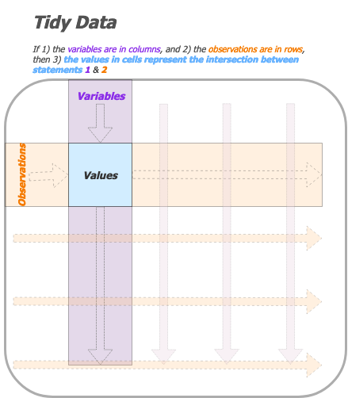
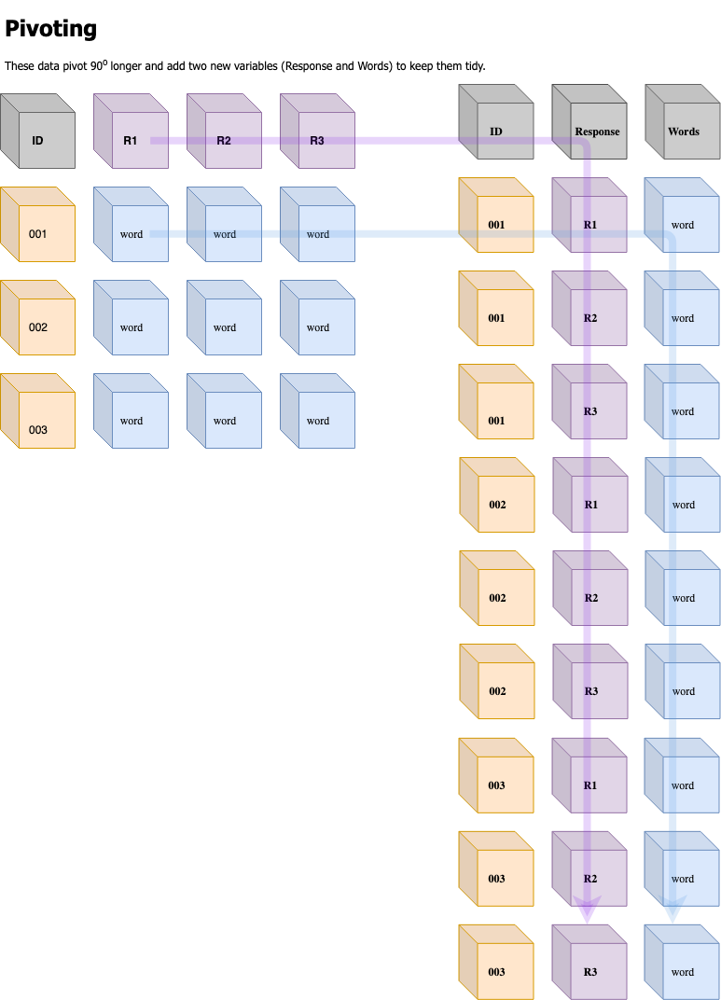

Tidy data, pivoting, and user feedback
================
Martin Frigaard
2017-05-12

  - [Motivation](#motivation)
      - [Objectives](#objectives)
      - [Loading the packages](#loading-the-packages)
  - [Refresher: What is (are?) tidy
    data?](#refresher-what-is-are-tidy-data)
      - [The core tidy data principles](#the-core-tidy-data-principles)
      - [Same information, different
        data](#same-information-different-data)
          - [How does this happen?](#how-does-this-happen)
      - [Pivoting](#pivoting)
          - [Fancy footwork](#fancy-footwork)

# Motivation

*TLDR: This tutorial was prompted by the recent changes to the `tidyr`
package (see the tweet from Hadley Wickham below). Two functions for
reshaping data (`gather()` and `spread()`) were replaced with `pivot_`
functions. I include the tweet below to give an example of how these
packages evolve (and how their authors incorporate users input into
their decisions)*

> Thanks to all 2649 (\!\!\!) people who completed my survey about table
> shapes\! I've done analysed the data at
> <a href="https://t.co/hyu1o91xRm">https://t.co/hyu1o91xRm</a> and the
> new functions will be called pivot\_longer() and pivot\_wider()
> <a href="https://twitter.com/hashtag/rstats?src=hash&amp;ref_src=twsrc%5Etfw">\#rstats</a>
> 
> </p>
> 
> — Hadley Wickham (@hadleywickham)
> <a href="https://twitter.com/hadleywickham/status/1109816130774986753?ref_src=twsrc%5Etfw">March
> 24,
> 2019</a>
> 
> <script async src="https://platform.twitter.com/widgets.js" charset="utf-8"></script>

## Objectives

This tutorial will introduce three underlying concepts about working
with data in the `tidyverse`: 1) tidy data, 2) pivoting, and 3)
grouping. A solid understanding of these concepts will make it easier to
use the other packages in the `tidyverse` to manipulate and re-structure
your data for visualizations and modeling.

## Loading the packages

Install and load the following packages for this tutorial.

``` r
# this will require the newest version of tidyr from github
# devtools::install_github("tidyverse/tidyr")
library(tidyr)
library(dplyr)
library(readr)
```

-----

# Refresher: What is (are?) tidy data?

“Tidy data” is a term that describes a standardized approach to
structuring datasets to make analyses and visualizations easier in R. If
you’ve worked with SQL and relational databases, you’ll recognize most
of these concepts. Hadley Wickham distilled a lot of the technical
jargon from [Edgar F. Codd’s ‘normal
form’](https://en.wikipedia.org/wiki/Third_normal_form) and applied it
to statistical terms. More importantly, he translated these essential
principles into concepts and terms a broader audience can grasp and use
for data manipulation. The first concept we will cover is **tidy data**.

### The core tidy data principles

Tidy data, at least in the `tidyverse`, is referring to ‘rectangular’
data. These are the data we typically see in spreadsheet software like
Googlesheets, Microsoft Excel, or in a relational database like MySQL or
Microsoft Access, The three principles for tidy rectangular data are:

1.  Variables make up columns
2.  Observations (or cases) go in the rows
3.  Values are in cells

While these might seem obvious at first, many of the problematic data
arrangements you’ll encounter come from not adhering to their guidance.
Bear with me as I walk through why if the two first statements are true,
the third becomes all but guaranteed (see image below).

<!-- -->

Not all data you’ll encounter are arranged in a tidy way, but I think
transforming and thinking of your data into this format in incredibly
helpful for understanding the power of data manipulation in the
`tidyverse`.

## Same information, different data

Assume we’re given the results of an experiment that examined a
dichotomous outcome (that was either `No Outcome` or `Outcome`) in two
groups (`Treatment` and `Control`).

**Experiment Results:**

|           | Outcome | No Outcome | Total |
| --------- | ------- | ---------- | ----- |
| Treatment | 3       | 206        |       |
| Control   | 26      | 180        |       |
| Total     |         |            | 415   |

The table above shows the results neatly summarized by group and
results. Tables like this are common in textbooks, but what kind of data
arrangement would’ve been used to create these summaries?

For example, the data might have the arrangement we see below in the
`TrialData` data frame.

``` r
TrialData <- readr::read_csv("data/trial-data.csv")
knitr::kable(
TrialData %>% head(10))
```

| patient | group   | result     | date     | physician |
| ------: | :------ | :--------- | :------- | :-------- |
|     265 | Control | no outcome | 1/1/18   | Johnson   |
|     344 | Control | no outcome | 1/1/18   | Johnson   |
|     214 | Control | outcome    | 1/14/18  | Johnson   |
|     320 | Control | no outcome | 1/22/18  | Johnson   |
|     359 | Control | no outcome | 1/22/18  | Johnson   |
|     277 | Control | no outcome | 1/23/18  | Johnson   |
|     385 | Control | no outcome | 1/24/18  | Johnson   |
|     347 | Control | no outcome | 1/3/18   | Johnson   |
|     333 | Control | no outcome | 1/8/18   | Johnson   |
|     260 | Control | no outcome | 10/20/18 | Johnson   |

These two tables look very different, and that’s because **the ways data
are collected are rarely similar to the ways data are displayed**. If I
wanted to get the aggregate data display like the table above, I can
using a combination of `dplyr` and `tidyr` functions.

``` r
TrialData %>%
    dplyr::group_by(result, group) %>%
    dplyr::summarize(count = n()) %>% 
    tidyr::spread(result, count) %>% 
    dplyr::select(outcome, `no outcome`) %>% 
    dplyr::arrange(outcome)
```

    ## # A tibble: 2 x 2
    ##   outcome `no outcome`
    ##     <int>        <int>
    ## 1       3          206
    ## 2      26          180

As you can see, both tables contain the same information, they’re just
arranged in a different way. The three functions that can drastically
change the shape of your data and make these types of transformations
possible are `dplyr::group_by()`, `dplyr::summarize()`, and
`tidyr::spread()`.

### How does this happen?

The `dplyr::group_by()` and `dplyr::summarize()` functions collapse the
orginal `TrialData` into a smaller, condensed version of the original
data set. However, these two functions don’t change much in terms of the
table’s shape: `result` and `group` are columns in both data sets, so
all we’ve done is add the `count` column (in fact, the `dplyr::count()`
function does exactly this, but I’m using the more verbose method to
demonstrate whats happening under the hood).

It takes `tidyr::spread()` to move the rows to columns–or to **pivot**
the `result` and `count` columns–from a vertically aligned display to a
horizontally arranged display. The `dplyr::select()` and
`dplyr::arrange()` functions are just window dressings to make the table
look identical to the **Experiment Results** table.

We can add even more `dplyr` functions here to make the table more
similar to the original display.

``` r
knitr::kable(
TrialData %>%
  dplyr::group_by(result, group) %>%
  dplyr::summarize(count = n()) %>% 
  dplyr::ungroup() %>%
  dplyr::mutate_at(vars(result:group), 
                   list(~as.character(.))) %>%
  dplyr::bind_rows(summarise(
                      result = "Total", 
                      group = "Total", 
                      TrialData, 
                      count = n())) %>% 
    tidyr::spread(result, count) %>% 
    dplyr::select(group, outcome, `no outcome`, Total) %>% 
    dplyr::arrange(outcome))
```

| group     | outcome | no outcome | Total |
| :-------- | ------: | ---------: | ----: |
| Treatment |       3 |        206 |    NA |
| Control   |      26 |        180 |    NA |
| Total     |      NA |         NA |   415 |

## Pivoting

The pivot functions are [recent
additions](https://tidyr.tidyverse.org/dev/articles/pivot.html) to the
`tidyr` package (I found it refreshing to learn that I wasn’t the only
person struggling to use the `tidyr::gather()` and `tidyr::spread()`
functions)

> Many people don’t find the names intuitive and find it hard to
> remember which direction corresponds to spreading and which to
> gathering. It also seems surprisingly hard to remember the arguments
> to these functions, meaning that many people (including me\!) have to
> consult the documentation every time.

I’ve always appreciated the function names in the `tidyverse`, because I
can tell a lot of thought is put into identifying the right verbs that
accurately captures the users intentions. I have to admit my own bias in
loving these recent changes, because `pivot` is a verb I am very
familiar with and can easily visualize.

### Fancy footwork

Before getting into statistics/data science, I went to college for
exercise physiology/kinesiology. One of the lessons I’ve never forgotten
is how important basic footwork is athletic performance. For example,
precise footwork and the ability to change direction sharply is so
essential in boxing that these skills are often what separates good
fighters from elite athletes.

Vasily Lomachenko is the best [pound-for-pound
boxer](https://en.wikipedia.org/wiki/Boxing_pound_for_pound_rankings)
according to Boxing Writers Association of America, ESPN, and the
Transnational Boxing Rankings Board (see the example
below).


As you can see, his ability to change directions (i.e. **pivot**) makes
him frustratingly hard to hit. It also allows him to see openings in his
opponents defense, which makes him incredibly successful at landing
punches (see
below):


In fact, Lomachenko is even known for taking [dance
lessons](https://sports.yahoo.com/quitting-boxing-dance-made-vasyl-lomachenko-better-fighter-195049319.html)
to improve his agility in ring. Read more
[here](http://fightland.vice.com/blog/the-pivots-and-precision-of-vasyl-lomachenko).

*Why am I telling you about Vasyl Lomachenko’s footwork?*

The `pivot_` functions give you a similar ability with your data. Being
able to rapidly move your data from columns to rows (and back) is
similar to being able to turn 90 degrees on a dime and avoid an incoming
jab (or see an opening and land one).

To demonstrate these new functions I will be loading data from the
[small world of words
project](https://smallworldofwords.org/en/project/home).

``` r
# fs::dir_ls("data")
SWOWData <- readr::read_csv("data/SWOWData.csv")
SWOWData %>% dplyr::glimpse(78)
```

I’ve taken a random sample of `500,000` observations from the original
raw data.

These new functions borrow ideas from the
[`cdata`](https://winvector.github.io/cdata/) and
[`data.table`](https://github.com/Rdatatable/data.table/wiki) packages.

<!-- -->
