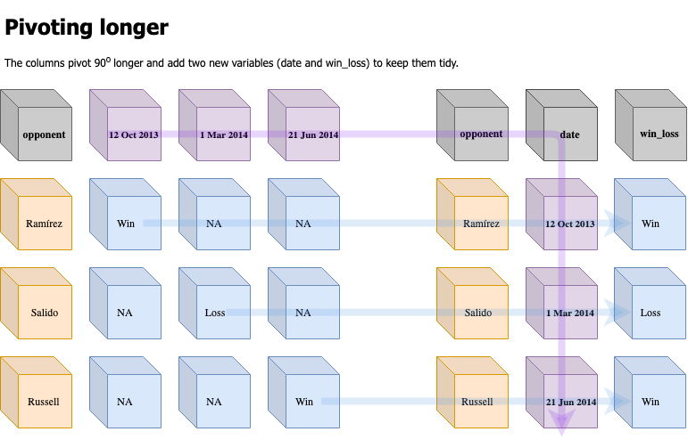

# Motivation

*TLDR: This tutorial was prompted by the recent changes to the `tidyr` package (see the tweet from Hadley Wickham below). Two functions for reshaping data (`gather()` and `spread()`) were replaced with `pivot_` functions. I include the tweet below to give an example of how these packages evolve (and how their authors incorporate users input into their decisions)*

> Thanks to all 2649 (!!!) people who completed my survey about table shapes! I&#39;ve done analysed the data at <a href="https://t.co/hyu1o91xRm">https://t.co/hyu1o91xRm</a> and the new functions will be called pivot_longer() and pivot_wider() <a href="https://twitter.com/hashtag/rstats?src=hash&amp;ref_src=twsrc%5Etfw">#rstats</a></p>&mdash; Hadley Wickham (@hadleywickham) <a href="https://twitter.com/hadleywickham/status/1109816130774986753?ref_src=twsrc%5Etfw">March 24, 2019</a>
> <script async src="https://platform.twitter.com/widgets.js" charset="utf-8"></script>

## Objectives

This tutorial will introduce three underlying concepts about working with data in the `tidyverse`: 1) tidy data, 2) pivoting, and 3) grouping. A solid understanding of these concepts will make it easier to use the other packages in the `tidyverse` to manipulate and re-structure your data for visualizations and modeling. 

## Loading the packages

Install and load the following packages for this tutorial.


```r
# this will require the newest version of tidyr from github
# devtools::install_github("tidyverse/tidyr")
library(tidyr)
library(dplyr)
library(readr)
```

***

# Refresher: What is (are?) tidy data?

“Tidy data” is a term that describes a standardized approach to structuring datasets to make analyses and visualizations easier in R. If you’ve worked with SQL and relational databases, you’ll recognize most of these concepts. Hadley Wickham distilled a lot of the technical jargon from [Edgar F. Codd’s 'normal form'](https://en.wikipedia.org/wiki/Third_normal_form) and applied it to statistical terms. More importantly, he translated these essential principles into concepts and terms a broader audience can grasp and use for data manipulation. The first concept we will cover is **tidy data**.

### The core tidy data principles

Tidy data, at least in the `tidyverse`, is referring to 'rectangular' data. These are the data we typically see in spreadsheet software like Googlesheets, Microsoft Excel, or in a relational database like MySQL or Microsoft Access, The three principles for tidy rectangular data are:

1. Variables make up columns 
2. Observations (or cases) go in the rows 
3. Values are in cells 
 
While these might seem obvious at first, many of the problematic data arrangements you’ll encounter come from not adhering to their guidance. Bear with me as I walk through why if the two first statements are true, the third becomes all but guaranteed (see image below).


Not all data you'll encounter are arranged in a tidy way, but I think transforming and thinking of your data into this format in incredibly helpful for understanding the power of data manipulation in the `tidyverse`.

## Same information, but different data

Assume we're given the results of an experiment that examined a dichotomous outcome (that was either `No Outcome` or `Outcome`) in two groups (`Treatment` and `Control`).

**Experiment Results:**

|               | Outcome       | No Outcome    | Total         |
| ------------- | ------------- | ------------- | ------------- |
| Treatment     | 3             | 206           |               |
| Control       | 26            | 180           |               |
| Total         |               |               | 415           |


The table above shows the results neatly summarized by group and results. Tables like this are common in textbooks, but what kind of data arrangement would've been used to create these summaries?

For example, the data might have the arrangement we see below in the `TrialData` data frame. 


```r
TrialData <- readr::read_csv("data/trial-data.csv")
```


 patient  group     result       date       physician 
--------  --------  -----------  ---------  ----------
     265  Control   no outcome   1/1/18     Johnson   
     344  Control   no outcome   1/1/18     Johnson   
     214  Control   outcome      1/14/18    Johnson   
     320  Control   no outcome   1/22/18    Johnson   
     359  Control   no outcome   1/22/18    Johnson   
     277  Control   no outcome   1/23/18    Johnson   
     385  Control   no outcome   1/24/18    Johnson   
     347  Control   no outcome   1/3/18     Johnson   
     333  Control   no outcome   1/8/18     Johnson   
     260  Control   no outcome   10/20/18   Johnson   

These two tables look very different, and that's because **the ways data are collected are rarely similar to the ways data are displayed**. If I wanted to get the aggregate data display like the table above, I can using a combination of `dplyr` and `tidyr` functions. 


```r
knitr::kable(
TrialData %>%
    dplyr::group_by(result, group) %>%
    dplyr::summarize(count = n()) %>% 
    tidyr::spread(result, count) %>% 
    dplyr::select(outcome, `no outcome`) %>% 
    dplyr::arrange(outcome)
)
```


 outcome   no outcome
--------  -----------
       3          206
      26          180

As you can see, both tables contain the same information, they're just arranged in a different way. The three functions that can drastically change the shape of your data and make these types of transformations possible are `dplyr::group_by()`, `dplyr::summarize()`, and `tidyr::spread()`.

### How does this happen?

The `dplyr::group_by()` and `dplyr::summarize()` functions collapse the orginal `TrialData` into a smaller, condensed version of the original data set. However, these two functions don't change much in terms of the table's shape: `result` and `group` are columns in both data sets, so all we've done is add the `count` column (in fact, the `dplyr::count()` function does exactly this, but I'm using the more verbose method to demonstrate whats happening under the hood).

It takes `tidyr::spread()` to move the rows to columns--or to **pivot** the `result` and `count` columns--from a vertically aligned display to a horizontally arranged display. The `dplyr::select()` and `dplyr::arrange()` functions are just window dressings to make the table look identical to the **Experiment Results** table.

We can add even more `dplyr` functions here to make the table more similar to the original display.


```r
knitr::kable(
TrialData %>%
  dplyr::group_by(result, group) %>%
  dplyr::summarize(count = n()) %>% 
  dplyr::ungroup() %>%
  dplyr::mutate_at(vars(result:group), 
                   list(~as.character(.))) %>%
  dplyr::bind_rows(summarise(
                      result = "Total", 
                      group = "Total", 
                      TrialData, 
                      count = n())) %>% 
    tidyr::spread(result, count) %>% 
    dplyr::mutate(
        outcome = tidyr::replace_na(outcome, " "),
        `no outcome` = tidyr::replace_na(`no outcome`, " "),
        Total = tidyr::replace_na(Total, " ")) %>% 
    dplyr::select(group, outcome, 
                  `no outcome`, 
                  Total) %>% 
    dplyr::arrange(desc(`no outcome`)))
```


group       outcome   no outcome   Total 
----------  --------  -----------  ------
Treatment   3         206                
Control     26        180                
Total                              415   

## Why pivoting?

The pivot functions are [recent additions](https://tidyr.tidyverse.org/dev/articles/pivot.html) to the `tidyr` package (I found it refreshing to learn that I wasn't the only person struggling to use the `tidyr::gather()` and `tidyr::spread()` functions). Hadley Wickham (the package developer/author) stated his own difficulties when using these functions,

> Many people don’t find the names intuitive and find it hard to remember which direction corresponds to spreading and which to gathering. It also seems surprisingly hard to remember the arguments to these functions, meaning that many people (including me!) have to consult the documentation every time.

I've always appreciated the function names in the `tidyverse`, because I can tell a lot of thought gets put into identifying verbs that accurately capture the users intentions. I have to admit my own bias in loving these recent changes, because `pivot` is a verb I am very familiar with and can easily visualize.

### Fancy footwork

Before getting into statistics/data science, I went to college for exercise physiology/kinesiology. One of the lessons I've never forgotten is how important basic footwork is athletic performance. For example, precise footwork and the ability to change direction sharply is so essential in boxing that these skills are often what separates good fighters from elite athletes. 

Vasily Lomachenko is the best [pound-for-pound boxer](https://en.wikipedia.org/wiki/Boxing_pound_for_pound_rankings) according to Boxing Writers Association of America, ESPN, and the Transnational Boxing Rankings Board (see the example below).


As you can see, his ability to change directions (i.e. **pivot**) makes him frustratingly hard to hit. It also allows him to see openings in his opponents defense, which makes him incredibly successful at landing punches (see below):


In fact, Lomachenko is even known for taking [dance lessons](https://sports.yahoo.com/quitting-boxing-dance-made-vasyl-lomachenko-better-fighter-195049319.html) to improve his footwork and agility in ring. Read more [here](http://fightland.vice.com/blog/the-pivots-and-precision-of-vasyl-lomachenko).

*Why am I telling you about Vasyl Lomachenko's footwork?*

The `pivot_` functions give you a similar ability with your data. Being able to rapidly move your data from columns to rows (and back) is similar to being able to turn 90 degrees on a dime and avoid an incoming jab (or see an opening and landing one).

We will load Lomachenko's fight record from Wikipedia and explore how to use these new functions.


```r
LomaFightsWide <- readr::read_csv("data/2019-03-27-LomaFightsWide.csv")
```


These data are not tidy because the date for each fight is in a separate column. While this format might seem strange to data scientists, this configuration makes sense for a fan entering each fight into a spreadsheet as it happens. Let's ponder a hypothetical chronological chain of events, 

1. The opponent/location is announced and the fan enters the information into the first two column/rows in a spreadsheet titled, 'Lomachenko`  
2. The fight number is essentially a row number (starting with `1`), but this helps keep track of the fighters win/loss record  
3. The date for the first fight gets entered into the next column, and the result goes into the corresponding cell when the fight is over 
4. Later, the technical `result` is announced, the `fight_record` is updated (after the bout), and the official round/time (`round_time`) is recorded (along with any `notes`)  
5. When the next fight happens, our fan right-clicks on the last recorded fight, and inserts a new column 

As you can see, all of these steps are completely reasonable for someone wanting to track their favorite athlete or sports team. I think of this data arrangement as *human eyeball friendly*, because the table captures enough information to be useful, and it has *some* computational abilities. For example, our fan could use filtering to see the number of `TKO`s a fighter has, or they could sort/arrange the `fight_record` column to figure what Lomachenko's current record was. Spreadsheets like these are a cross between a timeline and a record book, and they do a good enough job at both tasks to justify their current structure.  

The [pivot vignette](https://tidyr.tidyverse.org/dev/articles/pivot.html#wide-to-long) makes a point that it's common to find data with this 'wide' format or...

> ...wild-caught datasets as they often optimise for ease of data entry or ease of comparison rather than ease of analysis. 

The `LomaFightsWide` data is one of those data sets. 

## Pivoting (longer)

Before diving into the `pivot_longer` function and it's arguments, I want to visualize the data I have, and try to imagine the shape of the same data in a tidy form. I'm going to reorganize some columns to make this a little easier. 


```r
LomaFightsWide <- LomaFightsWide %>% 
    dplyr::select(opponent, 
                  `12 Oct 2013`:`12 Apr 2019`,
                  dplyr::everything())
LomaFightsWide
```

```
## # A tibble: 14 x 21
##    opponent `12 Oct 2013` `1 Mar 2014` `21 Jun 2014` `22 Nov 2014`
##    <chr>    <chr>         <chr>        <chr>         <chr>        
##  1 José Ra… Win           <NA>         <NA>          <NA>         
##  2 Orlando… <NA>          Loss         <NA>          <NA>         
##  3 Gary Ru… <NA>          <NA>         Win           <NA>         
##  4 Chonlat… <NA>          <NA>         <NA>          Win          
##  5 Gamalie… <NA>          <NA>         <NA>          <NA>         
##  6 Romulo … <NA>          <NA>         <NA>          <NA>         
##  7 Román M… <NA>          <NA>         <NA>          <NA>         
##  8 Nichola… <NA>          <NA>         <NA>          <NA>         
##  9 Jason S… <NA>          <NA>         <NA>          <NA>         
## 10 Miguel … <NA>          <NA>         <NA>          <NA>         
## 11 Guiller… <NA>          <NA>         <NA>          <NA>         
## 12 Jorge L… <NA>          <NA>         <NA>          <NA>         
## 13 José Pe… <NA>          <NA>         <NA>          <NA>         
## 14 Anthony… <NA>          <NA>         <NA>          <NA>         
## # … with 16 more variables: `2 May 2015` <chr>, `7 Nov 2015` <chr>, `11
## #   Jun 2016` <chr>, `26 Nov 2016` <chr>, `8 Apr 2017` <chr>, `5 Aug
## #   2017` <chr>, `9 Dec 2017` <chr>, `12 May 2018` <chr>, `8 Dec
## #   2018` <chr>, `12 Apr 2019` <chr>, fight_loc <chr>, fight_number <dbl>,
## #   result <chr>, fight_record <chr>, round_time <chr>, notes <chr>
```

So now I have the `opponent`column, followed by the dates and then everything else. 

After some sketching on a notepad, I decide I want to make the following transformation with these data. 



The diagram above shows how I'm expecting the transformed data to look. Note that although I am using the `tidyr::pivot_longer()` function, these changes do not always result in a 'longer' data frame. In fact, tidying these data resulted in a 14 observations X 9 variables data frame (vs the original 14 observations X 21 variables data frame), 

> "Note that I don’t believe it makes sense to describe a dataset as being in “long form”. Length is a relative term, and you can only say (e.g.) that dataset A is longer than dataset B." [source](https://tidyr.tidyverse.org/dev/articles/pivot.html#wide-to-long)


```r
LomaFightsLonger <- LomaFightsWide %>% 
# specify columns to pivot into rows
    tidyr::pivot_longer(cols = `12 Oct 2013`:`12 Apr 2019`,
                    # the name of the new variable (used to be the columns)?
                        names_to = "date",
                    # name of the variable for what was in these columns?
                        values_to = "win_loss",
                    # what to do about the missing values?
                        na.rm = TRUE)
LomaFightsLonger %>% dplyr::glimpse(78)
```

```
## Observations: 14
## Variables: 9
## $ opponent     <chr> "José Ramírez", "Orlando Salido", "Gary Russell Jr.", …
## $ fight_loc    <chr> "Thomas & Mack Center, Paradise, Nevada, US", "Alamodo…
## $ fight_number <dbl> 1, 2, 3, 4, 5, 6, 7, 8, 9, 10, 11, 12, 13, 14
## $ result       <chr> "TKO", "SD", "MD", "UD", "KO", "KO", "KO", "RTD", "RTD…
## $ fight_record <chr> "1–0", "1–1", "2–1", "3–1", "4–1", "5–1", "6–1", "7–1"…
## $ round_time   <chr> "4 (10), 2:55", "12", "12", "12", "9 (12), 0:50", "10 …
## $ notes        <chr> "Won WBO International featherweight title", "For vaca…
## $ date         <chr> "12 Oct 2013", "1 Mar 2014", "21 Jun 2014", "22 Nov 20…
## $ win_loss     <chr> "Win", "Loss", "Win", "Win", "Win", "Win", "Win", "Win…
```

I can see from this new data frame that the `date` column still needs to be formatted as a date. This is a great opportunity to use the `tidyr::pivot_longer_spec()` function because it allows me to store additional metadata about the transformation. 

### Pivoting with additional specifications

> A pivoting spec is a data frame that describes the metadata stored in the column name, with one row for each column, and one column for each variable mashed into the column name. 

Sticking with the example from above, what if I wanted to store information for formatting the `date` variable? I can use the `tidyr::pivot_longer_spec()` variant, give this function the previous arguments, and create `loma_spec`, a data frame with three variables in it: `.name`, `.value`, and `date`. 


```r
loma_spec <- LomaFightsWide %>% 
# specify columns to pivot into rows
    tidyr::pivot_longer_spec(cols = `12 Oct 2013`:`12 Apr 2019`,
                    # the name of the new variable (used to be the columns)?
                        names_to = "date",
                    # name of the variable for what was in these columns?
                        values_to = "win_loss")
loma_spec %>% utils::head()
```

```
## # A tibble: 6 x 3
##   .name       .value   date       
##   <chr>       <chr>    <chr>      
## 1 12 Oct 2013 win_loss 12 Oct 2013
## 2 1 Mar 2014  win_loss 1 Mar 2014 
## 3 21 Jun 2014 win_loss 21 Jun 2014
## 4 22 Nov 2014 win_loss 22 Nov 2014
## 5 2 May 2015  win_loss 2 May 2015 
## 6 7 Nov 2015  win_loss 7 Nov 2015
```

The three columns in `loma_spec` contain metadata (data about the data) on the transformation I'll be performing--specifically the orginally columns (`.name`) and the corresponding cell values (`.value`). The other variable (`date`) gets carried over from the transformation as well. 

So if I want to format the `date` variable, I can include those arguments *within* the `loma_spec` data frame, and then supply it to the `pivot_longer()` function. 


```r
# format the date
loma_spec <- loma_spec %>% 
    dplyr::mutate(date = lubridate::dmy(date))
# supply it to the pivot_longer
LomaFightsLonger <- LomaFightsWide %>% 
  pivot_longer(spec = loma_spec, 
               na.rm = TRUE) 
LomaFightsLonger %>% dplyr::glimpse(78)
```

```
## Observations: 14
## Variables: 9
## $ opponent     <chr> "José Ramírez", "Orlando Salido", "Gary Russell Jr.", …
## $ fight_loc    <chr> "Thomas & Mack Center, Paradise, Nevada, US", "Alamodo…
## $ fight_number <dbl> 1, 2, 3, 4, 5, 6, 7, 8, 9, 10, 11, 12, 13, 14
## $ result       <chr> "TKO", "SD", "MD", "UD", "KO", "KO", "KO", "RTD", "RTD…
## $ fight_record <chr> "1–0", "1–1", "2–1", "3–1", "4–1", "5–1", "6–1", "7–1"…
## $ round_time   <chr> "4 (10), 2:55", "12", "12", "12", "9 (12), 0:50", "10 …
## $ notes        <chr> "Won WBO International featherweight title", "For vaca…
## $ date         <date> 2013-10-12, 2014-03-01, 2014-06-21, 2014-11-22, 2015-…
## $ win_loss     <chr> "Win", "Loss", "Win", "Win", "Win", "Win", "Win", "Win…
```

Now the `loma_spec` can get supplied to the `pivot_longer()` function and the `date` variable is properly formatted (note I still need to provide the `na.rm = TRUE` argument).

## Multiple variables in a single column (throwback)

You've probaby noticed there are two variables in the `round_time` column. The first is the round the fight ended in (presented as `final round (total rounds)`) and the `time` in that round (`minutes:seconds`). In order to break these two variables into their own columns, I can use the `tidyr::separate()` function to split these two variables apart into their own columns. 


```r
LomaFightsLonger %>% 
    tidyr::separate(
        col = round_time,
        into = c("fight_rounds", "fight_time"),
        sep = ",",
        remove = FALSE) %>% 
    dplyr::select(round_time:fight_time)
```

```
## # A tibble: 14 x 3
##    round_time    fight_rounds fight_time
##    <chr>         <chr>        <chr>     
##  1 4 (10), 2:55  4 (10)       " 2:55"   
##  2 12            12           <NA>      
##  3 12            12           <NA>      
##  4 12            12           <NA>      
##  5 9 (12), 0:50  9 (12)       " 0:50"   
##  6 10 (12), 2:35 10 (12)      " 2:35"   
##  7 5 (12), 1:09  5 (12)       " 1:09"   
##  8 7 (12), 3:00  7 (12)       " 3:00"   
##  9 9 (12), 3:00  9 (12)       " 3:00"   
## 10 7 (12), 3:00  7 (12)       " 3:00"   
## 11 6 (12), 3:00  6 (12)       " 3:00"   
## 12 10 (12), 2:08 10 (12)      " 2:08"   
## 13 12            12           <NA>      
## 14 – (12)        – (12)       <NA>
```

This throws a warning, but there is no real reason for concern. 

`Expected 2 pieces. Missing pieces filled with `NA` in 5 rows [2, 3, 4, 13, 14].`

### Variables and values in column names

Think back to the avid sports fan we introduced above, Now we will assume he's interested in tracking the epic saga between Gennady Gennadyevich Golovkin (tripple G or GGG) and Saúl "Canelo" Álvarez that went from September 16th, 2017 until their rematch a year later on September 15th, 2018. 

In order to track these fighters, the following spreadsheet gets created:


RTD = A corner retirement or corner stoppage..during any rest period between rounds, a boxer refuses to continue or their corner pulls them out, thereby forcing the referee to call an end to the fight. 

UD =  all three judges agree on which fighter won the match.

MD = In a majority decision, two of the three judges agree on which fighter won the match, while the third judge indicates that neither fighter won (i.e., a "draw").


These new functions borrow ideas from the [`cdata`](https://winvector.github.io/cdata/) and [`data.table`](https://github.com/Rdatatable/data.table/wiki) packages.


