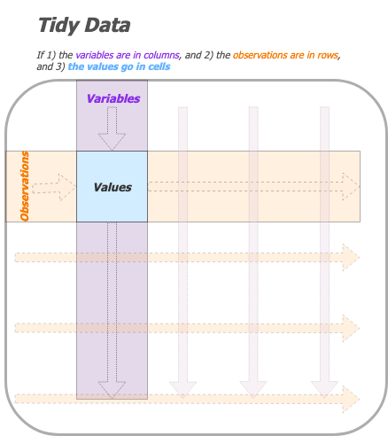

Data Science Communication using R - tidyr
================
Martin Frigaard
2017-05-12

  - [Objectives](#objectives)
  - [Part one: Tidy data](#part-one-tidy-data)
      - [Core tidy data principles](#core-tidy-data-principles)
  - [Part two: Grouping](#part-two-grouping)
  - [Part three: Pivoting](#part-three-pivoting)
      - [It’s like having fancy
        footwork](#its-like-having-fancy-footwork)
  - [Scenario 1: categorical variable across multiple
    columns](#scenario-1-categorical-variable-across-multiple-columns)

*TLDR: This tutorial was prompted by the recent changes to the `tidyr`
package (see the tweet from Hadley Wickham below). Two functions for
reshaping columns and rows (`gather()` and `spread()`) were replaced
with `tidyr::pivot_longer()` and `tidyr::pivot_wider()` functions.*

> Thanks to all 2649 (\!\!\!) people who completed my survey about table
> shapes\! I've done analysed the data at
> <a href="https://t.co/hyu1o91xRm">https://t.co/hyu1o91xRm</a> and the
> new functions will be called pivot\_longer() and pivot\_wider()
> <a href="https://twitter.com/hashtag/rstats?src=hash&amp;ref_src=twsrc%5Etfw">\#rstats</a>
> 
> </p>
> 
> — Hadley Wickham (@hadleywickham)
> <a href="https://twitter.com/hadleywickham/status/1109816130774986753?ref_src=twsrc%5Etfw">March
> 24,
> 2019</a>
> 
> <script async src="https://platform.twitter.com/widgets.js" charset="utf-8"></script>

``` r
# this will require the newest version of tidyr from github
# devtools::install_github("tidyverse/tidyr")
library(tidyverse)
```

    TIDY⬢TIDY⬢TIDY⬢TIDY⬢TIDY⬢TIDY⬢TID⬢TIDY
     ⬢ __  _    __   .    ⬡           ⬢  . 
      / /_(_)__/ /_ ___  _____ _______ ___ 
     / __/ / _  / // / |/ / -_) __(_-</ -_)
     \__/_/\_,_/\_, /|___/\__/_/ /___/\__/ 
          ⬢  . /___/      ⬡      .       ⬢
    TIDY⬢TIDY⬢TIDY⬢TIDY⬢TIDY⬢TIDY⬢TID⬢TIDY

# Objectives

This tutorial will cover three concepts about working with data in the
`tidyverse`:

1)  tidy data,  
2)  grouping, and  
3)  the new pivoting verbs in `tidyr`

A solid understanding of these topics makes it easier to manipulate and
re-structure your data for visualizations and modeling in the
`tidyverse`.

I’ll be using examples of spreadsheets that were designed for data
entry, not necessarily statistical modeling or graphics.

My goal is that by showing the reasoning behind the data entry process,
you’ll walk away with a better understanding (and hopefully a little
less frustration) for why data are collected in so many different ways.

-----

# Part one: Tidy data

[Tidy data](https://www.jstatsoft.org/article/view/v059i10) is… *“a
standardized way to link the structure of a dataset (its physical
layout) with its semantics (its meaning)”*

If you’ve worked with SQL and relational databases, you’ll recognize
most of these concepts. Hadley Wickham distilled a lot of the technical
jargon from [Edgar F. Codd’s ‘normal
form’](https://en.wikipedia.org/wiki/Third_normal_form) and applied it
to statistical terms. More importantly, he translated these essential
principles into concepts and terms a broader audience can grasp and use
for data manipulation.

## Core tidy data principles

Tidy data, at least in the `tidyverse`, is referring to ‘rectangular’
data. These are the data we typically see in spreadsheet software like
Googlesheets, Microsoft Excel, or in a relational database like MySQL,
PostgreSQL, or Microsoft Access, The three principles for tidy data are:

1.  Variables make up the columns  
2.  Observations (or cases) go in the rows  
3.  Values are in cells

Put them together, and these three statements make up the contents in a
[data frame or tibble](https://tibble.tidyverse.org/). Data frame’s can
contain any number of variables, which are used to store various
measurements associated with each observation.

While these might seem obvious at first, many of the data arrangements
we encounter in real life don’t adhere to this guidance.

<!-- -->

Let’s walk through a few scenarios to show how the decisions about data
entry can lead to many different column and row orientations.

# Part two: Grouping

Grouping is a way of summarizing data with functions in the `dplyr`
package. Similar to `GROUP BY` in SQL, `dplyr::group_by()` silently
groups a data frame (which means we don’t see any changes to the data
frame after applying the function).

Take the data frame below, which has 5 variables:

  - `group_var` - a categorical group
  - `year` - the calendar year the measurements were collected
  - `x_measurement` and `y_measurement` - these are randomly generated
    numbers
  - `ordinal_x_var` - this is an ordinal variable corresponding to the
    values in `x_measurement` (greater than or equal to 75 is `"high"`
    or `3`, greater than or equal to `50` and less than `75` is `"med"`,
    and less than `50` is `"low"`).

<!-- end list -->

``` r
DataTibble <- tibble::tribble(
   ~group_var, ~year,   ~x_measurement,   ~y_messurement,  ~ordinal_x_var,
          "A",  2018, 11.8159851059318, 532.373521731468,           "low",
          "A",  2017, 28.4611755283549, 116.042412365321,           "low",
          "A",  2016, 49.1562793264166, 304.210926492466,           "low",
          "B",  2018, 87.5606247922406, 719.384127181955,          "high",
          "B",  2017, 11.3308956148103, 984.383774694521,           "low",
          "C",  2018, 15.8781699370593, 959.414658935741,           "low",
          "C",  2017, 63.7600556015968, 962.275661041727,           "med",
          "C",  2016, 96.0327247157693, 744.529502285644,          "high") %>% 
    dplyr::mutate(ordinal_x_var = base::factor(ordinal_x_var, 
                                            levels = c("high", 
                                                        "med", 
                                                        "low"),
                                            labels = c(3, 2, 1)))

DataTibble %>% dplyr::glimpse(78)
```

If I apply `dplyr::group_by()` to the `group_var` in `DataTibble`, I
will see no visible result.

``` r
DataTibble %>% 
    dplyr::group_by(group_var)
```

But if I combine `dplyr::group_by()` with `dplyr::summarize()`, I can
collapse `DataTibble` into a smaller table by supplying an aggregate
function to `summarize()`. Examples of these are `mean()`, `median()`,
`sum()`, `n()`, `sd()`, etc.

``` r
knitr::kable(
DataTibble %>% 
    dplyr::group_by(group_var) %>% 
    dplyr::summarize(x_mean = mean(x_measurement), 
                     y_mean = mean(y_messurement),
                     no = n())
)
```

Grouping can also work with categorical/factor variables. The code below
uses `dplyr::count()` to summarize the number of `ordinal_x_var` levels
per category of `group_var`,

``` r
knitr::kable(
DataTibble %>% 
    dplyr::count(group_var, ordinal_x_var))
```

This table isn’t very easy to read because all of the information is
oriented and indexed vertically. I can move the values of `group_var`
into individual columns to make it easier on the eyes using
`tidyr::spread`.

``` r
knitr::kable(
DataTibble %>% 
    dplyr::count(group_var, 
                 ordinal_x_var) %>% 
    tidyr::spread(key = group_var, 
                  value = n))
```

Notice how this creates a table with different dimensions? This can
quickly be undone with the accompanying `tidyr::gather()` function, but
requires us to specify that the missing values should be removed. *I
also added a `dplyr::select()` statement to arrange these values so they
are similar to the table above*.

``` r
knitr::kable(
DataTibble %>% 
    dplyr::count(group_var, 
                 ordinal_x_var) %>% 
    tidyr::spread(key = group_var, 
                  value = n) %>% 
    tidyr::gather(key = group_var, 
                  value = "n", 
                  -ordinal_x_var, 
                  na.rm = TRUE) %>% 
    dplyr::select(group_var, ordinal_x_var, n))
```

# Part three: Pivoting

All this data manipulation brings us to *pivoting*, the [recent
additions](https://tidyr.tidyverse.org/dev/articles/pivot.html) to the
`tidyr` package. These functions will be slowly replacing the previous
functions for reshaping data frames, `tidyr::gather()` and
`tidyr::spread()`. I found it refreshing to learn that I wasn’t the only
person struggling to use these functions. Hadley Wickham, the package
developer/author, confessed he also struggles when using these
functions,

> Many people don’t find the names intuitive and find it hard to
> remember which direction corresponds to spreading and which to
> gathering. It also seems surprisingly hard to remember the arguments
> to these functions, meaning that many people (including me\!) have to
> consult the documentation every time.

Statements like these are examples of why I appreciate the `tidyverse`,
because I can tell a lot of thought gets put into identifying verbs that
accurately capture the users intentions. Knowing how to reshape data is
an important skill for data scientists, and I think the `tidyr::pivot_`
functions are great additions to data manipulation in the `tidyverse`.

-----

## It’s like having fancy footwork

Vasily Lomachenko, the best [pound-for-pound
boxer](https://en.wikipedia.org/wiki/Boxing_pound_for_pound_rankings) in
the world, is known for taking [traditional Ukrainian dance classes as a
child before ever stepping into a boxing
ring](traditional%20Ukrainian%20dance%20classes). Why would an athlete
who punches people for a living spend time learning how to dance?
Because having precise footwork and the ability to change direction
sharply is so essential in boxing that these skills are often what
separates a good fighter from an elite
athlete.


As you can see, Lomachenko’s pivoting abilities not only make him
frustratingly hard to hit, but they also allow him to see openings in
his opponents defense (which makes him incredibly successful at landing
punches).


*Why am I telling you about Vasyl Lomachenko’s footwork?*

The `tidyr::pivot_` functions give you a similar ability with your data.
Being able to rapidly rotate your data from columns to rows (and back)
is similar to being able to turn 90 degrees on a dime and avoid an
incoming punch (or to see an opening and land a stiff jab).

> “I think footwork is one of the most important things to becoming a
> great fighter. That’s where everything starts.” - Vasyl Lomachenko

We’re going to start by manipulating a data set of Lomachenko’s fights
from the [BoxRec](http://boxrec.com/en/boxer/659771) database. The fight
information has been entered in a way that makes sense for the person
entering the data, but it’s not ideal for analysis or modeling.

# Scenario 1: categorical variable across multiple columns

We will load Lomachenko’s fight record from Wikipedia and explore how to
use these new functions. To see how these data are created, check out
the script file
[here](https://github.com/mjfrigaard/storybenchR/blob/master/02.1-tidyr-tidyverse/loma-fights-wikipedia.R)

``` r
# fs::dir_ls("data")
LomaFightsWide <- readr::read_csv(file = "data/2019-03-29-LomaFightsWide.csv")
```

Assume a physician wants to compare the efficacy of a new statin drug (a
cholesterol lowering medicine) against the currently recommended
medication.

After consenting `415` patients with high cholesterol, the physician
randomly selects a sample of `209` patients to receive the new drug for
six months, while the other `206` patients get a six-month course of the
current drug.

*NOTE: This is a simplification of a clinical trial. In a true
experiment, there are many other factors to consider.*

Below is an example of how these data might get entered into a
spreadsheet.

``` r
TrialDataPrePost <- read_csv("data/trial-data-pre-post.csv",
                             col_types = list())
knitr::kable(
TrialDataPrePost %>% utils::head())
```

Imagine a hypothetical chain of events for this trial, starting with the
first and following in the order they occur:

1.  A patient with high cholesterol gets randomized into the `treatment`
    condition, given an ID number (`patient id trt`), then a cholesterol
    measurement is taken and entered into the `baseline treatment`
    column.

2.  A second patient with high cholesterol comes into the physician’s
    office, is randomized into the `control` group, given their ID
    (`patient id cont`), and their baseline cholesterol measurement is
    recorded.

3.  The process continues, and all `415` patients with high cholesterol
    are assigned to a group (`treatment` or `control`), given an ID
    (`patient id`), then prescribed the appropriate medication.

4.  Six months after their initial appointment and baseline
    measurements, both groups of patients have their cholesterol
    measured again (in the `post` columns).

Given this timeline, does it seem *that* strange to enter the data in a
spreadsheet like the `TrialDataPrePost` data frame? I don’t think so,
and here are some reasons why:

1.  This spreadsheet starts out as a record-keeping tool, and it’s doing
    just that: something happens, then it gets documented
2.  Tables like this can be read left-to-right, and the columns and rows
    are added *as they occur*
3.  The physician (or whoever is entering the data) can see a lot of the
    data on the screen

We can actually think of the `TrialDataPrePost` data frame as containing
*two* data frames: the `Treatment` data (with `209` patients), and the
`Control` data (with `206` patients).

A little `dplyr` action will can separate these data frames.

``` r
Treatment <- TrialDataPrePost %>% 
    dplyr::select(pat_id_trt,
                  `baseline treatment`,
                  `post treatment`)
Treatment %>% glimpse(78)
```

``` r
Control <- TrialDataPrePost %>% 
    dplyr::filter(!is.na(pat_id_cont)) %>% 
    dplyr::select(pat_id_cont,
                  `baseline control`,
                  `post control`)
Control %>% glimpse(78)
```

``` r
# trt <- runif(209, min = 160, max = 200)
# cont <- runif(206, min = 160, max = 200)
# A <- tibble::enframe(x = trt, value = "baseline treatment")
# B <- tibble::enframe(x = cont, value = "baseline control")
# write_csv(as.data.frame(A), "data/A.csv")
# write_csv(as.data.frame(B), "data/B.csv")
# trt2 <- runif(209, min = 150, max = 190)
# cont2 <- runif(206, min = 160, max = 200)
# A2 <- tibble::enframe(x = trt2, value = "post treatment")
# B2 <- tibble::enframe(x = cont2, value = "post control")
# write_csv(as.data.frame(A2), "data/A2.csv")
# write_csv(as.data.frame(B2), "data/B2.csv")
```

<div class="kable-table">

| patient\_id | group   | result     |
| ----------: | :------ | :--------- |
|         265 | control | no outcome |
|         344 | control | no outcome |
|         214 | control | outcome    |
|         320 | control | no outcome |
|         359 | control | no outcome |
|         277 | control | no outcome |

</div>
