How to explore and manipulate a dataset from the fivethirtyeight package
in R
================
Martin Frigaard
2019-08-03

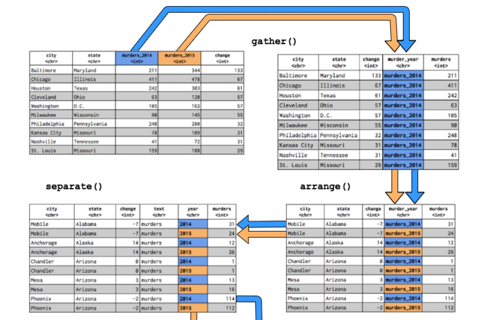<!-- -->

The `fivethirtyeight` R package – released by Albert Y. Kim, Chester
Ismay, and Jennifer Chunn last March – contains dozens of datasets used
in FiveThirtyEight news articles like [“A Handful Of Cities Are Driving
2016’s Rise In
Murders,”](https://fivethirtyeight.com/features/a-handful-of-cities-are-driving-2016s-rise-in-murders/)
[“The Best MLB All-Star Teams
Ever,”](https://fivethirtyeight.com/features/the-best-mlb-all-star-teams-ever/)
and [“The Dallas Shooting Was Among The Deadliest For Police In U.S.
History.”](https://fivethirtyeight.com/features/the-dallas-shooting-was-among-the-deadliest-for-police-in-u-s-history/)

This tutorial will explore the `murder_2015_final` dataset using `tidyr`
functions like `tibble`, `gather`, `arrange` and `separate` from our
tidyverse tutorial.

## Install and load the package

Using RStudio, we’ll install and then load the `fivethirtyeight`
package, as well as `tidyr`, `tibble` and `dplyr` and then call
`murder_2015_final`

``` r
library(fivethirtyeight)
library(tidyr)
library(tibble)
library(dplyr)
murder_2015_final
```

    ## # A tibble: 83 x 5
    ##    city         state        murders_2014 murders_2015 change
    ##    <chr>        <chr>               <int>        <int>  <int>
    ##  1 Baltimore    Maryland              211          344    133
    ##  2 Chicago      Illinois              411          478     67
    ##  3 Houston      Texas                 242          303     61
    ##  4 Cleveland    Ohio                   63          120     57
    ##  5 Washington   D.C.                  105          162     57
    ##  6 Milwaukee    Wisconsin              90          145     55
    ##  7 Philadelphia Pennsylvania          248          280     32
    ##  8 Kansas City  Missouri               78          109     31
    ##  9 Nashville    Tennessee              41           72     31
    ## 10 St. Louis    Missouri              159          188     29
    ## # … with 73 more rows

Look at the dataset’s column names

Use `names(murder_2015_final)` to list out the dataset’s column names.

``` r
names(murder_2015_final)
```

    ## [1] "city"         "state"        "murders_2014" "murders_2015"
    ## [5] "change"

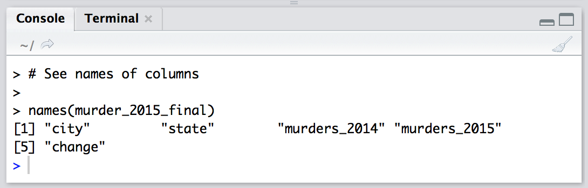<!-- -->

### Gather variables into a single column

Lets gather up the two year variables, `murders_2014` and `murders_2015`
into a single year column we’ll name `murder_year`. We’ll store the
number of murders in a column titled murders and call this new object
`murders_gathered`.

``` r
murders_gathered <- murder_2015_final %>% 
    gather(
        murder_year,
        murders,
        murders_2014:murders_2015,
        na.rm = TRUE)
murders_gathered
```

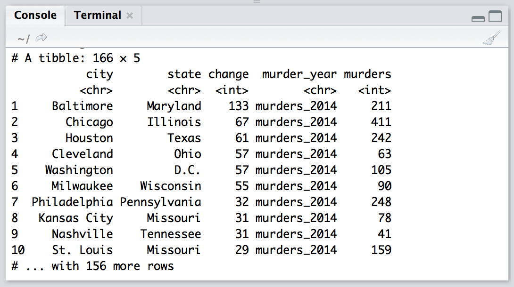<!-- -->

### Arrange data alphabetically by state and city

Now let’s `arrange` these data alphabetically by state and city. We can
do this with `dplyr::arrange()` from the `dplyr` package. (We’ll learn
more about `dplyr` in the next tutorial\!)

``` r
murders_arranged <- murders_gathered %>% 
    arrange(
        state, 
        city)
murders_arranged
```

So now we have the two years in a single column (`murder_year`), but the
repeating `murder_` text is redundant. I want to get the year in a
column by itself.

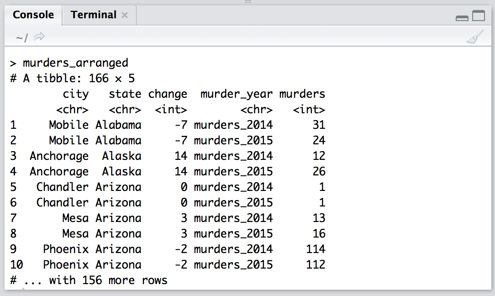<!-- -->

### Separate “murder\_year” column into “text” and “year”

Now I want to put the murder years (`2014` & `2015`) back into two
different columns. I’ll do this with `tidyr::separate()`.

The `separate()` command uses a name of the existting column we want to
separate (`murder_year`), and the names of the columns that will contain
the separated values (`c("text", "year")`).

``` r
murders_separate <- murders_arranged %>%
    tidyr::separate(
        murder_year,
            into = c("text", 
                     "year"))
murders_separate
```

    ## # A tibble: 166 x 6
    ##    city      state   change text    year  murders
    ##    <chr>     <chr>    <int> <chr>   <chr>   <int>
    ##  1 Mobile    Alabama     -7 murders 2014       31
    ##  2 Mobile    Alabama     -7 murders 2015       24
    ##  3 Anchorage Alaska      14 murders 2014       12
    ##  4 Anchorage Alaska      14 murders 2015       26
    ##  5 Chandler  Arizona      0 murders 2014        1
    ##  6 Chandler  Arizona      0 murders 2015        1
    ##  7 Mesa      Arizona      3 murders 2014       13
    ##  8 Mesa      Arizona      3 murders 2015       16
    ##  9 Phoenix   Arizona     -2 murders 2014      114
    ## 10 Phoenix   Arizona     -2 murders 2015      112
    ## # … with 156 more rows

Great. Now I can use `tidyr::spread()` to put the year back into two
different columns, 2014 & 2015. But I will combine this with
`dplyr::arrange()` so the output is easier to read.

``` r
murders_spread <- murders_separate %>% 
    spread(
        year,
        murders
        ) %>% 
        arrange(
            state,
            city)
murders_spread
```

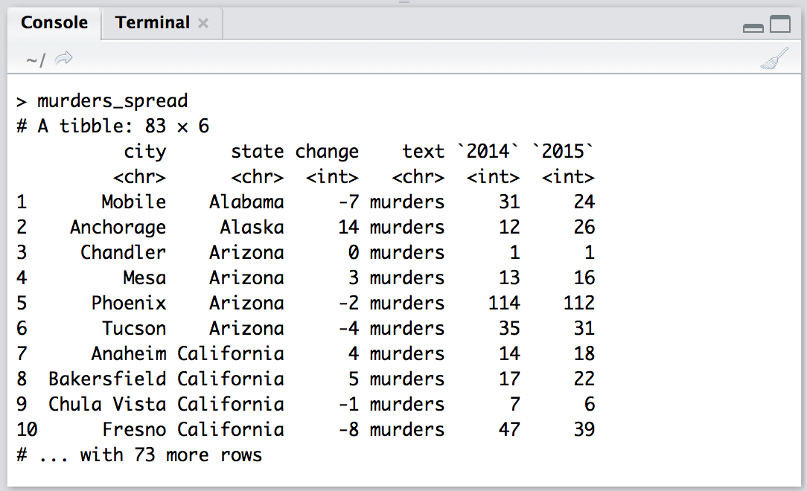<!-- -->

What if I want to combine city and state into a single column
`city_state`?

### Using unite to paste one column into another

The final command, `tidyr::unite()`, lets me paste the contents of
columns onto one another. It requires the name of the new column
`city_state` and the columns I want to combine city and state. But I
want to sort this new tibble in descending order of change, and I want
to remove the text variable.

I can combine all of these together with the pipe (`%>%`).

``` r
murders_final <- murders_spread %>%
unite(
    city_state, 
    city, 
    state) %>% 
        arrange(
            city_state
            ) %>% 
            select(
                -(text)
                )
murders_final
```

    ## # A tibble: 83 x 4
    ##    city_state             change `2014` `2015`
    ##    <chr>                   <int>  <int>  <int>
    ##  1 Albuquerque_New Mexico     13     30     43
    ##  2 Anaheim_California          4     14     18
    ##  3 Anchorage_Alaska           14     12     26
    ##  4 Arlington_Texas            -5     13      8
    ##  5 Atlanta_Georgia             1     93     94
    ##  6 Aurora_Colorado            13     11     24
    ##  7 Austin_Texas               -9     32     23
    ##  8 Bakersfield_California      5     17     22
    ##  9 Baltimore_Maryland        133    211    344
    ## 10 Boston_Massachusetts      -15     53     38
    ## # … with 73 more rows

## Output the new table as a csv

Use `readr::write_csv(as_data_frame(murders_final),
"murders_final.csv")` and voilá, you have a csv.

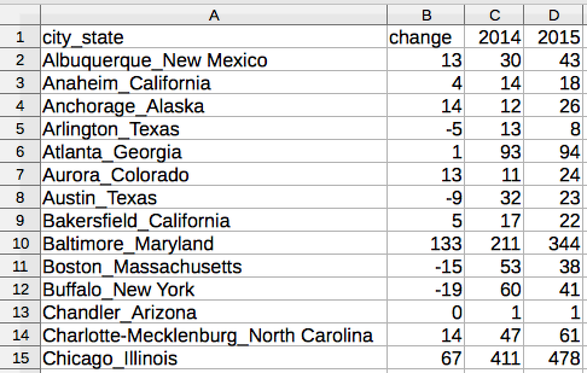<!-- -->

### A recap of what we learned

We used the pipe operator to string together various `tidyr` and `dplyr`
functions for structuring our data (in tibbles). Remember that:

`gather()` collects data across columns and puts it into into rows
`arrange()` sorts the data in each column `separate()` divides the
contents of a column apart into new columns `spread()` distributes data
from rows into columns `unite()` attaches the contents from one column
onto the contents of another column

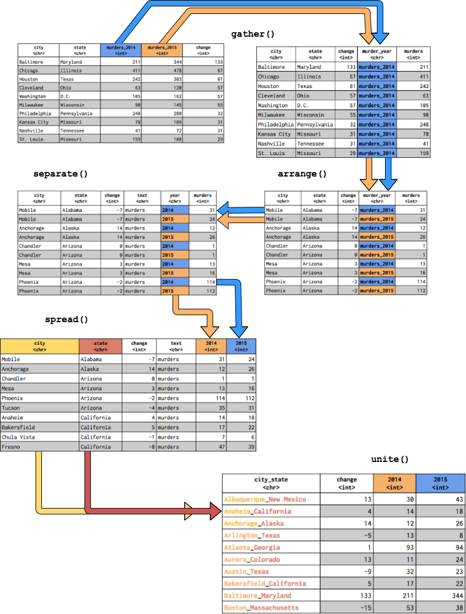<!-- -->

### A quick barplot

By typing `barplot(murders_final$change)`, you can create a quick
barplot of the change in murders by city.

``` r
graphics::barplot(murders_final$change)
```

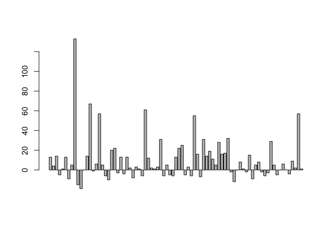<!-- -->

Obviously, the barplot is not visualizing the “change” column sorted low
to high. To do that, try your hand with `arrange()`.

``` r
murders_final  %>% 
  dplyr::arrange(change) -> murders_final_sort
```

Then, plotting `barplot(murders_final_sort$change)` will produce this:

``` r
barplot(murders_final_sort$change)
```

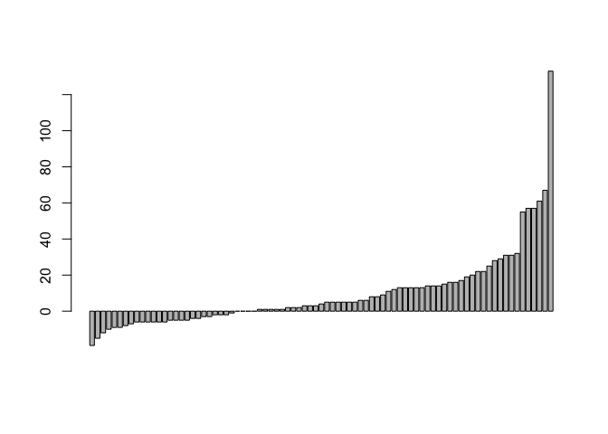<!-- -->

To extend the y-axis to -20, add:

``` r
barplot(murders_final_sort$change,
        ylim = c(-20, 120))
```

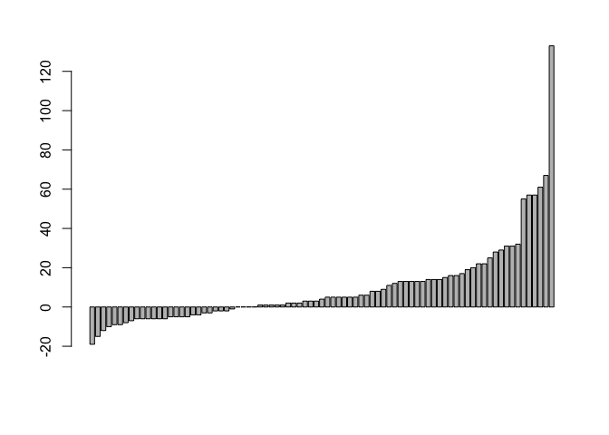<!-- -->

Finally, we’ll add some labels. There are many different ways to add
labels in R. Here’s one way:

``` r
midpts <- barplot(murders_final_sort$change,
                  cex.axis = 1.0, cex.names = 0.6,
                  ylim = c(-20, 120), main = "Change in murders from 2014 to 2015"
)

text(murder_2015_final$city,
     x = midpts,
     offset = -0.1,
     y = -20,
     cex = 0.5,
     srt = 60,
     xpd = TRUE,
     pos = 2
) 
```

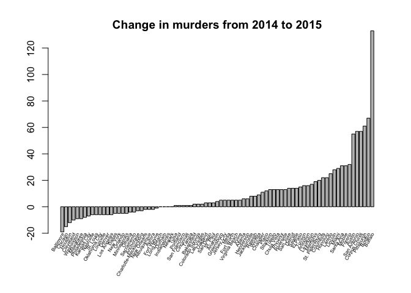<!-- -->
