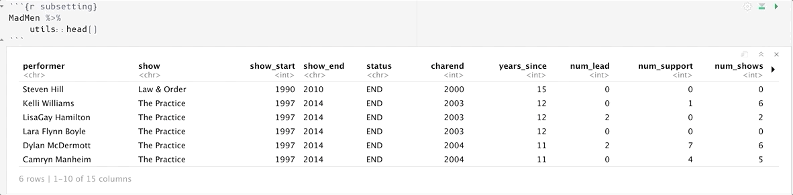
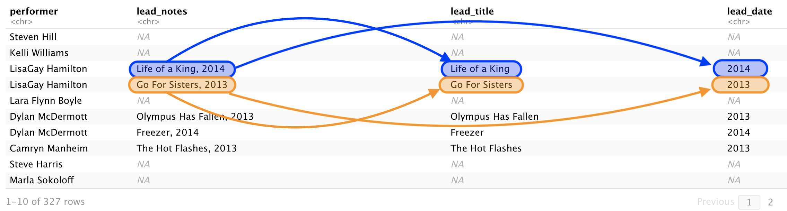
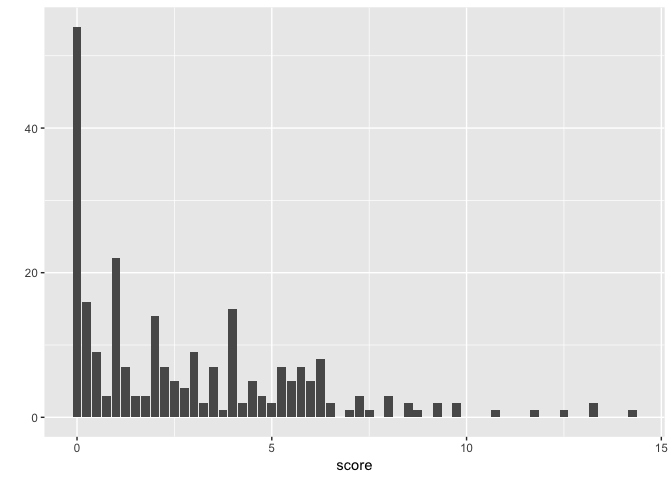

How to explore and manipulate a dataset from the fivethirtyeight package
in R
================
Martin Frigaard

  - [Install and load packages](#install-and-load-packages)
  - [Loading data from a package](#loading-data-from-a-package)
  - [Separating a column into multiple
    rows](#separating-a-column-into-multiple-rows)
      - [How tidyr::separate\_rows()
        works](#how-tidyrseparate_rows-works)
  - [Separating a column into multiple
    variables](#separating-a-column-into-multiple-variables)
      - [Dealing with messages &
        warnings](#dealing-with-messages-warnings)
      - [How tidyr::separate() works](#how-tidyrseparate-works)
  - [Unite columns into new
    variables](#unite-columns-into-new-variables)
      - [How tidyr::unite() works](#how-tidyrunite-works)
  - [Arrange data by a single column](#arrange-data-by-a-single-column)
      - [How dplyr::arrange() works](#how-dplyrarrange-works)
  - [Gathering multiple variables into a single
    column](#gathering-multiple-variables-into-a-single-column)
      - [How dplyr::arrange() & tidyr::gather()
        works](#how-dplyrarrange-tidyrgather-works)
  - [Spreading a variable across
    columns](#spreading-a-variable-across-columns)
  - [Exploring the data with ggplot2](#exploring-the-data-with-ggplot2)
      - [Why have a ‘grammar’ of data
        visualization?](#why-have-a-grammar-of-data-visualization)
      - [Composition of graphical
        elements](#composition-of-graphical-elements)
      - [Geoms and aesthetics](#geoms-and-aesthetics)
          - [Using geoms with
            ggplot2::qplot()](#using-geoms-with-ggplot2qplot)
          - [The bar plot](#the-bar-plot)
              - [What is this graph telling
                us?](#what-is-this-graph-telling-us)
          - [A box-plot](#a-box-plot)
              - [What is this graph telling
                us?](#what-is-this-graph-telling-us-1)
      - [Output the new tables as csv
        files](#output-the-new-tables-as-csv-files)
      - [A recap of what we learned](#a-recap-of-what-we-learned)
          - [End](#end)

Original version: `"2017-05-12"`

Current version: 2019-05-14

The
[fivethirtyeight](https://cran.r-project.org/web/packages/fivethirtyeight/vignettes/fivethirtyeight.html)
R package – released by Albert Y. Kim, Chester Ismay, and Jennifer Chunn
– contains dozens of datasets used in FiveThirtyEight news articles like
[The Best MLB All-Star Teams
Ever](https://fivethirtyeight.com/features/the-best-mlb-all-star-teams-ever/),
and [The Dallas Shooting Was Among The Deadliest For Police In U.S.
History.](https://fivethirtyeight.com/features/the-dallas-shooting-was-among-the-deadliest-for-police-in-u-s-history/)

This tutorial will explore a few datasets from the `fivethirtyeight`
package using `tidyverse` packages and functions like `arrange`,
`separate`, `separate_rows`, `gather`, and `spread` in our previous
[tutorial.](http://www.storybench.org/getting-started-with-tidyverse-in-r/)
It will also introduce basic visualizations with `ggplot2` geoms.

## Install and load packages

Using RStudio, install and load the `fivethirtyeight` and `tidyverse`
packages (this includes `tidyr`, `tibble` and `dplyr`).

``` r
library(fivethirtyeight)
library(tidyverse)
```

## Loading data from a package

The `mad_men` table comes from the article, [“Mad Men” Is Ending. What’s
Next For The
Cast?"](https://fivethirtyeight.com/features/mad-men-is-ending-whats-next-for-the-cast/).
Using data from a package is like using a function from a package. The
syntax is, `package::data`.

## Separating a column into multiple rows

The code below will load the `mad_men` data set into the current
workspace. I prefer to assign `CamelCase` names to `data.fames` and
`tibbles`, so I’ll rename this to `MadMen`. I’ll also view the overall
structure of this object with `dplyr::glimpse()`.

``` r
MadMen <- fivethirtyeight::mad_men
MadMen %>% dplyr::glimpse(78)
```

    ## Observations: 248
    ## Variables: 15
    ## $ performer     <chr> "Steven Hill", "Kelli Williams", "LisaGay Hamilton", …
    ## $ show          <chr> "Law & Order", "The Practice", "The Practice", "The P…
    ## $ show_start    <int> 1990, 1997, 1997, 1997, 1997, 1997, 1997, 1997, 1990,…
    ## $ show_end      <chr> "2010", "2014", "2014", "2014", "2014", "2014", "2014…
    ## $ status        <chr> "END", "END", "END", "END", "END", "END", "END", "END…
    ## $ charend       <int> 2000, 2003, 2003, 2003, 2004, 2004, 2004, 2004, 2004,…
    ## $ years_since   <int> 15, 12, 12, 12, 11, 11, 11, 11, 11, 11, 10, 10, 10, 1…
    ## $ num_lead      <int> 0, 0, 2, 0, 2, 0, 0, 0, 0, 0, 3, 0, 1, 1, 5, 2, 0, 1,…
    ## $ num_support   <int> 0, 1, 0, 0, 7, 4, 2, 1, 0, 1, 1, 7, 1, 2, 9, 4, 6, 5,…
    ## $ num_shows     <int> 0, 6, 2, 0, 6, 5, 3, 1, 0, 0, 10, 9, 8, 7, 7, 5, 4, 3…
    ## $ score         <dbl> 0.00, 6.25, 4.00, 0.00, 9.75, 6.00, 3.50, 1.25, 0.00,…
    ## $ score_div_y   <chr> "0", "0.520833333", "0.333333333", "0", "0.886363636"…
    ## $ lead_notes    <chr> NA, NA, "Life of a King, 2014; Go For Sisters, 2013",…
    ## $ support_notes <chr> NA, "Any Day Now (2012)", NA, NA, "The Messengers, 20…
    ## $ show_notes    <chr> NA, "Medical Investigation, Season 1; Lie To Me, Seas…

The article tells us this dataset has information on 248 actors who,
*appeared on at least half the episodes of television shows that were
nominated for an Emmy for Outstanding Drama since the year 2000*.

These data are from the [Internet Movie Database](https://www.imdb.com)
(IMDB) and [OpusData](https://www.opusdata.com/). There are three
`_notes` variables that list the leads, supporting roles, and shows each
actor has been in after their prestige television `show` ended. The
`show_start` and `show_end` contain the duration of the show (in years).
You can read more about the data on [FiveThirtyEight’s GitHub
account](https://github.com/fivethirtyeight/data/tree/master/mad-men).

I’ll use the `utils::head()` function to view the top six observations
of the `MadMen` dataset.

``` r
MadMen %>% utils::head()
```

    ## # A tibble: 6 x 15
    ##   performer show  show_start show_end status charend years_since num_lead
    ##   <chr>     <chr>      <int> <chr>    <chr>    <int>       <int>    <int>
    ## 1 Steven H… Law …       1990 2010     END       2000          15        0
    ## 2 Kelli Wi… The …       1997 2014     END       2003          12        0
    ## 3 LisaGay … The …       1997 2014     END       2003          12        2
    ## 4 Lara Fly… The …       1997 2014     END       2003          12        0
    ## 5 Dylan Mc… The …       1997 2014     END       2004          11        2
    ## 6 Camryn M… The …       1997 2014     END       2004          11        0
    ## # … with 7 more variables: num_support <int>, num_shows <int>,
    ## #   score <dbl>, score_div_y <chr>, lead_notes <chr>, support_notes <chr>,
    ## #   show_notes <chr>

I can use the RStudio notebook preview window to scroll over and see
that `LisaGay Hamilton` has two lead roles (`Life of a King, 2014` and
`Go For Sisters, 2013`) coming up in the `lead_notes` variable.

*These are listed next to each other, separated by a semi-colon.*

<!-- -->

This data arrangement doesn’t meet the rules of tidy data because there
are two observations (i.e. multiple lead roles) in the same row.

Fortunately `tidyr` comes with a `separate_rows()` function I can use to
move the two movie titles into their own rows. I’ll set the `sep`
argument to indicate I want to split these values at the semi-colon
(`sep = ;`) and save these new data into `MadMenSepRows`.

``` r
MadMenSepRows <- MadMen %>% 
    tidyr::separate_rows(lead_notes, sep = ";") 
MadMenSepRows %>% utils::head()
```

<!-- -->

This separated the items in `lead_notes` into their own rows, but this
also means all the other information on `LisaGay Hamilton` gets
duplicated into a second row, too.

### How tidyr::separate\_rows() works

<!-- -->

## Separating a column into multiple variables

When I look at the `lead_notes` I see there are still two pieces of
information in this variable: the title and the year (separated by a
comma). I am going to use another `tidyr` function, `separate()`, to
split these two into different *columns*.

`tidyr::separate()` takes a `col` argument (the column I want to use to
split), `into` (the new columns for the two bits of data), `sep` (what
to split them on), and `remove` (a logical argument specifying whether
to delete the original column).

I’m going to run this code without assigning it to a new object to
demonstrate how handy it is to work in RMarkdown/RStudio.

``` r
MadMenSepRows %>% 
    tidyr::separate(col = lead_notes,  
                    into = c("lead_title", "lead_date"), 
                    sep = ", ", 
                    remove = FALSE)
```

    ## Warning: Expected 2 pieces. Additional pieces discarded in 1 rows [54].

<!-- -->

### Dealing with messages & warnings

When I ran the code above I got the following text in the output window,

`Expected 2 pieces. Additional pieces discarded in 1 rows [54].`

Be sure to read all error & warning messages. Many times, if something
doesn’t work, the solution is right there in the message (*this is one
of those cases.*) I will leave it as an exercise to understand what is
happening with the `tidyr::separate()` message.

Now that I know this function is working, I will assign this to a new
object called, `MadMenSeparated`.

``` r
MadMenSeparated <- MadMenSepRows %>% 
    tidyr::separate(col = lead_notes,  
                    into = c("lead_title", "lead_date"), 
                    sep = ", ", 
                    remove = FALSE)
```

### How tidyr::separate() works

<!-- -->

## Unite columns into new variables

Sometimes two columns need to be combined into a new, single variable.
I’ll demonstrate an example of this with the data behind the article,
[“Where Police Have Killed Americans In
2015”](https://fivethirtyeight.com/features/where-police-have-killed-americans-in-2015/).

These data are from the Guardian’s
[database](https://www.theguardian.com/us-news/ng-interactive/2015/jun/01/about-the-counted)
on police killings,

> “The Counted is a project by the Guardian – and you – working to count
> the number of people killed by police and other law enforcement
> agencies in the United States throughout 2015 and 2016.”

The code below loads and views the `police_killings` data frame.

``` r
PoliceKillings <- fivethirtyeight::police_killings
PoliceKillings %>% dplyr::glimpse(78)
```

    ## Observations: 467
    ## Variables: 34
    ## $ name                 <chr> "A'donte Washington", "Aaron Rutledge", "Aaron…
    ## $ age                  <int> 16, 27, 26, 25, 29, 29, 22, 35, 44, 31, 76, 40…
    ## $ gender               <chr> "Male", "Male", "Male", "Male", "Male", "Male"…
    ## $ raceethnicity        <chr> "Black", "White", "White", "Hispanic/Latino", …
    ## $ month                <chr> "February", "April", "March", "March", "March"…
    ## $ day                  <int> 23, 2, 14, 11, 19, 7, 27, 26, 28, 7, 26, 12, 2…
    ## $ year                 <int> 2015, 2015, 2015, 2015, 2015, 2015, 2015, 2015…
    ## $ streetaddress        <chr> "Clearview Ln", "300 block Iris Park Dr", "22n…
    ## $ city                 <chr> "Millbrook", "Pineville", "Kenosha", "South Ga…
    ## $ state                <chr> "AL", "LA", "WI", "CA", "OH", "AZ", "CA", "CA"…
    ## $ latitude             <dbl> 32.52958, 31.32174, 42.58356, 33.93930, 41.148…
    ## $ longitude            <dbl> -86.36283, -92.43486, -87.83571, -118.21946, -…
    ## $ state_fp             <int> 1, 22, 55, 6, 39, 4, 6, 6, 48, 26, 6, 6, 48, 1…
    ## $ county_fp            <int> 51, 79, 59, 37, 153, 13, 29, 37, 41, 81, 31, 5…
    ## $ tract_ce             <int> 30902, 11700, 1200, 535607, 530800, 111602, 70…
    ## $ geo_id               <dbl> 1051030902, 22079011700, 55059001200, 60375356…
    ## $ county_id            <int> 1051, 22079, 55059, 6037, 39153, 4013, 6029, 6…
    ## $ namelsad             <chr> "Census Tract 309.02", "Census Tract 117", "Ce…
    ## $ lawenforcementagency <chr> "Millbrook Police Department", "Rapides Parish…
    ## $ cause                <chr> "Gunshot", "Gunshot", "Gunshot", "Gunshot", "G…
    ## $ armed                <chr> "No", "No", "No", "Firearm", "No", "No", "Fire…
    ## $ pop                  <int> 3779, 2769, 4079, 4343, 6809, 4682, 5027, 5238…
    ## $ share_white          <dbl> 60.5, 53.8, 73.8, 1.2, 92.5, 7.0, 50.8, 8.6, 1…
    ## $ share_black          <dbl> 30.5, 36.2, 7.7, 0.6, 1.4, 7.7, 0.3, 0.2, 17.7…
    ## $ share_hispanic       <dbl> 5.6, 0.5, 16.8, 98.8, 1.7, 79.0, 44.2, 84.1, 6…
    ## $ p_income             <int> 28375, 14678, 25286, 17194, 33954, 15523, 2594…
    ## $ h_income             <int> 51367, 27972, 45365, 48295, 68785, 20833, 5806…
    ## $ county_income        <int> 54766, 40930, 54930, 55909, 49669, 53596, 4855…
    ## $ comp_income          <dbl> 0.9379359, 0.6834107, 0.8258693, 0.8638144, 1.…
    ## $ county_bucket        <int> 3, 2, 2, 3, 5, 1, 4, 4, 2, 3, 4, 5, 3, 4, 3, 1…
    ## $ nat_bucket           <int> 3, 1, 3, 3, 4, 1, 4, 4, 1, 2, 3, 5, 3, 2, 2, 1…
    ## $ pov                  <dbl> 14.1, 28.8, 14.6, 11.7, 1.9, 58.0, 17.2, 12.2,…
    ## $ urate                <dbl> 0.09768638, 0.06572379, 0.16629314, 0.12482727…
    ## $ college              <dbl> 0.16850951, 0.11140236, 0.14731227, 0.05013293…

I want to `unite()` the `city` and `state` columns into a single column
titled `city_state`. The new `city_state` column will include the name
of the city and state, separated by a comma. Creating this column *does*
violate the rules of tidy data, but a column like this might be helpful
as a label on a graph.

Just to be safe we will keep both the `city` and `state` variables in
the `PoliceKillingsUnited` data set.

``` r
PoliceKillingsUnited <- PoliceKillings %>% 
    tidyr::unite(col = city_state, # new variable name
     city, state, # columns I am using
     sep = ", ", # how to separated them
     remove = FALSE) # do not remove city and state 
PoliceKillingsUnited %>% dplyr::select(streetaddress:longitude) %>% head(3)
```

### How tidyr::unite() works

`tidyr::unit()` combines two columns into one.

<!-- -->

## Arrange data by a single column

Load the `murder_2015_final` data set into the workspace into an object
called `Murder2015Final`.

``` r
Murder2015Final <- fivethirtyeight::murder_2015_final
Murder2015Final %>% dplyr::glimpse(78)
```

    ## Observations: 83
    ## Variables: 5
    ## $ city         <chr> "Baltimore", "Chicago", "Houston", "Cleveland", "Washi…
    ## $ state        <chr> "Maryland", "Illinois", "Texas", "Ohio", "D.C.", "Wisc…
    ## $ murders_2014 <int> 211, 411, 242, 63, 105, 90, 248, 78, 41, 159, 45, 56, …
    ## $ murders_2015 <int> 344, 478, 303, 120, 162, 145, 280, 109, 72, 188, 73, 8…
    ## $ change       <int> 133, 67, 61, 57, 57, 55, 32, 31, 31, 29, 28, 25, 22, 2…

These data come from the article, [A Handful Of Cities Are
Driving 2016’s Rise In
Murders](https://fivethirtyeight.com/features/a-handful-of-cities-are-driving-2016s-rise-in-murders/).

It’s often helpful to sort or arrange your data before you make any
changes to their structure. If you set the data up in a predictable way,
it’ll be easier to spot if any transformations go wrong or produce a
result you weren’t expecting.

I am going to use `dplyr::arrange()` to sort the `Murder2015Final` data
by `city` and rename them `MurdersArranged`. I’ll print these to the
RStudio Notebook `tibble` preview.

``` r
MurdersArranged <- Murder2015Final %>% 
    dplyr::arrange(city)
MurdersArranged %>% utils::head()
```

### How dplyr::arrange() works

`dplyr::arrange()` sorts a data frame by a single (or multiple)
variables.

<!-- -->

## Gathering multiple variables into a single column

The `MurdersArranged` data has two variables that contain the number of
murders in each state for 2014 and 2015 (`murders_2014` and
`murders_2015`). I am going to `gather` up these variables into a single
column I’ll name `murder_year`, and I’ll store the number of murders in
a column titled `murders`. Both of these new variables will get stored
in a new object titled `MurdersGathered`.

I’ll continue including `dplyr::arrange()` to see if I get a predictable
result.

``` r
MurdersGathered <- MurdersArranged %>% 
    tidyr::gather(
        key = murder_year,
        value = murders,
        murders_2014:murders_2015,
        na.rm = TRUE) %>% 
    dplyr::arrange(city)
MurdersGathered %>% utils::head()
```

### How dplyr::arrange() & tidyr::gather() works

The image below shows how the `tidyr::gather()` works on the arranged
data.

<!-- -->

## Spreading a variable across columns

The opposite of `tidyr::gather()` is `tidyr::spread()`. This function
works a lot like `tidyr::gather()`, because it takes the same `key` and
`value` arguments, only this time it sends the contents on `murder_year`
into two columns (only two different values are in this column), and the
values from `murders` ends up beneath each new corresponding column.
I’ll put this into a new object named `MurderSpread`.

``` r
MurderSpread <- MurdersGathered %>% 
    tidyr::spread(key = murder_year,
        value = murders
        ) %>% 
        dplyr::arrange(
            city)
MurderSpread %>% utils::head()
```

<!-- -->

# Exploring the data with ggplot2

In the previous tutorial, we used the `ggplot2::qplot()` function to
visualize data. The `ggplot2` package is an implementation of the
[“Grammar of Graphics”](https://amzn.to/2MRRCAB) by Leland Wilkinson.

Below I give a brief overview of the benefits of having a grammar and
the `quickplot` syntax.

### Why have a ‘grammar’ of data visualization?

[Wilhelm von
Humboldt](https://en.wikipedia.org/wiki/Wilhelm_von_Humboldt) described
language as a system for “*making infinite use of finite means.*”
Grammar is then a set of rules used to generate comprehensible sentences
in a language (human or computer languages).

Within the R language, `ggplot2` provides a rich vocabulary for
graphical elements. Knowing how to use `ggplot2`’s grammar gives an
excellent mental model for thinking about data visualizations.

### Composition of graphical elements

I’d like to extend the definition of ‘grammar’ above to include Steven
Pinker’s description in [The Sense of
Style](https://www.amazon.com/Sense-Style-Thinking-Persons-Writing/dp/0143127799),
“*\[grammar is\] our species’ solution to the problem of getting
complicated thoughts from one head into another*.”

In this sense, `ggplot2` gives us an ability to communicate the
*complexities* of our data in the same way that scientific jargon allows
us to precisely and unambiguously defined ideas.

Lastly, `ggplot2` has an expansive vocabulary, so knowing a finite list
of functions and their syntax unlocks an unlimited number of
visualizations.

## Geoms and aesthetics

A geom (or geometric object) is, \*“what you actually see on the plot:
points, lines, polygons, etc.\* These are combined with aesthetic
mappings, which are *"properties that can be perceived on the graphic*”
like color, size, position, and shape.

I’ll be using `qplot()`’s `geom =` argument to explore the data in my
current working environment.

### Using geoms with ggplot2::qplot()

Using the geoms in `ggplot2::qplot()` means supplying the `geom =`
argument with a type of graph. The syntax looks like this:

``` r
Data %>% ggplot2::qplot(data = ., 
                      x = variable_x, 
                      y = variable_y,
                      geom = "shape")
```

The `data = .` argument is a product of the piping syntax. By placing
the `data = .` on the right-hand side of the pipe operator (`%>%`), we
are telling R to read this statement as, “*the object to the left of the
`%>%` belongs in the `data` argument.*” See the figure below:

<!-- -->

The `geom = shape` will be replaced by a geom or type of graph (`"bar"`,
`"point"`, “box”)

In the [Mad Men
article](https://fivethirtyeight.com/features/mad-men-is-ending-whats-next-for-the-cast/),
the variables are described with the language below,

> I zeroed in on the actors who had been on a defunct show or, if the
> program was still on the air, had left the show. This encompassed 248
> performers, all of whom were given a score for their post-show career.
> They received:
> 
>   - 1 point for each season they regularly appeared on another TV
>     show.
>   - 1 point for each time they had a leading role in a film.
>   - 0.25 points for each supporting role in a film.

The variables outlined above are `num_shows`, `num_lead`, `num_support`,
and they give us the `score_div_y` (or *“Score” divided by “Years
Since”*). The `score_div_y` and `years_since` then give us the total
`score`. These data are presented in the article as a table, but I’ll
explore the `score` variable using two geoms from `ggplot2`.

### The bar plot

Using the geoms in `ggplot2::qplot()` means supplying the `geom =`
argument with a type of graph.

A bar-plot might help us understand the distribution of `score` in the
`MadMen` data. I can build this graph using the template above,
substituting the `MadMen` for `Data`, `score` in the `x` variable
position, and `"bar"` for `"shape"`.

``` r
MadMen %>% ggplot2::qplot(data = ., 
                        x = score, 
                        geom = "bar")
```

<!-- -->

#### What is this graph telling us?

The `geom = "bar"` displays the `score` values in the height of each bar
(i.e. their `count`, as indicated by the `y` axis). These bars aren’t
equal heights, and the highest bar is at `0`. Fewer tall bars are on the
right side of the graph (high `score`s), only four bars have a `count`
higher than `10` (all are under `5`).

The article indicated, “*The median actor in our set had a score of 2*”,
but it’s not clear where the median value is in the bar-plot. To view
how this statistic fits into the distribution of `score`, I will use the
`geom = "boxplot"`.

### A box-plot

Change the code above to use a `geom = "boxplot"`, but map `score` to
the `y` axis and give the `x` axis a blank character string (`" "`).

``` r
MadMen %>% ggplot2::qplot(data = ., 
                        x = " ", 
                        y = score,
                        geom = "boxplot") 
```

<!-- -->

#### What is this graph telling us?

Box-plots (or box and whisker plots) display five statistical concepts
in a single graph. These were initially introduced by John Tukey in his
1977 book, [“Exploratory Data Analysis.”](https://amzn.to/2t8lUWI)

<!-- The image below is a taken from page 41,  -->

<!-- ```{r IMAGE-og-box-whisker, echo=FALSE} -->

<!-- # fs::dir_ls("images") -->

<!-- knitr::include_graphics(path = "images/og-box-whisker.png") -->

<!-- ``` -->

Box-plots display the five number summary, which includes the smallest,
largest, median, and upper and lower quartiles (quartiles divide the
numbers into a percentage, and the 25th and 75th are included on the
graph). Box-plots also display ‘outliers’, or extreme values as dots or
points.

In order to get an idea of what I should be seeing on the graph, I will
use the `base::summary()` function to list the `Min`, `1st Qu.`,
`Median`, `Mean`, `3rd Qu.`, and `Max.` This is a five number summary
plus the mean (or average).

``` r
base::summary(MadMen$score)
```

    ##    Min. 1st Qu.  Median    Mean 3rd Qu.    Max. 
    ##   0.000   0.250   2.000   2.793   4.500  14.250

The `Median` is the horizontal line within the box, and if I look over
to the `y` axis, I can see this corresponds to a score of 2 (just like
the article stated).

<!-- -->

Can you guess which bars in the bar-plot correspond to the points on the
box-plot?

## Output the new tables as csv files

Use `write_csv(as.data.frame(x = Data, file = "path/to/file.csv"))` and
voilá, you have a csv.

``` r
readr::write_csv(as.data.frame(MadMen), path = "data/MadMen.csv")
```

## A recap of what we learned

We used the pipe operator to string together various `tidyr` and `dplyr`
functions for structuring our data (in tibbles). Remember that:

  - `dplyr::arrange()` sorts the data in each column

  - `tidyr::separate()` divides the contents of a column apart into new
    *columns*

  - `tidyr::separate_rows()` split the contents of a column into new
    *rows*

  - `tidyr::unite()` sticks the contents from one column onto the
    contents of another column

  - `tidyr::gather()` collects and indexes data across columns and puts
    them into into rows

  - `tidyr::spread()` distributes indexed data from rows into columns

  - using `geom`s in `ggplot2::qplot()`

  - `base::summary()` to get the five number (and mean)

In the next tutorial we will expand our `ggplot2` abilities.

### End
