Getting started with data visualization in R using ggplot2
================
Martin Frigaard
September 22, 2017

  - [Loading the packages](#loading-the-packages)
      - [Starting your data visualizations with a pen and
        paper](#starting-your-data-visualizations-with-a-pen-and-paper)
      - [Why have a grammar of
        graphics?](#why-have-a-grammar-of-graphics)
          - [Univariate plots](#univariate-plots)
          - [The data set](#the-data-set)
          - [The aesthetic layer](#the-aesthetic-layer)
          - [A statistic for a geom](#a-statistic-for-a-geom)
          - [A geom for a statistic](#a-geom-for-a-statistic)
          - [The positions for everyone](#the-positions-for-everyone)
          - [Putting it all together](#putting-it-all-together)
          - [Histograms](#histograms)
          - [Density plots](#density-plots)
          - [Bar charts](#bar-charts)
          - [Multivariate plots](#multivariate-plots)
          - [Scatter plots](#scatter-plots)
          - [Identify and label outliers](#identify-and-label-outliers)
          - [Layer scatter plots on a common
            scale](#layer-scatter-plots-on-a-common-scale)
          - [Line plots](#line-plots)
              - [Adjusting axis scales](#adjusting-axis-scales)
          - [Bar charts (stacked)](#bar-charts-stacked)
              - [Using themes and
                positions](#using-themes-and-positions)
          - [Flip coordinates](#flip-coordinates)
              - [Relevel factors](#relevel-factors)
          - [Box plots](#box-plots)
          - [Facets](#facets)
          - [Exporting graphs](#exporting-graphs)

> More information has been added to this post from R4DS. The updates
> should add clarity to the grammar of graphics.

# Loading the packages

``` r
library(tidyverse)
```

Creating a customized graph that communicates your ideas effectively can
be challenging. This tutorial will introduce you to the popular R
package `ggplot2`, its underlying grammar of graphics, and show you how
to create stylish and simple graphs quickly. We will also go over some
basic principles of data visualization.

Spending some time thinking about the structure/arrangement of your data
set will help you produce a better visualization, and we have covered
some common data wrangling tasks in these previous tutorials:

1.  Getting started with [RStudio
    Notebooks](http://www.storybench.org/getting-started-r-rstudio-notebooks/)
    for reproducible reporting
2.  [Tidying
    data](http://www.storybench.org/getting-started-with-tidyverse-in-r/)
    and the `tidyverse`
3.  [Exploring data using
    FiveThirtyEight’s](http://www.storybench.org/how-to-explore-a-dataset-from-the-fivethirtyeight-package-in-r/)
    R package
4.  [Manipulating data using the
    dplyr](http://www.storybench.org/how-to-explore-a-dataset-from-the-fivethirtyeight-package-in-r/)
    package

## Starting your data visualizations with a pen and paper

The best place to start with any visualization is with a pen and paper
sketch. I’ve found removing the confines of any particular software or
program and brainstorming on paper helps get the first bad ideas out of
the way. After I get an outline or sketch of the visualization I want to
create, I figure out the details within whatever computer/software
environment I’m using. I find this much more helpful than jumping in and
programming from scratch – it’s much harder to end up in the right place
if you have no idea where you’re going.

Graphs and comedy

My goal when I create a graph or visualization is to communicate an idea
or some information about the underlying data (i.e., the differences,
patterns, etc.) with a minimal amount additional explanation. In many
ways, good graphics are like well-written jokes; if I have to explain my
joke, it loses the desired effect. You’ve heard the phrase, “a picture
is worth a thousand words.” Well, if I want the picture (i.e. the
visualization) I create to be worth 1,000 words, any additional
explanation I have to provide diminishes that word-value.

Graphs are also similar to jokes in that you should know your audience
before delivering either. Thanksgiving dinner at your in-law’s house
probably isn’t the place for Redd Foxx’s [“What’s the difference between
a pickpocket and a peeping tom?”](http://scomedy.com/quotes/9282) but
you might get away with Abbott & Costello’s [“Who’s on
first?”](http://www.psu.edu/dept/inart10_110/inart10/whos.html)
Telling a joke to the wrong audience can be awkward (or even volatile)
because 1) the joke failed to make the material relevant and funny, or
2) unknowingly encroached on a sensitive topic. Showing a visualization
to the wrong audience is more akin to the first mistake (resulting in
crickets, blank stares, or just being overlooked), but the second isn’t
impossible. After all, data is information, so it’s a good idea to think
about how a visualization you’re sharing will fit into your audience’s
world view.

The comedian Jamie Foxx recently said he tests out his new stand-up
material on his family before using it on stage. The reason? Beta
testing rough jokes on an audience you trust enough to give you honest
feedback is a great way to refine your work. That is also an excellent
way to improve the reception of your data visualizations. By sending
early drafts to friends and colleagues, you’re getting a fresh set of
eyes on the graphs you’ve created to see if they’re communicating your
ideas effectively.

The final similarity between jokes and data visualizations is their
ability to influence their audience. Data visualizations from
journalists like Alberto Cairo, Mona Chalabi, and Jeremy Singer-Vine
have incited countless readers to demand that evidence accompanies
journalism. The current media technology landscape continues to create
opportunities for people to be influenced by data.

Many jokes are funny because they present the truth in a new and
entertaining way, which brings me to the lesson I repeat to myself
often: “it doesn’t matter if my visualizations look beautiful, get
published, go viral, or even get read by everyone on the planet. It only
matters that the reader understands what truth I was trying to tell.”
After all, the goal here is communication, so anything short of
comprehension by the intended audience is a failure.

Three goals for your data visualization or graph: 1) your audience sees
your finished work (so you truly have to do it), 2) everyone in the
intended audience understands the ideas or information you’re trying to
convey, and 3) the audience is influenced by the data you’ve presented.

Communicating numbers with graphs

In 1985, two scientists at Bell Laboratories – William Cleveland and
Robert McGill – published a [paper](http://www.jstor.org/stable/1695272)
on “visual decoding of elementary graphical-perception tasks” (i.e.,
which graph elements convey statistical concepts with minimal mental
effort). The authors identified ten commonly used graphing elements for
representing numerical data. Then they ran some experiments that tested
people’s ability to quickly and easily see the relevant information each
graph was supposed to convey. The authors used the results from these
tests to rank the graphing elements according to how accurately the
patterns in the data were perceived. Their ranking is below:

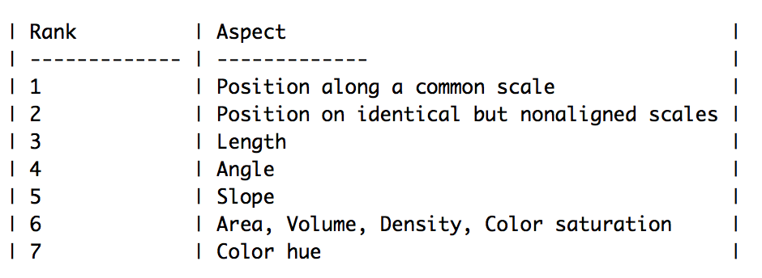<!-- -->

The point to notice here is that people could see the information and
ideas in the graphs easiest when they were displayed using positions and
geometric shapes (positioning, length, and angles). For example, the
graphs below are presenting values in positions on a horizontal axis,
easing our ability to make a comparison because the location of these
values is on identical (but not aligned) scales.

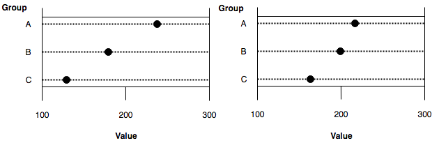<!-- -->

Nathan Yau from [Flowing Data](http://flowingdata.com/) refers to this
list of elements (but also includes ‘shape’) as the visual cues in a
graph or visualization. Below is a visual ranking of each item adapted
from Yau’s text, [Data
Points](https://www.amazon.com/Data-Points-Visualization-Means-Something/dp/111846219X).
These elements are one of four visualization components he covers (the
other three being a coordinate system, scale, and context).

<!-- -->

Leland Wilkinson’s [Grammar of
Graphics](https://www.amazon.com/Grammar-Graphics-Statistics-Computing/dp/0387245448)
presents a unique system for creating graphics in a distributed
computing environment (this was implemented in SPSS as GPL). Hadley
Wickham expanded and adapted Wilkinson’s grammar to the R language in
the `ggplot2` package.

## Why have a grammar of graphics?

Having a grammar of graphics allows us to build graphs using an official
syntax. The individual components of each graph are like parts of a
well-written sentence. Composing clear, well-structured sentences isn’t
easy. To quote Stephen Pinker,

> “appreciating the engineering design behind a sentence – a linear
> ordering of phrases which conveys a gnarly network of ideas — is the
> key to understanding what you are trying to accomplish when you
> compose a sentence.”

The `ggplot2` syntax uses layers as a “*linear ordering of phrases*” to
build graphs “*which convey a gnarly network of ideas*.” Stated simply –
the underlying grammar provides a framework for an analyst to build each
graph one part at a time in a sequential order (or layers).

The composition of `ggplot2` calls have five parts:

1.  A data set  
2.  The aesthetic mapping ( `aes()` )  
3.  A statistical transformation ( `stat =` )  
4.  A geometric object ( `geom_` )  
5.  A position adjustment ( `position =` )

### Univariate plots

Many times you will be interested in just seeing the distribution of a
single variable. There are a few ways to do this, but the most common
are histograms (a kind of bar-chart), and density plots.

Recall above we said each graph in `ggplot2` needs the data, an
aesthetic, a statistical transformation, a geometric object, and a
position adjustment. We are going to create a histogram of Height by
specifying each component.

### The data set

We will use a variety of data sets throughout this tutorial, starting
with data from the National Health and Nutrition Examination Survey, in
the [NHANES](https://cran.r-project.org/web/packages/NHANES/index.html)
package. It is important to note that `ggplot2` (and other packages in
the `tidyverse` are designed to work with
[tidy](https://www.jstatsoft.org/article/view/v059i10) data.

``` r
library(NHANES)
nhanes_df <- NHANES::NHANES %>% tbl_df()
```

``` r
nhanes_df
```

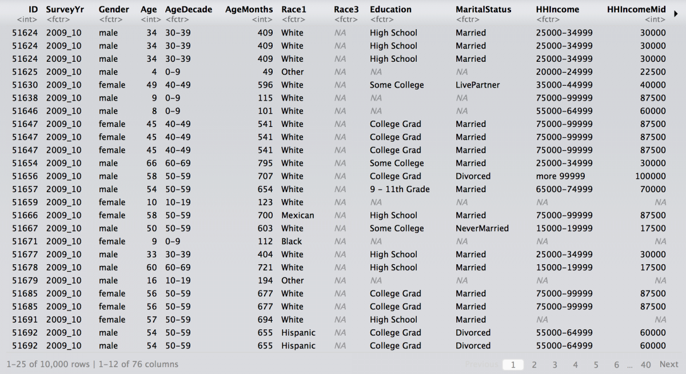<!-- -->

Let’s get a quick summary of the Height variable from our `nhanes_df`
data set using the `dplyr` functions. The help info on Height tells us:
“Standing height in cm. Reported for participants aged 2 years or
older.”

``` r
nhanes_df %>%
     dplyr::select(Height) %>%
     summarise(
         min = min(Height, na.rm = TRUE),
         max = max(Height, na.rm = TRUE),
         mean = mean(Height, na.rm = TRUE),
         median = median(Height, na.rm = TRUE),
         iqr = IQR(Height, na.rm = TRUE),
         sd = sd(Height, na.rm = TRUE),
         missing = sum(is.na(Height)),
         total_non_miss = sum(!is.na(Height)),
         total = n()
)
```

    ## # A tibble: 1 x 9
    ##     min   max  mean median   iqr    sd missing total_non_miss total
    ##   <dbl> <dbl> <dbl>  <dbl> <dbl> <dbl>   <int>          <int> <int>
    ## 1  83.6  200.  162.    166  17.7  20.2     353           9647 10000

Specificity is what makes the `dplyr` functions so flexible.
Unfortunately, this specificity comes at the expense of a lot of typing
for basic numerical summaries. If I had to do this for every variable in
my data set, it would 1) get tiring and 2) increase the chances of
error.

But we can also get a quick number summary using the `favstats` function
from the mosaic package. We will add some formatting from the `knitr`
package to make the output look prettier, too.

``` r
library(mosaic)
```

    ## Loading required package: lattice

    ## Loading required package: ggformula

    ## Loading required package: ggstance

    ## 
    ## Attaching package: 'ggstance'

    ## The following objects are masked from 'package:ggplot2':
    ## 
    ##     geom_errorbarh, GeomErrorbarh

    ## 
    ## New to ggformula?  Try the tutorials: 
    ##  learnr::run_tutorial("introduction", package = "ggformula")
    ##  learnr::run_tutorial("refining", package = "ggformula")

    ## Loading required package: mosaicData

    ## Loading required package: Matrix

    ## 
    ## Attaching package: 'Matrix'

    ## The following objects are masked from 'package:tidyr':
    ## 
    ##     expand, pack, unpack

    ## Registered S3 method overwritten by 'mosaic':
    ##   method                           from   
    ##   fortify.SpatialPolygonsDataFrame ggplot2

    ## 
    ## The 'mosaic' package masks several functions from core packages in order to add 
    ## additional features.  The original behavior of these functions should not be affected by this.
    ## 
    ## Note: If you use the Matrix package, be sure to load it BEFORE loading mosaic.

    ## 
    ## Attaching package: 'mosaic'

    ## The following object is masked from 'package:Matrix':
    ## 
    ##     mean

    ## The following objects are masked from 'package:dplyr':
    ## 
    ##     count, do, tally

    ## The following object is masked from 'package:purrr':
    ## 
    ##     cross

    ## The following object is masked from 'package:ggplot2':
    ## 
    ##     stat

    ## The following objects are masked from 'package:stats':
    ## 
    ##     binom.test, cor, cor.test, cov, fivenum, IQR, median,
    ##     prop.test, quantile, sd, t.test, var

    ## The following objects are masked from 'package:base':
    ## 
    ##     max, mean, min, prod, range, sample, sum

``` r
knitr::kable(
nhanes_df %$% mosaic::favstats(Height)
)
```

|  |  min |    Q1 | median |    Q3 |   max |     mean |       sd |    n | missing |
|  | ---: | ----: | -----: | ----: | ----: | -------: | -------: | ---: | ------: |
|  | 83.6 | 156.8 |    166 | 174.5 | 200.4 | 161.8778 | 20.18657 | 9647 |     353 |

NOTE: The `%$%` operator is another magical tool from the `magrittr`
package and handles functions that don’t return a data-frame. Use it
when the regular pipe doesn’t work.

### The aesthetic layer

The pipe (`%>%`) operator makes the ggplot code easier to read and write
by adding each layer of the graph logically like the parts of a sentence
(`data %>% aesthetic + geom`).

With the pipe we can map the aesthetic x to variable Height and create
our first graph using the `layer()` function:

``` r
# assign data and variable to aesthetic
nhanes_df %>%
     ggplot(mapping = aes(x = Height)) +
# add the necessary layers
     layer(
          stat = "bin",
          geom = "bar",
          position = "identity")
```

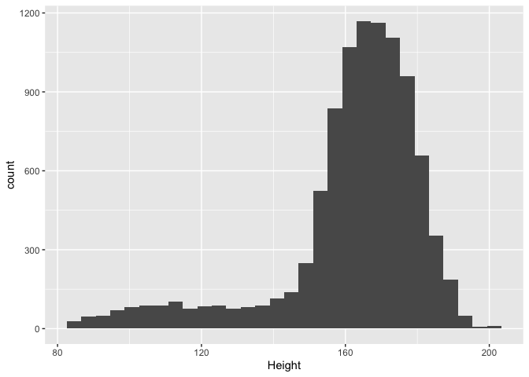<!-- -->

Ah\! What are these warnings and messages?

`ggplot2` is pretty good about warning you whenever data are missing.
This doesn’t surprise us because we had 353 missing values in our
summary above (why do you think these data are missing?).

The message is telling us how many `“bins”` our data has been divvied up
into. The default is set to 30.

### A statistic for a geom

The `stat = “bin”` is a default setting for histograms, and we can
adjust the binwidth values by specifying the `params = list(binwidth
= 1)`. The simplest way to understand bins is by setting it to extreme
values. We will set the binwidth to a small and large value to
demonstrate how bins influence the histogram.

If I use a low bin number (`binwidth = 1`), then I can see the numbers
of bars in my histogram has increased. Also, we can see there is a dip
in the number of `Height` values around `170`.

``` r
# assign data and variable to aesthetic
nhanes_df %>%
     ggplot(mapping = aes(x = Height)) +
# add the necessary layers
          layer(
               stat = "bin",
                    params = list(binwidth = 1),
               geom = "bar",
               position = "identity")
```

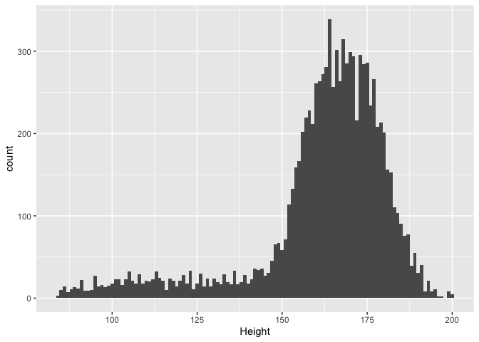<!-- -->

Conversely, if I set the binwidth to a larger number (like `“35“`), I’ll
get fewer bars, and some of the nuanced aspects of the distribution are
lost.

``` r
# assign data and variable to aesthetic
nhanes_df %>%
     ggplot(mapping = aes(x = Height)) +
# add the necessary layers
          layer(
               stat = "bin",
                    params = list(binwidth = 35),
               geom = "bar",
               position = "identity")
```

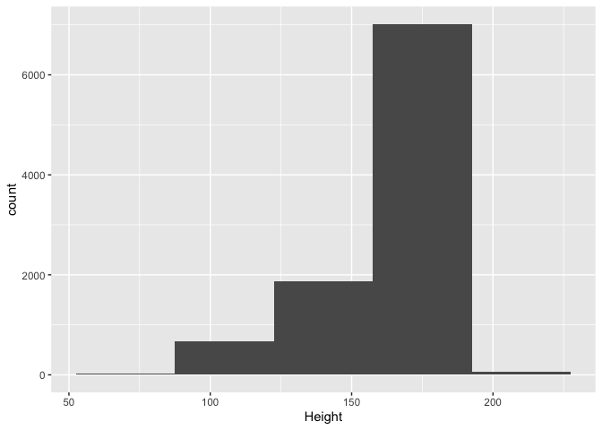<!-- -->

*NOTE*: Small number of `bins` means many bars, a large number of `bins`
means fewer bars.

Finding the best setting for `binwidth` depends on the data set, but the
goal is to give the viewer an idea of the underlying distribution of the
variable.

### A geom for a statistic

We said earlier that a histogram was a kind of bar chart, so the
geometric object for this graph is the bar (not histogram). The bars, in
this case, are the predetermined bins.

### The positions for everyone

The `position = identity` doesn’t make any changes to the data on this
geometric object (because the bars don’t need to be adjusted).

### Putting it all together

We just specified all five components for a simple histogram (the data,
the aesthetic mapping, the stat, the geometric object, and the position)
using the `layer` function. This is a lot to remember (and type\!). The
beauty of `ggplot2` is that we don’t have to state every component
explicitly. Each geometric object (`geom`) comes with a default
statistic (`stat`). The converse is also true (every `stat` belongs to a
default `geom`). This lightens the mental load when we want to use the
grammar to build a graph because we don’t have to remember what `stat`
goes with each `geom`.

### Histograms

A
[histogram](http://ggplot2.tidyverse.org/reference/geom_histogram.html)
breaks up the whole range of values in a variable into bins or classes.
Each bar in the graph represents an interval for the value of a variable
(“bins”), and the graph counts the number of observations whose values
fall into each bin.

We don’t need to type out each layer explicitly. We can get a basic
histogram by adding the `geom_histogram()` to `nhanes_df %>%
ggplot(aes(x = Height))`.

``` r
nhanes_df %>% ggplot(aes(x = Height)) +
     geom_histogram()
```

<!-- -->

I recommend assigning the `data %>% ggplot(aes())` to an object (named
`gg_something`) so you can cut down on typing. We can also specify the
binwidth inside the `geom_histogram()` function (along with the `na.rm =
TRUE` argument to remove that pesky message).

``` r
gg_nhanes_ht <- nhanes_df %>% ggplot(aes(x = Height)) 
gg_nhanes_ht +
    geom_histogram(binwidth = 3, na.rm = TRUE)
```

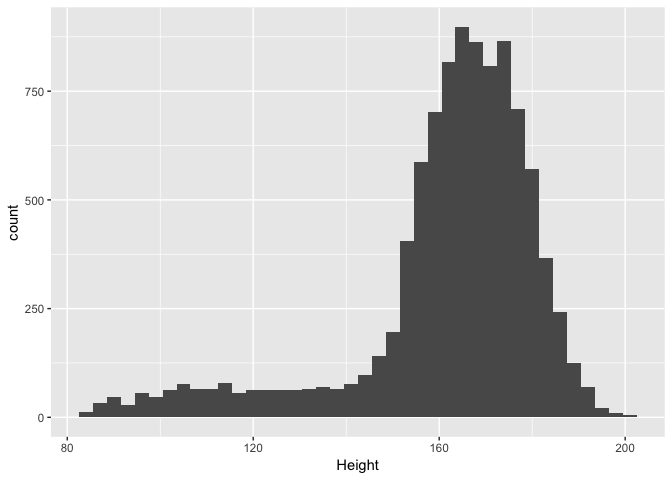<!-- -->

*NOTE*: Missing data is a huge topic and you always think carefully
about how (and when) you choose to remove observations from a data
visualization (or analysis).

There you have it – this is how `ggplot2` builds a graph by layers.
After you’ve identified a data set, the variables get set to aesthetics
(i.e. the plotting position along the x axis), then geoms (the bars,
points, lines, etc.) get added to build the graph. As we move forward,
you will see that additional variables can be set to different
aesthetics (color, size, shape, etc.) and additional geoms can be added
to enhance the graph.

Now that we have a handle on the grammar, let’s look at two additional
univariate plots.

### Density plots

The `geom_density()` plot works a lot like the histogram, but draws a
line instead of the bars.

``` r
gg_nhanes_ht + geom_density(na.rm = TRUE)
```

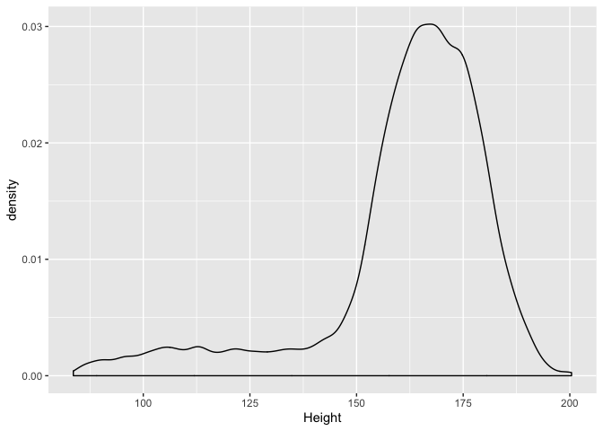<!-- -->

This distribution looks close to the histogram, but not identical.
That’s because the default stat for the `geom_density()` is `stat =
"density"`. The underlying math in “density” produces a slightly
different visual representation of the distribution. However, we can
specify the same `stat = "bin"` and set `binwidth = 3` to get a
distribution that is almost identical to the histogram.

``` r
gg_nhanes_ht + geom_density( stat = "bin", 
                             binwidth = 3, na.rm = TRUE)
```

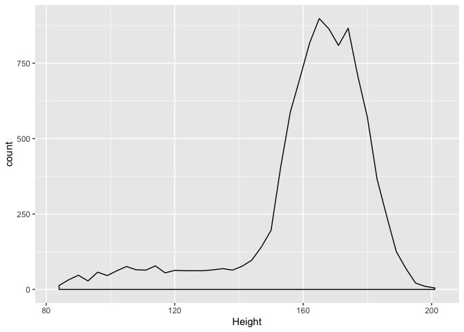<!-- -->

As we stated earlier, the great thing about the ggplot2 is how easily
you can combine different `geom`’s in the same plot. For example, if I
wanted to layer the `geom_histogram()` under the `geom_density()`, I can
just use the `+` symbol to combine them.

``` r
gg_nhanes_ht + 
    geom_histogram(binwidth = 3, 
                   na.rm = TRUE) + 
    geom_density(stat = "bin", 
                  binwidth = 3, 
                  na.rm = TRUE)
```

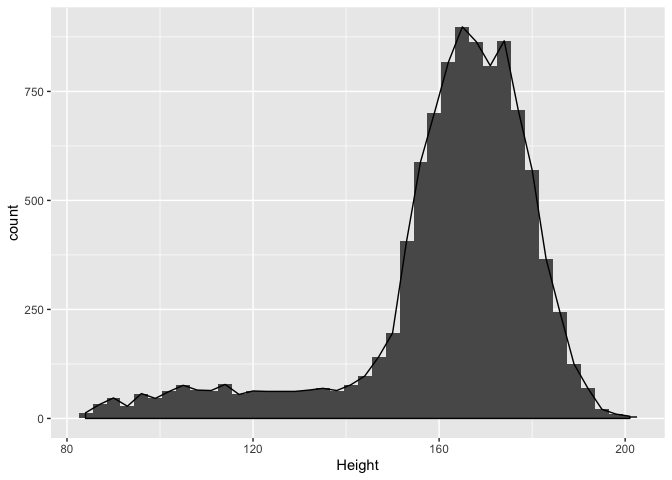<!-- -->

This is a little hard to see because both distributions are black/gray.
But I can use the `color`, `fill`, and `size` aesthetics to make it
easier to see these two geoms.

``` r
gg_nhanes_ht + geom_histogram( binwidth = 3, fill = "white", color = "steelblue", na.rm = TRUE) + geom_density( stat = "bin", binwidth = 3, size = .7, color = "red", na.rm = TRUE)
```

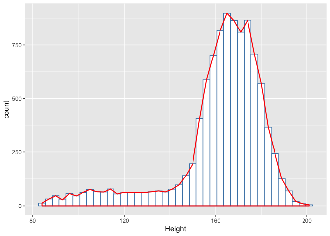<!-- -->

Is this graph more clear than simply using either the `geom_density()`
or `geom_histogram()`? I tend to think one representation of a
distribution is enough for one graph, but this example illustrates how
each function works with their statistic, and how we can combine two
geoms into the same graph.

### Bar charts

The final univariate plot we will look at is the bar
chart(`geom_bar()`). A bar chart is like a histogram, but instead of
binning the data, the observations get counted (`stat = "count"`). This
means every observation contributes one unit of height for each bar. To
get rid of the warnings, we will remove the missing `Height` values
using `na.rm = TRUE` in our bar chart geom.

``` r
gg_nhanes_ht + 
    geom_bar(na.rm = TRUE)
```

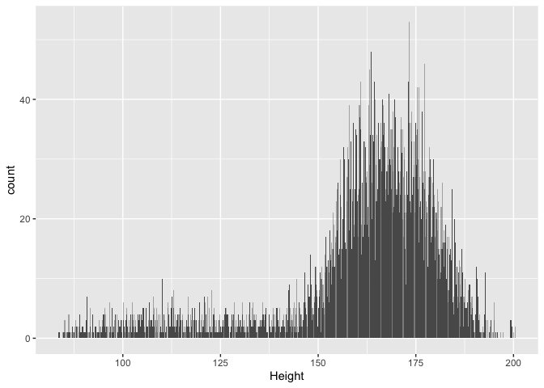<!-- -->

The `stat = "count"` is why we see gaps between the bars (not possible
when using `stat = "bin"`), can you explain why?

Which graph is best? A bar chart gives us a very granular picture of the
data, and the histogram and density plot do a better job of displaying
the underlying distribution of the Height variable. Each graph serves
its own purpose, so best really depends on the intention of the analyst.

### Multivariate plots

Now that we’ve used the `ggplot2` grammar for single variable graphs, we
will explore visualizing two variables in the same graph. By adding more
variables into the same plot, we get more graph options. But many of
these additional options come with a cost of complexity, so choose
carefully how many you include avoid [chart
junk](https://www.edwardtufte.com/bboard/q-and-a-fetch-msg?msg_id=00040Z).

Some common multivariate plots are scatter plots, line-plots, box-plots,
or point-plots. We will start by graphing two continuous numerical
variables.

### Scatter plots

Scatter plots are great if you have two variables that are measured on
continuous numerical scales (i.e. dollars, kilograms, ounces, etc.). We
will look at the relationship between `weight` and `height` in Major
League Baseball players from the `Master` data set in the `Lahman`
package.

First, we will get a summary for each variable:

Summary for `height`:

``` r
bb_df <- Lahman::Master %>% tbl_df 
bb_df %$% fav_stats(height)
```

    ##  min Q1 median Q3 max     mean       sd     n missing
    ##   43 71     72 74  83 72.30803 2.613688 18875     742

I find it helpful to think about what I’m expecting to see before I
start building graphs. I’m expecting there to a positive association (or
correlation) between `height` and `weight`. As one goes up, so does the
other (and vice versa).

To check this, I can create a scatter plot using `geom_point()` (and
filter the missing values using `na.rm = TRUE`).

``` r
gg_bb_wt_ht <- bb_df %>% ggplot(aes(x = height, y = weight)) 
gg_bb_wt_ht + 
    geom_point(na.rm = TRUE)
```

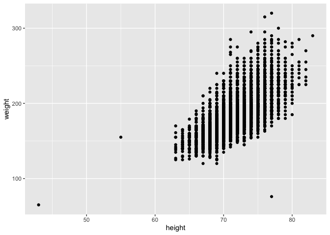<!-- -->

What can we see here? I think my expectations were met. But it looks
like there’s one tiny baseball player all alone out there in the
lower-left corner of the graph. I want to be able to identify this
player by name – do you have any ideas about how to do that?

Well, in order to solve this problem, we need to attach a name to this
data point. We already know how to `dplyr::select()` and
`dplyr::filter()` observations based on their values, so why don’t we
start with these functions.

``` r
# select the variable of interest 
tiny_player_df <- bb_df %>% 
    dplyr::select(weight, # weight   
                  height, # height
                  nameGiven) %>% # nameGiven
                  filter(height < 50 & weight < 70)
tiny_player_df
```

    ## # A tibble: 1 x 3
    ##   weight height nameGiven  
    ##    <int>  <int> <chr>      
    ## 1     65     43 Edward Carl

### Identify and label outliers

Now we can go back to our original scatter plot and add another layer.
However, this time we specify the data within the `geom_text()`, add the
label aesthetic for the player’s name (`nameGiven`), and specify what
size to make the text. I also want to adjust the alpha level inside the
`geom_point()`. The `alpha` is a measure of transparency or saturation,
so by making the number less than `1`, the points will be slightly
transparent.

``` r
gg_bb_wt_ht +
      geom_point(alpha = 1/2,
                 na.rm = TRUE) +
      geom_text(data = tiny_player_df,
                 aes(label = nameGiven),
                 size = 2.5)
```

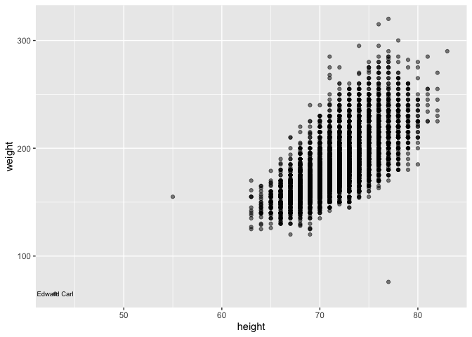<!-- -->

Using `geom_text()` is great for clearly labeling data points and
outliers, but use it sparingly. Too many words on a graph make it
difficult to read the text and know what to focus on. Adjusting the
alpha is a great way to show where many data points cluster or overlap.

We are going to move onto a new set of variables from a different data
set to continue exploring scatter plots. Let’s see the relationship
between Metacritic and Rotten Tomatoes movie critic scores for films in
the `fandango` data set from the `fivethirtyeight` package. These data
were used in the FiveThirtyEight story [“Be Suspicious Of Online Movie
Ratings, Especially
Fandango’s.”](http://fivethirtyeight.com/features/fandango-movies-ratings/)

First we will get the summary stats for the critic scores from
rottentomatoes:

``` r
fan_df <- fivethirtyeight::fandango %>% tbl_df() 
knitr::kable(fan_df %$% fav_stats(rottentomatoes))
```

|  | min |    Q1 | median | Q3 | max |     mean |      sd |   n | missing |
|  | --: | ----: | -----: | -: | --: | -------: | ------: | --: | ------: |
|  |   5 | 31.25 |   63.5 | 89 | 100 | 60.84932 | 30.1688 | 146 |       0 |

And now the summary scores from metacritic critics.

``` r
knitr::kable( fan_df %$% fav_stats(metacritic))
```

|  | min |   Q1 | median | Q3 | max |     mean |       sd |   n | missing |
|  | --: | ---: | -----: | -: | --: | -------: | -------: | --: | ------: |
|  |  13 | 43.5 |     59 | 75 |  94 | 58.80822 | 19.51739 | 146 |       0 |

And now we will get a scatter plot (`geom_point()`) comparing these two
variables. This time we won’t adjust the `alpha` level.

``` r
gg_fan_critics <- fan_df %>% 
    ggplot(aes(rottentomatoes, metacritic)) 
gg_fan_critics + geom_point()
```

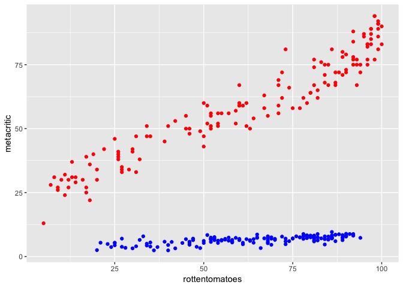<!-- -->

These two variables seem correlated (as `y` increases so does `x`, and
vice versa), but what if I also wanted to see if the user scores from
each site have the same relationship?

Below are the summaries for **Rottentomato** user scores:

``` r
knitr::kable(fan_df %$% fav_stats(rottentomatoes_user))
```

|  | min | Q1 | median | Q3 | max |     mean |       sd |   n | missing |
|  | --: | -: | -----: | -: | --: | -------: | -------: | --: | ------: |
|  |  20 | 50 |   66.5 | 81 |  94 | 63.87671 | 20.02443 | 146 |       0 |

and the users from **Metacritic** summary:

``` r
knitr::kable(fan_df %$% fav_stats(metacritic_user))
```

|  | min |  Q1 | median |  Q3 | max |     mean |       sd |   n | missing |
|  | --: | --: | -----: | --: | --: | -------: | -------: | --: | ------: |
|  | 2.4 | 5.7 |   6.85 | 7.5 | 9.6 | 6.519178 | 1.510712 | 146 |       0 |

Now we can add these two variables the same way we added the
`geom_text()` in the last plot (i.e. by specifying a separate data frame
inside the second `geom_point()` layer).

``` r
# get the df with user scores
user_df <- fan_df %>%
     dplyr::select(rottentomatoes_user,
                   metacritic_user)

gg_fan_critics +
     geom_point(color = "red") + # make the critic colors red
     geom_point(data = user_df, # assign the data inside geom_point()
                aes(rottentomatoes_user,
                    metacritic_user),
                color = "blue") # make user colors blue
```

<!-- -->

Wow, what is going on here? It looks like all the Metacritic users gave
really low ratings for the movies in the data set. This is depicted by
the flat line of blue points. Do Metacritic users really dislike all the
films they see? Are they hipsters?

No. In case you didn’t catch it, the user ratings for Metacritic are on
a different scale than the critics (1-10 vs 1-100), so this scatter plot
is uninterpretable with these two `geom_point()` layers.

But this graph can serve as an important lesson: ***Just because the
code worked, doesn’t mean the graph makes sense***.

If we wanted to plot users and critics using two `geom_point()` layers,
they need to be on the same measurement scale. That is why the
`metacritic_norm`, `metacritic_user_nom`, `rt_norm` and `rt_user_norm`
variables have been created for –they are on a normalized 0 - 5 scale.

### Layer scatter plots on a common scale

``` r
meta_df <- fan_df %>% 
    dplyr::select(metacritic_norm, metacritic_user_nom) 

fan_df %>% 
    ggplot(aes(rt_norm, rt_user_norm)) + 
    geom_point(color = "tomato2") + 
    geom_point(data = meta_df, 
               aes(metacritic_norm, 
                   metacritic_user_nom), 
               color = "steelblue1")
```

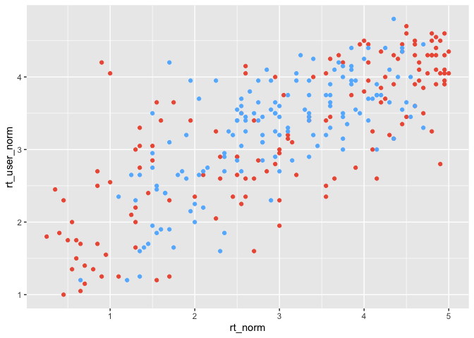<!-- -->

Do the normalized relationships look as correlated as the raw critic
scores? You should read [the
article](http://fivethirtyeight.com/features/fandango-movies-ratings/)
to find out more.

``` r
# fs::dir_ls("images", regexp = "hickey")
knitr::include_graphics(path = "images/hickey-datalab-fandango-2.png")
```

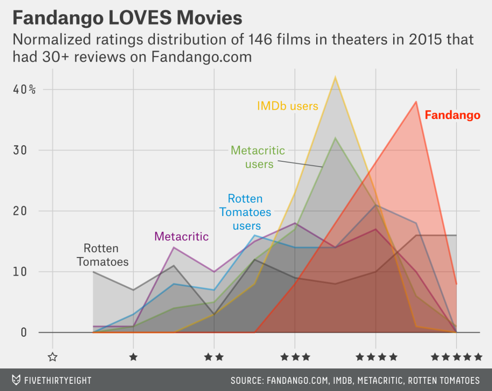<!-- -->

### Line plots

Line plots are great if you have a numerical quantity (ounces, meters,
degrees Fahrenheit) that you want to see over levels of a categorical
variable (males vs. females, low vs. medium vs. high, etc).

To build a line chart, we will use World Bank Open Data on the percent
contribution to each country’s GDP by three sectors in their economy:
agriculture, the service sector, and industry. Only the top ten
countries are in this data set.

I’ve downloaded these data and stored them in `.csv` files for you to
access. Run the code below and you’ll have three data frames in your
working environment (`ag_gdp_df`, `ind_gdp_df`, `serv_gdp_df`).

``` r
download.file(url = "https://raw.githubusercontent.com/mjfrigaard/storybenchR/master/data/aggdp_worldbank.csv",
                           destfile = "data/aggdp_worldbank.csv") 


download.file(url = "https://raw.githubusercontent.com/mjfrigaard/storybenchR/master/data/indgdp_worldbank.csv",
                            destfile = "data/indgdp_worldbank.csv")


download.file(url = "https://raw.githubusercontent.com/mjfrigaard/storybenchR/master/data/servgdp_worldbank.csv",
                             destfile = "data/servgdp_worldbank.csv")
```

``` r
ag_gdp_df <- readr::read_csv("data/aggdp_worldbank.csv")
ind_gdp_df <- readr::read_csv("data/indgdp_worldbank.csv")
serv_gdp_df <- readr::read_csv("data/servgdp_worldbank.csv")
```

Per usual, the raw data are not clean, so we will tidy them.

``` r
# tidy the WORLDBANK data 
ag_gdp_df <- ag_gdp_df %>% gather(key = year, 
                                  value = ag_prec_gdp, 
                                  -Country) 
ind_gdp_df <- ind_gdp_df %>% gather(key = year, 
                                    value = ind_perc_gdp, 
                                    -Country) 
serv_gdp_df <- serv_gdp_df %>% gather(key = year, 
                                      value = serv_perc_gdp, 
                                      -Country)
```

We will start with looking at the percent contribution to GDP from the
agriculture sector. Let’s take a `glimpse()` at the data frame.

``` r
ag_gdp_df %>% glimpse(78)
```

    ## Observations: 560
    ## Variables: 3
    ## $ Country     <chr> "Australia", "Brazil", "Canada", "China", "Germany", "F…
    ## $ year        <chr> "1960", "1960", "1960", "1960", "1960", "1960", "1960",…
    ## $ ag_prec_gdp <dbl> NA, 20.59281, NA, 23.38367, NA, NA, NA, 42.56113, NA, N…

Hmm… `year` should be numerical or date, but I will start by converting
it to a numerical variable for now.

``` r
# convert year 
ag_gdp_df$year <- as.numeric(ag_gdp_df$year)
```

Now we can create a line plot. We will map `year` to the x aesthetic,
`ag_perc_gdp` to the y, and group by the `Country`.

``` r
gg_ag_gdp <- ag_gdp_df %>% 
    ggplot(aes(x = year, 
               y = ag_prec_gdp, 
               group = Country)) 
gg_ag_gdp + geom_line(aes(color = Country), 
                      na.rm = TRUE)
```

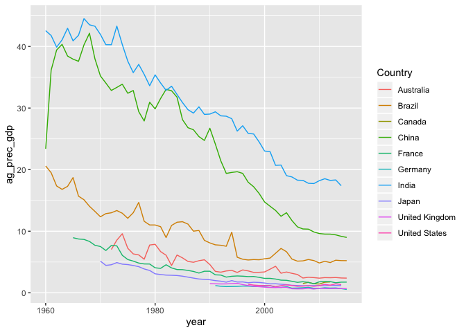<!-- -->

This looks like there has been a drop in the contributions of
agriculture to GDP across the 10 countries represented in our data, but
I can’t see the dates very well. How many years are represented here?

``` r
ag_gdp_df %>% distinct(year) %>% nrow()
```

    ## [1] 56

#### Adjusting axis scales

Eek\! I probably can’t plot all `56` distinct years, but I can
compromise and plot 5-year increments.

I will use the `scale_fill_continuous()` function and set the breaks and
labels vector. I’ll also remove the `x` label with `labs(x = NULL)`.

``` r
gg_ag_gdp + 
    geom_line(aes(color = Country), na.rm = TRUE) + 
    labs(x = NULL) + 
    scale_x_continuous(breaks = c(1960, 1965, 1970, 1975, 1980, 1985, 1990, 
                                  1995, 2000, 2005, 2010, 2015), 
                       labels = c('1960', '1965', '1970', '1975', '1980', 
                                  '1985', '1990', '1995', '2000', "2005", 
                                  "2010", '2015'))
```

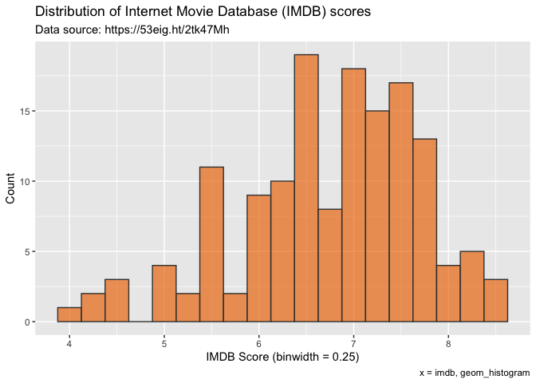<!-- -->

This looks better, but I want to add a `geom_point()` to make the values
stand out more for each year.

``` r
gg_ag_gdp + 
    geom_line(aes(color = Country), na.rm = TRUE) + 
    geom_point(aes(color = Country), 
               size = 1, na.rm = TRUE) + 
    labs(x = NULL) + 
    scale_x_continuous(breaks = c(1960, 1965, 1970, 1975, 1980, 1985, 1990, 
                                  1995, 2000, 2005, 2010, 2015), 
                   labels = c("1960", "1965", "1970", "1975", "1980", "1985",
                              "1990", "1995", "2000", "2005", "2010", "2015"))
```

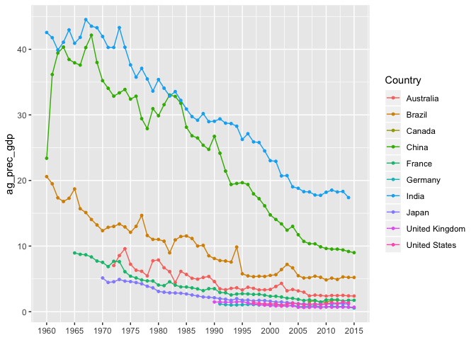<!-- -->

I think that illustrates the changes better than just a line plot. Now
we can see that the agriculture sector has been contributing less to GDP
over the last 50+ years in most of these countries. Let’s see how this
compares to the other two sectors.

Summary for the contribution from services sector:

``` r
# we know this needs to be numeric 
serv_gdp_df$year <- as.numeric(serv_gdp_df$year)
knitr::kable(serv_gdp_df %$% fav_stats(serv_perc_gdp))
```

|  |      min |       Q1 |   median |       Q3 |      max |     mean |       sd |   n | missing |
|  | -------: | -------: | -------: | -------: | -------: | -------: | -------: | --: | ------: |
|  | 21.72436 | 45.49618 | 60.29961 | 69.68059 | 79.15431 | 57.55385 | 15.40777 | 382 |     178 |

Line plot for services sector:

``` r
gg_serv_gdp <- serv_gdp_df %>% 
    ggplot(aes(x = year, y = serv_perc_gdp, group = Country)) 
gg_serv_gdp + geom_line(aes(color = Country), na.rm = TRUE) + 
    geom_point(aes(color = Country), size = 1, na.rm = TRUE) + 
    labs(x = NULL) + 
    scale_x_continuous(breaks = c(1960, 1965, 1970, 1975, 1980, 1985, 1990, 
                                  1995, 2000, 2005, 2010, 2015), 
                       labels = c("1960", "1965", "1970", "1975", "1980", 
                                  "1985", "1990", "1995", "2000", "2005", 
                                  "2010", "2015"))
```

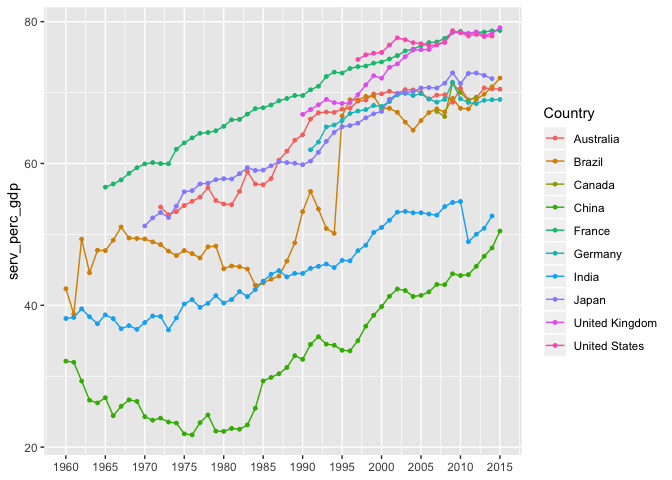<!-- -->

Summary for the contribution from industry sector:

``` r
# create numeric year 
ind_gdp_df$year <- as.numeric(ind_gdp_df$year)
```

Industry summary:

``` r
knitr::kable(ind_gdp_df %$% fav_stats(ind_perc_gdp))
```

|  |      min |       Q1 |   median |       Q3 |      max |     mean |       sd |   n | missing |
|  | -------: | -------: | -------: | -------: | -------: | -------: | -------: | --: | ------: |
|  | 18.77527 | 25.77376 | 29.69351 | 37.97135 | 47.90623 | 31.46867 | 7.851675 | 382 |     178 |

Line plot for the industry sector.

``` r
gg_ind_gdp <- ind_gdp_df %>% 
    ggplot(aes(x = year, y = ind_perc_gdp, group = Country)) 
gg_ind_gdp + 
    geom_line(aes(color = Country), na.rm = TRUE) + 
    geom_point(aes(color = Country), size = 1, na.rm = TRUE) + 
    labs(x = NULL) + 
    scale_x_continuous(breaks = c(1960, 1965, 1970, 1975, 1980, 1985, 
                                  1990, 1995, 2000, 2005, 2010, 2015), 
                       labels = c("1960", "1965", "1970", "1975", "1980", 
                                  "1985", "1990", "1995", "2000", "2005", 
                                  "2010", "2015"))
```

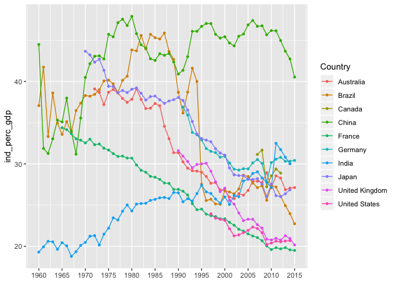<!-- -->

It looks like since 1960, agriculture has contributed less to GDP, the
service sector has started to contribute more, and the industry sector
does not have a straightforward trend. Note that India has seen an
increase in the industry sector’s contribution to their GDP, while most
of the other countries have seen the industry sector contributions fall
over the last 2-3 decades. China stands out as an industry giant, and
Brazil had a sharp drop between 1990 and 1995.

### Bar charts (stacked)

We can use the stacked bar charts to show relative proportions of
numerical variables across categories or stratified by other variables
in a data set. We are going to use the data from [“Where People Go To
Check The
Weather”](http://fivethirtyeight.com/datalab/weather-forecast-news-app-habits/)
by FiveThirtyEight.

``` r
weather_df <- fivethirtyeight::weather_check %>% tbl_df() 
weather_df %>% glimpse(78)
```

    ## Observations: 928
    ## Variables: 9
    ## $ respondent_id       <dbl> 3887201482, 3887159451, 3887152228, 3887145426,…
    ## $ ck_weather          <lgl> TRUE, TRUE, TRUE, TRUE, TRUE, TRUE, TRUE, TRUE,…
    ## $ weather_source      <chr> "The default weather app on your phone", "The d…
    ## $ weather_source_site <chr> NA, NA, NA, NA, "Iphone app", "AccuWeather App"…
    ## $ ck_weather_watch    <ord> Very likely, Very likely, Very likely, Somewhat…
    ## $ age                 <fct> 30 - 44, 18 - 29, 30 - 44, 30 - 44, 30 - 44, 18…
    ## $ female              <lgl> FALSE, FALSE, FALSE, FALSE, FALSE, FALSE, FALSE…
    ## $ hhold_income        <ord> "$50,000 to $74,999", "Prefer not to answer", "…
    ## $ region              <chr> "South Atlantic", NA, "Middle Atlantic", NA, "M…

This data comes from a survey, and as you can see, all variables are all
logical `lgl`, character `chr`, or factor `fctr`. Calculating a mean or
median doesn’t really make sense with data like these because the
numerical quantity would have no meaning. These are best summarized
using the `count()` or `distinct()` functions.

``` r
weather_df %>% count(hhold_income)
```

    ## # A tibble: 12 x 2
    ##    hhold_income             n
    ##    <ord>                <int>
    ##  1 $0 to $9,999            45
    ##  2 $10,000 to $24,999      81
    ##  3 $25,000 to $49,999     132
    ##  4 $50,000 to $74,999     111
    ##  5 $75,000 to $99,999     104
    ##  6 $100,000 to $124,999   104
    ##  7 $125,000 to $149,999    49
    ##  8 $150,000 to $174,999    39
    ##  9 $175,000 to $199,999    23
    ## 10 $200,000 and up         58
    ## 11 Prefer not to answer   169
    ## 12 <NA>                    13

Being curious people, we might wonder about responses to the question,
“*If you had a smartwatch (like the Apple Watch), how likely or
unlikely would you be to check the weather on that device?*”

``` r
weather_df %>% count(ck_weather_watch)
```

    ## # A tibble: 5 x 2
    ##   ck_weather_watch      n
    ##   <ord>             <int>
    ## 1 Very unlikely       208
    ## 2 Somewhat unlikely    73
    ## 3 Somewhat likely     274
    ## 4 Very likely         362
    ## 5 <NA>                 11

And we want to compare this variable with the responses to the people
who answered, “*Do you typically check a daily weather report?*” (`TRUE`
or `FALSE`).

We will create a bar chart with these data using color (`fill`) to
represent the `ck_weather`.

``` r
gg_weather_watch <- weather_df %>% 
    ggplot(aes(x = ck_weather_watch, fill = ck_weather)) 
gg_weather_watch + geom_bar()
```

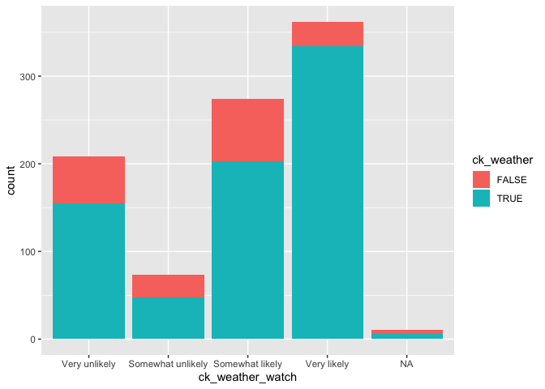<!-- -->

What do we see? More people checking the weather are apparently also
more likely to check a hypothetical weather watch app. Still, many
people who stated they were Very unlikely to check a weather watch app
also said they checked the weather report daily (`TRUE`). Do they feel
loyalty to their meteorologist or hate watches?

Maybe checking your weather is a regional phenomenon? Lets look at a bar
chart of `ck_weather` by `x = region`:

``` r
gg_weather_region <- weather_df %>% 
    ggplot(aes(x = region, 
               fill = ck_weather)) 
gg_weather_region + geom_bar()
```

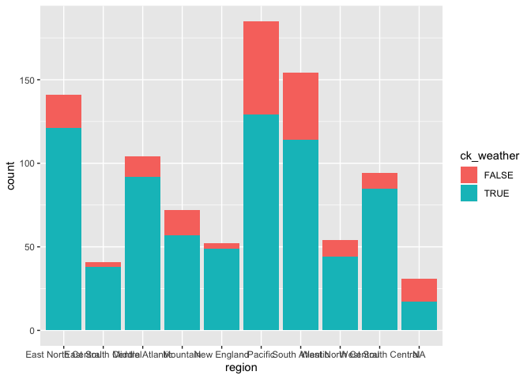<!-- -->

Hmm…we can’t really see what’s going on with the x axis because the
label text is on top of each other. I should adjust this with a
`theme(axis.text.x)` function. I also want to move the bars next to each
other using `position = dodge`.

#### Using themes and positions

``` r
gg_weather_region + 
    geom_bar(position = "dodge") + 
    theme(axis.text.x = element_text(angle = 45, 
                                     hjust = 1))
```

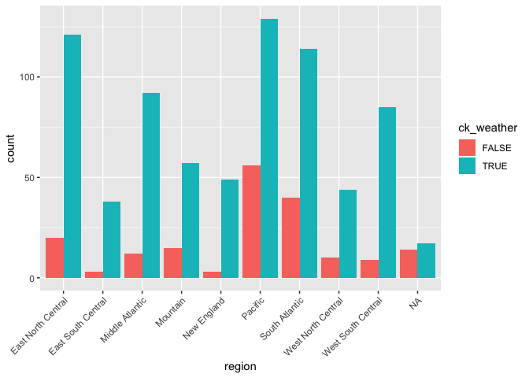<!-- -->

The top three regions for checking weather were Pacific, East North
Central, and South Atlantic. Any ideas why?

Ok, maybe the willingness to check the phone app (`ck_weather_watch`)
has more to do with the household income (`hhold_income`) and not the
geographic location (`region`) reported by the respondents?

``` r
gg_weather_income <- weather_df %>% ggplot(aes(x = hhold_income, 
                                               fill = ck_weather_watch)) 
gg_weather_income + 
    geom_bar(position = "dodge") + 
    theme(axis.text.x = element_text(angle = 45, 
                                     hjust = 1))
```

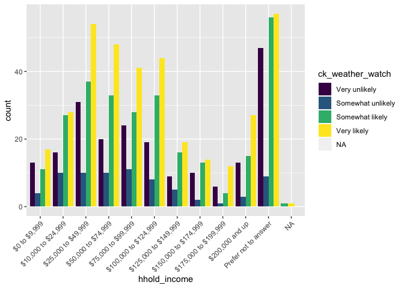<!-- -->

Well, we see the responses for Very likely (i.e. purple) have an upward
trend from `$0` to `$9,999` to `$25,000` to `$49,999`. We can also see
the responses for Very likely are always higher than the other available
responses (regardless of `hh_income`). Any thoughts as to why?

This graph was actually a little difficult to read because of the angle
of the text and so many different bars, so I am going to shift the
layout by adjusting the coordinates.

### Flip coordinates

Long labels like this are easier to read if we adjust the axis with
`coord_flip()`.

``` r
gg_weather_income +
      geom_bar(position = "dodge") +
            coord_flip()
```

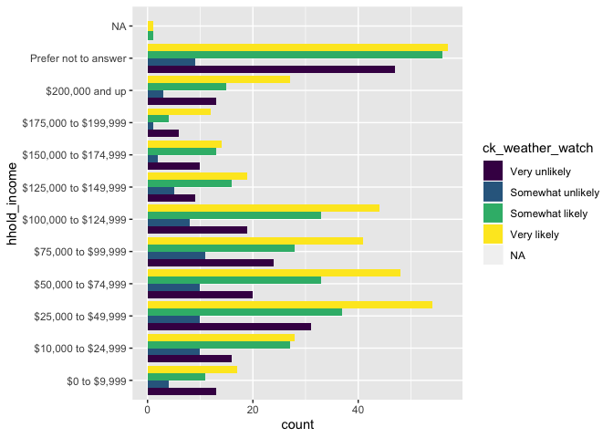<!-- -->

That looks better.

But the ordering looks strange with the *Prefer not to answer* at the
top next to *NA*. These are conceptually different (i.e. “I’d rather not
say” is not the same as “missing”) so I want them at different ends of
the y axis. Fortunately, I can reorder these using `fct_relevel()` from
the `forcats` package.

#### Relevel factors

``` r
library(forcats) 
gg_weather_income_relevel <- weather_df %>% 
    ggplot(aes(x = fct_relevel(hhold_income, "Prefer not to answer"), 
               fill = ck_weather_watch)) 
gg_weather_income_relevel + 
    geom_bar(position = "dodge") +
    coord_flip()
```

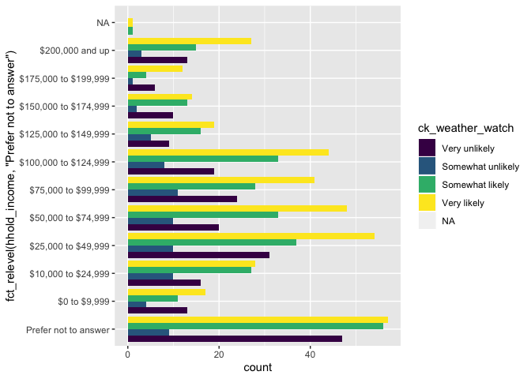<!-- -->

It looks like people who “*Prefer not to answer*” about their household
income are also the people who report being most likely to check a
weather watch app. Any other noticeable trends? For some reason,
Somewhat unlikely has the lowest count in all categories of
`hhold_income`. It is because when someone asks you if you’ll use their
app, people have the hardest time saying, “probably not”?

### Box plots

The final plot we will cover in this tutorial is the box plot. The box
plot is a visual representation of a five number summary (the min, Q1,
median, Q3, and max of a variable).

To show this plot we will us the iris data set in the datasets package.
This is a “famous” set of data (if there is such a thing) because of its
publication history. While the publication is certainly a product of its
time (the Annals of Human Eugenics isn’t around anymore for a reason),
the data continue to be useful for many analysis and visualizations.

From the help file:

“*This famous (Fisher’s or Anderson’s) iris data set gives the
measurements in centimeters of the variables sepal length and width and
petal length and width, respectively, for 50 flowers from each of 3
species of iris. The species are Iris setosa, versicolor, and
virginica.*”

``` r
iris %>% glimpse(78)
```

    ## Observations: 150
    ## Variables: 5
    ## $ Sepal.Length <dbl> 5.1, 4.9, 4.7, 4.6, 5.0, 5.4, 4.6, 5.0, 4.4, 4.9, 5.4,…
    ## $ Sepal.Width  <dbl> 3.5, 3.0, 3.2, 3.1, 3.6, 3.9, 3.4, 3.4, 2.9, 3.1, 3.7,…
    ## $ Petal.Length <dbl> 1.4, 1.4, 1.3, 1.5, 1.4, 1.7, 1.4, 1.5, 1.4, 1.5, 1.5,…
    ## $ Petal.Width  <dbl> 0.2, 0.2, 0.2, 0.2, 0.2, 0.4, 0.3, 0.2, 0.2, 0.1, 0.2,…
    ## $ Species      <fct> setosa, setosa, setosa, setosa, setosa, setosa, setosa…

The first thing you should notice is that these data are not tidy
because we see `.Length` and `.Width` repeated across columns. These are
both Measurement’s so they should be gathered up (`gather()`) into one
variable.

``` r
iris_tidy_df <- iris %>% 
    gather(Measurement, Value, 
           -Species) 
iris_tidy_df %>% glimpse(78)
```

    ## Observations: 600
    ## Variables: 3
    ## $ Species     <fct> setosa, setosa, setosa, setosa, setosa, setosa, setosa,…
    ## $ Measurement <chr> "Sepal.Length", "Sepal.Length", "Sepal.Length", "Sepal.…
    ## $ Value       <dbl> 5.1, 4.9, 4.7, 4.6, 5.0, 5.4, 4.6, 5.0, 4.4, 4.9, 5.4, …

Now we can create a simple box plot with this data set.

``` r
gg_iris_tidy <- iris_tidy_df %>% 
    ggplot(aes(x = Species, 
                y = Value, 
                fill = Species)) 
gg_iris_tidy + geom_boxplot()
```

<!-- -->

What do all these lines, shapes, and colors represent? A box plot is
somewhat abstract without any data points, but we can easily add a
`geom_jitter()` layer that drops the data points on top of the box
plots. We also specify the `alpha` to 1/2 because slightly transparent
points will help us see where the data clusters.

``` r
gg_iris_tidy + 
    geom_boxplot() + 
    geom_jitter(width = 1/20, # very small width for the random noise 
                height = 1/20, # very small height for the random noise 
                alpha = 1/2, # transparent so we can see clustering 
                size = 1) # very small points
```

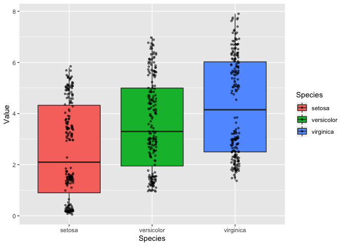<!-- -->

Now that we have a distribution of points and the box plots, let’s
calculate some summary statistics to help us understand what we’re
seeing.

``` r
iris_tidy_df %>% 
    group_by(Species) %>% 
    summarise(min = min(Value), 
              `25%` = quantile(Value, probs = 0.25), 
              median = median(Value), 
              mean = mean(Value), 
              `75%` = quantile(Value, probs = 0.75), 
              max = max(Value))
```

    ## # A tibble: 3 x 7
    ##   Species      min `25%` median  mean `75%`   max
    ##   <fct>      <dbl> <dbl>  <dbl> <dbl> <dbl> <dbl>
    ## 1 setosa       0.1  0.9    2.10  2.54  4.32   5.8
    ## 2 versicolor   1    1.95   3.3   3.57  5      7  
    ## 3 virginica    1.4  2.5    4.15  4.28  6.02   7.9

We are going to focus on the setosa box plot and summary statistics. The
median for setosa is `2.10`, and this lines up with the black line in
the center of the red box. The median is a helpful measure because we
know that half the observations are above this value, and the other half
are below this value. Compare this to the mean for each `Species` of
flower and consider how a variable with extreme values might differ in
the two measurements (their `mean` vs. `median`).

We can also see the lowest cluster of points on the setosa box shouldn’t
be below `~0.1` and the highest cluster shouldn’t be above `~5.8`. Why
do I say \~ (approximately)? The `geom_jitter()` adds a bit of random
noise to the `geom_point()`, so its possible for the points to extend
slightly past these boundaries.

The `geom_jitter()` is helpful when data are over plotted on a graph,
and you can also use `position = "jitter"` inside a `geom_point()`.

We can add additional specifications to the box plots such as `notch =
TRUE`.

``` r
gg_iris_tidy + 
    geom_boxplot(notch = TRUE) + 
    geom_jitter(width = 1/20, # very small width for the random noise 
                height = 1/20, # very small height for the random noise 
                alpha = 1/2, # transparent so we can see clustering 
                size = 1) # very small points
```

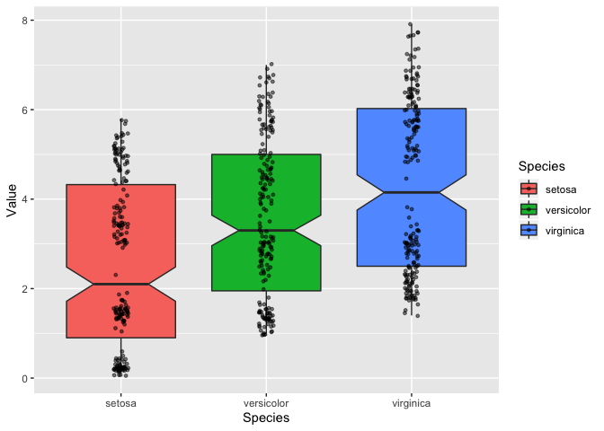<!-- -->

### Facets

For our final exercises, let’s switch back to a larger data set to show
a few more advanced techniques in `ggplot2`. We’re going to use the
`nhanes` data set we used earlier in this tutorial.

``` r
nhanes_df %>% glimpse(78)
```

    ## Observations: 10,000
    ## Variables: 76
    ## $ ID               <int> 51624, 51624, 51624, 51625, 51630, 51638, 51646, 5…
    ## $ SurveyYr         <fct> 2009_10, 2009_10, 2009_10, 2009_10, 2009_10, 2009_…
    ## $ Gender           <fct> male, male, male, male, female, male, male, female…
    ## $ Age              <int> 34, 34, 34, 4, 49, 9, 8, 45, 45, 45, 66, 58, 54, 1…
    ## $ AgeDecade        <fct>  30-39,  30-39,  30-39,  0-9,  40-49,  0-9,  0-9, …
    ## $ AgeMonths        <int> 409, 409, 409, 49, 596, 115, 101, 541, 541, 541, 7…
    ## $ Race1            <fct> White, White, White, Other, White, White, White, W…
    ## $ Race3            <fct> NA, NA, NA, NA, NA, NA, NA, NA, NA, NA, NA, NA, NA…
    ## $ Education        <fct> High School, High School, High School, NA, Some Co…
    ## $ MaritalStatus    <fct> Married, Married, Married, NA, LivePartner, NA, NA…
    ## $ HHIncome         <fct> 25000-34999, 25000-34999, 25000-34999, 20000-24999…
    ## $ HHIncomeMid      <int> 30000, 30000, 30000, 22500, 40000, 87500, 60000, 8…
    ## $ Poverty          <dbl> 1.36, 1.36, 1.36, 1.07, 1.91, 1.84, 2.33, 5.00, 5.…
    ## $ HomeRooms        <int> 6, 6, 6, 9, 5, 6, 7, 6, 6, 6, 5, 10, 6, 10, 10, 4,…
    ## $ HomeOwn          <fct> Own, Own, Own, Own, Rent, Rent, Own, Own, Own, Own…
    ## $ Work             <fct> NotWorking, NotWorking, NotWorking, NA, NotWorking…
    ## $ Weight           <dbl> 87.4, 87.4, 87.4, 17.0, 86.7, 29.8, 35.2, 75.7, 75…
    ## $ Length           <dbl> NA, NA, NA, NA, NA, NA, NA, NA, NA, NA, NA, NA, NA…
    ## $ HeadCirc         <dbl> NA, NA, NA, NA, NA, NA, NA, NA, NA, NA, NA, NA, NA…
    ## $ Height           <dbl> 164.7, 164.7, 164.7, 105.4, 168.4, 133.1, 130.6, 1…
    ## $ BMI              <dbl> 32.22, 32.22, 32.22, 15.30, 30.57, 16.82, 20.64, 2…
    ## $ BMICatUnder20yrs <fct> NA, NA, NA, NA, NA, NA, NA, NA, NA, NA, NA, NA, NA…
    ## $ BMI_WHO          <fct> 30.0_plus, 30.0_plus, 30.0_plus, 12.0_18.5, 30.0_p…
    ## $ Pulse            <int> 70, 70, 70, NA, 86, 82, 72, 62, 62, 62, 60, 62, 76…
    ## $ BPSysAve         <int> 113, 113, 113, NA, 112, 86, 107, 118, 118, 118, 11…
    ## $ BPDiaAve         <int> 85, 85, 85, NA, 75, 47, 37, 64, 64, 64, 63, 74, 85…
    ## $ BPSys1           <int> 114, 114, 114, NA, 118, 84, 114, 106, 106, 106, 12…
    ## $ BPDia1           <int> 88, 88, 88, NA, 82, 50, 46, 62, 62, 62, 64, 76, 86…
    ## $ BPSys2           <int> 114, 114, 114, NA, 108, 84, 108, 118, 118, 118, 10…
    ## $ BPDia2           <int> 88, 88, 88, NA, 74, 50, 36, 68, 68, 68, 62, 72, 88…
    ## $ BPSys3           <int> 112, 112, 112, NA, 116, 88, 106, 118, 118, 118, 11…
    ## $ BPDia3           <int> 82, 82, 82, NA, 76, 44, 38, 60, 60, 60, 64, 76, 82…
    ## $ Testosterone     <dbl> NA, NA, NA, NA, NA, NA, NA, NA, NA, NA, NA, NA, NA…
    ## $ DirectChol       <dbl> 1.29, 1.29, 1.29, NA, 1.16, 1.34, 1.55, 2.12, 2.12…
    ## $ TotChol          <dbl> 3.49, 3.49, 3.49, NA, 6.70, 4.86, 4.09, 5.82, 5.82…
    ## $ UrineVol1        <int> 352, 352, 352, NA, 77, 123, 238, 106, 106, 106, 11…
    ## $ UrineFlow1       <dbl> NA, NA, NA, NA, 0.094, 1.538, 1.322, 1.116, 1.116,…
    ## $ UrineVol2        <int> NA, NA, NA, NA, NA, NA, NA, NA, NA, NA, NA, NA, NA…
    ## $ UrineFlow2       <dbl> NA, NA, NA, NA, NA, NA, NA, NA, NA, NA, NA, NA, NA…
    ## $ Diabetes         <fct> No, No, No, No, No, No, No, No, No, No, No, No, No…
    ## $ DiabetesAge      <int> NA, NA, NA, NA, NA, NA, NA, NA, NA, NA, NA, NA, NA…
    ## $ HealthGen        <fct> Good, Good, Good, NA, Good, NA, NA, Vgood, Vgood, …
    ## $ DaysPhysHlthBad  <int> 0, 0, 0, NA, 0, NA, NA, 0, 0, 0, 10, 0, 4, NA, NA,…
    ## $ DaysMentHlthBad  <int> 15, 15, 15, NA, 10, NA, NA, 3, 3, 3, 0, 0, 0, NA, …
    ## $ LittleInterest   <fct> Most, Most, Most, NA, Several, NA, NA, None, None,…
    ## $ Depressed        <fct> Several, Several, Several, NA, Several, NA, NA, No…
    ## $ nPregnancies     <int> NA, NA, NA, NA, 2, NA, NA, 1, 1, 1, NA, NA, NA, NA…
    ## $ nBabies          <int> NA, NA, NA, NA, 2, NA, NA, NA, NA, NA, NA, NA, NA,…
    ## $ Age1stBaby       <int> NA, NA, NA, NA, 27, NA, NA, NA, NA, NA, NA, NA, NA…
    ## $ SleepHrsNight    <int> 4, 4, 4, NA, 8, NA, NA, 8, 8, 8, 7, 5, 4, NA, 5, 7…
    ## $ SleepTrouble     <fct> Yes, Yes, Yes, NA, Yes, NA, NA, No, No, No, No, No…
    ## $ PhysActive       <fct> No, No, No, NA, No, NA, NA, Yes, Yes, Yes, Yes, Ye…
    ## $ PhysActiveDays   <int> NA, NA, NA, NA, NA, NA, NA, 5, 5, 5, 7, 5, 1, NA, …
    ## $ TVHrsDay         <fct> NA, NA, NA, NA, NA, NA, NA, NA, NA, NA, NA, NA, NA…
    ## $ CompHrsDay       <fct> NA, NA, NA, NA, NA, NA, NA, NA, NA, NA, NA, NA, NA…
    ## $ TVHrsDayChild    <int> NA, NA, NA, 4, NA, 5, 1, NA, NA, NA, NA, NA, NA, 4…
    ## $ CompHrsDayChild  <int> NA, NA, NA, 1, NA, 0, 6, NA, NA, NA, NA, NA, NA, 3…
    ## $ Alcohol12PlusYr  <fct> Yes, Yes, Yes, NA, Yes, NA, NA, Yes, Yes, Yes, Yes…
    ## $ AlcoholDay       <int> NA, NA, NA, NA, 2, NA, NA, 3, 3, 3, 1, 2, 6, NA, N…
    ## $ AlcoholYear      <int> 0, 0, 0, NA, 20, NA, NA, 52, 52, 52, 100, 104, 364…
    ## $ SmokeNow         <fct> No, No, No, NA, Yes, NA, NA, NA, NA, NA, No, NA, N…
    ## $ Smoke100         <fct> Yes, Yes, Yes, NA, Yes, NA, NA, No, No, No, Yes, N…
    ## $ Smoke100n        <fct> Smoker, Smoker, Smoker, NA, Smoker, NA, NA, Non-Sm…
    ## $ SmokeAge         <int> 18, 18, 18, NA, 38, NA, NA, NA, NA, NA, 13, NA, NA…
    ## $ Marijuana        <fct> Yes, Yes, Yes, NA, Yes, NA, NA, Yes, Yes, Yes, NA,…
    ## $ AgeFirstMarij    <int> 17, 17, 17, NA, 18, NA, NA, 13, 13, 13, NA, 19, 15…
    ## $ RegularMarij     <fct> No, No, No, NA, No, NA, NA, No, No, No, NA, Yes, Y…
    ## $ AgeRegMarij      <int> NA, NA, NA, NA, NA, NA, NA, NA, NA, NA, NA, 20, 15…
    ## $ HardDrugs        <fct> Yes, Yes, Yes, NA, Yes, NA, NA, No, No, No, No, Ye…
    ## $ SexEver          <fct> Yes, Yes, Yes, NA, Yes, NA, NA, Yes, Yes, Yes, Yes…
    ## $ SexAge           <int> 16, 16, 16, NA, 12, NA, NA, 13, 13, 13, 17, 22, 12…
    ## $ SexNumPartnLife  <int> 8, 8, 8, NA, 10, NA, NA, 20, 20, 20, 15, 7, 100, N…
    ## $ SexNumPartYear   <int> 1, 1, 1, NA, 1, NA, NA, 0, 0, 0, NA, 1, 1, NA, NA,…
    ## $ SameSex          <fct> No, No, No, NA, Yes, NA, NA, Yes, Yes, Yes, No, No…
    ## $ SexOrientation   <fct> Heterosexual, Heterosexual, Heterosexual, NA, Hete…
    ## $ PregnantNow      <fct> NA, NA, NA, NA, NA, NA, NA, NA, NA, NA, NA, NA, NA…

Let’s start with a basic plot of body mass index (`BMI`) and how much
time a person spent at a computer per day (`CompHrsDay`).

More specifically, the `CompHrsDay` is the “*Number of hours per day on
average participant used a computer or gaming device over the past 30
days. Reported for participants 2 years or older. One of `0_hrs`,
`0_to_1hr`, `1_hr`, `2_hr`, `3_hr`, `4_hr`, `More_4_hr.` Not available
2009-2010.*”

We will get a summary of the BMI variable using `fav_stats()`:

``` r
nhanes_df %$% fav_stats(BMI)
```

    ##    min    Q1 median    Q3   max     mean       sd    n missing
    ##  12.88 21.58  25.98 30.89 81.25 26.66014 7.376579 9634     366

And we will get a count of the CompHrsDay because it’s a factor
variable.

``` r
nhanes_df %>% count(CompHrsDay)
```

    ## # A tibble: 8 x 2
    ##   CompHrsDay     n
    ##   <fct>      <int>
    ## 1 0_hrs       1073
    ## 2 0_to_1_hr   1409
    ## 3 1_hr        1030
    ## 4 2_hr         589
    ## 5 3_hr         347
    ## 6 4_hr         162
    ## 7 More_4_hr    253
    ## 8 <NA>        5137

We are curious about the relationship between body mass index (`BMI`)
and screen time (`CompHrsDay`), so we are going to start with a simple
violin plot that shows the distribution of `CompHrsDay` on the `x` and
`BMI` on the `y`.

But we want to limit our plot to non-missing values, and remove any kids
under the age of 19 (as in `filter` out `AgeDecade != " 10-19" & Age
> 18`).

``` r
gg_nhanes_age_comp <- nhanes_df %>% 
    filter(!is.na(CompHrsDay) & !is.na(AgeDecade) & 
               AgeDecade != " 10-19" & Age > 18) %>% 
    ggplot(aes(x = CompHrsDay, y = BMI)) 
# now build a violin plot 
gg_nhanes_age_comp + 
    geom_violin(na.rm = TRUE, 
                alpha = 1/2, 
                aes(fill = CompHrsDay))
```

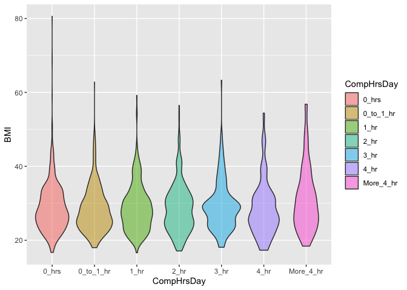<!-- -->

Violin plots are great if you have one numerical value and you want to
see its density across levels of a factor or categorical variable. The
`geom_violin()` is “a blend of `geom_boxplot()` and `geom_density()`: a
violin plot is a mirrored density plot displayed in the same way as a
boxplot.”.

I want to add the `AgeDecade` and `Gender` variables to this plot
because I assume they are both influencing `BMI`. Adding two more layers
to the same plot sounds chaotic, but luckily I have another option,
`facet`’ing.

A `facet` splits the data into subsets and plots these in multiple
subplots. The syntax for the faceting is `facet_grid(VARIABLE_Y ~
VARIABLE_X)`.

``` r
gg_nhanes_age_comp + 
    geom_violin(na.rm = TRUE, 
                alpha = 1/2, 
                aes(fill = CompHrsDay)) + 
    facet_grid(AgeDecade ~ Gender)
```

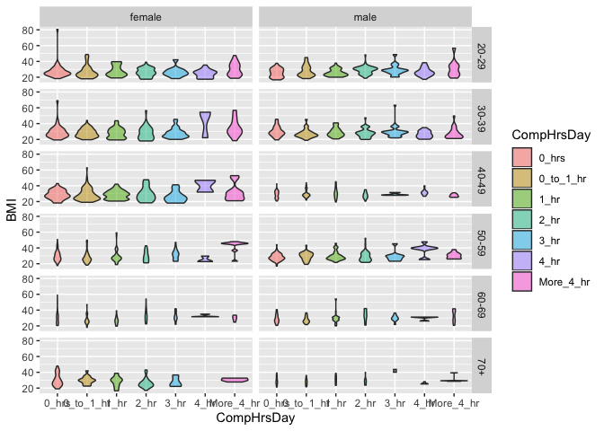<!-- -->

Now I have a violin plot for every combination of `Gender` by
`AgeDecade` by `CompHrsDay`. There are a few additional adjustments I
can make to this visualization to improve its layout, though. I should
fix the `x` axis so the scale is readable. The `AgeDecade` is decreasing
in the opposite direction of `BMI`, which makes it harder to interpret.
Finally, `BMI` is on a fixed scale, but not all values have the same
range. I want the `y` axis to be able to vary according to the data in
that `Gender` x `AgeDecade` combination.

``` r
gg_nhanes_age_comp + 
    geom_violin(na.rm = TRUE, 
                alpha = 1/2, 
                aes(fill = CompHrsDay)) + 
    facet_grid(fct_rev(AgeDecade) ~ Gender, # change the order of the AgeDecade 
               scales = "free_y") + # allow y axis to vary 
    theme(legend.position = "none") + # remove legend 
    theme(axis.text.x = 
          element_text(angle = 45, # make x axis easier to read 
         hjust = 1)) + labs(x = "Computer hours per day", # add x axis label 
                                y = "Body Mass Index") # add y axis label
```

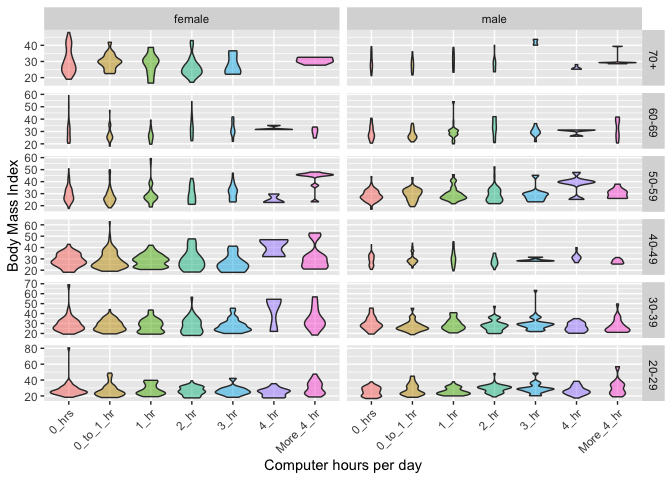<!-- -->

Here are all of the violin plots for all of the levels of `Gender` by
`AgeDecade` by `CompHrsDay`. Faceting is great for adding variables to a
visualization without adding them to the same plot.

We will do another example of faceting, this time with `AgeMonths` and
`Height` by `Genders`. Let’s limit this graph to people under the age of
30 (360 months) and filter out the missing `Height` values.

``` r
gg_nhanes_ht_age_sex <- nhanes_df %>% 
    filter(!is.na(Height) & AgeMonths < 360) %>% 
    ggplot(aes(x = Height, 
               y = AgeMonths, color = Gender)) 

gg_nhanes_ht_age_sex + 
    geom_point(size = 1/2)
```

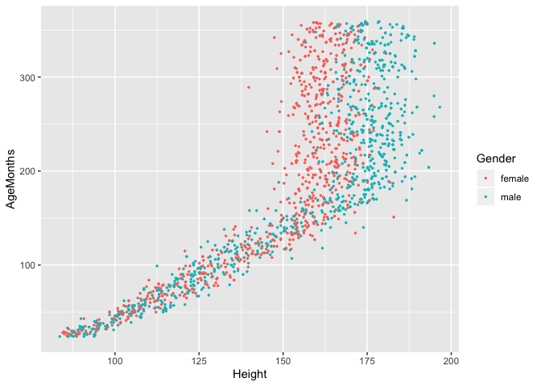<!-- -->

I’ve used `color` to distinguish `male` from `female`, but now I want to
see the scatter plot broken up by `AgeDecade`. We are going to keep the
color for `Gender`, but fit a line to the points with `geom_smooth()`.
We will add `AgeDecade` with `facet_grid()`, but reverse the order of
the factor variable (`fct_rev()`), remove the labels and breaks from the
`y` axis using `scale_y_continuous`, and add labels to both `x` and `y`.

``` r
gg_nhanes_ht_age_sex + 
    geom_point(size = 1/2) + 
    geom_smooth(size = 1/2, 
                color = "darkred", 
                method = "loess") + 
    facet_grid(fct_rev(AgeDecade) ~ ., 
               scales = "free_y") + 
    scale_y_continuous(labels = NULL, 
                       breaks = NULL) + 
    labs(x = "Height (cm)", 
         y = "Age (Decade)")
```

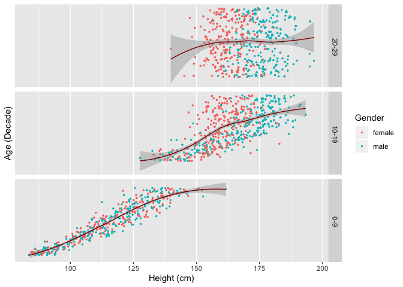<!-- -->

Now I can see long gradual growth in childhood (0-9), the separation of
points between males and females in the teenage years (10-19), and the
flat line representing fully grown adults.

The syntax for `facet_grid()` looks tricky at first, but you can get the
hang of it with a little experimentation. Inside the parentheses, you
can assign either `facet_grid(. ~ VARIABLE)` or `facet_grid(VARIABLE ~
.)`, and this changes the columns vs. rows layout. You should also
experiment with `facet_wrap()` for adding variables to your
visualizations.

### Exporting graphs

We’ve created quite a few graphs and visualizations in this tutorial. If
we want to print or save any of them, there are multiple options
(depending on the desired format or medium).

First we have to identify the graph we want to save. We can use `ls()`
to see the objects in our working environment:

``` r
ls()
```

    ##  [1] "ag_gdp_df"                 "bb_df"                    
    ##  [3] "fan_df"                    "gg_ag_gdp"                
    ##  [5] "gg_bb_wt_ht"               "gg_fan_critics"           
    ##  [7] "gg_ind_gdp"                "gg_iris_tidy"             
    ##  [9] "gg_nhanes_age_comp"        "gg_nhanes_ht"             
    ## [11] "gg_nhanes_ht_age_sex"      "gg_serv_gdp"              
    ## [13] "gg_weather_income"         "gg_weather_income_relevel"
    ## [15] "gg_weather_region"         "gg_weather_watch"         
    ## [17] "ind_gdp_df"                "iris_tidy_df"             
    ## [19] "meta_df"                   "nhanes_df"                
    ## [21] "serv_gdp_df"               "tiny_player_df"           
    ## [23] "user_df"                   "weather_df"

How about the line plot for the percent contribution to GDP by industry?
When I export a figure I like to distinguish it from other graphs I am
still tweaking by putting a `_PRNT` identifier on it.

``` r
gg_ind_gdp_PRNT <- gg_ind_gdp + 
    geom_line(aes(color = Country), na.rm = TRUE) + 
    geom_point(aes(color = Country), size = 1, na.rm = TRUE) + 
    labs(x = "Years", y = "Industry Percent Contribution to GDP") + 
    scale_x_continuous( breaks = c(1960, 1965, 1970, 1975, 1980, 1985, 1990, 
                                   1995, 2000, 2005, 2010, 2015), 
                        labels = c("1960", "1965","1970","1975","1980","1985", 
                                   "1990", "1995","2000","2005","2010","2015")) 
gg_ind_gdp_PRNT
```

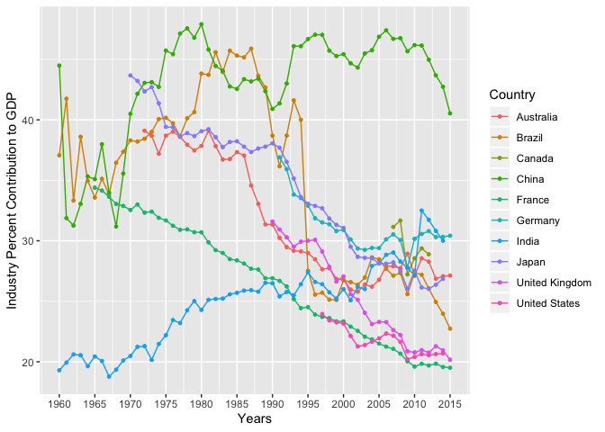<!-- -->

I will export this graph as a `.PNG` file. I learned a nice trick from
[Jeff Leek](http://jtleek.com/) that checks for a directory and creates
one if its not already there. Use the `dir("./")` function to check
where you’re saving the image.

``` r
if (!file.exists("images")) { 
    dir.create("images") } 
ggsave("images/gg_ind_gdp_PRNT.png", 
       width = 8, 
       height = 5)
```

And here is our graph:

``` r
fs::dir_ls("images", regexp = "_PRNT")
```

    ## images/gg_ind_gdp_PRNT-1.png images/gg_ind_gdp_PRNT.png
