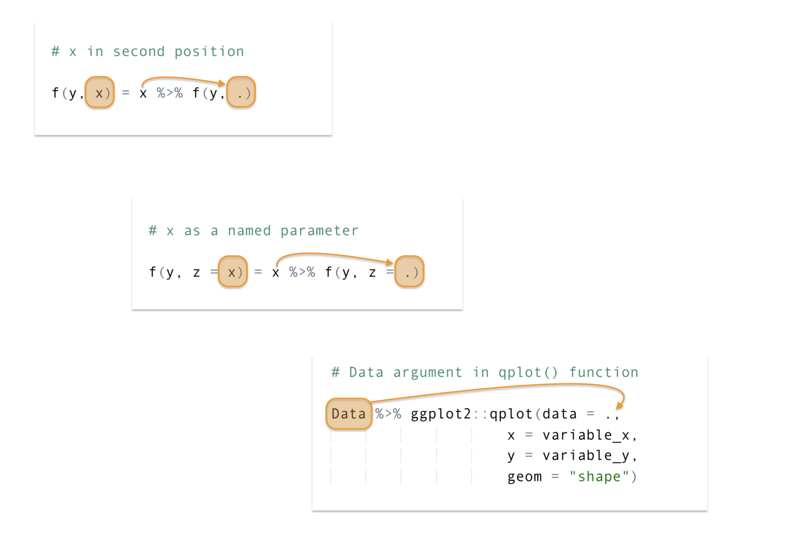
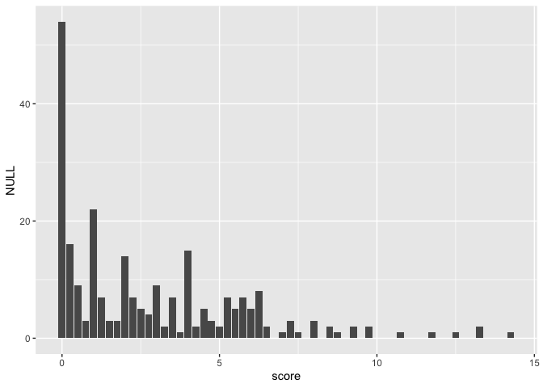
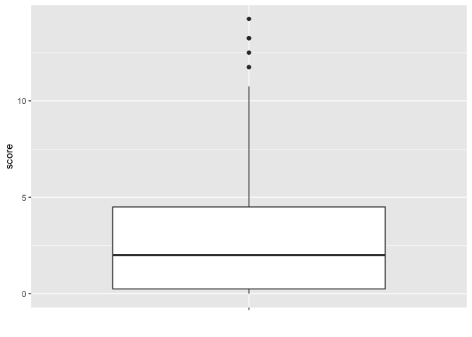
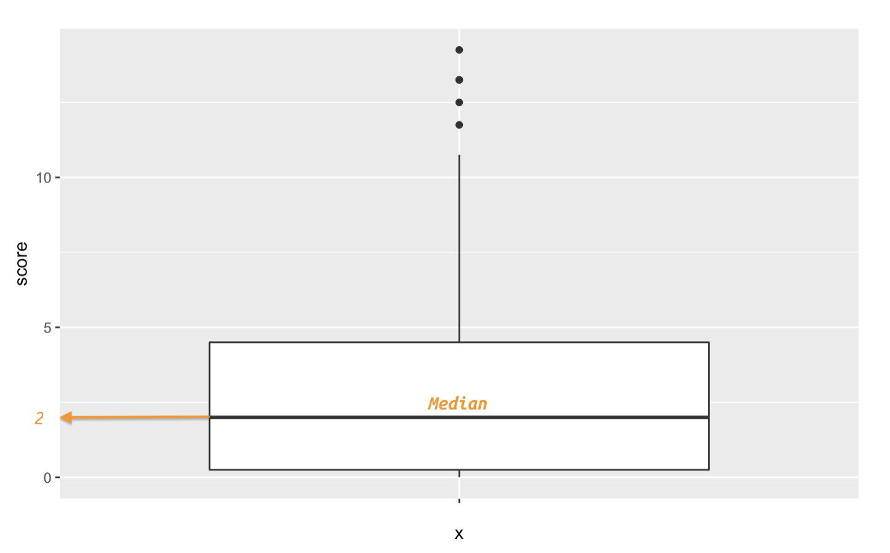

Intro to qplot()
================
Martin Frigaard

  - [Exploring the data with ggplot2](#exploring-the-data-with-ggplot2)
      - [Why have a ‘grammar’ of data
        visualization?](#why-have-a-grammar-of-data-visualization)
      - [Composition of graphical
        elements](#composition-of-graphical-elements)
      - [Geoms and aesthetics](#geoms-and-aesthetics)
          - [Using geoms with
            ggplot2::qplot()](#using-geoms-with-ggplot2qplot)
          - [The bar plot](#the-bar-plot)
              - [What is this graph telling
                us?](#what-is-this-graph-telling-us)
          - [A box-plot](#a-box-plot)
              - [What is this graph telling
                us?](#what-is-this-graph-telling-us-1)
      - [Output the new tables as csv
        files](#output-the-new-tables-as-csv-files)

# Exploring the data with ggplot2

In the previous tutorial, we used the `ggplot2::qplot()` function to
visualize data. The `ggplot2` package is an implementation of the
[“Grammar of Graphics”](https://amzn.to/2MRRCAB) by Leland Wilkinson.

Below I give a brief overview of the benefits of having a grammar and
the `quickplot` syntax.

### Why have a ‘grammar’ of data visualization?

[Wilhelm von
Humboldt](https://en.wikipedia.org/wiki/Wilhelm_von_Humboldt) described
language as a system for “*making infinite use of finite means.*”
Grammar is then a set of rules used to generate comprehensible sentences
in a language (human or computer languages).

Within the R language, `ggplot2` provides a rich vocabulary for
graphical elements. Knowing how to use `ggplot2`’s grammar gives an
excellent mental model for thinking about data visualizations.

### Composition of graphical elements

I’d like to extend the definition of ‘grammar’ above to include Steven
Pinker’s description in [The Sense of
Style](https://www.amazon.com/Sense-Style-Thinking-Persons-Writing/dp/0143127799),
“*\[grammar is\] our species’ solution to the problem of getting
complicated thoughts from one head into another*.”

In this sense, `ggplot2` gives us an ability to communicate the
*complexities* of our data in the same way that scientific jargon allows
us to precisely and unambiguously defined ideas.

Lastly, `ggplot2` has an expansive vocabulary, so knowing a finite list
of functions and their syntax unlocks an unlimited number of
visualizations.

## Geoms and aesthetics

A geom (or geometric object) is, \*“what you actually see on the plot:
points, lines, polygons, etc.\* These are combined with aesthetic
mappings, which are *"properties that can be perceived on the graphic*”
like color, size, position, and shape.

I’ll be using `qplot()`’s `geom =` argument to explore the data in my
current working environment.

### Using geoms with ggplot2::qplot()

Using the geoms in `ggplot2::qplot()` means supplying the `geom =`
argument with a type of graph. The syntax looks like this:

``` r
Data %>% ggplot2::qplot(data = ., 
                      x = variable_x, 
                      y = variable_y,
                      geom = "shape")
```

The `data = .` argument is a product of the piping syntax. By placing
the `data = .` on the right-hand side of the pipe operator (`%>%`), we
are telling R to read this statement as, “*the object to the left of the
`%>%` belongs in the `data` argument.*” See the figure below:

<!-- -->

The `geom = shape` will be replaced by a geom or type of graph (`"bar"`,
`"point"`, “box”)

In the [Mad Men
article](https://fivethirtyeight.com/features/mad-men-is-ending-whats-next-for-the-cast/),
the variables are described with the language below,

``` r
MadMen <- fivethirtyeight::mad_men
MadMen %>% dplyr::glimpse(78)
```

    ## Observations: 248
    ## Variables: 15
    ## $ performer     <chr> "Steven Hill", "Kelli Williams", "LisaGay Hamilton", …
    ## $ show          <chr> "Law & Order", "The Practice", "The Practice", "The P…
    ## $ show_start    <int> 1990, 1997, 1997, 1997, 1997, 1997, 1997, 1997, 1990,…
    ## $ show_end      <chr> "2010", "2014", "2014", "2014", "2014", "2014", "2014…
    ## $ status        <chr> "END", "END", "END", "END", "END", "END", "END", "END…
    ## $ charend       <int> 2000, 2003, 2003, 2003, 2004, 2004, 2004, 2004, 2004,…
    ## $ years_since   <int> 15, 12, 12, 12, 11, 11, 11, 11, 11, 11, 10, 10, 10, 1…
    ## $ num_lead      <int> 0, 0, 2, 0, 2, 0, 0, 0, 0, 0, 3, 0, 1, 1, 5, 2, 0, 1,…
    ## $ num_support   <int> 0, 1, 0, 0, 7, 4, 2, 1, 0, 1, 1, 7, 1, 2, 9, 4, 6, 5,…
    ## $ num_shows     <int> 0, 6, 2, 0, 6, 5, 3, 1, 0, 0, 10, 9, 8, 7, 7, 5, 4, 3…
    ## $ score         <dbl> 0.00, 6.25, 4.00, 0.00, 9.75, 6.00, 3.50, 1.25, 0.00,…
    ## $ score_div_y   <chr> "0", "0.520833333", "0.333333333", "0", "0.886363636"…
    ## $ lead_notes    <chr> NA, NA, "Life of a King, 2014; Go For Sisters, 2013",…
    ## $ support_notes <chr> NA, "Any Day Now (2012)", NA, NA, "The Messengers, 20…
    ## $ show_notes    <chr> NA, "Medical Investigation, Season 1; Lie To Me, Seas…

> I zeroed in on the actors who had been on a defunct show or, if the
> program was still on the air, had left the show. This encompassed 248
> performers, all of whom were given a score for their post-show career.
> They received:
> 
>   - 1 point for each season they regularly appeared on another TV
>     show.
>   - 1 point for each time they had a leading role in a film.
>   - 0.25 points for each supporting role in a film.

The variables outlined above are `num_shows`, `num_lead`, `num_support`,
and they give us the `score_div_y` (or *“Score” divided by “Years
Since”*). The `score_div_y` and `years_since` then give us the total
`score`. These data are presented in the article as a table, but I’ll
explore the `score` variable using two geoms from `ggplot2`.

### The bar plot

Using the geoms in `ggplot2::qplot()` means supplying the `geom =`
argument with a type of graph.

A bar-plot might help us understand the distribution of `score` in the
`MadMen` data. I can build this graph using the template above,
substituting the `MadMen` for `Data`, `score` in the `x` variable
position, and `"bar"` for `"shape"`.

``` r
MadMen %>% ggplot2::qplot(data = ., 
                        x = score, 
                        geom = "bar")
```

<!-- -->

#### What is this graph telling us?

The `geom = "bar"` displays the `score` values in the height of each bar
(i.e. their `count`, as indicated by the `y` axis). These bars aren’t
equal heights, and the highest bar is at `0`. Fewer tall bars are on the
right side of the graph (high `score`s), only four bars have a `count`
higher than `10` (all are under `5`).

The article indicated, “*The median actor in our set had a score of 2*”,
but it’s not clear where the median value is in the bar-plot. To view
how this statistic fits into the distribution of `score`, I will use the
`geom = "boxplot"`.

### A box-plot

Change the code above to use a `geom = "boxplot"`, but map `score` to
the `y` axis and give the `x` axis a blank character string (`" "`).

``` r
MadMen %>% ggplot2::qplot(data = ., 
                        x = " ", 
                        y = score,
                        geom = "boxplot") 
```

<!-- -->

#### What is this graph telling us?

Box-plots (or box and whisker plots) display five statistical concepts
in a single graph. These were initially introduced by John Tukey in his
1977 book, [“Exploratory Data Analysis.”](https://amzn.to/2t8lUWI)

<!-- The image below is a taken from page 41,  -->

<!-- ```{r IMAGE-og-box-whisker, echo=FALSE} -->

<!-- # fs::dir_ls("images") -->

<!-- knitr::include_graphics(path = "images/og-box-whisker.png") -->

<!-- ``` -->

Box-plots display the five number summary, which includes the smallest,
largest, median, and upper and lower quartiles (quartiles divide the
numbers into a percentage, and the 25th and 75th are included on the
graph). Box-plots also display ‘outliers’, or extreme values as dots or
points.

In order to get an idea of what I should be seeing on the graph, I will
use the `base::summary()` function to list the `Min`, `1st Qu.`,
`Median`, `Mean`, `3rd Qu.`, and `Max.` This is a five number summary
plus the mean (or average).

``` r
base::summary(MadMen$score)
```

    ##    Min. 1st Qu.  Median    Mean 3rd Qu.    Max. 
    ##   0.000   0.250   2.000   2.793   4.500  14.250

The `Median` is the horizontal line within the box, and if I look over
to the `y` axis, I can see this corresponds to a score of 2 (just like
the article stated).

<!-- -->

Can you guess which bars in the bar-plot correspond to the points on the
box-plot?

## Output the new tables as csv files

Use `write_csv(as.data.frame(x = Data, file = "path/to/file.csv"))` and
voilá, you have a csv.

``` r
readr::write_csv(as.data.frame(MadMen), path = "data/MadMen.csv")
```

<!---
## A recap of what we learned

We used the pipe operator to string together various `tidyr` and `dplyr` functions for structuring our data (in tibbles). Remember that:

- `dplyr::arrange()` sorts the data in each column  

- `tidyr::separate()` divides the contents of a column apart into new *columns* 
- `tidyr::separate_rows()` split the contents of a column into new *rows* 
- `tidyr::unite()` sticks the contents from one column onto the contents of another column  

- `tidyr::gather()` collects and indexes data across columns and puts them into into rows 
- `tidyr::spread()` distributes indexed data from rows into columns  

- using `geom`s in `ggplot2::qplot()` 

- `base::summary()` to get the five number (and mean) 

In the next tutorial we will expand our `ggplot2` abilities. 

### End
--->
