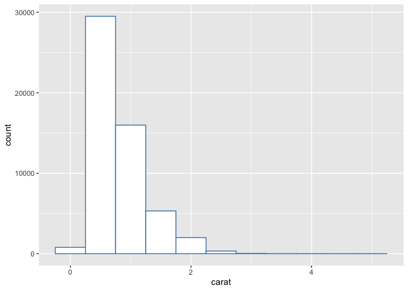
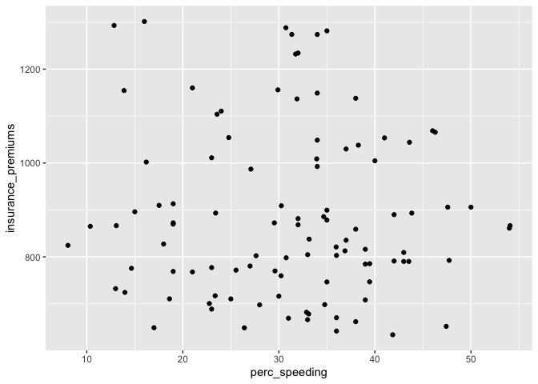
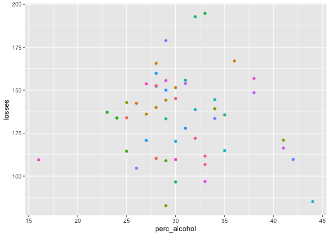
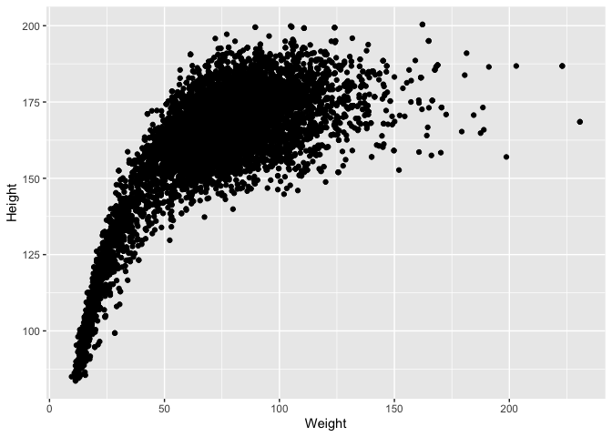
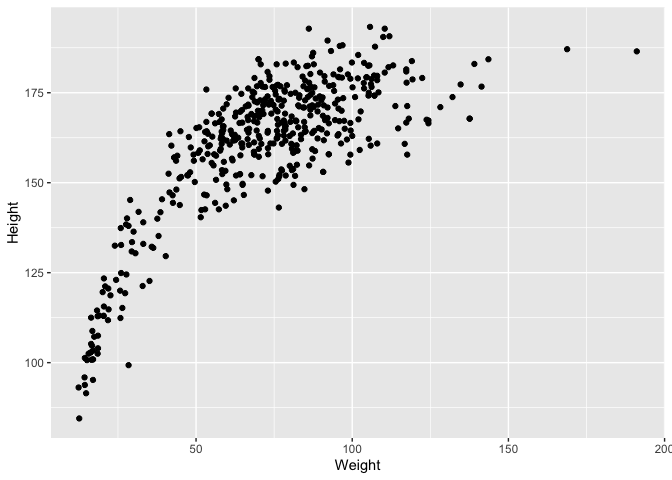
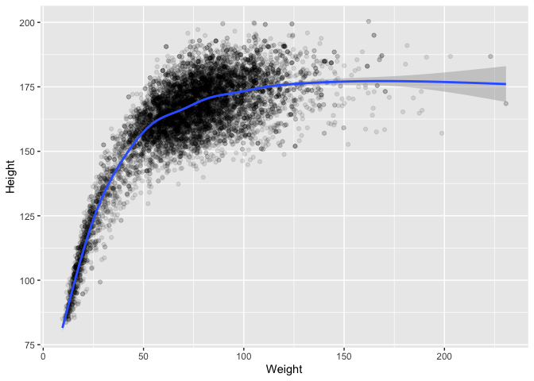
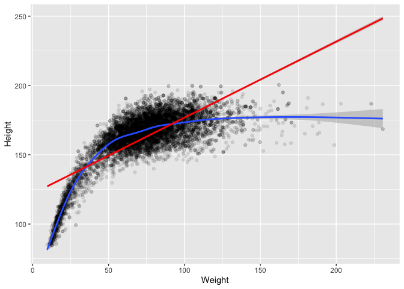

ggplot2 extras
================
Martin Frigaard
9/8/2017

# Loading the packages

First, load the `tidyverse`.

``` r
suppressWarnings(suppressMessages(library(tidyverse)))
suppressWarnings(suppressMessages(library(magrittr)))
```

The [`tidyverse`](http://tidyverse.org/) is a collection of R packages
developed by RStudio’s Chief Scientist [Hadley
Wickham](http://hadley.nz/). These packages work well together as part
of larger data analysis pipeline. To learn more about these tools and
how they work together, read [R for data
science](http://r4ds.had.co.nz/).


We will be using the `bad_drivers` data set from [“Dear Mona, Which
State Has The Worst
Drivers?”](http://fivethirtyeight.com/datalab/which-state-has-the-worst-drivers/).
We load it into out working environment and give it a `_df` to identify
that this object is the data frame.

``` r
bad_drivers_df <- fivethirtyeight::bad_drivers
bad_drivers_df %>% glimpse()
```

    ## Observations: 51
    ## Variables: 8
    ## $ state               <chr> "Alabama", "Alaska", "Arizona", "Arkansas", "Ca…
    ## $ num_drivers         <dbl> 18.8, 18.1, 18.6, 22.4, 12.0, 13.6, 10.8, 16.2,…
    ## $ perc_speeding       <int> 39, 41, 35, 18, 35, 37, 46, 38, 34, 21, 19, 54,…
    ## $ perc_alcohol        <int> 30, 25, 28, 26, 28, 28, 36, 30, 27, 29, 25, 41,…
    ## $ perc_not_distracted <int> 96, 90, 84, 94, 91, 79, 87, 87, 100, 92, 95, 82…
    ## $ perc_no_previous    <int> 80, 94, 96, 95, 89, 95, 82, 99, 100, 94, 93, 87…
    ## $ insurance_premiums  <dbl> 784.55, 1053.48, 899.47, 827.34, 878.41, 835.50…
    ## $ losses              <dbl> 145.08, 133.93, 110.35, 142.39, 165.63, 139.91,…

### The aesthetic mapping

The aesthetic is the part of the graph we see. When we apply a numerical
value (or variable) to an aesthetic, we refer to this as **mapping**.
Consider the call below in which we map `perc_speeding` to
`insurance_premiums` to the x and y. We assign this to a new object and
add `_aes` to remind us this is the data frame and aesthetic mapping.

``` r
bad_drivers_df_aes <- bad_drivers_df %>% ggplot(aes(x = perc_speeding, y = insurance_premiums))
bad_drivers_df_aes
```

<!-- -->

This creates a blank canvas (or carteisn coordinate system) with the two
mapped variables (`perc_speeding` and `insurance_premiums`), but we
don’t see any data points. These are added in the next layers.

### the stat and geom

We would like to see the scatter plot between these two variables, but
in order to do that we need to understand something about the
statistical transformations and geometric objects. Every geometric
object has belongs to a particular statistical transformation, and every
statistical transformation has a particular geometric object.

We can get under the hood of these functions by looking at the `layer`
function.

``` r
p <- ggplot(data = diamonds, mapping = aes(x = carat))
p2 <- p + layer(
  geom = "bar",
  params = list(
    binwidth = 0.5,
    fill = "white",
    color = "steelblue"
  ),
  stat = "bin",
  position = "identity"
)
p2
```

<!-- -->

``` r
bad_drivers_df_aes + layer(
  mapping = NULL, # already specified
  data = NULL, # already specified
  geom = "point",
  stat = "identity",
  position = "identity"
)
```

<!-- -->

We can see `"point"` is the `geom` for a scatter plot, and that
`"identity"` (which leaves the data unchanged) is the default `stat` and
`position`. But we can lesson the typing by just using the shortcut
`geom_point()`.

``` r
bad_drivers_df_aes_stat_geom <- bad_drivers_df_aes + geom_point()
bad_drivers_df_aes_stat_geom
```

<!-- -->

### the position

The `position` argument adjusts the geometric objects to provide a
clearer image. For example, I can add `geom_jitter()` to add some random
noise to every data point. We will call this object `gg_bad_drivers`
because it has all five layers.

``` r
gg_bad_drivers <- bad_drivers_df_aes_stat_geom +
  geom_jitter(width = 10, height = 10)
gg_bad_drivers
```

<!-- -->

This makes more sense when we are dealing with categorical or discrete
values and many data points overlap.

## Adding the layers

Now that we have the basics down, we can start adding more layers to
build better graphs.

Lets look at the relationship between `perc_alcohol` (the percentage of
drivers involved in fatal collisions who were alcohol-impaired) and
`losses` (financial losses incurred by insurance companies for
collisions per insured driver), but add the color aesthetic.

``` r
bad_drivers_df %>% ggplot(aes(x = perc_alcohol, y = losses)) +
  geom_point(aes(color = state))
```

<!-- -->

The legend makes the plot hard to see, so I will use the
`theme(legend.position = "none")` function to remove the legend
altogether.

``` r
bad_drivers_df %>% ggplot(aes(x = perc_alcohol, y = losses)) +
  geom_point(aes(color = state)) +
  theme(legend.position = "none")
```

<!-- -->

That’s better. But I want to the point to represent the number of
`num_drives` (the number of drivers involved in fatal collisions per
billion miles).

``` r
bad_drivers_df %>% ggplot(aes(x = perc_alcohol, y = losses)) +
  geom_point(aes(color = state, size = num_drivers)) +
  theme(legend.position = "none")
```

<!-- -->

It’s a little hard to tell which state is which without labels, so I’ll
add a `geom_text` and apply the `size` of the text to `num_drivers`.

``` r
bad_drivers_df %>% ggplot(aes(x = perc_alcohol, y = losses)) +
  geom_point(aes(color = state)) +
  geom_text(aes(label = state, color = state, size = num_drivers)) +
  theme(legend.position = "none")
```

<!-- -->

## Adding region

Lets break this down further by region. Below are vectors for each US
state region.

``` r
american_midwest <- c("Illinois", "Indiana", "Iowa", "Kansas", "Michigan", 
                      "Minnesota", "Missouri", "Nebraska", "North Dakota", 
                      "Ohio", "South Dakota", "Wisconsin")
american_northeast <- c("Connecticut", "Maine", "Massachusetts", 
                        "New Hampshire", "Rhode Island", "Vermont", 
                        "New Jersey", "New York", "Pennsylvania")
american_south <- c("Delaware", "Florida", "Georgia", "Maryland", 
                    "North Carolina", "South Carolina", "Virginia", 
                    "District of Columbia", "West Virginia", "Alabama", 
                    "Kentucky", "Mississippi", "Tennessee", "Arkansas", 
                    "Louisiana", "Oklahoma", "Texas")
american_west <- c("Arizona", "Colorado", "Idaho", "Montana", "Nevada", 
                   "New Mexico", "Utah", "Wyoming", "Alaska", "California", 
                   "Hawaii", "Oregon", "Washington")
```

I want to create a new variable `region`, in the `bad_drivers_df` data
frame, and then `facet` the graphs according to this new variable.

Let’s do this is one pipeline

``` r
bad_drivers_df %>%
  mutate(
    region =
      case_when(
        state %in% american_midwest ~ "midwest",
        state %in% american_northeast ~ "northeast",
        state %in% american_south ~ "south",
        state %in% american_west ~ "west",
        TRUE ~ "other"
      )
  ) %>%
  ggplot(aes(x = perc_alcohol, y = losses)) +
  geom_point(aes(color = region, size = num_drivers)) +
  geom_text(aes(label = state, size = 8)) +
  facet_grid(. ~ region)
```

<!-- -->

This graph combines the positions, colors, size, labels, and facets to
display the relationship between the amount of money lost by insurance
companies for collisions per insured driver and the percentage of
alcohol-impaired drivers involved in fatal collisions.

``` r
library(babynames)
```

Now that we know the basics for a `ggplot2` graph, we can start to build
on these foundations to get more interesting representations of the
data.

We will start with the native `diamonds` data set from the `ggplot2`
package.

``` r
# put the diamonds data set into its own data frame
dmnds_gg <- ggplot2::diamonds
```

I use `gg` for data sets I create visualizations with (for pattern
matching purposes).

``` r
dmnds_gg %>% glimpse()
```

    ## Observations: 53,940
    ## Variables: 10
    ## $ carat   <dbl> 0.23, 0.21, 0.23, 0.29, 0.31, 0.24, 0.24, 0.26, 0.22, 0.23,…
    ## $ cut     <ord> Ideal, Premium, Good, Premium, Good, Very Good, Very Good, …
    ## $ color   <ord> E, E, E, I, J, J, I, H, E, H, J, J, F, J, E, E, I, J, J, J,…
    ## $ clarity <ord> SI2, SI1, VS1, VS2, SI2, VVS2, VVS1, SI1, VS2, VS1, SI1, VS…
    ## $ depth   <dbl> 61.5, 59.8, 56.9, 62.4, 63.3, 62.8, 62.3, 61.9, 65.1, 59.4,…
    ## $ table   <dbl> 55, 61, 65, 58, 58, 57, 57, 55, 61, 61, 55, 56, 61, 54, 62,…
    ## $ price   <int> 326, 326, 327, 334, 335, 336, 336, 337, 337, 338, 339, 340,…
    ## $ x       <dbl> 3.95, 3.89, 4.05, 4.20, 4.34, 3.94, 3.95, 4.07, 3.87, 4.00,…
    ## $ y       <dbl> 3.98, 3.84, 4.07, 4.23, 4.35, 3.96, 3.98, 4.11, 3.78, 4.05,…
    ## $ z       <dbl> 2.43, 2.31, 2.31, 2.63, 2.75, 2.48, 2.47, 2.53, 2.49, 2.39,…

We will start by breaking down the components of a basic `ggplot` call.
Before we do this, I want to get some basic summary statistics for
`price` and `carat`.

``` r
knitr::kable(
  dmnds_gg %>%
    dplyr::select(carat) %>%
    summarise(
      min_carat = min(carat),
      max_carat = max(carat),
      med_carat = median(carat),
      mean_carat = mean(carat)
    )
)
```

| min\_carat | max\_carat | med\_carat | mean\_carat |
| ---------: | ---------: | ---------: | ----------: |
|        0.2 |       5.01 |        0.7 |   0.7979397 |

**NOTE:** Makes tables pretty using `knitr::kable()`

``` r
knitr::kable(
  dmnds_gg %>%
    dplyr::select(price) %>%
    summarise(
      min_price = min(price),
      max_price = max(price),
      med_price = median(price),
      mean_price = mean(price)
    )
)
```

| min\_price | max\_price | med\_price | mean\_price |
| ---------: | ---------: | ---------: | ----------: |
|        326 |      18823 |       2401 |      3932.8 |

Ok now that we have an idea for each of these variables individually,
lets see how they looks in a graph plotted against each other.

``` r
dmnds_gg %>% ggplot(
  aes(
    x = carat,
    y = price
  )
) +
  geom_point()
```

<!-- -->

What do we see? This graph looks like a scatter plot between `price` and
`caret`. There seems to be a pattern in this relationship (which we will
discuss more later), but is this what we would expect to see?

## the geoms

We tend to think of graphics and visualizations in terms of the shapes
we see (i.e. the dots, bars, lines, etc.). The `ggplot()` function
creates plots in R conveniently named after these **geometric objects**
using a `geom_` (i.e. `geom_bar` for bar charts, `geom_line` for line
charts, etc). Each `geom_` argument has five components:

1.  `data`: the data set (`diamonds`)  
2.  `mapping`: horizontal (`x`) position = `carat`, vertical (`y`)
    position = `price`  
3.  `geom`: geometric objects like scatter plots, histograms, lines,
    etc. = `point`  
4.  `stat`: statistical transformations (i.e. counts or bins) =
    `identity`for raw data  
5.  `position`: adjusting any overlapping objects = `identity`for raw
    data

The grammar allows us to build a plot with each component explicitly
using the `layer` function (and the native `diamonds` data set).

##### Why the crazy indentations?

I like to capitalize on English’s flat branching structure, because each
clause (graph component) ends up on it’s own line, and the entire graph
command can extended diagonally with commas(`,`). I don’t always
remember to arrange it this way, but it helps when I am building a plot
or trying to read someone else’s.

``` r
ggplot() +
  layer(
    data = diamonds, # 1 THE DATA SET
    mapping = aes( # 2 MAPPINGS
      x = carat, # x axis
      y = price
    ), # y axis
    geom = "point", # 3 GEOM_FUNCTION
    stat = "identity", # 4 STAT
    position = "identity"
  ) # 5 POSITION
```

<!-- -->

The reason we don’t have to state each part explicitly is the beauty of
the `ggplot2` package. The grammar comes loaded with smart defaults for
many of the graph components, so we don’t have to remember what `stat`
goes with each `geom`.

There are actually seven parts to each `ggplot2` graph, although not all
are required. We will explore the other functions later. A template for
the grammar is available below:

``` r
ggplot(data = <THE DATA SET>) + # default data and aesthetic mapping 
 geom_<GEOM_FUNCTION>( # the geometric object
  mapping = aes(<MAPPINGS>), # map aesthetics (with scales)
  stat = <STAT>, # statistical transformations
  position = <POSITION> # position adjustments
  ) +
  <COORDINATE_FUNCTION> + # coordinate systems
  <FACET_FUNCTION> # facets 
```

It’s also available
[here](http://r4ds.had.co.nz/data-visualisation.html#the-layered-grammar-of-graphics)

-----

For additional `tidyr` functions using `qplot`, we will use the data for
the story “*A Statistical Analysis of the Work of Bob Ross*”, available
[here](http://fivethirtyeight.com/features/a-statistical-analysis-of-the-work-of-bob-ross/).
Let’s load it in and take a look.

``` r
bob_gg <- fivethirtyeight::bob_ross
bob_gg %>% glimpse()
```

    ## Observations: 403
    ## Variables: 71
    ## $ episode            <chr> "S01E01", "S01E02", "S01E03", "S01E04", "S01E05"…
    ## $ season             <dbl> 1, 1, 1, 1, 1, 1, 1, 1, 1, 1, 1, 1, 1, 2, 2, 2, …
    ## $ episode_num        <dbl> 1, 2, 3, 4, 5, 6, 7, 8, 9, 10, 11, 12, 13, 1, 2,…
    ## $ title              <chr> "A WALK IN THE WOODS", "MT. MCKINLEY", "EBONY SU…
    ## $ apple_frame        <int> 0, 0, 0, 0, 0, 0, 0, 0, 0, 0, 0, 0, 0, 0, 0, 0, …
    ## $ aurora_borealis    <int> 0, 0, 0, 0, 0, 0, 0, 0, 0, 0, 0, 0, 0, 0, 0, 0, …
    ## $ barn               <int> 0, 0, 0, 0, 0, 0, 0, 0, 0, 0, 0, 0, 0, 0, 0, 0, …
    ## $ beach              <int> 0, 0, 0, 0, 0, 0, 0, 0, 1, 0, 0, 0, 0, 0, 0, 0, …
    ## $ boat               <int> 0, 0, 0, 0, 0, 0, 0, 0, 0, 0, 0, 0, 0, 0, 0, 0, …
    ## $ bridge             <int> 0, 0, 0, 0, 0, 0, 0, 0, 0, 0, 0, 0, 0, 0, 0, 0, …
    ## $ building           <int> 0, 0, 0, 0, 0, 0, 0, 0, 0, 0, 0, 0, 0, 0, 0, 0, …
    ## $ bushes             <int> 1, 0, 0, 1, 0, 0, 0, 1, 0, 1, 0, 0, 1, 1, 0, 0, …
    ## $ cabin              <int> 0, 1, 1, 0, 0, 1, 0, 0, 0, 0, 0, 0, 0, 0, 0, 0, …
    ## $ cactus             <int> 0, 0, 0, 0, 0, 0, 0, 0, 0, 0, 0, 0, 0, 0, 0, 0, …
    ## $ circle_frame       <int> 0, 0, 0, 0, 0, 0, 0, 0, 0, 0, 0, 0, 0, 0, 0, 0, …
    ## $ cirrus             <int> 0, 0, 0, 0, 0, 0, 0, 0, 0, 0, 0, 1, 0, 0, 0, 0, …
    ## $ cliff              <int> 0, 0, 0, 0, 0, 0, 0, 0, 0, 0, 0, 0, 0, 0, 0, 0, …
    ## $ clouds             <int> 0, 1, 0, 1, 0, 0, 0, 0, 1, 0, 0, 1, 0, 0, 0, 1, …
    ## $ conifer            <int> 0, 1, 1, 1, 0, 1, 0, 1, 0, 1, 0, 1, 1, 1, 1, 0, …
    ## $ cumulus            <int> 0, 0, 0, 0, 0, 0, 0, 0, 0, 0, 0, 0, 0, 1, 0, 1, …
    ## $ deciduous          <int> 1, 0, 0, 0, 1, 0, 1, 0, 0, 1, 1, 0, 1, 1, 0, 1, …
    ## $ diane_andre        <int> 0, 0, 0, 0, 0, 0, 0, 0, 0, 0, 0, 0, 0, 0, 0, 0, …
    ## $ dock               <int> 0, 0, 0, 0, 0, 0, 0, 0, 0, 0, 0, 0, 0, 0, 0, 0, …
    ## $ double_oval_frame  <int> 0, 0, 0, 0, 0, 0, 0, 0, 0, 0, 0, 0, 0, 0, 0, 0, …
    ## $ farm               <int> 0, 0, 0, 0, 0, 0, 0, 0, 0, 0, 0, 0, 0, 0, 0, 0, …
    ## $ fence              <int> 0, 0, 1, 0, 0, 0, 0, 0, 1, 0, 0, 0, 0, 0, 0, 0, …
    ## $ fire               <int> 0, 0, 0, 0, 0, 0, 0, 0, 0, 0, 0, 0, 0, 0, 0, 0, …
    ## $ florida_frame      <int> 0, 0, 0, 0, 0, 0, 0, 0, 0, 0, 0, 0, 0, 0, 0, 0, …
    ## $ flowers            <int> 0, 0, 0, 0, 0, 0, 0, 0, 0, 0, 0, 0, 0, 0, 0, 0, …
    ## $ fog                <int> 0, 0, 0, 0, 0, 0, 0, 0, 0, 0, 0, 0, 0, 0, 0, 0, …
    ## $ framed             <int> 0, 0, 0, 0, 0, 0, 0, 0, 0, 0, 0, 0, 0, 0, 0, 0, …
    ## $ grass              <int> 1, 0, 0, 0, 0, 0, 0, 0, 0, 0, 0, 0, 1, 1, 0, 0, …
    ## $ guest              <int> 0, 0, 0, 0, 0, 0, 0, 0, 0, 0, 0, 0, 0, 0, 0, 0, …
    ## $ half_circle_frame  <int> 0, 0, 0, 0, 0, 0, 0, 0, 0, 0, 0, 0, 0, 0, 0, 0, …
    ## $ half_oval_frame    <int> 0, 0, 0, 0, 0, 0, 0, 0, 0, 0, 0, 0, 0, 0, 0, 0, …
    ## $ hills              <int> 0, 0, 0, 0, 0, 0, 0, 0, 0, 0, 0, 0, 0, 0, 0, 0, …
    ## $ lake               <int> 0, 0, 0, 1, 0, 1, 1, 1, 0, 1, 1, 1, 0, 1, 1, 0, …
    ## $ lakes              <int> 0, 0, 0, 0, 0, 0, 0, 0, 0, 0, 0, 0, 0, 0, 0, 0, …
    ## $ lighthouse         <int> 0, 0, 0, 0, 0, 0, 0, 0, 0, 0, 0, 0, 0, 0, 0, 0, …
    ## $ mill               <int> 0, 0, 0, 0, 0, 0, 0, 0, 0, 0, 0, 0, 0, 0, 0, 0, …
    ## $ moon               <int> 0, 0, 0, 0, 0, 1, 0, 0, 0, 0, 0, 0, 0, 0, 0, 0, …
    ## $ mountain           <int> 0, 1, 1, 1, 0, 1, 1, 1, 0, 1, 0, 1, 1, 1, 0, 0, …
    ## $ mountains          <int> 0, 0, 1, 0, 0, 1, 1, 1, 0, 0, 0, 1, 0, 0, 0, 0, …
    ## $ night              <int> 0, 0, 0, 0, 0, 1, 0, 0, 0, 0, 0, 0, 0, 0, 0, 0, …
    ## $ ocean              <int> 0, 0, 0, 0, 0, 0, 0, 0, 1, 0, 0, 0, 0, 0, 0, 1, …
    ## $ oval_frame         <int> 0, 0, 0, 0, 0, 0, 0, 0, 0, 0, 0, 0, 0, 0, 0, 0, …
    ## $ palm_trees         <int> 0, 0, 0, 0, 0, 0, 0, 0, 0, 0, 0, 0, 0, 0, 0, 0, …
    ## $ path               <int> 0, 0, 0, 0, 0, 0, 0, 0, 0, 0, 0, 0, 0, 0, 0, 0, …
    ## $ person             <int> 0, 0, 0, 0, 0, 0, 0, 0, 0, 0, 0, 0, 0, 0, 0, 0, …
    ## $ portrait           <int> 0, 0, 0, 0, 0, 0, 0, 0, 0, 0, 0, 0, 0, 0, 0, 0, …
    ## $ rectangle_3d_frame <int> 0, 0, 0, 0, 0, 0, 0, 0, 0, 0, 0, 0, 0, 0, 0, 0, …
    ## $ rectangular_frame  <int> 0, 0, 0, 0, 0, 0, 0, 0, 0, 0, 0, 0, 0, 0, 0, 0, …
    ## $ river              <int> 1, 0, 0, 0, 1, 0, 0, 0, 0, 0, 0, 0, 0, 0, 0, 0, …
    ## $ rocks              <int> 0, 0, 0, 0, 1, 0, 0, 0, 0, 0, 0, 0, 0, 0, 0, 0, …
    ## $ seashell_frame     <int> 0, 0, 0, 0, 0, 0, 0, 0, 0, 0, 0, 0, 0, 0, 0, 0, …
    ## $ snow               <int> 0, 1, 0, 0, 0, 1, 0, 0, 0, 0, 0, 0, 0, 0, 1, 0, …
    ## $ snowy_mountain     <int> 0, 1, 0, 1, 0, 1, 1, 0, 0, 0, 0, 1, 1, 1, 0, 0, …
    ## $ split_frame        <int> 0, 0, 0, 0, 0, 0, 0, 0, 0, 0, 0, 0, 0, 0, 0, 0, …
    ## $ steve_ross         <int> 0, 0, 0, 0, 0, 0, 0, 0, 0, 0, 0, 0, 0, 0, 0, 0, …
    ## $ structure          <int> 0, 0, 1, 0, 0, 1, 0, 0, 0, 0, 0, 0, 0, 0, 0, 0, …
    ## $ sun                <int> 0, 0, 1, 0, 0, 0, 0, 0, 0, 0, 0, 0, 0, 0, 1, 1, …
    ## $ tomb_frame         <int> 0, 0, 0, 0, 0, 0, 0, 0, 0, 0, 0, 0, 0, 0, 0, 0, …
    ## $ tree               <int> 1, 1, 1, 1, 1, 1, 1, 1, 0, 1, 1, 1, 1, 1, 1, 1, …
    ## $ trees              <int> 1, 1, 1, 1, 1, 1, 1, 1, 0, 1, 1, 1, 1, 1, 1, 1, …
    ## $ triple_frame       <int> 0, 0, 0, 0, 0, 0, 0, 0, 0, 0, 0, 0, 0, 0, 0, 0, …
    ## $ waterfall          <int> 0, 0, 0, 0, 0, 0, 0, 0, 0, 0, 0, 0, 0, 0, 0, 0, …
    ## $ waves              <int> 0, 0, 0, 0, 0, 0, 0, 0, 0, 0, 0, 0, 0, 0, 0, 1, …
    ## $ windmill           <int> 0, 0, 0, 0, 0, 0, 0, 0, 0, 0, 0, 0, 0, 0, 0, 0, …
    ## $ window_frame       <int> 0, 0, 0, 0, 0, 0, 0, 0, 0, 0, 0, 0, 0, 0, 0, 0, …
    ## $ winter             <int> 0, 1, 1, 0, 0, 1, 0, 0, 0, 0, 0, 0, 0, 0, 0, 0, …
    ## $ wood_framed        <int> 0, 0, 0, 0, 0, 0, 0, 0, 0, 0, 0, 0, 0, 0, 0, 0, …

Ugh–what **IS** this? Well, this is a standard *binary format* data set,
with each variable telling us the presence (`1`) or absence (`0`) of
each variable.

***NOTE***: if you are ever creating binary variables, always have `1`
equal the presence of the variable name, and `0` coded as the absence.
For example, a binary `gender` variable could be named `male`, and `1`
could be the numerical code for male gender (this also helps with
sorting because the character variable will sort `female` before `male`,
which aligns with the `0` and `1`). Developing these habits early (and
sticking to them\!) makes your analyses more organized and easy to
follow.

We will convert this format into a [tidy]() data set.

``` r
bob_tidy_gg <- bob_gg %>%
  gather(object, present, -c(episode, season, episode_num, title)) %>%
  mutate(present = as.logical(present)) %>%
  arrange(episode, object)
bob_tidy_gg %>% glimpse()
```

    ## Observations: 27,001
    ## Variables: 6
    ## $ episode     <chr> "S01E01", "S01E01", "S01E01", "S01E01", "S01E01", "S01E…
    ## $ season      <dbl> 1, 1, 1, 1, 1, 1, 1, 1, 1, 1, 1, 1, 1, 1, 1, 1, 1, 1, 1…
    ## $ episode_num <dbl> 1, 1, 1, 1, 1, 1, 1, 1, 1, 1, 1, 1, 1, 1, 1, 1, 1, 1, 1…
    ## $ title       <chr> "A WALK IN THE WOODS", "A WALK IN THE WOODS", "A WALK I…
    ## $ object      <chr> "apple_frame", "aurora_borealis", "barn", "beach", "boa…
    ## $ present     <lgl> FALSE, FALSE, FALSE, FALSE, FALSE, FALSE, FALSE, TRUE, …

The `ggplot2` package (and all others in the `tidyverse`) work best with
tidy data. If you are ever curious if your data is tidy, consider it’s
structure and measurements. The original `bob_ross` data set had 403
observations and 71 variables. This new `bob_tidy_gg` has 27,001
observations and 6 variables. That’s because the original `bob_ross`
data set had variables for every item his paintings, and whether it was
there (or not). This doesn’t meet the tidy rule of one variable per
column, because these columns are actually representing a measurement of
painting `object`s, and whether the object is `present` or not. In this
case, we prefer the data structure that contains the most *granular
measurement variables*.

``` r
# fs::dir_ls("data")
celeb_heights <- read_csv("data/celeb_heights.csv")
```

    ## Parsed with column specification:
    ## cols(
    ##   id = col_double(),
    ##   firstname = col_character(),
    ##   midname = col_character(),
    ##   lastname = col_character(),
    ##   fullname = col_character(),
    ##   ftin = col_character(),
    ##   feet = col_double(),
    ##   inches = col_double(),
    ##   meters = col_double(),
    ##   gender = col_character()
    ## )

``` r
celeb_heights %>%
  dplyr::glimpse()
```

    ## Observations: 5,502
    ## Variables: 10
    ## $ id        <dbl> 1, 8, 9, 2, 3, 4, 5, 6, 7, 10, 17, 18, 19, 20, 32, 33, 34…
    ## $ firstname <chr> "Verne", "Herve", "David", "Tony", "Warwick", "Phil", "Mi…
    ## $ midname   <chr> NA, NA, NA, NA, NA, NA, "J", NA, NA, NA, NA, NA, NA, NA, …
    ## $ lastname  <chr> "Troyer", "Villechaize", "Rappaport", "Cox", "Davis", "Fo…
    ## $ fullname  <chr> "Verne Troyer", "Herve Villechaize", "David Rappaport", "…
    ## $ ftin      <chr> "2ft 8in", "3ft 10in", "3ft 11in", "3ft 6in", "3ft 6in", …
    ## $ feet      <dbl> 2, 3, 3, 3, 3, 3, 3, 3, 3, 4, 4, 4, 4, 4, 4, 4, 4, 4, 4, …
    ## $ inches    <dbl> 8.0, 10.0, 11.0, 6.0, 6.0, 6.0, 7.0, 8.0, 9.0, 1.7, 10.0,…
    ## $ meters    <dbl> 0.81280, 1.16840, 1.19380, 1.06680, 1.06680, 1.06680, 1.0…
    ## $ gender    <chr> "M", "M", "M", "M", "M", "M", "M", "M", "M", "F", "F", "F…

For example, let’s say I want to look at the relationship in `child` and
`parent` heights in the `HistData::PearsonLee` dataset. This data set is
a little different than most because it has a `frequency` variable.

``` r
library(HistData)
hts_df <- PearsonLee %>% tbl_df()
hts_df %>%
  ggplot(aes(x = parent, y = child)) +
  geom_point()
```

<!-- -->

``` r
library(NHANES)
nhanes <- NHANES::NHANES
```

``` r
knitr::kable(
  favstats(nhanes$Weight)
)
```

|  | min |   Q1 | median |   Q3 |   max |    mean |       sd |    n | missing |
|  | --: | ---: | -----: | ---: | ----: | ------: | -------: | ---: | ------: |
|  | 2.8 | 56.1 |   72.7 | 88.9 | 230.7 | 70.9818 | 29.12536 | 9922 |      78 |

Get the summary for `Weight`.

``` r
knitr::kable(
  favstats(nhanes$Height)
)
```

|  |  min |    Q1 | median |    Q3 |   max |     mean |       sd |    n | missing |
|  | ---: | ----: | -----: | ----: | ----: | -------: | -------: | ---: | ------: |
|  | 83.6 | 156.8 |    166 | 174.5 | 200.4 | 161.8778 | 20.18657 | 9647 |     353 |

Now with a little bit of summary info I can start to imagine what this
scatter plot will look like. First, my `x` and `y` scales will go from
`2.8` - `230.7` and `83.6` - `200.4`. I also know that most of the data
(dots) will be around `70` for weight and `160` for height. Does this
tell me if the relationship between them is linear?

If this is a linear relationship, **I should expect to see a bunch of
dots grouped together on the diagonal (lower-left to upper-right)**. I
am going to create a scatter plot with these two variables, but first I
am going to filter out the missing `Height` and `Weight` values.

``` r
nhanes %>%
  filter(!is.na(Weight) & !is.na(Height)) %>%
  ggplot(aes(x = Weight, y = Height)) +
  geom_point()
```

<!-- -->

The relationship between these variables looks fairly linear
(i.e. diagonal), but it also seems to have a bit of a curve. We also
have a fair amount of overplotting (points sitting on top of one
another). We can clean this up in a couple different ways. The first is
to impose a `size` value in the `geom_point()`.

``` r
nhanes %>%
  filter(!is.na(Weight) & !is.na(Height)) %>%
  ggplot(aes(x = Weight, y = Height)) +
  geom_point(size = 0.6)
```

<!-- -->

The `size` argument is in reference to the size of the points. We could
also change the tranparency of the points using the `alpha` aesthetic.

``` r
nhanes %>%
  filter(!is.na(Weight) & !is.na(Height)) %>%
  ggplot(aes(x = Weight, y = Height)) +
  geom_point(alpha = 1 / 10)
```

<!-- -->

Finally, we could also not use all of the data (i.e. take a random
sample of `50` observations from the `nhanes` data set)

``` r
nhanes %>%
  sample_n(size = 500) %>%
  filter(!is.na(Weight) & !is.na(Height)) %>%
  ggplot(aes(x = Weight, y = Height)) +
  geom_point()
```

<!-- -->

All of these solutions work, but I would use the `size` or `alpha`
options because we don’t have to choose how many observations to keep.

So does this relationship look linear? We can use the `geom_smooth()`
function to see what line best fits these data. We’ll reduce the
tranparency to `1/10` for clarity, too.

``` r
nhanes %>%
  filter(!is.na(Weight) & !is.na(Height)) %>%
  ggplot(aes(x = Weight, y = Height)) +
  geom_point(alpha = 1 / 10) +
  geom_smooth()
```

    ## `geom_smooth()` using method = 'gam' and formula 'y ~ s(x, bs = "cs")'

<!-- -->

It looks like the `geom_smooth()` function fit a line using `method =
"gam"`, and not `method = "lm"`. This is another default in
`ggplot2`–plots with 1000+ observations use the `"gam"` method. We can
specify the linear method by simply adding another `geom_smooth()`, but
we should make sure to specify a different line color (`color = "red"`).

``` r
nhanes %>%
  filter(!is.na(Weight) & !is.na(Height)) %>%
  ggplot(aes(x = Weight, y = Height)) +
  geom_point(alpha = 1 / 10) +
  geom_smooth() +
  geom_smooth(method = "lm", color = "red")
```

    ## `geom_smooth()` using method = 'gam' and formula 'y ~ s(x, bs = "cs")'

<!-- --> ***NOTE***: the `alpha`
aesthetic can take fractions (`1/10`) or decimals (`0.1`).

Scatter plots (`geom_point()`) are a great way to show the relationship
data from two continuous variables. But what if you want to look at how
a continuous variable is distributed across the levels of a categorical
(or factor) variable? There is more than one way to do this, but we will
start with a stacked bar chart.

### Stacked bar charts

I want to know how the variable `Age` varies across `Gender` in the
`nhanes` data set. I can get some quick summary statistics by using
`group_by` from `dplyr`:

``` r
nhanes %>%
  group_by(Gender) %>%
  summarise(
    min = min(Age),
    max = max(Age),
    median = median(Age),
    mean = mean(Age),
    Mode = mode(Age)
  )
```

    ## # A tibble: 2 x 6
    ##   Gender   min   max median  mean Mode   
    ##   <fct>  <int> <int>  <dbl> <dbl> <chr>  
    ## 1 female     0    80     37  37.6 numeric
    ## 2 male       0    80     36  35.8 numeric

Ok my summary statistics let me know that I should be expecting a graph
that ranges from `0` to `80` on the `x`. Can we tell what the most
common age is? The statistical term for this is the **mode**, and
unfortunately R doesn’t have a quick and easy way to get the mode for
variables in data frames. No problem though

``` r
my_mode <- function(x, na.rm = FALSE) {
  if (na.rm) {
    x <- x[!is.na(x)]
  }
  ux <- unique(x)
  return(ux[which.max(tabulate(match(x, ux)))])
}
```

``` r
nhanes %>%
  group_by(Gender) %>%
  summarise(
    min = min(Age),
    max = max(Age),
    median = median(Age),
    mean = mean(Age),
    mode = my_mode(Age)
  )
```

    ## # A tibble: 2 x 6
    ##   Gender   min   max median  mean  mode
    ##   <fct>  <int> <int>  <dbl> <dbl> <int>
    ## 1 female     0    80     37  37.6    80
    ## 2 male       0    80     36  35.8    80

A stacked bar chart uses the `fill` aesthetic to separate the levels of
a categorical or factor variable by color.

``` r
nhanes %>%
  ggplot(aes(x = Age, fill = Gender)) +
  geom_bar()
```

<!-- -->

The `y` axis is a count of number of observations in each bar. `ggplot2`
also automatically provides a legend to keep track of each level.

This was a very brief tutorial of the `ggplot2` package, so I recommend
learning more about the package by typing `library(help = "ggplot2")`
into your R console, checking out the
[ggplot2](http://ggplot2.tidyverse.org/reference/ggplot2-package.html)
tidyverse page, or purchasing the [ggplot2
book](https://www.amazon.com/ggplot2-Elegant-Graphics-Data-Analysis/dp/331924275X/ref=sr_1_1?s=books&ie=UTF8&qid=1504615645&sr=1-1&keywords=ggplot2).
