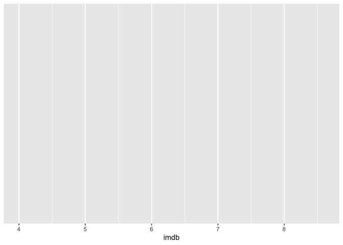
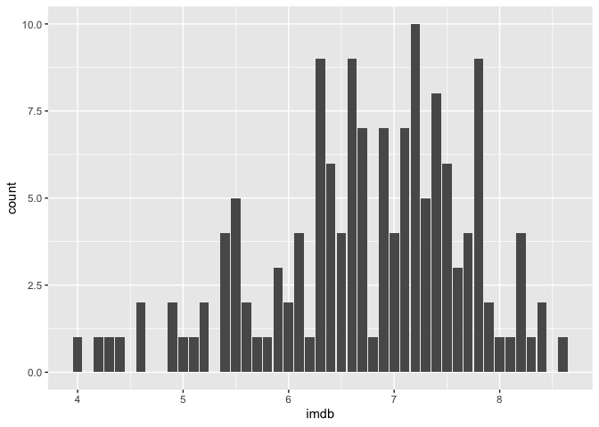
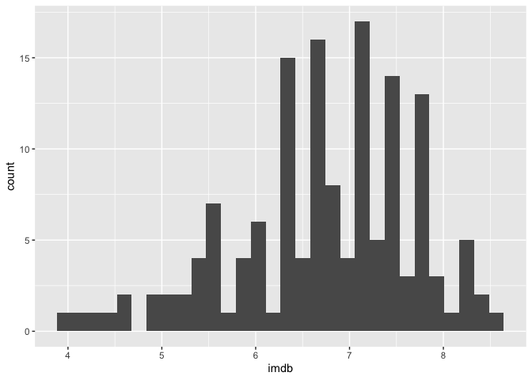
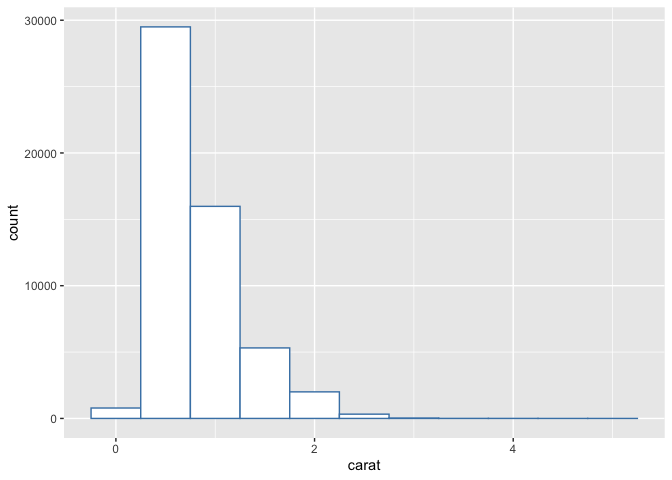

Getting started with data visualization in R using ggplot2 (short)
================

Creating a customized graph that communicates your ideas effectively can
be challenging. This tutorial will introduce you to the popular R
package `ggplot2`, it’s underlying grammar of graphics, and show you how
to create stylish and simple graphs quickly. We will also go over some
basic principles of data visualization.

Spending some time thinking about the structure/arrangement of your data
set will help you produce a better visualization, and we have covered
some everyday data wrangling tasks in these previous tutorials:

1.  Getting started with RStudio Notebooks for reproducible reporting:
    <http://bit.ly/noteb0oks>
2.  Tidying data and the `tidyverse`: <http://bit.ly/tidystart>
3.  Exploring data using FiveThirtyEight’s R package:
    <http://bit.ly/wrangle-intro>
4.  Manipulating data using the `dplyr` package:
    <http://bit.ly/m0ar-wrangle>

## Start your data visualizations with a pen and paper

The best place to start with any visualization is with a pen and paper
sketch. I’ve found removing the confines of any particular software or
programming language and brainstorming on paper helps get the first bad
ideas out of the way. After I have an outline or sketch of the
visualization I want to create, I figure out the details within whatever
computer/software environment I’m using. I find this much more helpful
than jumping in and programming from scratch – it’s much harder to end
up in the right place if you have no idea where you’re going.

## Graphs and comedy

My goal when I create a graph or visualization is to communicate an idea
or some information about the underlying data (i.e., the differences,
patterns, etc.) with a minimal amount additional explanation. In many
ways, good graphics are like well-written jokes; if I have to explain a
joke, it loses the desired effect. You’ve heard the phrase, “a picture
is worth a thousand words.” Well, if I want the picture (i.e., the
visualization), I create to be worth 1,000 words, any additional
explanation I have to provide diminishes that word value.

Graphs are also similar to jokes in that you should know your audience
before delivering either. Thanksgiving dinner at your in-law’s house
probably isn’t the place for Redd Foxx’s “What’s the difference between
a pickpocket and a peeping tom?”, but you might get away with Abbott &
Costello’s, “Who’s on first?”

Telling jokes to the wrong audience can be awkward (or even volatile)
because 1) it failed to make the material relevant and funny, or 2) you
unknowingly encroached on a sensitive topic. Showing a visualization to
the wrong audience is more akin to the first mistake (resulting in
crickets, blank stares, or just being overlooked), but the second isn’t
impossible. After all, data is information, so it’s a good idea to think
about how a visualization you’re sharing will fit into your audience’s
world view.

## Share & share often

The comedian Jamie Foxx said he tests out his new stand-up material on
his family before using it on stage. Beta testing rough jokes like this
on an audience you trust enough to give you honest feedback is a great
way to refine your work. That is also an excellent way to improve the
reception of your data visualizations. By sending early drafts to
friends and colleagues, you’re getting a fresh set of eyes on the graphs
you’ve created to see if they’re communicating your ideas effectively.

The final similarity between jokes and data visualizations is their
ability to influence their audience. Data visualizations from
journalists like Alberto Cairo, Mona Chalabi, and Jeremy Singer-Vine
have incited countless readers to demand that evidence accompanies
journalism. The current media technology landscape continues to create
opportunities for people to look at data and in new and compelling ways.

Many jokes are funny because they present an uncomfortable truth in a
novel and entertaining way. Facts are more accessible to digest when
presented in jest (i.e., *it’s funny because it’s true*). I like to keep
this as a standard for visualizations–*a good visualization makes the
truth easier to comprehend*. After all, the goal here is communication,
so anything short of comprehension by the intended audience is a
failure.

Three goals for your data visualization or graph: 1) your audience sees
your finished work (so you have to complete it), 2) everyone in the
intended audience understands the ideas or information you’re trying to
convey, and 3) you present the data to your audience in a
novel/entertaining way.

## Communication with graphs

In 1985, two scientists at Bell Laboratories – William Cleveland and
Robert McGill – published a paper on “visual decoding of elementary
graphical-perception tasks” (i.e., which graph elements convey
statistical concepts with minimal mental effort). The authors identified
ten commonly used graphing components for representing numerical data.
Then they ran some experiments that tested people’s ability to quickly
and easily see the relevant information each graph was supposed to
convey. The authors used the results from these tests to rank the
graphing elements according to how accurately the patterns in the data
were perceived. Their ranking is below:

People could see the information and ideas in the graphs best when they
were displayed using positions and geometric shapes (positioning,
length, and angles). For example, the graphs below are presenting values
in positions on a horizontal axis, easing our ability to make a
comparison because the location of these values is on identical (but not
aligned) scales.

Nathan Yau from Flowing Data refers to this list of elements (but also
includes ‘shape’) as the visual cues in a graph or visualization. Below
is a visual ranking of each item adapted from Yau’s text, Data Points.
These elements are one of four visualization components he covers (the
other three being a coordinate system, scale, and context).

<image>

Leland Wilkinson’s Grammar of Graphics presents a unique system for
creating graphics in a distributed computing environment (implemented in
SPSS as GPL). Hadley Wickham expanded and adapted Wilkinson’s grammar to
the R language in the ggplot2 package.

## Why have a grammar of graphics?

Having a grammar of graphics allows us to build graphs using a standard
syntax. The individual elements of each graph are like the parts of a
well-written sentence. It takes a strong command of English to write
clear sentences.

“appreciating the engineering design behind a sentence – a linear
ordering of phrases which conveys a gnarly network of ideas — is the key
to understanding what you are trying to accomplish when you compose a
sentence.” - Stephen Pinker

`ggplot2` uses geometric objects (“geoms”), aesthetic mappings, and
layers as the “linear ordering of phrases” to build graphs “which convey
a gnarly network of ideas.” The grammar provides a framework for
building each graph one part at a time in sequential order (or layers).

## The data set

To build a graph, I’ll need a dataset. We will be using a variety of
datasets throughout these tutorials, starting with the `fandango` table
from the `fivethirtyeight` package. These data are from the article,
[“Be Suspicious Of Online Movie Ratings, Especially
Fandango’s”](https://53eig.ht/2tk47Mh). Be sure to read the article
before continuing this tutorial.

The code chunk below loads these data into RStudio.

``` r
library(fivethirtyeight)
Fandango <- fivethirtyeight::fandango
Fandango %>% glimpse(78)
```

    ## Observations: 146
    ## Variables: 23
    ## $ film                       <chr> "Avengers: Age of Ultron", "Cinderella",…
    ## $ year                       <dbl> 2015, 2015, 2015, 2015, 2015, 2015, 2015…
    ## $ rottentomatoes             <int> 74, 85, 80, 18, 14, 63, 42, 86, 99, 89, …
    ## $ rottentomatoes_user        <int> 86, 80, 90, 84, 28, 62, 53, 64, 82, 87, …
    ## $ metacritic                 <int> 66, 67, 64, 22, 29, 50, 53, 81, 81, 80, …
    ## $ metacritic_user            <dbl> 7.1, 7.5, 8.1, 4.7, 3.4, 6.8, 7.6, 6.8, …
    ## $ imdb                       <dbl> 7.8, 7.1, 7.8, 5.4, 5.1, 7.2, 6.9, 6.5, …
    ## $ fandango_stars             <dbl> 5.0, 5.0, 5.0, 5.0, 3.5, 4.5, 4.0, 4.0, …
    ## $ fandango_ratingvalue       <dbl> 4.5, 4.5, 4.5, 4.5, 3.0, 4.0, 3.5, 3.5, …
    ## $ rt_norm                    <dbl> 3.70, 4.25, 4.00, 0.90, 0.70, 3.15, 2.10…
    ## $ rt_user_norm               <dbl> 4.30, 4.00, 4.50, 4.20, 1.40, 3.10, 2.65…
    ## $ metacritic_norm            <dbl> 3.30, 3.35, 3.20, 1.10, 1.45, 2.50, 2.65…
    ## $ metacritic_user_nom        <dbl> 3.55, 3.75, 4.05, 2.35, 1.70, 3.40, 3.80…
    ## $ imdb_norm                  <dbl> 3.90, 3.55, 3.90, 2.70, 2.55, 3.60, 3.45…
    ## $ rt_norm_round              <dbl> 3.5, 4.5, 4.0, 1.0, 0.5, 3.0, 2.0, 4.5, …
    ## $ rt_user_norm_round         <dbl> 4.5, 4.0, 4.5, 4.0, 1.5, 3.0, 2.5, 3.0, …
    ## $ metacritic_norm_round      <dbl> 3.5, 3.5, 3.0, 1.0, 1.5, 2.5, 2.5, 4.0, …
    ## $ metacritic_user_norm_round <dbl> 3.5, 4.0, 4.0, 2.5, 1.5, 3.5, 4.0, 3.5, …
    ## $ imdb_norm_round            <dbl> 4.0, 3.5, 4.0, 2.5, 2.5, 3.5, 3.5, 3.5, …
    ## $ metacritic_user_vote_count <int> 1330, 249, 627, 31, 88, 34, 17, 124, 62,…
    ## $ imdb_user_vote_count       <int> 271107, 65709, 103660, 3136, 19560, 3937…
    ## $ fandango_votes             <int> 14846, 12640, 12055, 1793, 1021, 397, 25…
    ## $ fandango_difference        <dbl> 0.5, 0.5, 0.5, 0.5, 0.5, 0.5, 0.5, 0.5, …

From the output, I can see there are 146 observations and 23 variables
in this dataset.

### Summarize data

I’ll get a quick summary of the `imdb` variable from the `Fandango` data
set using `dplyr`’s `select()`, `filter()`, and `summarize()` functions.

If I access the help files, I find the variable is, *“The IMDb user
score for the film.”*

``` r
Fandango %>%
     dplyr::select(imdb) %>%
     dplyr::filter(!is.na(imdb)) %>% 
     dplyr::summarise(
         min = min(imdb),
         max = max(imdb),
         mean = mean(imdb),
         median = median(imdb),
         iqr = IQR(imdb),
         sd = sd(imdb),
         missing = sum(is.na(imdb)),
         total_non_miss = sum(!is.na(imdb)),
         total = n()
)
```

    ## # A tibble: 1 x 9
    ##     min   max  mean median   iqr    sd missing total_non_miss total
    ##   <dbl> <dbl> <dbl>  <dbl> <dbl> <dbl>   <int>          <int> <int>
    ## 1     4   8.6  6.74    6.9   1.1 0.959       0            146   146

Specificity is what makes the `dplyr` functions so flexible.
Unfortunately, this specificity comes at the expense of a lot of typing
for basic numerical summaries. If I had to do this for every variable in
my data set, it would 1) get tiring and 2) increase the chances of
error.

But we can also get a quick number summary using the `fav_stats`
function from the `mosaic` package. I’ll add some formatting from the
`knitr` package to make the output look prettier, too.

``` r
knitr::kable(
Fandango %$% mosaic::fav_stats(imdb)
)
```

| min |  Q1 | median |  Q3 | max |     mean |        sd |   n | missing |
| --: | --: | -----: | --: | --: | -------: | --------: | --: | ------: |
|   4 | 6.3 |    6.9 | 7.4 | 8.6 | 6.736986 | 0.9587358 | 146 |       0 |

NOTE: The `%$%` operator is another magical tool from the `magrittr`
package and handles functions that don’t have a specific data argument.
Use it when the regular pipe doesn’t work.

### The components of ggplot2 graphs

The composition of `ggplot2` calls have three parts:

1.  A data set (`data.frame` or `tibble`)
2.  The aesthetic mapping ( `mapping = aes()` )
3.  A geometric object ( `geom_` ) and more aesthetics

`ggplot2` is designed to work with tidy data (observations in rows,
variables in columns). In application, `ggplot2` function calls look
like the image below:

``` r
Data %>% 
    ggplot2::ggplot(mapping = aes(x = variable_x, y = variable_y)) + 
            ggplot2::geom_(...)
```

It’s also common to see a `ggplot2` figure built by starting with the
`ggplot2::ggplot()` function,

``` r
ggplot2::ggplot(Data, 
    mapping = aes(x = variable_x, y = variable_y)) + 
        ggplot2::geom_(...)
```

I prefer to start with a dataset (`Data`), then initialize the `ggplot2`
object, and then add the aesthetic mappings. I’ve found this follows a
subject-verb agreement that errs on the side of the reader’s
understanding. Generally speaking, data objects in R are the nouns (or
subjects), and R functions are verbs. Verbs do things to subjects or
nouns, and verbs usually follow them in a sentence.

So rather than writing,

`Verb(Subject,`

I like writing,

`Subject %>% Verb`

This way, I consistently start with the `Data` (the subject/noun), and
then add the `function()` (the verb that’s going to do something to the
data).

### Adding geoms and mapping aesthetics

After piping the data to the `ggplot2::ggplot()` function, we can use
the `+` operator to add geoms (`geom_function()`) and other aesthetics
mappings. See the code example below:

``` r
Data %>% 
    ggplot(mapping = aes(x = variable_x, y = variable_y)) +
    ggplot2::geom_function(mapping = aes(x = variable_x, y = variable_y))
```

The syntax above also includes mapping to `x` and `y` variables inside
the `geom_function()`, but these arguments are not required if the
mapping is in the previous `ggplot()` function. Other named arguments
are often omitted when composing `ggplot2` graphs, like `mapping =`, `x
=`, and `y =`. The common shorthand methods I’ve seen are:

``` r
Data %>% ggplot(aes(x = variable_x, y = variable_y))
```

and

``` r
Data %>% ggplot(aes(variable_x, variable_y))
```

Both produce the same thing. It is also common to assign the output of
the `ggplot2::ggplot()` function to an object, then add layers (geoms)
to it.

``` r
plot <- Data %>% ggplot(aes(variable_x, variable_y))
# add geoms to plot
plot + 
    ggplot2::geom_function()
```

For now, I’ll start by showing what goes into each `geom_function()`
using the `ggplot2::layer()`. These graphs will only use a single `x`
variable so we can get the hang of the grammar.

### Pipe (%\>%) vs. plus (+)

The pipe (`%>%`) operator carries the data to the `ggplot2::ggplot()`
function and initializes the `ggplot` object. After I’ve created this
object, the new elements (geoms, titles, axes labels, themes, etc.) are
added using the `+` operator.

The two operators get a little confusing if you’re used to using the
pipe operator with other packages in the `tidyverse`. It helps me to
think of the `Data` and the `ggplot2::ggplot()` as the bare minimum
needed to create a graph canvas and *everything else gets added to that
canvas*.

### A ggplot2 object

If I wanted to create a blank canvas of the `imdb` variable from the
`Fandango` dataset I summarized above, I can use the code below:

``` r
# assign to ggplot_object
ggplot_object <- Fandango %>%
     ggplot2::ggplot(mapping = aes(x = imdb))
# print ggplot_object
ggplot_object
```

<!-- -->

The `ggplot_object` has the `imdb` variable spread across the `x` axis,
ranging from just under 4 to almost 9, which makes sense if we look at
the `min` and `max` values from the summary above. However, there isn’t
anything to *see* on this graph because we haven’t assigned any geoms.

Now that we have 1) the data, and 2) an aesthetic mapping, we can add
geom layers to the canvas. Just to verify what is mapped in the
`ggplot_object`, we can also check by looking at the `mapping` list
using the `$` operator.

``` r
# store and explore ggplot_object
ggplot_object$mapping
```

    ## Aesthetic mapping: 
    ## * `x` -> `imdb`

I see `x` is still `imdb`.

### Statistics and geoms

By using `ggplot2::layer()`, I’ll be able to specify each component in
my `ggplot2` graph. I will start by looking at two different bar charts
(this will help understand the connection between `stat`s and `geom`s).

#### Bar graphs and histograms

Bar graphs and histograms can both be used to view the distribution of a
single variable. If I want to view the distribution of `imdb` with a
`"bar"` geom, I can add `stat`, `geom`, and `position` arguments to the
`ggplot_object` using `layer()` below.

``` r
ggplot_object + 
# add the necessary layers
     layer(stat = "count",
           geom = "bar",
           position = "identity")
```

<!-- -->

The `stat` tells `ggplot` how I want `imdb` summarized in the graph. For
a bar graph, this is the `count` of the total number of observations
within each `imdb` score category. Then the `geom` argument tells
`ggplot` to visually represent this statistic in a `bar`. The `position`
argument is used to make any adjustments or changes to the data
represented in the geom. An `"identity"` argument doesn’t make any
changes to the data (because the bars don’t need to be adjusted), but
`position` can be used to adjust data with variants like `position =
"fill"`, and `position = "stack"`.

A histogram has the same `geom` and `position` arguments, but uses `stat
= "bin"` to divvy up the scores of `imdb`.

``` r
# assign data and variable to aesthetic
ggplot_object + 
# add the necessary layers
     layer(stat = "bin",
           geom = "bar",
           position = "identity")
```

    ## `stat_bin()` using `bins = 30`. Pick better value with `binwidth`.

<!-- -->

*What are these warnings and messages?* `ggplot2` is pretty good about
notifying us with messages and warnings about the graphs we create. The
message is telling me the data have been divvied up in 30 bins (the
default).

``` r
`stat_bin()` using `bins = 30`. Pick better value with `binwidth`.`
```

#### What is binwidth and how does it relate to bins?

The binwidth is how wide each bar is on the `x` axis. We can adjust the
`binwidth` values by specifying the `params = list(binwidth = 0.5)`. The
simplest way to understand bins is by setting it to extreme values. We
will set the `binwidth` argument to small and large values to
demonstrate how binning influences the shape of the histogram.

If I use a low binwidth number (`binwidth = 0.5`), then I can see the
numbers of bars in my histogram has decreased. Also, we can see the
tallest bars of values for `imdb` scores are between 6.5 and 7.

``` r
# assign data and variable to aesthetic
Fandango %>%
     ggplot(mapping = aes(x = imdb)) +
# add the necessary layers
          layer(stat = "bin",
                    params = list(binwidth = 0.5),
               geom = "bar",
               position = "identity")
```

<!-- -->

The relationship between the bins, `binwidth` and frequency of `imdb`
scores are outlined in the image below.

<!-- -->

Conversely, if I set the `binwidth` to a larger number (like `“1“`),
there will be fewer bars (and more score occurrences binned inside each
bar).

``` r
# assign data and variable to aesthetic
Fandango %>%
     ggplot(mapping = aes(x = imdb)) +
# add the necessary layers
          layer(
               stat = "bin",
                    params = list(binwidth = 1),
               geom = "bar",
               position = "identity")
```

<!-- -->

Finding the best setting for `binwidth` depends on the data, but the
goal is to give the viewer an idea of the underlying distribution of the
variable.

# Putting it all together

Earlier I stated there were three components for a `ggplot2` graph, (the
data, aesthetic mappings, and geoms). But in the `layer()` function,
we’ve had to specify additional arguments (`stat`, `geom`, `position`,
and `params`). This a lot to remember (and type\!). The beauty of
`ggplot2` is that we don’t have to state every layer component
explicitly. Each geometric object comes with a default statistic. This
lightens our mental load when we want to use the grammar to build a
graph because we only need to remember the geom function.

I can pass the existing `ggplot_object` to the
`ggplot2::geom_histogram()` function using the `+` and add the
`binwidth` argument.

*I will set this to `0.25` just to show another example of the
relationship between the `binwidth` and the resulting number of `bins`*

``` r
ggplot_object + 
    geom_histogram(binwidth = 0.25)
```

<!-- -->

## Label your graphs and save your work\!

Charts without axis labels and a title aren’t much more than an
incomplete doodle on a napkin. Fortunately, `ggplot2` comes with the
`labs()` function that gives a *ton* of options for including important
information on your graphs. [Other authors](http://bit.ly/2I9WPVS) have
written about labeling graphs for scientific articles, but I’ll add that
it’s worthwhile to consider the audience when adding text to any figure
(spell-out the acronyms, avoid unnecessary jargon, etc.). I’m probably
going to be the next person to see this graph, and I haven’t mastered
the ability to perfectly recall multiple lines of code, so I’ll include
the information necessary to reproduce it.

The `ggplot2::ggsave()` function can be added to the end of any chunk of
code and it will save the last graph created. I will add it below to
save this graph in the `images` folder with the title,
`"imdb-histo-plot.png"`.

``` r
ggplot_object + 
    geom_histogram(binwidth = 0.25, 
                   fill = "darkorange2", 
                   color = "gray25",
                   alpha = 2/3) + 
    ggplot2::labs(title = "Distribution of Internet Movie Database (IMDB) scores",
                  subtitle = "Data source: https://53eig.ht/2tk47Mh",
                  caption = "x = imdb, geom_histogram",
                  x = "IMDB Score (binwidth = 0.25)",
                  y = "Count")
```

<!-- -->

``` r
# save
ggplot2::ggsave(filename = "images/imdb-histo-plot.png", 
                width = 7, height = 5, units = "in")
```

And just like that, we have a plot we can export to any other medium\!
Below is a schematic showing the parts of a `ggplot2` graph.

<!-- -->

## Reproducing a graph

The article that uses the `Fandango` data set show a graph with a single
distribution of fandango scores. Given what we’ve covered, we should be
able to reproduce this graph (or get pretty close).

The `dplyr::glimpse()` function tells me that there are two variables
for Fandango scores in the dataset, `fandango_stars` and
`fandango_ratingvalue`. One way to check if these two variables have a
distribution similar to the image in the article is to pass them to pass
them both to the `skimr::skim()` function.

``` r
Fandango %>% 
    skimr::skim(fandango_stars, fandango_ratingvalue)
```

The `skimr::skim()` function perfect for comparing two variable
distributions. The `hist` column produced gives us a small histogram we
can view along with summary statistics.

<!-- -->

I personally prefer to use `skimr::skim_to_wide()` because it returns a
`skim` of the entire data frame, with the statistics in the columns. I
can also save this object to view later.

``` r
FandangoSkim <- Fandango %>% 
    skimr::skim_to_wide()
FandangoSkim
```

<!-- -->

Now that I can see the miny histograms for both variables, it looks like
`fandango_ratingvalue` is

``` r
Fandango %>% 
    ggplot2::ggplot(aes(x = fandango_ratingvalue)) + 
    geom_freqpoly(binwidth = 1.45, 
                   color = "darkorange2") + 
ggplot2::labs(title = "Fandango's Lopsided Ratings Curve",
subtitle = "Ratings for 209 films that played in theatres in 2015 and received 30+ reviews",
  caption = "Data source: Fandango.com",
                  x = "IMDB Score (binwidth = 1.45)",
                  y = "Count") 
```

<!-- -->
