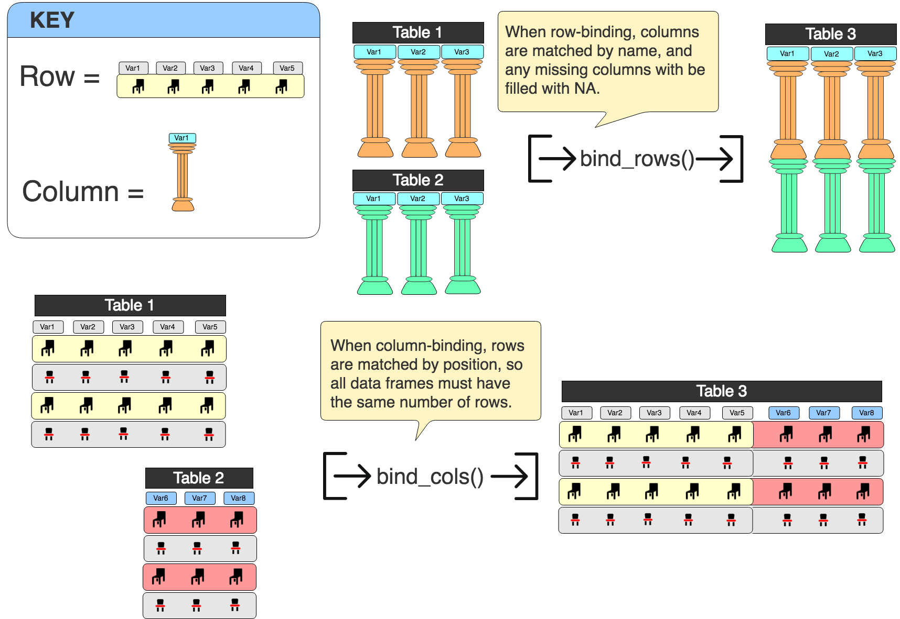
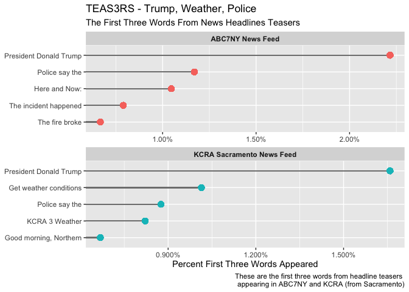
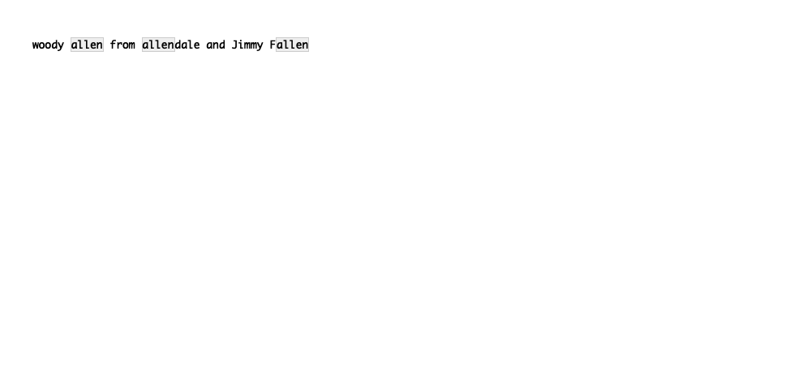
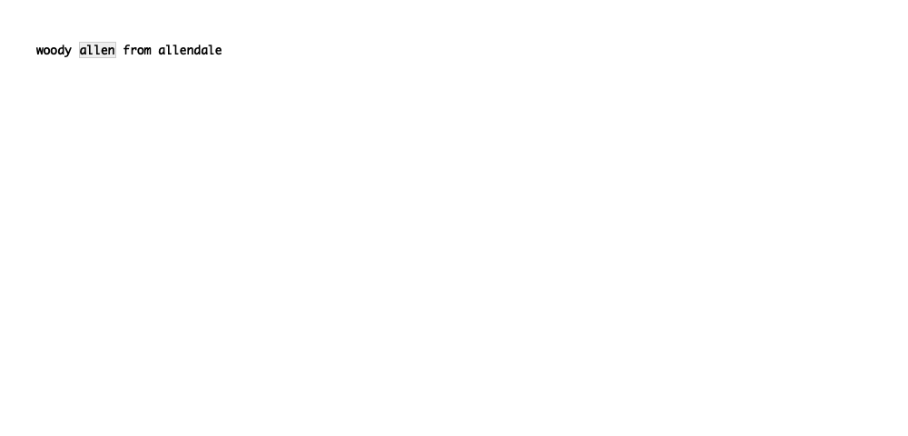
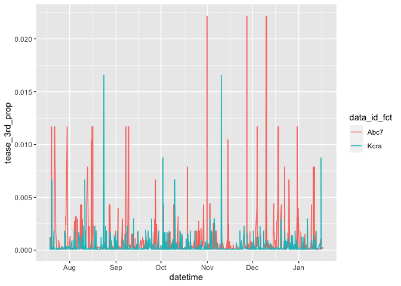
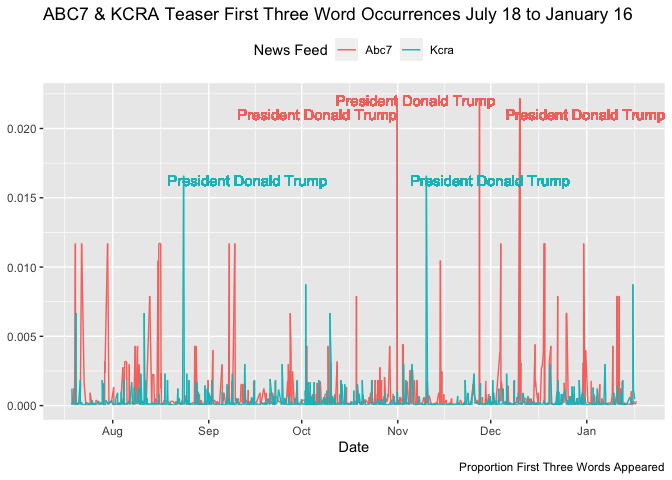

String Manipulation in R
================
Martin Frigaard
September 22, 2017

  - [String-Manipulation: An Overview](#string-manipulation-an-overview)
      - [Load the Packages](#load-the-packages)
      - [Load the Data](#load-the-data)
          - [Inspect the data sets](#inspect-the-data-sets)
      - [Combine Data Sets](#combine-data-sets)
          - [***Which one do I want to
            use?***](#which-one-do-i-want-to-use)
      - [String Manipulation with Base
        R](#string-manipulation-with-base-r)
          - [Testing Characer Strings](#testing-characer-strings)
      - [Removing Characters](#removing-characters)
      - [Pasting](#pasting)
      - [Printing](#printing)
      - [The `stringr` package](#the-stringr-package)
      - [Changing Case](#changing-case)
          - [Finding `words`](#finding-words)
      - [Create a visualization with a
        pipeline](#create-a-visualization-with-a-pipeline)
      - [Joins](#joins)
          - [Inner joins](#inner-joins)
          - [Outer joins](#outer-joins)
      - [Joining `NewsData` and `maps`
        data](#joining-newsdata-and-maps-data)
          - [Create State level data](#create-state-level-data)
              - [Create `City` data](#create-city-data)
          - [Create `StateAbbLkUp` table](#create-stateabblkup-table)
          - [Join `City` and `States` data](#join-city-and-states-data)
          - [Create `city_id` in
            `NewsData`](#create-city_id-in-newsdata)
              - [Create `city_id` in
                `NewsData`](#create-city_id-in-newsdata-1)
          - [Finding cities within
            headlines](#finding-cities-within-headlines)
      - [Regular Expressions (regex)](#regular-expressions-regex)
          - [Review Regular Expressions with
            `str_view()`](#review-regular-expressions-with-str_view)
              - [***Why are regular expressions so
                awful/powerful?***](#why-are-regular-expressions-so-awfulpowerful)
      - [Regular Expressions in R](#regular-expressions-in-r)
      - [Common Regular Expressions](#common-regular-expressions)
          - [Match a word at the end of a
            line](#match-a-word-at-the-end-of-a-line)
          - [Replace the word at the end of a
            line](#replace-the-word-at-the-end-of-a-line)
          - [Matches a word at the beginning of a
            line](#matches-a-word-at-the-beginning-of-a-line)
          - [Replace the word at the beginning of a
            line](#replace-the-word-at-the-beginning-of-a-line)
          - [Match one or more numbers](#match-one-or-more-numbers)
          - [Replaces one or more
            numbers](#replaces-one-or-more-numbers)
          - [ADVANCED: Match first noun phrase in
            teasers](#advanced-match-first-noun-phrase-in-teasers)
          - [ADVANCED: Match words ending with
            `ing`](#advanced-match-words-ending-with-ing)
          - [ADVANCED: Replace the `ing` with
            `in'`](#advanced-replace-the-ing-with-in)
          - [ADVANCED: Find articles, indefinite aricles, and
            nouns.](#advanced-find-articles-indefinite-aricles-and-nouns.)
      - [`separate`, `str_sub`, and
        `make_datetime`](#separate-str_sub-and-make_datetime)
          - [First Three `teaser` Words Over
            Time](#first-three-teaser-words-over-time)

This code chunk will create a file name for the document.

``` r
# filename ----------
file_prefix <- c("001.3-") # version #
file_exten <- c(".Rmd")
file_title <- tolower(str_replace_all(
    "String Manipulation in R", 
    pattern = " ",
    replacement = "_"))
file_name <- paste0(file_prefix, file_title, file_exten)
file_name
```

    ## [1] "001.3-string_manipulation_in_r.Rmd"

**PACKAGES:**

``` r
library(dplyr) # Data wrangling, glimpse(75) and tbl_df().
library(ggplot2) # Visualise data.
library(lubridate) # Dates and time.
```

    ## 
    ## Attaching package: 'lubridate'

    ## The following object is masked from 'package:base':
    ## 
    ##     date

``` r
library(readr) # Efficient reading of CSV data.
library(stringr) # String operations.
library(tibble) # Convert row names into a column.
library(tidyr) # Prepare a tidy dataset, gather().
library(magrittr) # Pipes %>%, %T>% and equals(), extract().
library(tidyverse) # all tidyverse packages
library(mosaic) # favstats and other summary functions
library(fs) # file management functions
library(stringi) # more strings
library(tidytext) # tidying text data for analysis
library(maps) # maps for us.cities
```

    ## 
    ## Attaching package: 'maps'

    ## The following object is masked from 'package:purrr':
    ## 
    ##     map

**HEADER:**

  - **File name:** 001.3-string\_manipulation\_in\_r.Rmd  
  - **Created date:** 2019-09-10  
  - **R version:** R version 3.6.1 (2019-07-05)  
  - `tidyverse` package version: 1.2.1
  - `magrittr` package version: 1.5  
  - `mosaic` package version: 1.5.0  
  - `dplyr` package version: 0.8.3
  - `ggplot2` package version: 3.2.1.9000
  - `lubridate` package version: 1.7.4
  - `readr` package version: 1.3.1
  - `stringr` package version: 1.4.0
  - `tibble` package version: 2.1.3
  - `tidyr` package version: 0.8.3.9000
  - `fs` package version: 1.3.1
  - `stringi` package version: 1.4.3

# String-Manipulation: An Overview

Manipulating characters (non-numerical data) is an essential skill for
anyone looking to visualize or analyze text data. This tutorial will go
over a few of the base R functions for manipulating strings in R, and
introduce the `stringr` package from the
[tidyverse](http://tidyverse.org/).

``` r
tidyverse::tidyverse_logo()
⬢ __  _    __   .    ⬡           ⬢  . 
 / /_(_)__/ /_ ___  _____ _______ ___ 
/ __/ / _  / // / |/ / -_) __(_-</ -_)
\__/_/\_,_/\_, /|___/\__/_/ /___/\__/ 
     ⬢  . /___/      ⬡      .       ⬢
```

### Load the Packages

Start by loading the packages we will be using in this tutorial

``` r
library(tidyverse) # All the goods
library(stringi) # More String Functions
library(magrittr) # Pipes %>%, %T>% and equals(), extract().
```

### Load the Data

We will be using 6 months of news article data from ABC7NY and KCRA
(from Sacramento), spanning July 18 to January 16 (headline, date-time,
teaser, url). All times are Eastern Standard Time.

``` r
Abc7 <- read_csv("data/abc7ny.csv")
Kcra <- read_csv("data/kcra.csv")
```

#### Inspect the data sets

Take a quick look at each data set with `dplyr::glimpse(75)`

``` r
Abc7 %>% glimpse(78)
```

    ## Observations: 9,745
    ## Variables: 6
    ## $ datetime  <chr> "July 18, 2017 at 03:41PM", "July 18, 2017 at 03:55PM", "…
    ## $ headline  <chr> "9-year-old boy wants to thank every cop in the U.S. with…
    ## $ url       <chr> "http://abc7ny.com/news/donut-boy-wants-to-thank-every-co…
    ## $ teaser    <chr> "Tyler Carach, a 9-year-old boy from Florida, wants to sh…
    ## $ feed_name <chr> "abc7ny.com RSS Feed", "abc7ny.com RSS Feed", "abc7ny.com…
    ## $ feed_url  <chr> "http://abc7ny.com/feed", "http://abc7ny.com/feed", "http…

``` r
Kcra %>% glimpse(78)
```

    ## Observations: 13,020
    ## Variables: 6
    ## $ datetime  <chr> "July 18, 2017 at 03:56PM", "July 18, 2017 at 03:58PM", "…
    ## $ headline  <chr> "Woman says product intended for wasps trapped 7 birds in…
    ## $ url       <chr> "http://www.kcra.com/article/woman-says-product-intended-…
    ## $ teaser    <chr> "The customer's Facebook post has been shared thousands o…
    ## $ feed_name <chr> "KCRA Top Stories", "KCRA Top Stories", "KCRA Top Stories…
    ## $ feed_url  <chr> "http://www.kcra.com", "http://www.kcra.com", "http://www…

We can see these data frames contain the same variables, but if we had
many, many columns we could use `base::identical()` and `base::names()`
to test if the columns are the same.

``` r
base::identical(names(Abc7), names(Kcra))
```

    ## [1] TRUE

### Combine Data Sets

We want to combine these data sets into a single data frame `NewsData`.
As with most operations in R, there are multiple ways to approach
combining data frames. I prefer to use `dplyr` for merging and joining
because 1) the functions are fast and efficient and 2) the arguments are
somewhat intuitive.

I say *somewhat* because `dplyr::bind_rows()` sticks two data frames
together **top-to-bottom**, and `dplyr::bind_cols()` puts two data
frames together **side-by-side**. If you look at the figure below, you
can see what I mean. Combining two data frames together
**top-to-bottom** means the data gets added into the matched columns
(and un-matched columns get filled with `NA`).

But if I want to combine data frames together **side-by-side**, they
will be matched on their row position (so I would need to make sure the
same number of rows are in each data frame).

<!-- -->

**NOTE:** The tiny object in the rows are chairs, because for some
reason, whenever I think of rows, I think of a row of chairs. The same
goes for columns (except I think about a Roman pillar).

-----

#### ***Which one do I want to use?***

I can see from the code chunks above that both data frames have
identical column names, but an unequal number of rows. This makes
`dplyr::bind_rows()` the correct option. I might want to separate each
data frame again later, so including an ID (like `data_id`) that allows
me to see what data set each headline originally came from is a good
idea. Fortunately, there is an argument in `dplyr::bind_rows()` for
including an id (`.id =`).

Before I start executing functions, I should think about to expect in
`NewsData`. The `Abc7` data frame has 9,745 and 6 variables, and `Kcra`
has 13,020 observations and 6 variables. If I use `dplyr::bind_rows()`,
I’m expecting a data frame with the sum of all observations
(i.e. 22,765) and 6 variables.

``` r
# test 
dplyr::bind_rows(Abc7, Kcra, .id = "data_id") %>% 
    dplyr::count(data_id)
```

    ## # A tibble: 2 x 2
    ##   data_id     n
    ##   <chr>   <int>
    ## 1 1        9745
    ## 2 2       13020

**NOTE:** I’m going to introduce a little sequence I go through for most
data manipulation tasks. It includes three steps: 1) *test*, 2)
*assign*, and 3) *verify*. These steps are for making sure I am getting
what I expect from each task. In the *test* step, I set up some way of
verifying the function or pipeline is doing what I want. For this
example, I used `dplyr::count()` to see if `"data_id"` is the new data
frame and if it can distinguish the original data sets.

Now I will *assign* the new variables to `NewsData` and *verify* it
gives the same information.

``` r
# assign
NewsData <- dplyr::bind_rows(Abc7, Kcra, .id = "data_id")
# verify
NewsData %>% 
    dplyr::count(data_id)
```

    ## # A tibble: 2 x 2
    ##   data_id     n
    ##   <chr>   <int>
    ## 1 1        9745
    ## 2 2       13020

Great\! I just need to remember that `1` is the id for `Abc7` and `2` is
the id for `Kcra`. Now I can start with the string manipulations.

``` r
NewsData %>% 
    glimpse(75)
```

    ## Observations: 22,765
    ## Variables: 7
    ## $ data_id   <chr> "1", "1", "1", "1", "1", "1", "1", "1", "1", "1", "1",…
    ## $ datetime  <chr> "July 18, 2017 at 03:41PM", "July 18, 2017 at 03:55PM"…
    ## $ headline  <chr> "9-year-old boy wants to thank every cop in the U.S. w…
    ## $ url       <chr> "http://abc7ny.com/news/donut-boy-wants-to-thank-every…
    ## $ teaser    <chr> "Tyler Carach, a 9-year-old boy from Florida, wants to…
    ## $ feed_name <chr> "abc7ny.com RSS Feed", "abc7ny.com RSS Feed", "abc7ny.…
    ## $ feed_url  <chr> "http://abc7ny.com/feed", "http://abc7ny.com/feed", "h…

### String Manipulation with Base R

There are a few functions in base R that come in handy when dealing with
strings. These first functions we will cover are basic, but they
introduce important concepts like how strings are printed, and the kinds
of manipulations that are possible with R. I’ll demo these by taking the
first five lines of the `headline` column and putting it into it’s
object (`headlines_var`) using `dplyr::select()` and `Matrix::head()`.

``` r
headlines_var <- NewsData %>% 
    dplyr::select(headline) %>% 
    Matrix::head(5) 
```

#### Testing Characer Strings

The base functions in R takes a character vector, so the first thing
I’ll need to do is test and see if `headlines_var` satisfies that
condition. I can do this with `base::is.character()`.

``` r
base::is.character(headlines_var)
```

    ## [1] FALSE

`FALSE`\!?\!? But this looked like a character vector when I used
`dplyr::glimpse(75)` above. What kind of object this *is*
`headlines_var`?

I can test that with `base::typeof()`.

``` r
base::typeof(headlines_var)
```

    ## [1] "list"

Ahhhh `headlines_var` is a `list`. This means I’ll need to use
`base::unlist()` to convert the `headlines_var` list to a character
vector.

``` r
headlines_var <- headlines_var %>% base::unlist() 
base::is.character(headlines_var)
```

    ## [1] TRUE

**NOTE:** *Other options for converting objects to strings include
`base::is.character()` and `base::toString()`.*

I’ll take a look at this vector and see what the contents look like with
`utils::str()`.

``` r
headlines_var %>% utils::str()
```

    ##  Named chr [1:5] "9-year-old boy wants to thank every cop in the U.S. with doughnuts" ...
    ##  - attr(*, "names")= chr [1:5] "headline1" "headline2" "headline3" "headline4" ...

We can see the `unlist()` function retains the `"names"` attribute in
the `headlines_var` vector.

``` r
headlines_var
```

    ##                                                                      headline1 
    ##           "9-year-old boy wants to thank every cop in the U.S. with doughnuts" 
    ##                                                                      headline2 
    ## "10-year-old boy critical after being struck by boat propeller on Long Island" 
    ##                                                                      headline3 
    ##                  "10-year-old boy critical after Long Island boating accident" 
    ##                                                                      headline4 
    ##       "American Airlines mechanic marks record-breaking 75 years with company" 
    ##                                                                      headline5 
    ##                         "12-year-old girl pulled from surf in Sandy Hook dies"

### Removing Characters

I can see from the contents of `headlines_var` that it is a vector with
all five headlines. I’ll demonstrate the `base::sub()` function by
removing the `-` characters.

``` r
base::sub(pattern = "-", replacement = " ", x = headlines_var)
```

    ##                                                                      headline1 
    ##           "9 year-old boy wants to thank every cop in the U.S. with doughnuts" 
    ##                                                                      headline2 
    ## "10 year-old boy critical after being struck by boat propeller on Long Island" 
    ##                                                                      headline3 
    ##                  "10 year-old boy critical after Long Island boating accident" 
    ##                                                                      headline4 
    ##       "American Airlines mechanic marks record breaking 75 years with company" 
    ##                                                                      headline5 
    ##                         "12 year-old girl pulled from surf in Sandy Hook dies"

The first pass with `base::sub()` only finds the first instance of `-`
and replaces it with a blank space `" "`. If I want to remove ALL
instances of `-`, I can use `base::gsub()`.

``` r
base::gsub(pattern = "-", replacement = " ", x = headlines_var)
```

    ##                                                                      headline1 
    ##           "9 year old boy wants to thank every cop in the U.S. with doughnuts" 
    ##                                                                      headline2 
    ## "10 year old boy critical after being struck by boat propeller on Long Island" 
    ##                                                                      headline3 
    ##                  "10 year old boy critical after Long Island boating accident" 
    ##                                                                      headline4 
    ##       "American Airlines mechanic marks record breaking 75 years with company" 
    ##                                                                      headline5 
    ##                         "12 year old girl pulled from surf in Sandy Hook dies"

Another option for replacing every instance of a character is
`base::chartr()`, but this requires that the `old` argument is the same
length of the `new` argument (otherwise you will see `'old' is longer
than 'new'`).

``` r
base::chartr(old = "-", new = " ", x = headlines_var)
```

    ##                                                                      headline1 
    ##           "9 year old boy wants to thank every cop in the U.S. with doughnuts" 
    ##                                                                      headline2 
    ## "10 year old boy critical after being struck by boat propeller on Long Island" 
    ##                                                                      headline3 
    ##                  "10 year old boy critical after Long Island boating accident" 
    ##                                                                      headline4 
    ##       "American Airlines mechanic marks record breaking 75 years with company" 
    ##                                                                      headline5 
    ##                         "12 year old girl pulled from surf in Sandy Hook dies"

### Pasting

Whenever you need to combine or “stick” string elements together, you
can either use `base::paste()` or `base::paste0()`. For example, if I
wanted to combine all of these headlines into a single, long, character
vector, I could use the following

``` r
base::paste(headlines_var, collapse = "; ")
```

    ## [1] "9-year-old boy wants to thank every cop in the U.S. with doughnuts; 10-year-old boy critical after being struck by boat propeller on Long Island; 10-year-old boy critical after Long Island boating accident; American Airlines mechanic marks record-breaking 75 years with company; 12-year-old girl pulled from surf in Sandy Hook dies"

Or if I wanted to combine all the headlines but not include any
whitespace between the characters, I could use `base::paste0()`

``` r
base::paste0(headlines_var, sep = "", collapse = "; ")
```

    ## [1] "9-year-old boy wants to thank every cop in the U.S. with doughnuts; 10-year-old boy critical after being struck by boat propeller on Long Island; 10-year-old boy critical after Long Island boating accident; American Airlines mechanic marks record-breaking 75 years with company; 12-year-old girl pulled from surf in Sandy Hook dies"

### Printing

I typically use [RStudio
Notebooks](https://rmarkdown.rstudio.com/r_notebooks.html), so I like to
have some flexibility with my printing options. There are a few base R
printing options you should know for printing strings (or anything) to
the R console.

If you want to see the results of a vector printed without quotes, use
`base::noquote()`

``` r
base::noquote(headlines_var)
```

    ##                                                                    headline1 
    ##           9-year-old boy wants to thank every cop in the U.S. with doughnuts 
    ##                                                                    headline2 
    ## 10-year-old boy critical after being struck by boat propeller on Long Island 
    ##                                                                    headline3 
    ##                  10-year-old boy critical after Long Island boating accident 
    ##                                                                    headline4 
    ##       American Airlines mechanic marks record-breaking 75 years with company 
    ##                                                                    headline5 
    ##                         12-year-old girl pulled from surf in Sandy Hook dies

Another option is `base::cat()`. This also comes with a `sep =`
argument.

``` r
base::cat(headlines_var, sep = ", ")
```

    ## 9-year-old boy wants to thank every cop in the U.S. with doughnuts, 10-year-old boy critical after being struck by boat propeller on Long Island, 10-year-old boy critical after Long Island boating accident, American Airlines mechanic marks record-breaking 75 years with company, 12-year-old girl pulled from surf in Sandy Hook dies

### The `stringr` package

The `tidyverse` comes with `stringr`, a handy package for handling
string manipulations. You can find it on the `tidyverse`
[website](http://stringr.tidyverse.org/) or you can read about here in
[R for Data Science](http://r4ds.had.co.nz/strings.html).

`stringr` (like other packages in the `tidyverse`) is very convenient
because all of the functions have a common prefix, `str_`

Everything we just did with base R is possible with `stringr`, so I’m
going to go through some of this package’s lesser-known functions.

-----

## Changing Case

It’s often useful to convert the entire corpus of text to lowercase so
future string matching is a little easier. I can do this by changing the
case of `headlines` and storing it in a new variable `headline_low`
using `stringr::str_to_lower()` and `dplyr::mutate()`.

**NOTE:** I’m going to perform the remaining functions with the
`NewsData` data frame (because that is the preferred object in the
`tidyverse`).

``` r
NewsData %>% 
    dplyr::mutate(headline_low = stringr::str_to_lower(headline)) %>% 
    dplyr::select(headline, headline_low) %>% 
    head(5)
```

    ## # A tibble: 5 x 2
    ##   headline                               headline_low                           
    ##   <chr>                                  <chr>                                  
    ## 1 9-year-old boy wants to thank every c… 9-year-old boy wants to thank every co…
    ## 2 10-year-old boy critical after being … 10-year-old boy critical after being s…
    ## 3 10-year-old boy critical after Long I… 10-year-old boy critical after long is…
    ## 4 American Airlines mechanic marks reco… american airlines mechanic marks recor…
    ## 5 12-year-old girl pulled from surf in … 12-year-old girl pulled from surf in s…

Then again, these are headlines, so maybe we want another variable that
converts all `headlines` to **Title Case** using
`stringr::str_to_title()`.

``` r
NewsData %>% 
    dplyr::mutate(headline_title = stringr::str_to_title(headline)) %>% 
    dplyr::select(headline, headline_title) %>% 
    head(5)
```

    ## # A tibble: 5 x 2
    ##   headline                              headline_title                          
    ##   <chr>                                 <chr>                                   
    ## 1 9-year-old boy wants to thank every … 9-Year-Old Boy Wants To Thank Every Cop…
    ## 2 10-year-old boy critical after being… 10-Year-Old Boy Critical After Being St…
    ## 3 10-year-old boy critical after Long … 10-Year-Old Boy Critical After Long Isl…
    ## 4 American Airlines mechanic marks rec… American Airlines Mechanic Marks Record…
    ## 5 12-year-old girl pulled from surf in… 12-Year-Old Girl Pulled From Surf In Sa…

### Finding `words`

I might also curious about the first few words in the `teaser`
associated with each headline. Let’s assume I want to see the frequency
of each word by news feed (or `data_id`). I can use the
`stringr::word()` function to extract the first three words and store it
in a new variable `teaser_3_words`.

``` r
# test
NewsData %>% 
    dplyr::mutate(teaser_3_words = stringr::word(NewsData$teaser, 1, 3)) %>% 
    count(teaser_3_words, sort = TRUE) %>% 
    head(10)
```

    ## # A tibble: 10 x 2
    ##    teaser_3_words             n
    ##    <chr>                  <int>
    ##  1 President Donald Trump   216
    ##  2 Get weather conditions   132
    ##  3 Police say the           114
    ##  4 KCRA 3 Weather           107
    ##  5 Here and Now:            102
    ##  6 Good morning, Northern    87
    ##  7 The incident happened     77
    ##  8 The fire broke            65
    ##  9 Authorities say the       43
    ## 10 The New York              42

This looks like it’s working, so I’ll assign `teaser_3_words` to the
`NewsData` data frame.

``` r
NewsData <- NewsData %>% 
    dplyr::mutate(teaser_3_words = stringr::word(NewsData$teaser, 1, 3))
```

Now I can verify this new variable is behaving the way it should by
using the same `dplyr::count()` function above.

``` r
NewsData %>% 
    dplyr::count(teaser_3_words, sort = TRUE) %>% 
    utils::head(10)
```

    ## # A tibble: 10 x 2
    ##    teaser_3_words             n
    ##    <chr>                  <int>
    ##  1 President Donald Trump   216
    ##  2 Get weather conditions   132
    ##  3 Police say the           114
    ##  4 KCRA 3 Weather           107
    ##  5 Here and Now:            102
    ##  6 Good morning, Northern    87
    ##  7 The incident happened     77
    ##  8 The fire broke            65
    ##  9 Authorities say the       43
    ## 10 The New York              42

Sometimes I like to verify a new variable using a visualization instead
of a table. I find it helpful to think of the data I am manipulating as
a distribution (or shape) instead of just a set of numbers in a table. A
figure has more attributes I can think about (shape, size, color,
position, etc.), where a table just has lines and text.

For example, when I created `teaser_3_words` with the first three words
from the `teaser`, I was thinking about how those words might vary by
station (ABC7NY or KCRA). I assume there is some overlap in
`teaser_3_words` between these stations. I can see this if I run
`dplyr::distinct()` and `base::nrow()`.

``` r
NewsData %>% 
    dplyr::distinct(teaser_3_words) %>% 
    base::nrow()
```

    ## [1] 15415

If there are `15415` distinct `teaser_3_words` and `22765` observations
in `NewsData`, I can safely assume there is some overlap between these
two stations.

## Create a visualization with a pipeline

If I want to visualize this, I need to add a column to the `NewsData`
data frame that has the results from `dplyr::count()`. This is possible
with `dplyr::add_count()`. Then I want to `dplyr::arrange()` the data so
the largest numbers are on top. `n` isn’t a very descriptive variable
name, so I will `dplyr::rename()` this to `tease_3rd_count`.

Things get a little trickier here, because I also want to add a total N
by news feed *and* a proportion variable that will tell me how many
times `teaser_3_words` showed up in that `teaser` relative to the total
number of teasers in the feed (`tease_3rd_prop`).

This little trick can be accomplished using the following steps:

1.  Use `dplyr::group_by()`, `dplyr::add_tally()`, and
    `dplyr::ungroup()` to collapse the data frame on the two news feeds
    in `data_id`, create a summary `n` variable, and then expand this
    data frame back to it’s original shape (plus one variable).

2.  Change the name of `n` to `newsfeed_n` with `dplyr::rename()`

3.  Finally, use `dplyr::mutate()` to create the proportion variable
    `tease_3rd_prop`, a factor version of `data_id`, and convert the
    existing `teaser_3_words` variable to a factor.

When I test a long pipeline like this, I do it iteratively. At the end
of each step, I add a `%>% dplyr::glimpse(75)` or another viewing
function to see what I am getting.

``` r
NewsData <- NewsData %>% 
    dplyr::add_count(teaser_3_words) %>% # count this variable and add it
    dplyr::arrange(desc(n)) %>% # arrange the new n data with largest on top
    dplyr::rename(tease_3rd_count = n) %>%  # get rid of n variable
    dplyr::group_by(data_id) %>% # collapse the data frame by news feed
    dplyr::add_tally() %>% # add the total count 
    dplyr::ungroup() %>% # expand the data to all variables again
    dplyr::rename(newsfeed_n = n) %>% # rename n to newsfeed_n
    dplyr::mutate(tease_3rd_prop = tease_3rd_count/newsfeed_n, # create prop
            data_id_fct = factor(data_id, # create factor for ID
                                   levels = c(1, 2),
                                   labels = c("Abc7", 
                                          "Kcra")),
            teaser_3_words = factor(teaser_3_words)) 
NewsData %>% 
    dplyr::glimpse(75)
```

    ## Observations: 22,765
    ## Variables: 12
    ## $ data_id         <chr> "1", "1", "1", "1", "1", "1", "1", "1", "1", "1"…
    ## $ datetime        <chr> "July 18, 2017 at 05:39PM", "July 19, 2017 at 09…
    ## $ headline        <chr> "President Trump blasts Congress over failure of…
    ## $ url             <chr> "http://abc7ny.com/politics/trump-blasts-congres…
    ## $ teaser          <chr> "President Donald Trump blasted congressional De…
    ## $ feed_name       <chr> "abc7ny.com RSS Feed", "abc7ny.com RSS Feed", "a…
    ## $ feed_url        <chr> "http://abc7ny.com/feed", "http://abc7ny.com/fee…
    ## $ teaser_3_words  <fct> President Donald Trump, President Donald Trump, …
    ## $ tease_3rd_count <int> 216, 216, 216, 216, 216, 216, 216, 216, 216, 216…
    ## $ newsfeed_n      <int> 9745, 9745, 9745, 9745, 9745, 9745, 9745, 9745, …
    ## $ tease_3rd_prop  <dbl> 0.02216521, 0.02216521, 0.02216521, 0.02216521, …
    ## $ data_id_fct     <fct> Abc7, Abc7, Abc7, Abc7, Abc7, Abc7, Abc7, Abc7, …

Now I can create a Cleveland Plot that shows the proportion of the first
three word occurrence by news station. Note that I also use a few
`dplyr` functions to make the plot a little clearer.

``` r
NewsDataTeaserClevelandPlot <- NewsData %>% 
    dplyr::arrange(desc(tease_3rd_prop)) %>% # sort desc by the proportion
    dplyr::filter(tease_3rd_count >= 50) %>% # only keep frequecies above 50
    dplyr::filter(!is.na(teaser_3_words)) %>% # remove missing
    # Make the plot
    ggplot2::ggplot(aes(x = tease_3rd_prop, # plot the prop
                        y = fct_reorder(teaser_3_words, # reorder words
                                        tease_3rd_count), # by counts
                     fill = data_id_fct,
                    group = teaser_3_words)) + # fill by feed
    ggplot2::geom_segment(aes(yend = teaser_3_words), 
                     xend = 0, 
                    color = "grey50") +
    ggplot2::geom_point(size = 3, 
                   aes(color = data_id_fct), 
                 show.legend = FALSE) + 
    ggplot2::facet_wrap( ~ data_id_fct, # arrange in 2 columns
           nrow = 2, 
         scales = "free", # free scales
       labeller = as_labeller( # add custom lables
       c(`Abc7` = "ABC7NY News Feed", 
         `Kcra` = "KCRA Sacramento News Feed"))) +
            ggplot2::scale_x_continuous(labels = scales::percent) + # use %
            ggplot2::theme(strip.text.x = element_text(face = "bold")) + # bold type
            ggplot2::labs( # labels and captions
                  x = "Percent First Three Words Appeared", 
                  y = NULL,
            caption = "These are the first three words from headline teasers 
            appearing in ABC7NY and KCRA (from Sacramento)",
              title = "TEAS3RS - Trump, Weather, Police",
           subtitle = "The First Three Words From News Headlines Teasers")
NewsDataTeaserClevelandPlot
```

<!-- -->

``` r
ggsave("images/NewsDataTeaserClevelandPlot.png", 
       width = 7, 
       height = 5, 
       units = "in")
```

As you can see, these pipelines provide a lot of flexibility for
manipulating and visualizing data.

## Joins

When you want to combine data frame one data set into another, but match
these data on a common variable, you need to perform a **join**. Broadly
speaking, there are two types of joins: **inner** and **outer.**

### Inner joins

Inner joining comes in handy when you need to combine two tables, but
only want keep the observations that are present in both tables. Read
more about these [here](http://r4ds.had.co.nz/relational-data.html).

### Outer joins

Outer joins can come in three types: left, right , and full outer joins.
The `left_join()` gets all the rows from the left table, including those
with `NA` values in the join field.

The important thing about `dplyr::left_join()` is the *order the tables
are listed in the function*. Inside the `dplyr::left_join()` function,
the first table listed is the primary table, and the second table is the
secondary table. The `dplyr::left_join()` will join the secondary table
to the primary table by matching on the rows from the primary table,
even if there aren’t matches with rows in the secondary table.

I’ll demonstrate a join using the data from the `maps` package.

## Joining `NewsData` and `maps` data

If I want to look at the `headline` or `teaser` data by location, I have
to join it to a data frame that has data I can map. This information is
found in the `maps` and `ggplot2` packages.

<!-- add citation for maps -->

### Create State level data

I want to create a data frame called `States` from
`ggplot2::map_data()`. I can see that now I have `region` in `States`
that contains the state names. I will rename this to `state_name` (its
already the correct case).

``` r
State <- ggplot2::map_data("state")
State <- State %>% 
    dplyr::select(state_name = region,
                  state_long = long, 
                  state_lat = lat, 
                  state_group = group, 
                  state_order = order,
                  state_subregion = subregion) 
State %>% 
    dplyr::glimpse(75)
```

    ## Observations: 15,537
    ## Variables: 6
    ## $ state_name      <chr> "alabama", "alabama", "alabama", "alabama", "ala…
    ## $ state_long      <dbl> -87.46201, -87.48493, -87.52503, -87.53076, -87.…
    ## $ state_lat       <dbl> 30.38968, 30.37249, 30.37249, 30.33239, 30.32665…
    ## $ state_group     <dbl> 1, 1, 1, 1, 1, 1, 1, 1, 1, 1, 1, 1, 1, 1, 1, 1, …
    ## $ state_order     <int> 1, 2, 3, 4, 5, 6, 7, 8, 9, 10, 11, 12, 13, 14, 1…
    ## $ state_subregion <chr> NA, NA, NA, NA, NA, NA, NA, NA, NA, NA, NA, NA, …

#### Create `City` data

Now I want a data frame with US cities. I can get this from
`maps::us.cities`. The state from the `name` variable using the
information stored in `country.etc`. I can do this by putting using the
state information in `country.etc` and `stringr::str_replace_all()` to
create `city`. I will also trim any additional whitespace from this
variable with `stringr::str_trim()` and convert it to lower case using
`stringr::str_to_lower()`.

``` r
City <- maps::us.cities
City <- City %>% 
    mutate(city_id = stringr::str_replace_all(string = City$name, 
                         pattern = City$country.etc, 
                         replacement = ""),
           city_id = stringr::str_trim(city_id),
           city_id = stringr::str_to_lower(city_id),
           state_abbrev = str_to_lower(country.etc)) %>% 
    dplyr::select(
        city_id,
        city_state_name = name,
        city_lat = lat,
        city_long = long,
        city_pop = pop, 
        city_capital = capital,
        dplyr::everything())
City %>% glimpse(75)
```

    ## Observations: 1,005
    ## Variables: 8
    ## $ city_id         <chr> "abilene", "akron", "alameda", "albany", "albany…
    ## $ city_state_name <chr> "Abilene TX", "Akron OH", "Alameda CA", "Albany …
    ## $ city_lat        <dbl> 32.45, 41.08, 37.77, 31.58, 42.67, 44.62, 35.12,…
    ## $ city_long       <dbl> -99.74, -81.52, -122.26, -84.18, -73.80, -123.09…
    ## $ city_pop        <int> 113888, 206634, 70069, 75510, 93576, 45535, 4949…
    ## $ city_capital    <int> 0, 0, 0, 0, 2, 0, 0, 0, 0, 0, 0, 0, 0, 0, 0, 0, …
    ## $ country.etc     <chr> "TX", "OH", "CA", "GA", "NY", "OR", "NM", "LA", …
    ## $ state_abbrev    <chr> "tx", "oh", "ca", "ga", "ny", "or", "nm", "la", …

### Create `StateAbbLkUp` table

Now I have city data in `City` and state data in `State`. I want to join
these together into `CityState` on `state_name`. But I also want to
create `StateAbbLkUp`, which contains state abbreviations from
`state.abb` and state names from `state.name`.

``` r
StateAbbLkUp <- data_frame("state_abbrev" = as.character(state.abb),
                            "state_name" = as.character(state.name))
```

    ## Warning: `data_frame()` is deprecated, use `tibble()`.
    ## This warning is displayed once per session.

``` r
StateAbbLkUp <- StateAbbLkUp %>% 
    dplyr::mutate(state_name = str_to_lower(state_name), 
                  state_abbrev = str_to_lower(state_abbrev)) 
StateAbbLkUp %>% glimpse(78)
```

    ## Observations: 50
    ## Variables: 2
    ## $ state_abbrev <chr> "al", "ak", "az", "ar", "ca", "co", "ct", "de", "fl", …
    ## $ state_name   <chr> "alabama", "alaska", "arizona", "arkansas", "californi…

### Join `City` and `States` data

Now I can join these three tables together using `dplyr::left_join()`
statements.

``` r
StateAbbLkUp <- dplyr::left_join(StateAbbLkUp, 
                                 City, 
                                 by = "state_abbrev") %>% 
                dplyr::left_join(State, by = "state_name") 
StateAbbLkUp %>% 
       dplyr::glimpse(75) 
```

    ## Observations: 473,586
    ## Variables: 14
    ## $ state_abbrev    <chr> "al", "al", "al", "al", "al", "al", "al", "al", …
    ## $ state_name      <chr> "alabama", "alabama", "alabama", "alabama", "ala…
    ## $ city_id         <chr> "auburn", "auburn", "auburn", "auburn", "auburn"…
    ## $ city_state_name <chr> "Auburn AL", "Auburn AL", "Auburn AL", "Auburn A…
    ## $ city_lat        <dbl> 32.59, 32.59, 32.59, 32.59, 32.59, 32.59, 32.59,…
    ## $ city_long       <dbl> -85.48, -85.48, -85.48, -85.48, -85.48, -85.48, …
    ## $ city_pop        <int> 51236, 51236, 51236, 51236, 51236, 51236, 51236,…
    ## $ city_capital    <int> 0, 0, 0, 0, 0, 0, 0, 0, 0, 0, 0, 0, 0, 0, 0, 0, …
    ## $ country.etc     <chr> "AL", "AL", "AL", "AL", "AL", "AL", "AL", "AL", …
    ## $ state_long      <dbl> -87.46201, -87.48493, -87.52503, -87.53076, -87.…
    ## $ state_lat       <dbl> 30.38968, 30.37249, 30.37249, 30.33239, 30.32665…
    ## $ state_group     <dbl> 1, 1, 1, 1, 1, 1, 1, 1, 1, 1, 1, 1, 1, 1, 1, 1, …
    ## $ state_order     <int> 1, 2, 3, 4, 5, 6, 7, 8, 9, 10, 11, 12, 13, 14, 1…
    ## $ state_subregion <chr> NA, NA, NA, NA, NA, NA, NA, NA, NA, NA, NA, NA, …

### Create `city_id` in `NewsData`

In order to create a `city_id` in `NewsData`, I will need to check all
the words in the `headline` to see how many mention the cities. To do
this I need to put the `StateAbbLkUp$city_id` into it’s own vector
`city_id_vec`. I can do this with `base::unlist()` and `base::paste()`.

If I don’t include spaces around the `collapse = " | "` argument I would
get a match for the city `mission` (for Mission, TX).

``` r
city_id_vec <- StateAbbLkUp %>% 
    distinct(city_state_name, .keep_all = TRUE) %$% unlist(unique(sort(StateAbbLkUp$city_id)))
city_id_vec <- paste(city_id_vec, sep = "", collapse = " | ")
```

This new vector should look like this:

``` r
[1] "abilene | akron | alameda | albany | albuquerque | alexandria | 
alhambra | aliso viejo | allen | allentown | aloha | altadena | 
altamonte springs | altoona | amarillo | ames | anaheim | anchorage |
anderson | andover | ann arbor | annandale | annapolis | antioch |
apple valley | appleton | arcadia | arden-arcade | arlington |
arlington heights | arvada | asheville | aspen hill | athens-clarke |
atlanta | atlantic city | attleboro | auburn | augusta | augusta-richmond |
aurora | austin | avondale | azusa |
```

#### Create `city_id` in `NewsData`

Before I can match `city_id_vec` to the headlines in `NewsData`, I need
to make sure the contents of `headline` in `NewsData` are all lower
case.

``` r
NewsData <- NewsData %>% 
    mutate(headline = stringr::str_to_lower(headline))
NewsData %$% head(headline, 1)
```

    ## [1] "president trump blasts congress over failure of gop health care bill"

### Finding cities within headlines

The trick here is to see which `headline`s in `NewsData` contains cities
from `city_id`. I do this by dropping `stringr::str_detect()` inside
`dplyr::filter()` to only include the data with a match from `city_id`.
The `stringr::str_detect()` function takes `string` vector (or character
column) as an input and check for matches provided by the `pattern`
argument.

``` r
MapNewsData <- NewsData %>% 
    filter(stringr::str_detect(string = headline, 
                               pattern = city_id_vec)) %>% 
    dplyr::select(headline, 
            dplyr::everything())
MapNewsData %>% dplyr::glimpse(75)
```

    ## Observations: 2,285
    ## Variables: 12
    ## $ headline        <chr> "president trump, politicians take to twitter af…
    ## $ data_id         <chr> "1", "1", "1", "1", "1", "2", "2", "1", "1", "1"…
    ## $ datetime        <chr> "October 31, 2017 at 06:49PM", "November 27, 201…
    ## $ url             <chr> "http://abc7ny.com/trump-tweets-after-nyc-rampag…
    ## $ teaser          <chr> "President Donald Trump called the deadly truck …
    ## $ feed_name       <chr> "abc7ny.com RSS Feed", "abc7ny.com RSS Feed", "a…
    ## $ feed_url        <chr> "http://abc7ny.com/feed", "http://abc7ny.com/fee…
    ## $ teaser_3_words  <fct> "President Donald Trump", "President Donald Trum…
    ## $ tease_3rd_count <int> 216, 216, 216, 216, 216, 216, 216, 114, 114, 114…
    ## $ newsfeed_n      <int> 9745, 9745, 9745, 9745, 9745, 13020, 13020, 9745…
    ## $ tease_3rd_prop  <dbl> 0.022165213, 0.022165213, 0.022165213, 0.0221652…
    ## $ data_id_fct     <fct> Abc7, Abc7, Abc7, Abc7, Abc7, Kcra, Kcra, Abc7, …

Now that I’ve filtered the data set down to only those 2,285
observations with cities in their `headline`, I need to join these data
back to `StateAbbLkUp`.

But first I need to create a `city_id` variable in `MapNewsData` using
`stringr::str_extract()`. This function takes a `string` vector, a
`pattern` to match on (which I create with `paste(city_id_vec, collapse
= "|")`).

``` r
MapNewsData <- MapNewsData %>% 
    mutate(city_id = str_extract(string = MapNewsData$headline, 
                     pattern = paste(city_id_vec, collapse = "|")),
           city_id = stringr::str_trim(city_id)) 
MapNewsData %>% 
    count(city_id, sort = TRUE) %>% 
    head(10)
```

    ## # A tibble: 10 x 2
    ##    city_id        n
    ##    <chr>      <int>
    ##  1 sacramento   384
    ##  2 new york     318
    ##  3 las vegas    178
    ##  4 stockton      76
    ##  5 sandy         68
    ##  6 houston       64
    ##  7 manhattan     54
    ##  8 modesto       54
    ##  9 surprise      46
    ## 10 moore         41

This looks like it worked, so I am going to use `dplyr::inner_join()` to
combine `MapNewsData` and `StateAbbLkUp` by `city_id`. The result should
*only be observations with data in both tables* (hopefully cities in
both tables). I can check this with a combination of `dplyr::count()`
and `tidyr::spread()`.

``` r
dplyr::inner_join(MapNewsData, StateAbbLkUp, by = "city_id") %>% 
    dplyr::count(city_id, city_state_name) %>% 
    utils::head(9) %>% 
    tidyr::spread(city_state_name, n)
```

    ## # A tibble: 8 x 10
    ##   city_id `Albuquerque NM` `Allen TX` `Anderson IN` `Arden-Arcade C…
    ##   <chr>              <int>      <int>         <int>            <int>
    ## 1 albuqu…              156         NA            NA               NA
    ## 2 allen                 NA       2176            NA               NA
    ## 3 anders…               NA         NA           257               NA
    ## 4 arden-…               NA         NA            NA              516
    ## 5 atlanta               NA         NA            NA               NA
    ## 6 atlant…               NA         NA            NA               NA
    ## 7 auburn                NA         NA            NA               NA
    ## 8 baltim…               NA         NA            NA               NA
    ## # … with 5 more variables: `Atlanta GA` <int>, `Atlantic City NJ` <int>,
    ## #   `Auburn AL` <int>, `Auburn WA` <int>, `Baltimore MD` <int>

I can see one potential problem here: `allen` in `MapNewsData` could
refer to a person (`woody allen`) and not a city (like `Allen TX`). The
best way to distinguish between cases like this is to ***know your
data***. Computers can’t replace brains when it comes to content
knowledge (yet).

I am going to go ahead and join these data frames together and clean the
dates.

``` r
MapNewsData <- dplyr::inner_join(MapNewsData, StateAbbLkUp, by = "city_id")
MapNewsData %>% glimpse(75)
```

    ## Observations: 1,075,720
    ## Variables: 26
    ## $ headline        <chr> "president trump, politicians take to twitter af…
    ## $ data_id         <chr> "1", "1", "1", "1", "1", "1", "1", "1", "1", "1"…
    ## $ datetime        <chr> "October 31, 2017 at 06:49PM", "October 31, 2017…
    ## $ url             <chr> "http://abc7ny.com/trump-tweets-after-nyc-rampag…
    ## $ teaser          <chr> "President Donald Trump called the deadly truck …
    ## $ feed_name       <chr> "abc7ny.com RSS Feed", "abc7ny.com RSS Feed", "a…
    ## $ feed_url        <chr> "http://abc7ny.com/feed", "http://abc7ny.com/fee…
    ## $ teaser_3_words  <fct> President Donald Trump, President Donald Trump, …
    ## $ tease_3rd_count <int> 216, 216, 216, 216, 216, 216, 216, 216, 216, 216…
    ## $ newsfeed_n      <int> 9745, 9745, 9745, 9745, 9745, 9745, 9745, 9745, …
    ## $ tease_3rd_prop  <dbl> 0.02216521, 0.02216521, 0.02216521, 0.02216521, …
    ## $ data_id_fct     <fct> Abc7, Abc7, Abc7, Abc7, Abc7, Abc7, Abc7, Abc7, …
    ## $ city_id         <chr> "new york", "new york", "new york", "new york", …
    ## $ state_abbrev    <chr> "ny", "ny", "ny", "ny", "ny", "ny", "ny", "ny", …
    ## $ state_name      <chr> "new york", "new york", "new york", "new york", …
    ## $ city_state_name <chr> "New York NY", "New York NY", "New York NY", "Ne…
    ## $ city_lat        <dbl> 40.67, 40.67, 40.67, 40.67, 40.67, 40.67, 40.67,…
    ## $ city_long       <dbl> -73.94, -73.94, -73.94, -73.94, -73.94, -73.94, …
    ## $ city_pop        <int> 8124427, 8124427, 8124427, 8124427, 8124427, 812…
    ## $ city_capital    <int> 0, 0, 0, 0, 0, 0, 0, 0, 0, 0, 0, 0, 0, 0, 0, 0, …
    ## $ country.etc     <chr> "NY", "NY", "NY", "NY", "NY", "NY", "NY", "NY", …
    ## $ state_long      <dbl> -73.92874, -73.93448, -73.95166, -73.96312, -73.…
    ## $ state_lat       <dbl> 40.80605, 40.78886, 40.77741, 40.75449, 40.73730…
    ## $ state_group     <dbl> 34, 34, 34, 34, 34, 34, 34, 34, 34, 34, 34, 34, …
    ## $ state_order     <int> 9050, 9051, 9052, 9053, 9054, 9055, 9056, 9057, …
    ## $ state_subregion <chr> "manhattan", "manhattan", "manhattan", "manhatta…

-----

## Regular Expressions (regex)

Regular expressions are “pattern\[s\] which specifies a set of strings
of characters”. They are used for pattern matching in many programming
languages. If you’re going to be analyzing mostly textual data, I
recommend the excellent texts from
[O’Reilly](https://ssearch.oreilly.com/?q=Regular+expressions) and the
[introduction](https://www.oreilly.com/ideas/an-introduction-to-regular-expressions)
from [Thomas Nield](https://twitter.com/thomasnield9727).

An example of a regular expression to extract all the numerical
characters in `headlines_var` would be:

``` r
stringr::str_extract_all(string = headlines_var, pattern = "[\\d]")
```

    ## [[1]]
    ## [1] "9"
    ## 
    ## [[2]]
    ## [1] "1" "0"
    ## 
    ## [[3]]
    ## [1] "1" "0"
    ## 
    ## [[4]]
    ## [1] "7" "5"
    ## 
    ## [[5]]
    ## [1] "1" "2"

If this looks strange to you, it’s because regular expressions are a bit
of a nightmare. They were originally created in the 1940s as a way to
describe languages, but now their primary purpose is to test the
frustration threshold for programmers and analysts.

### Review Regular Expressions with `str_view()`

If I wanted to check and see if the regular expression pattern match I
created was working, I can use `stringr::str_view` and
`stringr::str_view_all()`

I want to match on `allen` (not `allendale`)

``` r
stringr::str_view_all(string = "woody allen from allendale and Jimmy Fallen", 
                      pattern = "allen")
```

<!-- -->

I need to tweak this slightly.

``` r
stringr::str_view_all(string = "woody allen from allendale", pattern = "\\ballen\\b")
```

<!-- -->

We can see what `headline` matches the regular expression and look to
see if the first three words in the `teaser` match the `city_id` and
`statename`.

``` r
MapNewsData %>% 
    dplyr::filter(stringr::str_detect(string = headline, 
                      pattern = "\\ballen\\b")) %>% 
    dplyr::select(teaser_3_words,
                  city_id,
                  state_name) %>% 
    head(10)
```

    ## # A tibble: 10 x 3
    ##    teaser_3_words     city_id state_name
    ##    <fct>              <chr>   <chr>     
    ##  1 Woody Allen called allen   texas     
    ##  2 Woody Allen called allen   texas     
    ##  3 Woody Allen called allen   texas     
    ##  4 Woody Allen called allen   texas     
    ##  5 Woody Allen called allen   texas     
    ##  6 Woody Allen called allen   texas     
    ##  7 Woody Allen called allen   texas     
    ##  8 Woody Allen called allen   texas     
    ##  9 Woody Allen called allen   texas     
    ## 10 Woody Allen called allen   texas

#### ***Why are regular expressions so awful/powerful?***

Regular expressions are highly
[**composable**](https://en.wikipedia.org/wiki/Composability), which
only adds to their complexity. The composability of a system or language
refers to how many ways we can mix and match it’s elements together to
satisfy our needs (which in this case means to ‘match a string or
character’). For any given string or set of strings, there are countless
ways of matching it with regular expressions.

> “The composability of the language is the degree to which the various
> methods of composition can be applied uniformly to all the various
> objects of the language, both atomic and compound.” - [James
> Clark](https://tinyurl.com/y8bhefe8)

## Regular Expressions in R

R has some funny quirks that add the fun of using regular expressions.
In real life (outside of R), we would’ve used the following abstract
sequence to match any digit from 0 to 9 in `headlines_var`.

``` r
stringr::str_extract_all(string = headlines_var, pattern = "[\d]")
# Error: '\d' is an unrecognized escape in character string starting ""[\d"
```

But in R we have to “escape the escape” character `\`, which means
`"[\d]"` becomes `"[\\d]"`. This is important if you are using a regular
expression testing website. These websites allow you check a regular
expression on some sample text, but they might match your needs within
R.

``` r
stringr::str_extract_all(string = headlines_var, pattern = "[\\d]")
# Error: '\d' is an unrecognized escape in character string starting ""[\d"
```

-----

## Common Regular Expressions

Below is a quick list of regular expressions I use often. I’ve coupled
them with both base R and `stringr` functions that are useful to know.

***`Symbol` = What it does***

#### Match a word at the end of a line

`$` = Matches the end of the line. Look for `teaser_3_words` where the
third word ends with `police`.

``` r
MapNewsData %>% 
    dplyr::filter(stringr::str_detect(
        string = teaser_3_words,
        pattern = "police$")) %>% 
    dplyr::select(teaser_3_words) %>% 
    utils::head(5)
```

    ## # A tibble: 5 x 1
    ##   teaser_3_words       
    ##   <fct>                
    ## 1 Citrus Heights police
    ## 2 Citrus Heights police
    ## 3 Citrus Heights police
    ## 4 Citrus Heights police
    ## 5 Citrus Heights police

#### Replace the word at the end of a line

``` r
MapNewsData %>% 
    dplyr::filter(stringr::str_detect(
        string = teaser_3_words,
        pattern = "police$")) %>% 
    dplyr::select(teaser_3_words) %>% 
    utils::head(5) %>% 
    dplyr::mutate(replace_police = 
    stringr::str_replace_all(string = teaser_3_words,
         pattern = "police$",
         replacement = "Royal Gendarmerie of Canada")) %>% 
    utils::head(5)
```

    ## # A tibble: 5 x 2
    ##   teaser_3_words        replace_police                            
    ##   <fct>                 <chr>                                     
    ## 1 Citrus Heights police Citrus Heights Royal Gendarmerie of Canada
    ## 2 Citrus Heights police Citrus Heights Royal Gendarmerie of Canada
    ## 3 Citrus Heights police Citrus Heights Royal Gendarmerie of Canada
    ## 4 Citrus Heights police Citrus Heights Royal Gendarmerie of Canada
    ## 5 Citrus Heights police Citrus Heights Royal Gendarmerie of Canada

#### Matches a word at the beginning of a line

`^` = Matches the beginning of the line. Look in `teaser_3_words` where
the first word starts with `Trump`.

``` r
MapNewsData %>% 
    dplyr::filter(stringr::str_detect(
        string = teaser_3_words,
        pattern = "^Trump")) %>% 
    dplyr::select(teaser_3_words) %>% 
    utils::head(5)
```

    ## # A tibble: 5 x 1
    ##   teaser_3_words  
    ##   <fct>           
    ## 1 Trump noted that
    ## 2 Trump noted that
    ## 3 Trump noted that
    ## 4 Trump noted that
    ## 5 Trump noted that

#### Replace the word at the beginning of a line

``` r
MapNewsData %>% 
    dplyr::filter(stringr::str_detect(
        string = teaser_3_words,
        pattern = "^Trump")) %>% 
    dplyr::select(teaser_3_words) %>% 
    utils::head(5) %>% 
    dplyr::mutate(replace_trump = 
    stringr::str_replace_all(string = teaser_3_words,
         pattern = "^Trump",
         replacement = "The Wu Tang Clan")) %>% 
    utils::head(5)
```

    ## # A tibble: 5 x 2
    ##   teaser_3_words   replace_trump              
    ##   <fct>            <chr>                      
    ## 1 Trump noted that The Wu Tang Clan noted that
    ## 2 Trump noted that The Wu Tang Clan noted that
    ## 3 Trump noted that The Wu Tang Clan noted that
    ## 4 Trump noted that The Wu Tang Clan noted that
    ## 5 Trump noted that The Wu Tang Clan noted that

#### Match one or more numbers

`+` = Matches one or more of the specified characters. Wrap in brackets
`[]` and include a range of numbers to check for all digits in the
`teaser_3_words` variable.

``` r
MapNewsData %>% 
    dplyr::filter(stringr::str_detect(
        string = teaser_3_words,
        pattern = "[0-9]+")) %>% 
    dplyr::select(teaser_3_words) %>% 
    utils::head(5)
```

    ## # A tibble: 5 x 1
    ##   teaser_3_words
    ##   <fct>         
    ## 1 More than 100 
    ## 2 More than 100 
    ## 3 More than 100 
    ## 4 More than 100 
    ## 5 More than 100

#### Replaces one or more numbers

Now we can replace the numbers with the word `"NUMBAS!!"`.

``` r
MapNewsData %>% 
    dplyr::filter(stringr::str_detect(
        string = teaser_3_words,
        pattern = "[0-9]+")) %>% 
    dplyr::select(teaser_3_words) %>% 
    utils::head(5) %>% 
    dplyr::mutate(replace_numbers = 
    stringr::str_replace_all(string = teaser_3_words,
         pattern = "[0-9]+",
         replacement = "NUMBAS!!")) %>% 
    utils::head(5)
```

    ## # A tibble: 5 x 2
    ##   teaser_3_words replace_numbers   
    ##   <fct>          <chr>             
    ## 1 More than 100  More than NUMBAS!!
    ## 2 More than 100  More than NUMBAS!!
    ## 3 More than 100  More than NUMBAS!!
    ## 4 More than 100  More than NUMBAS!!
    ## 5 More than 100  More than NUMBAS!!

Now we can get into some more advanced pattern matches with `stringr`.

#### ADVANCED: Match first noun phrase in teasers

I want to identify and match the nouns in `teaser`s. First I will create
the `noun` pattern. Check out the regex to understand what it’s
matching.

``` r
noun <- "(a|the) ([^ ]+)"
noun
```

    ## [1] "(a|the) ([^ ]+)"

Now I will use a combination of `stringr::str_subset()` and
`stringr::str_extract()` to see what is being matched with `noun`.

``` r
MapNewsData %$% 
    stringr::str_subset(string = teaser, 
                        pattern = noun) %>%
    stringr::str_extract(noun) %>% 
    utils::head(5)
```

    ## [1] "the deadly" "the deadly" "the deadly" "the deadly" "the deadly"

It works, but the problem is this currently returns a vector (check with
`purrr::is_vector()`).

``` r
MapNewsData %$% 
    stringr::str_subset(string = teaser, 
                        pattern = noun) %>%
    stringr::str_extract(noun) %>% 
    purrr::is_vector()
```

    ## [1] TRUE

But I need a column for a data frame. Well I can create a column by
passing this to `tibble::as_data_frame()`.

``` r
MapNewsData %$% 
    stringr::str_extract(string = teaser, 
                         pattern = noun) %>% 
    tibble::as_data_frame() %>% 
    utils::head(10)
```

    ## Warning: `as_data_frame()` is deprecated, use `as_tibble()` (but mind the new semantics).
    ## This warning is displayed once per session.

    ## # A tibble: 10 x 1
    ##    value     
    ##    <chr>     
    ##  1 the deadly
    ##  2 the deadly
    ##  3 the deadly
    ##  4 the deadly
    ##  5 the deadly
    ##  6 the deadly
    ##  7 the deadly
    ##  8 the deadly
    ##  9 the deadly
    ## 10 the deadly

But why would I stop here? I just went over how to use
`dplyr::bind_cols()` to attach this to `NewsData` and I can use
`dplyr::rename()` to change the title of this new column to
`tease_noun_phrase`.

``` r
MapNewsData <- MapNewsData %$% 
    stringr::str_extract(string = teaser, 
                         pattern = noun) %>% 
    tibble::as_data_frame() %>% 
    dplyr::bind_cols(MapNewsData) %>% 
    dplyr::rename(tease_noun_phrase = value) 
MapNewsData %>% 
    dplyr::select(tease_noun_phrase, 
                  teaser) %>% 
    utils::head(10)
```

    ## # A tibble: 10 x 2
    ##    tease_noun_phrase teaser                                                     
    ##    <chr>             <chr>                                                      
    ##  1 the deadly        "President Donald Trump called the deadly truck rampage in…
    ##  2 the deadly        "President Donald Trump called the deadly truck rampage in…
    ##  3 the deadly        "President Donald Trump called the deadly truck rampage in…
    ##  4 the deadly        "President Donald Trump called the deadly truck rampage in…
    ##  5 the deadly        "President Donald Trump called the deadly truck rampage in…
    ##  6 the deadly        "President Donald Trump called the deadly truck rampage in…
    ##  7 the deadly        "President Donald Trump called the deadly truck rampage in…
    ##  8 the deadly        "President Donald Trump called the deadly truck rampage in…
    ##  9 the deadly        "President Donald Trump called the deadly truck rampage in…
    ## 10 the deadly        "President Donald Trump called the deadly truck rampage in…

#### ADVANCED: Match words ending with `ing`

This pattern will match all words in each `headline` that end with
`ing`. Look at the pattern closely–note what is happening with the
escape characters `\\` and the matching pattern `[A-Za-z]+ing`.

``` r
MapNewsData %>% 
    dplyr::filter(stringr::str_detect(
        string = headline,
        pattern = "\\b[A-Za-z]+ing\\b")) %>% 
    dplyr::select(headline) %>% 
    utils::head(5)
```

    ## # A tibble: 5 x 1
    ##   headline                                   
    ##   <chr>                                      
    ## 1 suspect sought in manhattan subway slashing
    ## 2 suspect sought in manhattan subway slashing
    ## 3 suspect sought in manhattan subway slashing
    ## 4 suspect sought in manhattan subway slashing
    ## 5 suspect sought in manhattan subway slashing

#### ADVANCED: Replace the `ing` with `in'`

Now we can replace the `ing` with `in'`.

``` r
MapNewsData %>% 
    dplyr::filter(stringr::str_detect(
        string = headline,
        pattern = "\\b[A-Za-z]+ing\\b")) %>% 
    dplyr::select(headline) %>% 
    utils::head(5) %>% 
    dplyr::mutate(replace_ing = 
    stringr::str_replace_all(string = headline,
         pattern = "ing",
         replacement = "in'")) %>% 
    utils::head(5)
```

    ## # A tibble: 5 x 2
    ##   headline                                replace_ing                           
    ##   <chr>                                   <chr>                                 
    ## 1 suspect sought in manhattan subway sla… suspect sought in manhattan subway sl…
    ## 2 suspect sought in manhattan subway sla… suspect sought in manhattan subway sl…
    ## 3 suspect sought in manhattan subway sla… suspect sought in manhattan subway sl…
    ## 4 suspect sought in manhattan subway sla… suspect sought in manhattan subway sl…
    ## 5 suspect sought in manhattan subway sla… suspect sought in manhattan subway sl…

#### ADVANCED: Find articles, indefinite aricles, and nouns.

I want to find the articles (`a` and `the`) and the nouns that follow
(`[^ ]+`) in the `teaser`, but I want to add these to `NewsData` as new
columns (`teaser_article` and `teaser_noun`). Then I want to get the
indefinite article (`an`) and the word that follows (`[^ ]+`) in the
`headline`. In order to do this, I need to use regex but not with
`stringr`. The `tidyr::extract()` function lets me use pattern matches
*and* specify what columns I want to split these pattern matches into. I
also throw in some `dplyr::everything()` to reorganize my data frame.

``` r
MapNewsData <- MapNewsData %>%
    tidyr::extract(
        col = teaser, 
        into = c("teaser_article", 
                 "teaser_noun"), 
        regex = "( a|the) ([^ ]+)", 
        remove = FALSE) %>% 
    dplyr::select(teaser_article,
                  teaser_noun, 
    dplyr::everything()) %>% 
    tidyr::extract(
        col = headline, 
        into = c("headline_indef_art", 
                 "headline_indef_noun"), 
        regex = "( an) ([^ ]+)", 
        remove = FALSE) %>% 
    dplyr::select(teaser_article,
        teaser_noun,
        headline_indef_art,
        headline_indef_noun, 
        tease_noun_phrase, 
        headline, 
    dplyr::everything()) %>%
    dplyr::arrange(desc(headline_indef_art))
MapNewsData %>% 
    dplyr::select(headline_indef_art,
                  headline_indef_noun,
                  headline) %>% head(10)
```

    ## # A tibble: 10 x 3
    ##    headline_indef_a… headline_indef_no… headline                                
    ##    <chr>             <chr>              <chr>                                   
    ##  1 " an"             attack             mayor: nyc bike path rampage in lower m…
    ##  2 " an"             attack             mayor: nyc bike path rampage in lower m…
    ##  3 " an"             attack             mayor: nyc bike path rampage in lower m…
    ##  4 " an"             attack             mayor: nyc bike path rampage in lower m…
    ##  5 " an"             attack             mayor: nyc bike path rampage in lower m…
    ##  6 " an"             attack             mayor: nyc bike path rampage in lower m…
    ##  7 " an"             attack             mayor: nyc bike path rampage in lower m…
    ##  8 " an"             attack             mayor: nyc bike path rampage in lower m…
    ##  9 " an"             attack             mayor: nyc bike path rampage in lower m…
    ## 10 " an"             attack             mayor: nyc bike path rampage in lower m…

-----

## `separate`, `str_sub`, and `make_datetime`

The dates (`datetime`) variable is not in a format I can use. I want to
get the date components into a `YYYY-MM-DD` format. I’ll start this
process with `tidyr::separate()`

``` r
# test
tidyr::separate(MapNewsData, 
         datetime, 
         into = c("month", "day", "year", "at", "hour", "min")) %>% 
    dplyr::select(headline,
                  month:min,
                  dplyr::everything()) %>% 
    dplyr::glimpse(75)
```

    ## Observations: 1,075,720
    ## Variables: 36
    ## $ headline            <chr> "mayor: nyc bike path rampage in lower manha…
    ## $ month               <chr> "November", "November", "November", "Novembe…
    ## $ day                 <chr> "01", "01", "01", "01", "01", "01", "01", "0…
    ## $ year                <chr> "2017", "2017", "2017", "2017", "2017", "201…
    ## $ at                  <chr> "at", "at", "at", "at", "at", "at", "at", "a…
    ## $ hour                <chr> "12", "12", "12", "12", "12", "12", "12", "1…
    ## $ min                 <chr> "13PM", "13PM", "13PM", "13PM", "13PM", "13P…
    ## $ teaser_article      <chr> "the", "the", "the", "the", "the", "the", "t…
    ## $ teaser_noun         <chr> "driver", "driver", "driver", "driver", "dri…
    ## $ headline_indef_art  <chr> " an", " an", " an", " an", " an", " an", " …
    ## $ headline_indef_noun <chr> "attack", "attack", "attack", "attack", "att…
    ## $ tease_noun_phrase   <chr> "the driver", "the driver", "the driver", "t…
    ## $ data_id             <chr> "1", "1", "1", "1", "1", "1", "1", "1", "1",…
    ## $ url                 <chr> "http://abc7ny.com/mayor-nyc-bike-path-rampa…
    ## $ teaser              <chr> "Investigators said the driver of the truck,…
    ## $ feed_name           <chr> "abc7ny.com RSS Feed", "abc7ny.com RSS Feed"…
    ## $ feed_url            <chr> "http://abc7ny.com/feed", "http://abc7ny.com…
    ## $ teaser_3_words      <fct> Investigators said the, Investigators said t…
    ## $ tease_3rd_count     <int> 5, 5, 5, 5, 5, 5, 5, 5, 5, 5, 5, 5, 5, 5, 5,…
    ## $ newsfeed_n          <int> 9745, 9745, 9745, 9745, 9745, 9745, 9745, 97…
    ## $ tease_3rd_prop      <dbl> 0.0005130836, 0.0005130836, 0.0005130836, 0.…
    ## $ data_id_fct         <fct> Abc7, Abc7, Abc7, Abc7, Abc7, Abc7, Abc7, Ab…
    ## $ city_id             <chr> "manhattan", "manhattan", "manhattan", "manh…
    ## $ state_abbrev        <chr> "ks", "ks", "ks", "ks", "ks", "ks", "ks", "k…
    ## $ state_name          <chr> "kansas", "kansas", "kansas", "kansas", "kan…
    ## $ city_state_name     <chr> "Manhattan KS", "Manhattan KS", "Manhattan K…
    ## $ city_lat            <dbl> 39.19, 39.19, 39.19, 39.19, 39.19, 39.19, 39…
    ## $ city_long           <dbl> -96.59, -96.59, -96.59, -96.59, -96.59, -96.…
    ## $ city_pop            <int> 45671, 45671, 45671, 45671, 45671, 45671, 45…
    ## $ city_capital        <int> 0, 0, 0, 0, 0, 0, 0, 0, 0, 0, 0, 0, 0, 0, 0,…
    ## $ country.etc         <chr> "KS", "KS", "KS", "KS", "KS", "KS", "KS", "K…
    ## $ state_long          <dbl> -94.63544, -95.00787, -95.08807, -95.42039, …
    ## $ state_lat           <dbl> 37.02453, 37.01308, 37.01308, 37.01308, 37.0…
    ## $ state_group         <dbl> 15, 15, 15, 15, 15, 15, 15, 15, 15, 15, 15, …
    ## $ state_order         <int> 3796, 3797, 3798, 3799, 3800, 3801, 3802, 38…
    ## $ state_subregion     <chr> NA, NA, NA, NA, NA, NA, NA, NA, NA, NA, NA, …

Ok now that I’ve separated the components, I need to convert them all
into formats I can use. Follow the comments in the pipeline below to see
how these work.

``` r
    tidyr::separate(MapNewsData, 
         datetime, 
          into = c("month", 
                  "day", 
                  "year", 
                  "at", 
                  "hour", 
                  "min")) %>% # I know this works
    dplyr::mutate( # new variables
         month = match(month, month.name), # month.name is loaded with R
           day = as.numeric(day), # make numeric day
          year = as.numeric(year), # # make numeric year
      am_or_pm = stringr::str_sub(min, 
                           start = 3, 
                             end = 4),  # break up min from AM/PM
          hour = if_else(am_or_pm %in% "PM", # condition for 24H time
                 as.numeric(hour) + 12, # 24 hour
                 as.numeric(hour)),
        minute = stringr::str_sub(min, 
                         start = 1, # get the minute elemets
                           end = 2),
           min = as.numeric(minute), # format the minutes
          date = lubridate::make_date(
                   year = year,
                  month = month,
                    day = day), 
      datetime = lubridate::make_datetime( # create the datetime
                   year = year, 
                  month = month, 
                    day = day, 
                   hour = hour, 
                    min = min)) %>% 
    dplyr::glimpse(75)
```

    ## Observations: 1,075,720
    ## Variables: 40
    ## $ teaser_article      <chr> "the", "the", "the", "the", "the", "the", "t…
    ## $ teaser_noun         <chr> "driver", "driver", "driver", "driver", "dri…
    ## $ headline_indef_art  <chr> " an", " an", " an", " an", " an", " an", " …
    ## $ headline_indef_noun <chr> "attack", "attack", "attack", "attack", "att…
    ## $ tease_noun_phrase   <chr> "the driver", "the driver", "the driver", "t…
    ## $ headline            <chr> "mayor: nyc bike path rampage in lower manha…
    ## $ data_id             <chr> "1", "1", "1", "1", "1", "1", "1", "1", "1",…
    ## $ month               <int> 11, 11, 11, 11, 11, 11, 11, 11, 11, 11, 11, …
    ## $ day                 <dbl> 1, 1, 1, 1, 1, 1, 1, 1, 1, 1, 1, 1, 1, 1, 1,…
    ## $ year                <dbl> 2017, 2017, 2017, 2017, 2017, 2017, 2017, 20…
    ## $ at                  <chr> "at", "at", "at", "at", "at", "at", "at", "a…
    ## $ hour                <dbl> 24, 24, 24, 24, 24, 24, 24, 24, 24, 24, 24, …
    ## $ min                 <dbl> 13, 13, 13, 13, 13, 13, 13, 13, 13, 13, 13, …
    ## $ url                 <chr> "http://abc7ny.com/mayor-nyc-bike-path-rampa…
    ## $ teaser              <chr> "Investigators said the driver of the truck,…
    ## $ feed_name           <chr> "abc7ny.com RSS Feed", "abc7ny.com RSS Feed"…
    ## $ feed_url            <chr> "http://abc7ny.com/feed", "http://abc7ny.com…
    ## $ teaser_3_words      <fct> Investigators said the, Investigators said t…
    ## $ tease_3rd_count     <int> 5, 5, 5, 5, 5, 5, 5, 5, 5, 5, 5, 5, 5, 5, 5,…
    ## $ newsfeed_n          <int> 9745, 9745, 9745, 9745, 9745, 9745, 9745, 97…
    ## $ tease_3rd_prop      <dbl> 0.0005130836, 0.0005130836, 0.0005130836, 0.…
    ## $ data_id_fct         <fct> Abc7, Abc7, Abc7, Abc7, Abc7, Abc7, Abc7, Ab…
    ## $ city_id             <chr> "manhattan", "manhattan", "manhattan", "manh…
    ## $ state_abbrev        <chr> "ks", "ks", "ks", "ks", "ks", "ks", "ks", "k…
    ## $ state_name          <chr> "kansas", "kansas", "kansas", "kansas", "kan…
    ## $ city_state_name     <chr> "Manhattan KS", "Manhattan KS", "Manhattan K…
    ## $ city_lat            <dbl> 39.19, 39.19, 39.19, 39.19, 39.19, 39.19, 39…
    ## $ city_long           <dbl> -96.59, -96.59, -96.59, -96.59, -96.59, -96.…
    ## $ city_pop            <int> 45671, 45671, 45671, 45671, 45671, 45671, 45…
    ## $ city_capital        <int> 0, 0, 0, 0, 0, 0, 0, 0, 0, 0, 0, 0, 0, 0, 0,…
    ## $ country.etc         <chr> "KS", "KS", "KS", "KS", "KS", "KS", "KS", "K…
    ## $ state_long          <dbl> -94.63544, -95.00787, -95.08807, -95.42039, …
    ## $ state_lat           <dbl> 37.02453, 37.01308, 37.01308, 37.01308, 37.0…
    ## $ state_group         <dbl> 15, 15, 15, 15, 15, 15, 15, 15, 15, 15, 15, …
    ## $ state_order         <int> 3796, 3797, 3798, 3799, 3800, 3801, 3802, 38…
    ## $ state_subregion     <chr> NA, NA, NA, NA, NA, NA, NA, NA, NA, NA, NA, …
    ## $ am_or_pm            <chr> "PM", "PM", "PM", "PM", "PM", "PM", "PM", "P…
    ## $ minute              <chr> "13", "13", "13", "13", "13", "13", "13", "1…
    ## $ date                <date> 2017-11-01, 2017-11-01, 2017-11-01, 2017-11…
    ## $ datetime            <dttm> 2017-11-02 00:13:00, 2017-11-02 00:13:00, 2…

Now I will assign these new variables to `MapNewsData` and visualize the
occurrence of our new variable `teaser_3_words` over time.

``` r
MapNewsData <- MapNewsData %>% 
    tidyr::separate(datetime, 
          into = c("month", 
                  "day", 
                  "year", 
                  "at", 
                  "hour", 
                  "min")) %>% # I know this works
    dplyr::mutate( # new variables
         month = match(month, month.name), # month.name is loaded with R
           day = as.numeric(day), # make numeric day
          year = as.numeric(year), # # make numeric year
      am_or_pm = str_sub(min, 
                           start = 3, 
                             end = 4),  # break up min from AM/PM
          hour = if_else(am_or_pm %in% "PM", # condition for 24H time
                 as.numeric(hour) + 12, # 24 hour
                 as.numeric(hour)),
        minute = str_sub(min, 
                         start = 1, # get the minute elemets
                           end = 2),
                    min = as.numeric(minute), # format the minutes
          date = make_date(
                   year = year,
                  month = month,
                    day = day),
      datetime = lubridate::make_datetime( # create the datetime
                   year = year, 
                  month = month, 
                    day = day, 
                   hour = hour, 
                    min = min))
```

### First Three `teaser` Words Over Time

I want to look at the proportions of the first three words in `teaser`s
over time. This can serve as a crude estimate for how much the first
three words of a `teaser` vary in proportion to the total number of
`teaser`s. I can do this by faceting like I did above, or I can use the
`cowplot::plot_grid()` function to separate these graphs by news feed.

In order to use this function, I need to load the `cowplot` library.
Then I want to split the data by the `data_id_fct` to create two plots
with the `tease_3rd_prop` on the x axis and `datetime` on the y axis.

``` r
# create data subset
MapNewsData_Prop_Data <- MapNewsData %>% 
    arrange(desc(tease_3rd_prop)) %>% 
    dplyr::select(data_id_fct, 
                  tease_3rd_prop,
                  teaser_3_words,
                  datetime) 
MapNewsData_Prop_Data %>% glimpse(75)
```

    ## Observations: 1,075,720
    ## Variables: 4
    ## $ data_id_fct    <fct> Abc7, Abc7, Abc7, Abc7, Abc7, Abc7, Abc7, Abc7, A…
    ## $ tease_3rd_prop <dbl> 0.02216521, 0.02216521, 0.02216521, 0.02216521, 0…
    ## $ teaser_3_words <fct> President Donald Trump, President Donald Trump, P…
    ## $ datetime       <dttm> 2017-10-31 18:49:00, 2017-10-31 18:49:00, 2017-1…

Now I am going to create a base line plot. This allows me to set the
colors for the text lables in the next geoms.

``` r
# create base line plot
MapNewsLinePlot <- MapNewsData_Prop_Data %>%
        ggplot2::ggplot(aes(x = datetime, 
                        y = tease_3rd_prop,
                        color = data_id_fct,
                        label = teaser_3_words)) + 
        ggplot2::geom_line(aes(group = data_id_fct)) 
MapNewsLinePlot
```

<!-- -->

I want to know what the specific colors are in this plot. It turns out,
all that information is stored in a data frame I can access using
`ggplot2::ggplot_build()`.

``` r
# get colors in this plot
MapNewsLinePlotData <- ggplot2::ggplot_build(MapNewsLinePlot)$data[[1]]
MapNewsLinePlotData %>% distinct(colour)
```

    ##    colour
    ## 1 #F8766D
    ## 2 #00BFC4

With my two color codes, I can set the `color` argument in the
`geom_text()` for the highest occurring proportions.

``` r
MapNewsData_Prop_Plot <- MapNewsLinePlot +
        ggplot2::geom_text(data = filter(MapNewsData,
                                    tease_3rd_prop >= 0.020 &
                                    datetime <= "2017-11-15"),
                                    aes(label = teaser_3_words),
                                        vjust = 2,
                                        hjust = 1,
                                        show.legend = FALSE,
                                        color = "#F8766D") +
            ggplot2::geom_text(data = filter(MapNewsData,
                                    tease_3rd_prop >= 0.020 &
                                    datetime >= "2017-11-15" & 
                                    datetime <= "2017-12-7"),
                                    aes(label = teaser_3_words),
                                        vjust = 0.7,
                                        hjust = 0.9,
                                        show.legend = FALSE,
                                        color = "#F8766D") +
            ggplot2::geom_text(data = filter(MapNewsData,
                                    tease_3rd_prop >= 0.020 &
                                    datetime >= "2017-12-7"),
                                    aes(label = teaser_3_words),
                                        vjust = 2,
                                        hjust = 0.09,
                                        show.legend = FALSE,
                                        color = "#F8766D") +
            ggplot2::geom_text(data = filter(MapNewsData,
                                    tease_3rd_prop > 0.015 &
                                    datetime <= "2017-09-01"),
                                    aes(label = teaser_3_words),
                                        vjust = 0.9,
                                        hjust = 0.1,
                                        show.legend = FALSE,
                                        color = "#00BFC4") +
            ggplot2::geom_text(data = filter(MapNewsData,
                                    tease_3rd_prop > 0.015 &
                                    datetime >= "2017-11-01" & 
                                    data_id_fct == "Kcra"),
                                    aes(label = teaser_3_words),
                                        vjust = 0.9,
                                        hjust = 0.1,
                                        show.legend = FALSE,
                                        color = "#00BFC4") +
            ggplot2::theme(legend.position = "top") +
            ggplot2::labs(x = "Date",
                      y = NULL,
                      color = "News Feed",
                      caption = "Proportion First Three Words Appeared") + 
            ggplot2::ggtitle("ABC7 & KCRA Teaser First Three Word Occurrences July 18 to January 16")
MapNewsData_Prop_Plot
```

<!-- -->

``` r
ggsave("images/MapNewsData_Prop_Plot.png", width = 7, height = 5, units = "in")
```

This gives us an idea for when a certain `teaser` or headline spiked in
coverage between July and January in 2018.

**FOOTER:**

``` r
devtools::session_info()  # put this at the end of document
```

    ## ─ Session info ───────────────────────────────────────────────────────────────
    ##  setting  value                       
    ##  version  R version 3.6.1 (2019-07-05)
    ##  os       macOS Mojave 10.14.6        
    ##  system   x86_64, darwin15.6.0        
    ##  ui       X11                         
    ##  language (EN)                        
    ##  collate  en_US.UTF-8                 
    ##  ctype    en_US.UTF-8                 
    ##  tz       America/Los_Angeles         
    ##  date     2019-09-10                  
    ## 
    ## ─ Packages ───────────────────────────────────────────────────────────────────
    ##  package     * version    date       lib source                            
    ##  assertthat    0.2.1      2019-03-21 [1] CRAN (R 3.6.0)                    
    ##  backports     1.1.4      2019-04-10 [1] CRAN (R 3.6.0)                    
    ##  broom         0.5.2      2019-04-07 [1] CRAN (R 3.6.0)                    
    ##  callr         3.3.1      2019-07-18 [1] CRAN (R 3.6.0)                    
    ##  cellranger    1.1.0      2016-07-27 [1] CRAN (R 3.6.0)                    
    ##  cli           1.1.0      2019-03-19 [1] CRAN (R 3.6.0)                    
    ##  colorspace    1.4-1      2019-03-18 [1] CRAN (R 3.6.0)                    
    ##  crayon        1.3.4      2017-09-16 [1] CRAN (R 3.6.0)                    
    ##  crosstalk     1.0.0      2016-12-21 [1] CRAN (R 3.6.0)                    
    ##  desc          1.2.0      2018-05-01 [1] CRAN (R 3.6.0)                    
    ##  devtools      2.2.0      2019-09-07 [1] CRAN (R 3.6.0)                    
    ##  digest        0.6.20     2019-07-04 [1] CRAN (R 3.6.0)                    
    ##  dplyr       * 0.8.3      2019-07-04 [1] CRAN (R 3.6.0)                    
    ##  DT            0.8        2019-08-07 [1] CRAN (R 3.6.0)                    
    ##  ellipsis      0.2.0.1    2019-07-02 [1] CRAN (R 3.6.0)                    
    ##  evaluate      0.14       2019-05-28 [1] CRAN (R 3.6.0)                    
    ##  fansi         0.4.0      2018-10-05 [1] CRAN (R 3.6.0)                    
    ##  forcats     * 0.4.0      2019-02-17 [1] CRAN (R 3.6.0)                    
    ##  fs          * 1.3.1      2019-05-06 [1] CRAN (R 3.6.0)                    
    ##  generics      0.0.2      2018-11-29 [1] CRAN (R 3.6.0)                    
    ##  ggdendro      0.1-20     2016-04-27 [1] CRAN (R 3.6.0)                    
    ##  ggformula   * 0.9.2      2019-09-05 [1] CRAN (R 3.6.0)                    
    ##  ggplot2     * 3.2.1.9000 2019-09-06 [1] Github (tidyverse/ggplot2@23e3241)
    ##  ggrepel       0.8.1      2019-05-07 [1] CRAN (R 3.6.0)                    
    ##  ggstance    * 0.3.3      2019-08-19 [1] CRAN (R 3.6.0)                    
    ##  glue          1.3.1.9000 2019-08-20 [1] Github (tidyverse/glue@7ac044a)   
    ##  gridExtra     2.3        2017-09-09 [1] CRAN (R 3.6.0)                    
    ##  gtable        0.3.0      2019-03-25 [1] CRAN (R 3.6.0)                    
    ##  haven         2.1.1      2019-07-04 [1] CRAN (R 3.6.0)                    
    ##  hms           0.5.1      2019-08-23 [1] CRAN (R 3.6.0)                    
    ##  htmltools     0.3.6      2017-04-28 [1] CRAN (R 3.6.0)                    
    ##  htmlwidgets   1.3        2018-09-30 [1] CRAN (R 3.6.0)                    
    ##  httpuv        1.5.1      2019-04-05 [1] CRAN (R 3.6.0)                    
    ##  httr          1.4.1      2019-08-05 [1] CRAN (R 3.6.0)                    
    ##  janeaustenr   0.1.5      2017-06-10 [1] CRAN (R 3.6.0)                    
    ##  jsonlite      1.6        2018-12-07 [1] CRAN (R 3.6.0)                    
    ##  knitr         1.24       2019-08-08 [1] CRAN (R 3.6.0)                    
    ##  labeling      0.3        2014-08-23 [1] CRAN (R 3.6.0)                    
    ##  later         0.8.0      2019-02-11 [1] CRAN (R 3.6.0)                    
    ##  lattice     * 0.20-38    2018-11-04 [1] CRAN (R 3.6.1)                    
    ##  lazyeval      0.2.2      2019-03-15 [1] CRAN (R 3.6.0)                    
    ##  leaflet       2.0.2      2018-08-27 [1] CRAN (R 3.6.0)                    
    ##  lubridate   * 1.7.4      2018-04-11 [1] CRAN (R 3.6.0)                    
    ##  magrittr    * 1.5        2014-11-22 [1] CRAN (R 3.6.0)                    
    ##  maps        * 3.3.0      2018-04-03 [1] CRAN (R 3.6.0)                    
    ##  MASS          7.3-51.4   2019-03-31 [1] CRAN (R 3.6.1)                    
    ##  Matrix      * 1.2-17     2019-03-22 [1] CRAN (R 3.6.1)                    
    ##  memoise       1.1.0      2017-04-21 [1] CRAN (R 3.6.0)                    
    ##  mime          0.7        2019-06-11 [1] CRAN (R 3.6.0)                    
    ##  modelr        0.1.5      2019-08-08 [1] CRAN (R 3.6.0)                    
    ##  mosaic      * 1.5.0      2019-01-12 [1] CRAN (R 3.6.0)                    
    ##  mosaicCore    0.6.0      2018-06-24 [1] CRAN (R 3.6.0)                    
    ##  mosaicData  * 0.17.0     2018-06-23 [1] CRAN (R 3.6.0)                    
    ##  munsell       0.5.0      2018-06-12 [1] CRAN (R 3.6.0)                    
    ##  nlme          3.1-141    2019-08-01 [1] CRAN (R 3.6.0)                    
    ##  pillar        1.4.2      2019-06-29 [1] CRAN (R 3.6.0)                    
    ##  pkgbuild      1.0.5      2019-08-26 [1] CRAN (R 3.6.0)                    
    ##  pkgconfig     2.0.2      2018-08-16 [1] CRAN (R 3.6.0)                    
    ##  pkgload       1.0.2      2018-10-29 [1] CRAN (R 3.6.0)                    
    ##  png           0.1-7      2013-12-03 [1] CRAN (R 3.6.0)                    
    ##  prettyunits   1.0.2      2015-07-13 [1] CRAN (R 3.6.0)                    
    ##  processx      3.4.1      2019-07-18 [1] CRAN (R 3.6.0)                    
    ##  promises      1.0.1      2018-04-13 [1] CRAN (R 3.6.0)                    
    ##  ps            1.3.0      2018-12-21 [1] CRAN (R 3.6.0)                    
    ##  purrr       * 0.3.2      2019-03-15 [1] CRAN (R 3.6.0)                    
    ##  R6            2.4.0      2019-02-14 [1] CRAN (R 3.6.0)                    
    ##  Rcpp          1.0.2      2019-07-25 [1] CRAN (R 3.6.0)                    
    ##  readr       * 1.3.1      2018-12-21 [1] CRAN (R 3.6.0)                    
    ##  readxl        1.3.1      2019-03-13 [1] CRAN (R 3.6.0)                    
    ##  remotes       2.1.0      2019-06-24 [1] CRAN (R 3.6.0)                    
    ##  rlang         0.4.0.9002 2019-09-10 [1] Github (r-lib/rlang@cf0a8c9)      
    ##  rmarkdown     1.15       2019-08-21 [1] CRAN (R 3.6.0)                    
    ##  rprojroot     1.3-2      2018-01-03 [1] CRAN (R 3.6.0)                    
    ##  rstudioapi    0.10       2019-03-19 [1] CRAN (R 3.6.0)                    
    ##  rvest         0.3.4      2019-05-15 [1] CRAN (R 3.6.0)                    
    ##  scales        1.0.0      2018-08-09 [1] CRAN (R 3.6.0)                    
    ##  sessioninfo   1.1.1      2018-11-05 [1] CRAN (R 3.6.0)                    
    ##  shiny         1.3.2      2019-04-22 [1] CRAN (R 3.6.0)                    
    ##  SnowballC     0.6.0      2019-01-15 [1] CRAN (R 3.6.0)                    
    ##  stringi     * 1.4.3      2019-03-12 [1] CRAN (R 3.6.0)                    
    ##  stringr     * 1.4.0      2019-02-10 [1] CRAN (R 3.6.0)                    
    ##  testthat      2.2.1      2019-07-25 [1] CRAN (R 3.6.0)                    
    ##  tibble      * 2.1.3      2019-06-06 [1] CRAN (R 3.6.0)                    
    ##  tidyr       * 0.8.3.9000 2019-07-26 [1] Github (tidyverse/tidyr@ef87abe)  
    ##  tidyselect    0.2.5      2018-10-11 [1] CRAN (R 3.6.0)                    
    ##  tidytext    * 0.2.2      2019-07-29 [1] CRAN (R 3.6.0)                    
    ##  tidyverse   * 1.2.1      2017-11-14 [1] CRAN (R 3.6.0)                    
    ##  tokenizers    0.2.1      2018-03-29 [1] CRAN (R 3.6.0)                    
    ##  usethis       1.5.1      2019-07-04 [1] CRAN (R 3.6.0)                    
    ##  utf8          1.1.4      2018-05-24 [1] CRAN (R 3.6.0)                    
    ##  vctrs         0.2.0.9002 2019-09-10 [1] Github (r-lib/vctrs@31c35cd)      
    ##  webshot       0.5.1      2018-09-28 [1] CRAN (R 3.6.0)                    
    ##  withr         2.1.2      2018-03-15 [1] CRAN (R 3.6.0)                    
    ##  xfun          0.9        2019-08-21 [1] CRAN (R 3.6.0)                    
    ##  xml2          1.2.2      2019-08-09 [1] CRAN (R 3.6.0)                    
    ##  xtable        1.8-4      2019-04-21 [1] CRAN (R 3.6.0)                    
    ##  yaml          2.2.0      2018-07-25 [1] CRAN (R 3.6.0)                    
    ##  zeallot       0.1.0      2018-01-28 [1] CRAN (R 3.6.0)                    
    ## 
    ## [1] /Library/Frameworks/R.framework/Versions/3.6/Resources/library
