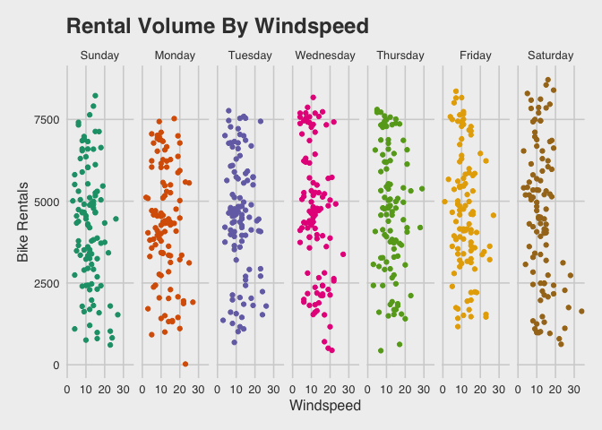

The Bike Rental Boom Is Here
================
Peter Spangler

  - [Motivation: Predicting Bike Rental Behaviour in a Metropolitan
    City](#motivation-predicting-bike-rental-behaviour-in-a-metropolitan-city)
  - [Import data](#import-data)
  - [Wrangle](#wrangle)
  - [Exploratory Data Analysis
    (tables)](#exploratory-data-analysis-tables)
      - [dplyr (\#1)](#dplyr-1)
      - [skimr (\#2)](#skimr-2)
      - [mosaic::inspect (\#3)](#mosaicinspect-3)
      - [Graph1: Bike Rental Volume By
        Temperature](#graph1-bike-rental-volume-by-temperature)
      - [Graph2: Bike Rental Volume By Wind
        Speed](#graph2-bike-rental-volume-by-wind-speed)
      - [Graph3: Bike Rental Density By Holiday vs
        Non-Holiday](#graph3-bike-rental-density-by-holiday-vs-non-holiday)

# Motivation: Predicting Bike Rental Behaviour in a Metropolitan City

> TLDR:

``` r
# packages --------------------------------------------------------------
library(tidyverse)
library(rsample) # data splitting
library(randomForest) # basic implementation
library(ranger) # a faster implementation of randomForest
library(caret) # an aggregator package for performing many machine learning models
library(ggthemes)
library(scales)
library(wesanderson)
library(styler)
```

Bikes have become one of the fastest growing modes of city travel and
transportation disruptors Lyft and Uber have expanded their offerings.
[Lyft’s recent acquisition of
Motivate](https://www.nytimes.com/2018/07/02/business/dealbook/lyft-citibike-motivate-bike-share.html),
the largest bike rental company in the world, will compete with Uber’s
Jump and Ford’s GoBikes which have delivered [625,000 and 1.4 million
rides](https://techcrunch.com/2019/02/08/ubers-jump-bikes-are-seeing-high-utilization-rates/)
in San Francisco, respectively. The growth of alternative forms of
transportation presents a unique challenge for both the companies
offering these services and the cities responding to the scale of
change, particularly in the area of forecasting demand.

“For sure congestion has been getting worse,” said Joe Castiglione,
Transportation Authority deputy director for technology, data, and
analysis. “The question we tried to answer is, do (Uber and Lyft) affect
congestion in San Francisco and by how much?” The answer, the report
said, is “yes” and “by about 50 percent.” -
[source](https://www.sfchronicle.com/business/article/Uber-Lyft-cars-clog-SF-streets-study-says-13309593.php)

*The technique we used to answer these questions* was a gradient
boosting machine (GBM). GBM is similar to other ensemble models in that
it builds improved accuracy by building multiple models.
<!-- The idea of the gradient boosting is to create a series of decision trees, with each new tree attempting to increase its performance over previous decision tree on the misclassified observations. -->
Where GMB is unique compared to other tree algorithms like a random
forest is that it builds models sequentially with higher weights given
to those cases that were badly predicted in previous models. GBM
improves accuracy incrementally instead of simply taking an average of
all models like in random forest. By reducing the error iteratively to
produce what will become the final model, GBM is an efficient and
powerful algorithm for classification and regression problems.
Implementing GBM in R allows for a nice selection of exploratory plots
including parameter contribution, and partial dependence plots which
provide a visual representation of the effect across values of a feature
in the model.

In this article we will use data from Capital Bikeshare available at the
[UCI Machine Learning Repository to model bike rentals from 2011
- 2012](https://archive.ics.uci.edu/ml/datasets/bike+sharing+dataset) in
Washington, D.C. We were curious what the major predictors were for
people renting bikes over the course of the year. The data we have
includes measurements on weather conditions (temperature, humidity, wind
speed, etc.), how many bikes were rented, and other seasonal attributes
that might influence rentals (i.e. weekdays and holidays). Curiously,
riders are more likely to rent a bike after Monday despite temperature
and the likelihood increases on Saturdays when temperatures are between
15 to 25 degrees celsius.

# Import data

``` r
# read data of bike rentals daily ----
bike <- read.csv("day.csv")
```

# Wrangle

The code chunk below prepares the data for modeling. Read through the
comments to understand why each step was taken, and how these variables
get entered into the visualizations and
models.

``` r
# WRANGLE ---------------------------------------------------------------

# recode with labels and make factor
bike <- bike %>%
  mutate(
    weekday_chr =
      case_when(
        weekday == 0 ~ "Sunday",
        weekday == 1 ~ "Monday",
        weekday == 2 ~ "Tuesday",
        weekday == 3 ~ "Wednesday",
        weekday == 4 ~ "Thursday",
        weekday == 5 ~ "Friday",
        weekday == 6 ~ "Saturday",
        TRUE ~ "other"))
# bike %>% 
#   dplyr::count(weekday, weekday_chr) %>% 
#   tidyr::spread(weekday, n)

# Weekdays (factor) ---
# test
# bike %>%
#   mutate(
#     weekday_fct = factor(x = weekday,
#              levels = c(0,1,2,3,4,5,6),
#              labels = c("Sunday",
#                        "Monday",
#                        "Tuesday",
#                        "Wednesday",
#                        "Thursday",
#                        "Friday",
#                        "Saturday"))) %>%
#   dplyr::count(weekday, weekday_fct) %>% 
#   tidyr::spread(weekday, n)

# assign 
bike <- bike %>%
  mutate(
    weekday_fct = factor(x = weekday,
             levels = c(0,1,2,3,4,5,6),
             labels = c("Sunday",
                       "Monday",
                       "Tuesday",
                       "Wednesday",
                       "Thursday",
                       "Friday",
                       "Saturday")))
# check
# bike %>% 
#   dplyr::count(weekday, weekday_fct) %>% 
#   tidyr::spread(weekday, n)


# Holidays ----

bike <- bike %>%
  mutate(
    holiday_chr =
      case_when(
        holiday == 0 ~ "Non-Holiday",
        holiday == 1 ~ "Holiday",
        TRUE ~ "other"
      )
  )

# test
# bike %>%
#   mutate(
#     holiday_fct = factor(x = holiday,
#              levels = c(0,1),
#              labels = c("Non-Holiday",
#                        "Holiday"))) %>%
#   dplyr::count(holiday, holiday_fct) %>%
#   tidyr::spread(holiday, n)

# assign
bike <- bike %>%
  mutate(
    holiday_fct = factor(x = holiday,
             levels = c(0,1),
             labels = c("Non-Holiday",
                       "Holiday")))

# verify
# bike %>%
#   dplyr::count(holiday_chr, holiday_fct) %>%
#   tidyr::spread(holiday_chr, n)

# Working days ----

bike <- bike %>%
  mutate(
    workingday_chr =
      case_when(
        workingday == 0 ~ "Non-Working Day",
        workingday == 1 ~ "Working Day",
        TRUE ~ "other"
      )
  )

# test
# bike %>%
#   mutate(
#     workingday_fct = factor(x = workingday,
#              levels = c(0,1),
#              labels = c("Non-Working Day",
#                        "Working Day"))) %>%
#   dplyr::count(workingday, workingday_fct) %>%
#   tidyr::spread(workingday, n)

# assign
bike <- bike %>%
  mutate(
    workingday_fct = factor(x = workingday,
             levels = c(0,1),
             labels = c("Non-Working Day",
                       "Working Day")))

# verify
# bike %>% 
#   dplyr::count(workingday_chr, workingday_fct) %>%
#   tidyr::spread(workingday_chr, n)


# Seasons

bike <- bike %>%
  mutate(
    season_chr =
      case_when(
        season == 1 ~ "Spring",
        season == 2 ~ "Summer",
        season == 3 ~ "Fall",
        season == 4 ~ "Winter",
        TRUE ~ "other"
      )
  )

# test
# bike %>%
#   mutate(
#     season_fct = factor(x = season,
#              levels = c(1, 2, 3, 4),
#              labels = c("Spring",
#                        "Summer",
#                        "Fall",
#                        "Winter"))) %>%
#   dplyr::count(season_chr, season_fct) %>%
#   tidyr::spread(season_chr, n)

# assign
bike <- bike %>%
  mutate(
    season_fct = factor(x = season,
             levels = c(1, 2, 3, 4),
             labels = c("Spring",
                       "Summer",
                       "Fall",
                       "Winter"))) 

# verify
# bike %>%
#   dplyr::count(season_chr, season_fct) %>%
#   tidyr::spread(season_chr, n)


# Weather situation ----

bike <- bike %>%
  mutate(
    weathersit_chr =
      case_when(
        weathersit == 1 ~ "Good",
        weathersit == 2 ~ "Clouds/Mist",
        weathersit == 3 ~ "Rain/Snow/Storm",
        TRUE ~ "other"
      )
  )

# test
# bike %>%
#   mutate(
#     weathersit_fct = factor(x = weathersit,
#              levels = c(1, 2, 3),
#              labels = c("Good",
#                        "Clouds/Mist",
#                        "Rain/Snow/Storm"))) %>%
#   dplyr::count(weathersit, weathersit_fct) %>%
#   tidyr::spread(weathersit, n)

# assign 
bike <- bike %>%
  mutate(
    weathersit_fct = factor(x = weathersit,
             levels = c(1, 2, 3),
             labels = c("Good",
                       "Clouds/Mist",
                       "Rain/Snow/Storm")))
# verify
# bike %>%
#   dplyr::count(weathersit_chr, weathersit_fct) %>%
#   tidyr::spread(weathersit_chr, n)


# Months ----

bike <- bike %>%
  mutate(
    month_chr =
      case_when(
        mnth == 1 ~ "January",
        mnth == 2 ~ "February",
        mnth == 3 ~ "March",
        mnth == 4 ~ "April",
        mnth == 5 ~ "May",
        mnth == 6 ~ "June",
        mnth == 7 ~ "July",
        mnth == 8 ~ "August",
        mnth == 9 ~ "September",
        mnth == 10 ~ "October",
        mnth == 11 ~ "November",
        mnth == 12 ~ "December",
        TRUE ~ "other"
      )
  )

# test
# bike %>%
#   mutate(
#     month_fct = factor(x = mnth,
#              levels = c(1, 2, 3, 4, 5, 6, 7, 8, 9, 10, 11, 12),
#              labels = c("January", "February", "March", "April", "May",
#                         "June", "July", "August", "September", "October",
#                         "November", "December"))) %>%
#   dplyr::count(mnth, month_fct) %>%
#   tidyr::spread(month_fct, n)

# assign
bike <- bike %>%
  mutate(
    month_fct = factor(x = mnth,
             levels = c(1, 2, 3, 4, 5, 6, 7, 8, 9, 10, 11, 12),
             labels = c("January", "February", "March", "April", "May",
                        "June", "July", "August", "September", "October",
                        "November", "December")))

# verify
# bike %>% 
#   dplyr::count(month_chr, month_fct) %>%
#   tidyr::spread(month_fct, n)

# Year ----
bike <- bike %>%
  mutate(
    yr_chr =
      case_when(
        yr == 0 ~ "2011",
        yr == 1 ~ "2012",
        TRUE ~ "other"
      )
  )

# test
# bike %>%
#   mutate(
#     yr_fct = factor(x = yr,
#              levels = c(0, 1),
#              labels = c("2011",
#                        "2012"))) %>%
#   dplyr::count(yr, yr_fct) %>%
#   tidyr::spread(yr, n)

# assign
bike <- bike %>%
  mutate(
    yr_fct = factor(x = yr,
             levels = c(0, 1),
             labels = c("2011",
                       "2012")))
# verify
# bike %>%
#   dplyr::count(yr_chr, yr_fct) %>%
#   tidyr::spread(yr_chr, n)

# normalize temperatures ----
bike <- bike %>%
  mutate(temp = as.integer(temp * (39 - (-8)) + (-8)))

bike <- bike %>%
  mutate(atemp = atemp * (50 - (16)) + (16))

# ~ windspeed ----
bike <- bike %>%
  mutate(windspeed = as.integer(67 * bike$windspeed))

# ~ humidity ----
bike <- bike %>%
  mutate(hum = as.integer(100 * bike$hum))

# ~ convert to date ----
bike <- bike %>%
  mutate(dteday = as.Date(dteday))

# check df
bike %>% dplyr::glimpse(78)
```

    ## Observations: 731
    ## Variables: 30
    ## $ instant        <int> 1, 2, 3, 4, 5, 6, 7, 8, 9, 10, 11, 12, 13, 14, 15, 1…
    ## $ dteday         <date> 2011-01-01, 2011-01-02, 2011-01-03, 2011-01-04, 201…
    ## $ season         <int> 1, 1, 1, 1, 1, 1, 1, 1, 1, 1, 1, 1, 1, 1, 1, 1, 1, 1…
    ## $ yr             <int> 0, 0, 0, 0, 0, 0, 0, 0, 0, 0, 0, 0, 0, 0, 0, 0, 0, 0…
    ## $ mnth           <int> 1, 1, 1, 1, 1, 1, 1, 1, 1, 1, 1, 1, 1, 1, 1, 1, 1, 1…
    ## $ holiday        <int> 0, 0, 0, 0, 0, 0, 0, 0, 0, 0, 0, 0, 0, 0, 0, 0, 1, 0…
    ## $ weekday        <int> 6, 0, 1, 2, 3, 4, 5, 6, 0, 1, 2, 3, 4, 5, 6, 0, 1, 2…
    ## $ workingday     <int> 0, 0, 1, 1, 1, 1, 1, 0, 0, 1, 1, 1, 1, 1, 0, 0, 0, 1…
    ## $ weathersit     <int> 2, 2, 1, 1, 1, 1, 2, 2, 1, 1, 2, 1, 1, 1, 2, 1, 2, 2…
    ## $ temp           <int> 8, 9, 1, 1, 2, 1, 1, 0, -1, 0, 0, 0, 0, 0, 2, 2, 0, …
    ## $ atemp          <dbl> 28.36325, 28.02713, 22.43977, 23.21215, 23.79518, 23…
    ## $ hum            <int> 80, 69, 43, 59, 43, 51, 49, 53, 43, 48, 68, 59, 47, …
    ## $ windspeed      <int> 10, 16, 16, 10, 12, 6, 11, 17, 24, 14, 8, 20, 20, 8,…
    ## $ casual         <int> 331, 131, 120, 108, 82, 88, 148, 68, 54, 41, 43, 25,…
    ## $ registered     <int> 654, 670, 1229, 1454, 1518, 1518, 1362, 891, 768, 12…
    ## $ cnt            <int> 985, 801, 1349, 1562, 1600, 1606, 1510, 959, 822, 13…
    ## $ weekday_chr    <chr> "Saturday", "Sunday", "Monday", "Tuesday", "Wednesda…
    ## $ weekday_fct    <fct> Saturday, Sunday, Monday, Tuesday, Wednesday, Thursd…
    ## $ holiday_chr    <chr> "Non-Holiday", "Non-Holiday", "Non-Holiday", "Non-Ho…
    ## $ holiday_fct    <fct> Non-Holiday, Non-Holiday, Non-Holiday, Non-Holiday, …
    ## $ workingday_chr <chr> "Non-Working Day", "Non-Working Day", "Working Day",…
    ## $ workingday_fct <fct> Non-Working Day, Non-Working Day, Working Day, Worki…
    ## $ season_chr     <chr> "Spring", "Spring", "Spring", "Spring", "Spring", "S…
    ## $ season_fct     <fct> Spring, Spring, Spring, Spring, Spring, Spring, Spri…
    ## $ weathersit_chr <chr> "Clouds/Mist", "Clouds/Mist", "Good", "Good", "Good"…
    ## $ weathersit_fct <fct> Clouds/Mist, Clouds/Mist, Good, Good, Good, Good, Cl…
    ## $ month_chr      <chr> "January", "January", "January", "January", "January…
    ## $ month_fct      <fct> January, January, January, January, January, January…
    ## $ yr_chr         <chr> "2011", "2011", "2011", "2011", "2011", "2011", "201…
    ## $ yr_fct         <fct> 2011, 2011, 2011, 2011, 2011, 2011, 2011, 2011, 2011…

-----

# Exploratory Data Analysis (tables)

Three options for summarizing the `bike` table.

## dplyr (\#1)

``` r
# create exploratory analysis table for continuous data
bike_dplyr_summary <- bike %>%
  select(temp, atemp, hum, windspeed, casual, registered, cnt) %>%
  summarise_each(list(
    min = ~min,
    q25 = ~quantile(., 0.25),
    median = ~median,
    q75 = ~quantile(., 0.75),
    max = ~max,
    mean = ~mean,
    sd = ~sd
  )) %>%
  gather(stat, val) %>%
  separate(stat, 
           into = c("var", "stat"), 
           sep = "_") %>%
  spread(stat, val) %>%
  select(var, min, q25, median, q75, max, mean, sd)

knitr::kable(bike_dplyr_summary)
```

| var        |       min |        q25 |     median |        q75 |        max |       mean |          sd |
| :--------- | --------: | ---------: | ---------: | ---------: | ---------: | ---------: | ----------: |
| atemp      |  18.68837 |   27.48664 |   32.54892 |   36.69247 |   44.59046 |   32.12804 |    5.540680 |
| casual     |   2.00000 |  315.50000 |  713.00000 | 1096.00000 | 3410.00000 |  848.17647 |  686.622488 |
| cnt        |  22.00000 | 3152.00000 | 4548.00000 | 5956.00000 | 8714.00000 | 4504.34884 | 1937.211452 |
| hum        |   0.00000 |   52.00000 |   62.00000 |   73.00000 |   97.00000 |   62.30643 |   14.242776 |
| registered |  20.00000 | 2497.00000 | 3662.00000 | 4776.50000 | 6946.00000 | 3656.17237 | 1560.256377 |
| temp       | \-5.00000 |    7.00000 |   15.00000 |   22.00000 |   32.00000 |   14.79617 |    8.546779 |
| windspeed  |   1.00000 |    9.00000 |   12.00000 |   15.00000 |   34.00000 |   12.26265 |    5.190293 |

## skimr (\#2)

``` r
# skimr::skim() ----
bike_summary_skim <- bike %>%
  skimr::skim_to_wide() %>%
  dplyr::select(type,
    variable,
    missing,
    complete,
    min,
    max,
    mean,
    sd,
    median = p50,
    hist)
knitr::kable(bike_summary_skim)
```

| type      | variable        | missing | complete | min        | max        | mean    | sd      | median | hist     |
| :-------- | :-------------- | :------ | :------- | :--------- | :--------- | :------ | :------ | :----- | :------- |
| character | holiday\_chr    | 0       | 731      | 7          | 11         | NA      | NA      | NA     | NA       |
| character | month\_chr      | 0       | 731      | 3          | 9          | NA      | NA      | NA     | NA       |
| character | season\_chr     | 0       | 731      | 4          | 6          | NA      | NA      | NA     | NA       |
| character | weathersit\_chr | 0       | 731      | 4          | 15         | NA      | NA      | NA     | NA       |
| character | weekday\_chr    | 0       | 731      | 6          | 9          | NA      | NA      | NA     | NA       |
| character | workingday\_chr | 0       | 731      | 11         | 15         | NA      | NA      | NA     | NA       |
| character | yr\_chr         | 0       | 731      | 4          | 4          | NA      | NA      | NA     | NA       |
| Date      | dteday          | 0       | 731      | 2011-01-01 | 2012-12-31 | NA      | NA      | NA     | NA       |
| factor    | holiday\_fct    | 0       | 731      | NA         | NA         | NA      | NA      | NA     | NA       |
| factor    | month\_fct      | 0       | 731      | NA         | NA         | NA      | NA      | NA     | NA       |
| factor    | season\_fct     | 0       | 731      | NA         | NA         | NA      | NA      | NA     | NA       |
| factor    | weathersit\_fct | 0       | 731      | NA         | NA         | NA      | NA      | NA     | NA       |
| factor    | weekday\_fct    | 0       | 731      | NA         | NA         | NA      | NA      | NA     | NA       |
| factor    | workingday\_fct | 0       | 731      | NA         | NA         | NA      | NA      | NA     | NA       |
| factor    | yr\_fct         | 0       | 731      | NA         | NA         | NA      | NA      | NA     | NA       |
| integer   | casual          | 0       | 731      | NA         | NA         | 848.18  | 686.62  | 713    | ▇▇▅▂▁▁▁▁ |
| integer   | cnt             | 0       | 731      | NA         | NA         | 4504.35 | 1937.21 | 4548   | ▂▅▅▇▇▅▅▂ |
| integer   | holiday         | 0       | 731      | NA         | NA         | 0.029   | 0.17    | 0      | ▇▁▁▁▁▁▁▁ |
| integer   | hum             | 0       | 731      | NA         | NA         | 62.31   | 14.24   | 62     | ▁▁▁▃▇▇▅▂ |
| integer   | instant         | 0       | 731      | NA         | NA         | 366     | 211.17  | 366    | ▇▇▇▇▇▇▇▇ |
| integer   | mnth            | 0       | 731      | NA         | NA         | 6.52    | 3.45    | 7      | ▇▅▇▃▅▇▅▇ |
| integer   | registered      | 0       | 731      | NA         | NA         | 3656.17 | 1560.26 | 3662   | ▁▅▅▆▇▅▃▃ |
| integer   | season          | 0       | 731      | NA         | NA         | 2.5     | 1.11    | 3      | ▇▁▇▁▁▇▁▇ |
| integer   | temp            | 0       | 731      | NA         | NA         | 14.8    | 8.55    | 15     | ▁▅▇▇▆▆▇▂ |
| integer   | weathersit      | 0       | 731      | NA         | NA         | 1.4     | 0.54    | 1      | ▇▁▁▅▁▁▁▁ |
| integer   | weekday         | 0       | 731      | NA         | NA         | 3       | 2       | 3      | ▇▇▇▇▁▇▇▇ |
| integer   | windspeed       | 0       | 731      | NA         | NA         | 12.26   | 5.19    | 12     | ▂▇▇▆▂▁▁▁ |
| integer   | workingday      | 0       | 731      | NA         | NA         | 0.68    | 0.47    | 1      | ▃▁▁▁▁▁▁▇ |
| integer   | yr              | 0       | 731      | NA         | NA         | 0.5     | 0.5     | 1      | ▇▁▁▁▁▁▁▇ |
| numeric   | atemp           | 0       | 731      | NA         | NA         | 32.13   | 5.54    | 32.55  | ▁▅▇▇▇▇▆▁ |

## mosaic::inspect (\#3)

``` r
# mosaic::inspect -----------------------------------------------------
bike_inspect <- mosaic::inspect(bike)
# categorical
knitr::kable(bike_inspect$categorical)
```

| name            | class     | levels |   n | missing | distribution                        |
| :-------------- | :-------- | -----: | --: | ------: | :---------------------------------- |
| weekday\_chr    | character |      7 | 731 |       0 | Monday (14.4%), Saturday (14.4%) …  |
| weekday\_fct    | factor    |      7 | 731 |       0 | Sunday (14.4%), Monday (14.4%) …    |
| holiday\_chr    | character |      2 | 731 |       0 | Non-Holiday (97.1%), Holiday (2.9%) |
| holiday\_fct    | factor    |      2 | 731 |       0 | Non-Holiday (97.1%), Holiday (2.9%) |
| workingday\_chr | character |      2 | 731 |       0 | Working Day (68.4%) …               |
| workingday\_fct | factor    |      2 | 731 |       0 | Working Day (68.4%) …               |
| season\_chr     | character |      4 | 731 |       0 | Fall (25.7%), Summer (25.2%) …      |
| season\_fct     | factor    |      4 | 731 |       0 | Fall (25.7%), Summer (25.2%) …      |
| weathersit\_chr | character |      3 | 731 |       0 | Good (63.3%), Clouds/Mist (33.8%) … |
| weathersit\_fct | factor    |      3 | 731 |       0 | Good (63.3%), Clouds/Mist (33.8%) … |
| month\_chr      | character |     12 | 731 |       0 | August (8.5%), December (8.5%) …    |
| month\_fct      | factor    |     12 | 731 |       0 | January (8.5%), March (8.5%) …      |
| yr\_chr         | character |      2 | 731 |       0 | 2012 (50.1%), 2011 (49.9%)          |
| yr\_fct         | factor    |      2 | 731 |       0 | 2012 (50.1%), 2011 (49.9%)          |

``` r
# categorical
knitr::kable(bike_inspect$Date)
```

| name   | class | first      | last       | min\_diff | max\_diff |   n | missing |
| :----- | :---- | :--------- | :--------- | :-------- | :-------- | --: | ------: |
| dteday | Date  | 2011-01-01 | 2012-12-31 | 1 days    | 1 days    | 731 |       0 |

``` r
# categorical
knitr::kable(bike_inspect$quantitative)
```

| name       | class   |       min |         Q1 |     median |         Q3 |        max |         mean |           sd |   n | missing |
| :--------- | :------ | --------: | ---------: | ---------: | ---------: | ---------: | -----------: | -----------: | --: | ------: |
| instant    | integer |   1.00000 |  183.50000 |  366.00000 |  548.50000 |  731.00000 |  366.0000000 |  211.1658116 | 731 |       0 |
| season     | integer |   1.00000 |    2.00000 |    3.00000 |    3.00000 |    4.00000 |    2.4965800 |    1.1108071 | 731 |       0 |
| yr         | integer |   0.00000 |    0.00000 |    1.00000 |    1.00000 |    1.00000 |    0.5006840 |    0.5003419 | 731 |       0 |
| mnth       | integer |   1.00000 |    4.00000 |    7.00000 |   10.00000 |   12.00000 |    6.5198358 |    3.4519128 | 731 |       0 |
| holiday    | integer |   0.00000 |    0.00000 |    0.00000 |    0.00000 |    1.00000 |    0.0287278 |    0.1671547 | 731 |       0 |
| weekday    | integer |   0.00000 |    1.00000 |    3.00000 |    5.00000 |    6.00000 |    2.9972640 |    2.0047869 | 731 |       0 |
| workingday | integer |   0.00000 |    0.00000 |    1.00000 |    1.00000 |    1.00000 |    0.6839945 |    0.4652334 | 731 |       0 |
| weathersit | integer |   1.00000 |    1.00000 |    1.00000 |    2.00000 |    3.00000 |    1.3953488 |    0.5448943 | 731 |       0 |
| temp       | integer | \-5.00000 |    7.00000 |   15.00000 |   22.00000 |   32.00000 |   14.7961696 |    8.5467794 | 731 |       0 |
| atemp      | numeric |  18.68837 |   27.48664 |   32.54892 |   36.69247 |   44.59046 |   32.1280356 |    5.5406801 | 731 |       0 |
| hum        | integer |   0.00000 |   52.00000 |   62.00000 |   73.00000 |   97.00000 |   62.3064295 |   14.2427756 | 731 |       0 |
| windspeed  | integer |   1.00000 |    9.00000 |   12.00000 |   15.00000 |   34.00000 |   12.2626539 |    5.1902926 | 731 |       0 |
| casual     | integer |   2.00000 |  315.50000 |  713.00000 | 1096.00000 | 3410.00000 |  848.1764706 |  686.6224883 | 731 |       0 |
| registered | integer |  20.00000 | 2497.00000 | 3662.00000 | 4776.50000 | 6946.00000 | 3656.1723666 | 1560.2563770 | 731 |       0 |
| cnt        | integer |  22.00000 | 3152.00000 | 4548.00000 | 5956.00000 | 8714.00000 | 4504.3488372 | 1937.2114516 | 731 |       0 |

Bike riders have the opportunity to avoid many of the limitations of car
traffic–bikers can ride in special travel lanes, they can quickly move
between vehicles, and can avoid the road altogether by riding on the
sidewalk. However, unlike rideshare passengers, bikers are vulnerable to
weather conditions, and this might impact their likelihood of choosing a
bike over other transportation options.

If weather conditions are influential in transportation decisions, we
would expect to see relationships between the number of bike rentals and
weather features including temperature, humidity and wind speed.

## Graph1: Bike Rental Volume By Temperature

``` r
# ~ rentals by temperature ----
ggRentalsByTemp <- bike %>% 
  ggplot(aes(y = cnt, 
                 x = temp, 
                 color = weekday_fct)) +
  geom_point(show.legend = FALSE) +
  geom_smooth(se = FALSE,
              show.legend = FALSE) +
  facet_grid(~weekday_fct) +
  scale_color_brewer(palette = "Dark2") +
  theme_fivethirtyeight() +
  theme(axis.title = element_text()) +
  ylab("Bike Rentals") +
  xlab("Temperature (°C)") +
  ggtitle("Bike Rental Volume By Temperature")
ggRentalsByTemp
```

    ## `geom_smooth()` using method = 'loess' and formula 'y ~ x'

<!-- -->

``` r
`geom_smooth()` using method = 'loess' and formula 'y ~ x'
```

## Graph2: Bike Rental Volume By Wind Speed

``` r
# ggRentalVolByWindSpeed ----
ggRentalVolByWindSpeed <- ggplot(bike) +
  geom_point(aes(y = cnt, 
                 x = windspeed, 
                 color = weekday_fct),
             show.legend = FALSE) +
  facet_grid(~weekday_fct) +
  scale_color_brewer(palette = "Dark2") +
  theme_fivethirtyeight() +
  theme(axis.title = element_text()) +
  ylab("Bike Rentals") +
  xlab("Windspeed") +
  ggtitle("Rental Volume By Windspeed")
ggRentalVolByWindSpeed
```

<!-- -->

Weather features appear to be drivers of rental behavior, where higher
temperatures show more rentals and higher windspeed resulted in fewer
rentals.

We can think of holidays as more opportunities for riders to choose
other forms of transportation, since fewer people drive on holidays.

## Graph3: Bike Rental Density By Holiday vs Non-Holiday
