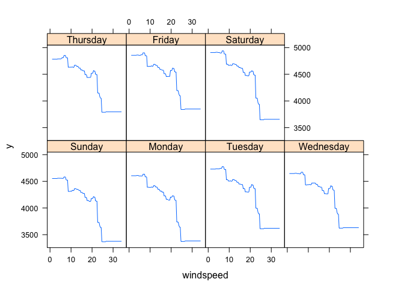
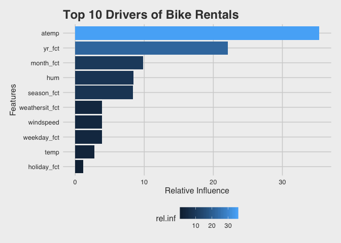

Bike rentals (part 2) - modeling with GBM
================

This tutorial is part 2 of our
[\#tidytuesday](https://www.youtube.com/results?search_query=%23tidytuesday)
post from last week. Check it out
[here.](http://www.storybench.org/exploring-bike-rental-behavior-using-r/)

# Load the packages

The packages below are needed to complete this
analysis.

``` r
# packages --------------------------------------------------------------
library(rsample)      
library(caret)        
library(ggthemes)
library(scales)
library(wesanderson)
library(tidyverse)
library(gbm)
library(Metrics)
library(here)
```

Run previous scripts to import and wrangle data.

``` r
# fs::dir_ls("code")
base::source("code/01-import.R")
base::source("code/02.3-wrangle.R")
base::source("code/03.3-visualize.R") # we don't neeed to run 03-vizualize.R,
# because it does not change the underlying data structure, but we wantto view 
# the EDA outputs
```

## What did we learn?

The EDA showed us that Bike rentals seem to drop off at a certain
temperature (\~20˚C).

``` r
ggRentalsByTemp
```

    ## `geom_smooth()` using method = 'loess' and formula 'y ~ x'

<!-- -->

And that rentals were lower on holidays compared to non-holidays.

``` r
ggRentalVolByHoliday
```

<!-- -->

Now that we have some understanding of the variables in `BikeData`, we
can use the [Generalized Boosted Regression Models (`gbm`)
package](https://cran.r-project.org/web/packages/gbm/index.html) to
model the bike rental data.

## The data

Check for the data in our working environment.

``` r
BikeData %>% glimpse()
```

    ## Observations: 731
    ## Variables: 30
    ## $ weekday        <int> 6, 0, 1, 2, 3, 4, 5, 6, 0, 1, 2, 3, 4, 5, 6, 0, 1, 2…
    ## $ weekday_chr    <chr> "Saturday", "Sunday", "Monday", "Tuesday", "Wednesda…
    ## $ weekday_fct    <fct> Saturday, Sunday, Monday, Tuesday, Wednesday, Thursd…
    ## $ holiday        <int> 0, 0, 0, 0, 0, 0, 0, 0, 0, 0, 0, 0, 0, 0, 0, 0, 1, 0…
    ## $ holiday_chr    <chr> "Non-Holiday", "Non-Holiday", "Non-Holiday", "Non-Ho…
    ## $ holiday_fct    <fct> Non-Holiday, Non-Holiday, Non-Holiday, Non-Holiday, …
    ## $ season         <int> 1, 1, 1, 1, 1, 1, 1, 1, 1, 1, 1, 1, 1, 1, 1, 1, 1, 1…
    ## $ season_chr     <chr> "Spring", "Spring", "Spring", "Spring", "Spring", "S…
    ## $ season_fct     <fct> Spring, Spring, Spring, Spring, Spring, Spring, Spri…
    ## $ workingday     <int> 0, 0, 1, 1, 1, 1, 1, 0, 0, 1, 1, 1, 1, 1, 0, 0, 0, 1…
    ## $ workingday_chr <chr> "Non-Working Day", "Non-Working Day", "Working Day",…
    ## $ workingday_fct <fct> Non-Working Day, Non-Working Day, Working Day, Worki…
    ## $ month_ord      <ord> Jan, Jan, Jan, Jan, Jan, Jan, Jan, Jan, Jan, Jan, Ja…
    ## $ month_fct      <fct> January, January, January, January, January, January…
    ## $ yr             <int> 0, 0, 0, 0, 0, 0, 0, 0, 0, 0, 0, 0, 0, 0, 0, 0, 0, 0…
    ## $ yr_chr         <chr> "2011", "2011", "2011", "2011", "2011", "2011", "201…
    ## $ yr_fct         <fct> 2011, 2011, 2011, 2011, 2011, 2011, 2011, 2011, 2011…
    ## $ weathersit     <int> 2, 2, 1, 1, 1, 1, 2, 2, 1, 1, 2, 1, 1, 1, 2, 1, 2, 2…
    ## $ weathersit_chr <chr> "Clouds/Mist", "Clouds/Mist", "Good", "Good", "Good"…
    ## $ weathersit_fct <fct> Clouds/Mist, Clouds/Mist, Good, Good, Good, Good, Cl…
    ## $ instant        <int> 1, 2, 3, 4, 5, 6, 7, 8, 9, 10, 11, 12, 13, 14, 15, 1…
    ## $ dteday         <date> 2011-01-01, 2011-01-02, 2011-01-03, 2011-01-04, 201…
    ## $ mnth           <int> 1, 1, 1, 1, 1, 1, 1, 1, 1, 1, 1, 1, 1, 1, 1, 1, 1, 1…
    ## $ temp           <int> 8, 9, 1, 1, 2, 1, 1, 0, -1, 0, 0, 0, 0, 0, 2, 2, 0, …
    ## $ atemp          <dbl> 28.36325, 28.02713, 22.43977, 23.21215, 23.79518, 23…
    ## $ hum            <int> 80, 69, 43, 59, 43, 51, 49, 53, 43, 48, 68, 59, 47, …
    ## $ windspeed      <int> 10, 16, 16, 10, 12, 6, 11, 17, 24, 14, 8, 20, 20, 8,…
    ## $ casual         <int> 331, 131, 120, 108, 82, 88, 148, 68, 54, 41, 43, 25,…
    ## $ registered     <int> 654, 670, 1229, 1454, 1518, 1518, 1362, 891, 768, 12…
    ## $ cnt            <int> 985, 801, 1349, 1562, 1600, 1606, 1510, 959, 822, 13…

## Variables of interest

First we want build a data frame for our model, which includes our
outcome variable `cnt` (the ‘*count of total rental bikes including both
casual and registered*’) and the features we want to help explain:

`season_fct` = Factor w/ 4 levels, “Spring”, “Summer”, “Fall”, “Winter”

`yr_fct` = Factor w/ 2 levels, “2011”, “2012”

`month_fct` = Factor w/ 12 levels, “January”, “February”, “March”,
“April”, “May”, “June”, “July”, “August”, “September”, “October”,
“November”, “December”

`holiday_fct` = Factor w/ 2 levels “Non-Holiday”, “Holiday”

`weekday_fct` = Factor w/ 7 levels, “Sunday”, “Monday”, “Tuesday”,
“Wednesday”, “Thursday”, “Friday”,“Saturday”

`workingday_fct` = Factor w/ 2 levels, “Non-Working Day”, “Working Day”

`weathersit_fct` = Factor w/ 3 levels, “Good”, “Clouds/Mist”,
“Rain/Snow/Storm”

`temp` = int \[1:731\] 8 9 1 1 2 1 1 0 -1 0

`atemp` = num \[1:731\] 28.4 28 22.4 23.2 23.8 ..

`hum` = int \[1:731\] 80 69 43 59 43 51 49 53 43 48 …

`windspeed` = int \[1:731\] 10 16 16 10 12 6 11 17 24 14 …

``` r
BikeDataModel <- BikeData %>% select(cnt,
                season_fct,
                yr_fct,
                month_fct,
                holiday_fct,
                weekday_fct,
                workingday_fct,
                weathersit_fct,
                temp,
                atemp,
                hum,
                windspeed)
BikeDataModel %>% dplyr::glimpse(78)
```

    ## Observations: 731
    ## Variables: 12
    ## $ cnt            <int> 985, 801, 1349, 1562, 1600, 1606, 1510, 959, 822, 13…
    ## $ season_fct     <fct> Spring, Spring, Spring, Spring, Spring, Spring, Spri…
    ## $ yr_fct         <fct> 2011, 2011, 2011, 2011, 2011, 2011, 2011, 2011, 2011…
    ## $ month_fct      <fct> January, January, January, January, January, January…
    ## $ holiday_fct    <fct> Non-Holiday, Non-Holiday, Non-Holiday, Non-Holiday, …
    ## $ weekday_fct    <fct> Saturday, Sunday, Monday, Tuesday, Wednesday, Thursd…
    ## $ workingday_fct <fct> Non-Working Day, Non-Working Day, Working Day, Worki…
    ## $ weathersit_fct <fct> Clouds/Mist, Clouds/Mist, Good, Good, Good, Good, Cl…
    ## $ temp           <int> 8, 9, 1, 1, 2, 1, 1, 0, -1, 0, 0, 0, 0, 0, 2, 2, 0, …
    ## $ atemp          <dbl> 28.36325, 28.02713, 22.43977, 23.21215, 23.79518, 23…
    ## $ hum            <int> 80, 69, 43, 59, 43, 51, 49, 53, 43, 48, 68, 59, 47, …
    ## $ windspeed      <int> 10, 16, 16, 10, 12, 6, 11, 17, 24, 14, 8, 20, 20, 8,…

## The testing and training split

We want to build training and testing data sets that are representative
of the original `bike` data set. To achieve this, we will randomly
select observations for two subsets of data. We’ll also specify the
sampling process, so we get an equal proportion of bike rentals (`cnt`)
in our `BikeTest` and `BikeTrain` data sets (we’ll randomize our data
into training and test sets with a 70% / 30% split).

The `BikeTrain` has the data we will use to build a model and
demonstrate it’s performance. However, because our goal is to generalize
as much as possible using ‘real world data’, we’ll be testing the model
on data our model *hasn’t* seen (i.e. the `BikeTest` data).

Having testing and training data sets allows us to 1) build and select
the best model, and 2) then assess the final model’s performance using
‘fresh’ data.

``` r
# gbm
set.seed(123)
BikeSplit <- initial_split(BikeDataModel, prop = .7)
BikeTrain <- training(BikeSplit)
BikeTest  <- testing(BikeSplit)
```

We can call the `gbm` function and select a number of parameters
including cross-fold validation.

Cross-fold validation randomly divides our training data into `k` sets
that are relatively equal in size.

Our model will be fit using all the sets with the exclusion of the first
fold. The model error of the fit is estimated with the hold-out sets.

Each set is used to measure the model error and an average is calculated
across the various sets. Shrinkage, interaction depth, `n.minobsinnode`
and `n.trees` can be adjusted for model accuracy using the caret package
in R <http://topepo.github.io/caret/index.html>.

``` r
# model
set.seed(123)
bike_fit_1 <- gbm::gbm(cnt ~., 
             # the formula for the model (recall that the period means, "all 
             # variables in the data set")
             data = BikeTrain, 
             # data set
             verbose = TRUE, 
             # Logical indicating whether or not to print
             #  out progress and performance indicators
             shrinkage = 0.01, 
             # a shrinkage parameter applied to each tree in the expansion. 
             # Also known as the learning rate or step-size reduction; 0.001 
             # to 0.1 usually work, but a smaller learning rate typically 
             # requires more trees.
             interaction.depth = 3, 
             # Integer specifying the maximum depth of each tree (i.e., the 
             # highest level of variable interactions allowed). A value of 1 
             # implies an additive model, a value of 2 implies a model with up
             #  to 2-way interactions
             n.minobsinnode = 5,
             # Integer specifying the minimum number of observations in the 
             # terminal nodes of the trees. Note that this is the actual number 
             # of observations, not the total weight.
             n.trees = 5000, 
             # Integer specifying the total number of trees to fit. This is 
             # equivalent to the number of iterations and the number of basis 
             # functions in the additive expansion.
             cv.folds = 10
             # Number of cross-validation folds to perform. If cv.folds>1 then
             # gbm, in addition to the usual fit, will perform a 
             # cross-validation, calculate an estimate of generalization error
             #  returned in cv.error
             )
```

    ## Distribution not specified, assuming gaussian ...
    ## Iter   TrainDeviance   ValidDeviance   StepSize   Improve
    ##      1  3887192.4522             nan     0.0100 53443.4349
    ##      2  3835212.0554             nan     0.0100 51509.5429
    ##      3  3781613.7580             nan     0.0100 46152.5706
    ##      4  3734439.6068             nan     0.0100 48076.6689
    ##      5  3684049.7222             nan     0.0100 47545.5212
    ##      6  3636533.0042             nan     0.0100 48434.4787
    ##      7  3589347.3456             nan     0.0100 49416.0562
    ##      8  3542140.5753             nan     0.0100 45291.3443
    ##      9  3498481.1653             nan     0.0100 46514.6332
    ##     10  3452261.3980             nan     0.0100 44721.0680
    ##     20  3045972.0342             nan     0.0100 36212.9962
    ##     40  2410474.9952             nan     0.0100 26269.8233
    ##     60  1955433.5618             nan     0.0100 16192.1865
    ##     80  1628469.9457             nan     0.0100 14135.8703
    ##    100  1382018.2395             nan     0.0100 9160.9246
    ##    120  1195831.9887             nan     0.0100 8799.7750
    ##    140  1044843.2360             nan     0.0100 5682.8200
    ##    160   929618.8138             nan     0.0100 4421.8344
    ##    180   836826.9391             nan     0.0100 3159.9133
    ##    200   763780.1593             nan     0.0100 3001.3117
    ##    220   704062.4139             nan     0.0100 2504.7431
    ##    240   652893.5616             nan     0.0100 1449.0387
    ##    260   612269.9808             nan     0.0100 1319.3961
    ##    280   576767.0591             nan     0.0100  479.6245
    ##    300   546468.2581             nan     0.0100  836.7126
    ##    320   519716.0340             nan     0.0100  604.0879
    ##    340   495755.4883             nan     0.0100  443.9041
    ##    360   475030.4327             nan     0.0100  251.6134
    ##    380   456852.9318             nan     0.0100  259.6615
    ##    400   441722.5895             nan     0.0100  322.0955
    ##    420   427193.5043             nan     0.0100  230.5563
    ##    440   413700.3546             nan     0.0100  182.3934
    ##    460   401292.5190             nan     0.0100  252.5115
    ##    480   389855.2195             nan     0.0100   44.6891
    ##    500   380273.3259             nan     0.0100  212.0465
    ##    520   371201.2253             nan     0.0100  199.9030
    ##    540   362883.9669             nan     0.0100  286.8928
    ##    560   355142.3440             nan     0.0100  175.8547
    ##    580   347494.7803             nan     0.0100   99.1315
    ##    600   341527.5409             nan     0.0100 -140.5291
    ##    620   335211.8514             nan     0.0100  -11.9570
    ##    640   329779.8872             nan     0.0100   23.5485
    ##    660   324638.6828             nan     0.0100  -26.1430
    ##    680   319260.8814             nan     0.0100 -162.9274
    ##    700   314709.8623             nan     0.0100 -170.8092
    ##    720   310563.1904             nan     0.0100  -76.4598
    ##    740   306611.8587             nan     0.0100  -85.2787
    ##    760   302971.4708             nan     0.0100 -178.1116
    ##    780   299050.4466             nan     0.0100 -200.0687
    ##    800   295302.4551             nan     0.0100 -239.4807
    ##    820   292191.2653             nan     0.0100 -110.4720
    ##    840   289016.3799             nan     0.0100 -230.7623
    ##    860   286033.7047             nan     0.0100 -242.8895
    ##    880   283269.2669             nan     0.0100 -358.9393
    ##    900   280044.6547             nan     0.0100 -213.1079
    ##    920   277225.7801             nan     0.0100 -277.3342
    ##    940   274302.3895             nan     0.0100 -189.9859
    ##    960   271495.1943             nan     0.0100 -157.6461
    ##    980   268827.2125             nan     0.0100   33.8393
    ##   1000   266664.1279             nan     0.0100 -304.6521
    ##   1020   264760.7435             nan     0.0100 -434.0257
    ##   1040   262475.4741             nan     0.0100   33.5914
    ##   1060   260086.7158             nan     0.0100  -69.2179
    ##   1080   258134.3943             nan     0.0100 -102.7013
    ##   1100   256199.4739             nan     0.0100 -181.3417
    ##   1120   254000.1594             nan     0.0100 -173.2413
    ##   1140   252161.6644             nan     0.0100 -181.7828
    ##   1160   250177.6304             nan     0.0100  -92.7574
    ##   1180   248179.8601             nan     0.0100  -59.7335
    ##   1200   246345.3676             nan     0.0100 -169.0600
    ##   1220   244592.9041             nan     0.0100 -100.6052
    ##   1240   242115.9538             nan     0.0100 -242.7018
    ##   1260   239916.7880             nan     0.0100  -71.5333
    ##   1280   238450.3115             nan     0.0100 -130.0682
    ##   1300   236828.3519             nan     0.0100 -294.1173
    ##   1320   235005.3544             nan     0.0100 -158.6614
    ##   1340   232852.6895             nan     0.0100  -39.0217
    ##   1360   231072.9650             nan     0.0100 -144.1016
    ##   1380   229228.9362             nan     0.0100 -303.5302
    ##   1400   227510.2118             nan     0.0100  -10.5100
    ##   1420   225740.4343             nan     0.0100 -114.4190
    ##   1440   224203.9244             nan     0.0100 -168.7355
    ##   1460   222569.5745             nan     0.0100 -133.5032
    ##   1480   221114.4741             nan     0.0100 -120.8710
    ##   1500   219083.4303             nan     0.0100   35.5445
    ##   1520   217045.7031             nan     0.0100 -147.6283
    ##   1540   215713.8340             nan     0.0100 -137.9704
    ##   1560   214081.9863             nan     0.0100  -69.2781
    ##   1580   212904.0607             nan     0.0100 -199.5365
    ##   1600   211524.5224             nan     0.0100 -174.3186
    ##   1620   210218.0034             nan     0.0100  -96.4548
    ##   1640   208607.5561             nan     0.0100 -126.0196
    ##   1660   207018.4134             nan     0.0100 -115.2971
    ##   1680   205670.7221             nan     0.0100 -141.8427
    ##   1700   203874.6916             nan     0.0100  -86.6871
    ##   1720   202468.7684             nan     0.0100 -201.5499
    ##   1740   201053.2656             nan     0.0100  -85.0128
    ##   1760   199803.3182             nan     0.0100 -161.1839
    ##   1780   198321.9031             nan     0.0100 -121.2172
    ##   1800   196808.9356             nan     0.0100  -37.1008
    ##   1820   195539.1600             nan     0.0100  -25.8757
    ##   1840   194297.0382             nan     0.0100 -129.0200
    ##   1860   193077.0839             nan     0.0100    9.6741
    ##   1880   192000.8258             nan     0.0100 -215.2432
    ##   1900   190956.3740             nan     0.0100 -174.2108
    ##   1920   189682.2338             nan     0.0100 -155.5764
    ##   1940   188464.0154             nan     0.0100 -190.5934
    ##   1960   187565.0303             nan     0.0100 -193.8673
    ##   1980   186155.8602             nan     0.0100  -31.9587
    ##   2000   184621.1951             nan     0.0100 -277.3145
    ##   2020   183606.0191             nan     0.0100 -233.3206
    ##   2040   182299.2898             nan     0.0100 -211.9698
    ##   2060   181242.9412             nan     0.0100  -90.6473
    ##   2080   180161.2504             nan     0.0100 -224.4996
    ##   2100   179167.1402             nan     0.0100 -175.2018
    ##   2120   177897.7431             nan     0.0100 -150.6893
    ##   2140   176649.0037             nan     0.0100 -187.4434
    ##   2160   175428.6685             nan     0.0100  -75.6811
    ##   2180   174651.1598             nan     0.0100 -176.0239
    ##   2200   173362.1983             nan     0.0100 -138.4243
    ##   2220   172405.3952             nan     0.0100 -134.3418
    ##   2240   171196.0516             nan     0.0100 -197.3931
    ##   2260   170273.8355             nan     0.0100   -8.4808
    ##   2280   169289.8220             nan     0.0100 -151.8244
    ##   2300   168294.3128             nan     0.0100 -189.2133
    ##   2320   167289.8485             nan     0.0100  -93.7999
    ##   2340   166295.5945             nan     0.0100  -49.3639
    ##   2360   165363.2289             nan     0.0100 -109.1776
    ##   2380   164385.2835             nan     0.0100 -188.8603
    ##   2400   163502.3526             nan     0.0100 -159.9859
    ##   2420   162447.4110             nan     0.0100 -119.7679
    ##   2440   161826.7523             nan     0.0100 -166.0478
    ##   2460   161078.3728             nan     0.0100 -149.6711
    ##   2480   160342.9890             nan     0.0100  -95.2660
    ##   2500   159350.2048             nan     0.0100 -116.4788
    ##   2520   158445.9040             nan     0.0100  -62.8042
    ##   2540   157580.7651             nan     0.0100 -116.4722
    ##   2560   156752.0348             nan     0.0100 -167.9255
    ##   2580   156007.3155             nan     0.0100 -150.8977
    ##   2600   155131.4826             nan     0.0100 -102.4069
    ##   2620   154284.2026             nan     0.0100  -90.6507
    ##   2640   153459.5469             nan     0.0100 -144.7513
    ##   2660   152844.1690             nan     0.0100  -93.4920
    ##   2680   152078.1573             nan     0.0100 -122.7435
    ##   2700   151322.3318             nan     0.0100 -122.8871
    ##   2720   150578.1007             nan     0.0100 -132.3230
    ##   2740   149949.1768             nan     0.0100 -149.5255
    ##   2760   149343.0046             nan     0.0100 -190.8255
    ##   2780   148542.2014             nan     0.0100  -68.9634
    ##   2800   148000.7251             nan     0.0100 -133.4034
    ##   2820   147477.6765             nan     0.0100 -180.8274
    ##   2840   146461.0999             nan     0.0100 -105.8105
    ##   2860   145529.1608             nan     0.0100  -57.2629
    ##   2880   144831.7710             nan     0.0100  -79.6833
    ##   2900   144093.6251             nan     0.0100  -65.3389
    ##   2920   143401.2705             nan     0.0100 -105.6778
    ##   2940   142646.0261             nan     0.0100 -130.0619
    ##   2960   142001.5876             nan     0.0100 -141.5228
    ##   2980   141267.6040             nan     0.0100  -58.3057
    ##   3000   140657.4693             nan     0.0100 -196.9558
    ##   3020   139962.0988             nan     0.0100 -202.1692
    ##   3040   139175.6695             nan     0.0100 -160.5423
    ##   3060   138569.6981             nan     0.0100 -145.0032
    ##   3080   138177.9536             nan     0.0100 -234.2093
    ##   3100   137650.6907             nan     0.0100 -108.8365
    ##   3120   136853.2720             nan     0.0100  -85.3836
    ##   3140   136248.7131             nan     0.0100 -127.1579
    ##   3160   135754.4855             nan     0.0100 -116.5284
    ##   3180   134922.2263             nan     0.0100  -85.6145
    ##   3200   134221.4948             nan     0.0100  -91.1945
    ##   3220   133550.5618             nan     0.0100 -116.5957
    ##   3240   133011.9928             nan     0.0100  -97.5304
    ##   3260   132346.8895             nan     0.0100  -90.1110
    ##   3280   131689.3712             nan     0.0100 -101.6936
    ##   3300   131043.6540             nan     0.0100 -100.5506
    ##   3320   130466.3810             nan     0.0100  -77.8563
    ##   3340   129863.8945             nan     0.0100 -123.8161
    ##   3360   129327.0863             nan     0.0100 -218.0927
    ##   3380   128694.1736             nan     0.0100  -92.5405
    ##   3400   128020.6598             nan     0.0100  -71.4714
    ##   3420   127501.9949             nan     0.0100  -74.4427
    ##   3440   127021.8562             nan     0.0100  -67.6176
    ##   3460   126420.8942             nan     0.0100  -88.5813
    ##   3480   125864.6940             nan     0.0100 -101.3860
    ##   3500   125424.3314             nan     0.0100  -74.7295
    ##   3520   124750.7686             nan     0.0100  -93.5544
    ##   3540   124203.8736             nan     0.0100  -95.7797
    ##   3560   123576.1137             nan     0.0100  -96.4240
    ##   3580   122985.2367             nan     0.0100  -42.1603
    ##   3600   122326.8132             nan     0.0100  -91.5140
    ##   3620   121730.5041             nan     0.0100 -163.2149
    ##   3640   121127.8364             nan     0.0100  -91.0178
    ##   3660   120676.1819             nan     0.0100 -108.2763
    ##   3680   120097.9122             nan     0.0100 -115.0683
    ##   3700   119464.8582             nan     0.0100 -109.4676
    ##   3720   118900.6416             nan     0.0100 -110.8882
    ##   3740   118393.2175             nan     0.0100 -131.7276
    ##   3760   118017.1879             nan     0.0100 -184.6326
    ##   3780   117458.9222             nan     0.0100  -24.6080
    ##   3800   116956.7751             nan     0.0100  -87.6057
    ##   3820   116417.3606             nan     0.0100  -68.4770
    ##   3840   115862.2274             nan     0.0100  -63.6300
    ##   3860   115459.2855             nan     0.0100  -99.4767
    ##   3880   114828.0558             nan     0.0100  -81.8484
    ##   3900   114404.1417             nan     0.0100 -107.2068
    ##   3920   113971.2483             nan     0.0100 -115.4283
    ##   3940   113382.7809             nan     0.0100 -136.9761
    ##   3960   112956.7632             nan     0.0100 -124.7900
    ##   3980   112428.4315             nan     0.0100  -48.8753
    ##   4000   111934.0074             nan     0.0100  -94.1091
    ##   4020   111432.3893             nan     0.0100  -75.8459
    ##   4040   110991.0245             nan     0.0100 -123.9657
    ##   4060   110482.8465             nan     0.0100  -70.2145
    ##   4080   109946.2203             nan     0.0100  -56.5535
    ##   4100   109487.5561             nan     0.0100  -83.4783
    ##   4120   109074.0174             nan     0.0100  -88.1902
    ##   4140   108691.8407             nan     0.0100 -132.2952
    ##   4160   108311.8779             nan     0.0100 -146.5391
    ##   4180   107826.2492             nan     0.0100  -62.4031
    ##   4200   107393.5821             nan     0.0100 -130.3040
    ##   4220   106934.2847             nan     0.0100 -130.9340
    ##   4240   106527.2864             nan     0.0100  -51.8701
    ##   4260   106111.8368             nan     0.0100  -55.9825
    ##   4280   105625.9042             nan     0.0100 -103.2519
    ##   4300   105294.3722             nan     0.0100 -110.1640
    ##   4320   104875.0602             nan     0.0100  -86.9005
    ##   4340   104432.4886             nan     0.0100 -131.0638
    ##   4360   103985.4362             nan     0.0100  -94.3818
    ##   4380   103620.8786             nan     0.0100  -47.5665
    ##   4400   103212.3970             nan     0.0100  -49.3313
    ##   4420   102719.2160             nan     0.0100  -92.6049
    ##   4440   102267.8403             nan     0.0100  -87.9692
    ##   4460   101929.9100             nan     0.0100  -85.8936
    ##   4480   101601.4746             nan     0.0100  -73.3725
    ##   4500   101161.6034             nan     0.0100  -85.5428
    ##   4520   100620.3843             nan     0.0100  -42.7390
    ##   4540   100227.7272             nan     0.0100  -58.0998
    ##   4560    99877.7830             nan     0.0100 -136.8083
    ##   4580    99574.3027             nan     0.0100  -53.8976
    ##   4600    99205.2504             nan     0.0100  -65.3591
    ##   4620    98812.9020             nan     0.0100 -108.4380
    ##   4640    98443.1140             nan     0.0100 -108.7065
    ##   4660    98115.7068             nan     0.0100 -123.7749
    ##   4680    97819.1369             nan     0.0100 -116.1468
    ##   4700    97439.2438             nan     0.0100  -80.3146
    ##   4720    97030.7721             nan     0.0100  -82.6252
    ##   4740    96730.4130             nan     0.0100  -85.5466
    ##   4760    96400.2874             nan     0.0100  -78.5731
    ##   4780    96033.8805             nan     0.0100  -56.3610
    ##   4800    95709.3001             nan     0.0100  -89.7861
    ##   4820    95372.4863             nan     0.0100  -93.2684
    ##   4840    95007.6334             nan     0.0100  -28.7100
    ##   4860    94711.0045             nan     0.0100  -79.4760
    ##   4880    94328.8504             nan     0.0100  -32.1775
    ##   4900    94051.8843             nan     0.0100  -53.2098
    ##   4920    93735.8334             nan     0.0100 -102.1904
    ##   4940    93373.0476             nan     0.0100 -127.3611
    ##   4960    93060.3340             nan     0.0100  -67.4814
    ##   4980    92729.5076             nan     0.0100  -58.6495
    ##   5000    92450.5528             nan     0.0100  -63.5015

**NOTE:** The `gbm::gbm()` function creates a lot of output (we included
the `verbose = TRUE` argument).

## Store and explore

Now we can inspect the model object (`bike_fit_1`) beginning with the
optimal number of learners that GBM has produced and the error rate.

We can use the `gbm::gbm.perf()` function to see the the error rate at
each number of learners.

``` r
# model performance
perf_gbm1 = gbm.perf(bike_fit_1, method = "cv")
```

<!-- -->

In the visualization below we can see that the blue line represents the
optimal number of trees with our cross validation (`cv`). GBM can be
sensitive to over-fitting, so using the `method = "cv"` in our estimate
protects against this.

``` r
perf_gbm1
```

    ## [1] 1794

We can see that the optimal number of trees is 1794.

## Make predictions

Now we can predict our bike rentals using the `predict()` function with
our test set and the optimal number of trees based on our `perf.gbm1`
estimate.

`RMSE` = The root mean squared error (`RMSE`) is used to measure the
prediction error in our model(s). As the name suggests, these errors are
weighted by means of squaring them. The RMSE is also pretty
straightforward to interpret, because it’s in the same units as our
outcome variable. Additional attractive qualities include the fact
equally captures the overestimates and underestimates, and the misses
are penalized according to their relative size.

`Metrics::rmse` computes the root mean squared error between two numeric
vectors, so we will use it to compare our predicted values with the
residuals to calculate the error of our model.

``` r
bike_prediction_1 <- stats::predict(
                           # the model from above
                          object = bike_fit_1, 
                          # the testing data
                          newdata = BikeTest,
                          # this is the number we calculated above
                          n.trees = perf_gbm1)
rmse_fit1 <- Metrics::rmse(actual = BikeTest$cnt, 
                           predicted = bike_prediction_1)
print(rmse_fit1)
```

    ## [1] 592.5008

GBM offers partial dependency plots to explore the correlations between
a feature in our model and our outcome. For example, you can see in the
graph below that ambient temperature is associated with increased
numbers of bike rentals until close to 35 degrees when riders tend to be
less likely to rent a bike.

``` r
gbm::plot.gbm(bike_fit_1, i.var = 9)
```

<!-- -->

Similarly we can look at the interaction of two features on bike
rentals. Below we can see that riders are more likely to rent a bike
after Monday, despite wind speed.

``` r
gbm::plot.gbm(bike_fit_1, i.var = c(5, 11))
```

<!-- -->

We can visualize the impact of different features on predicting bike
rentals using the relative influence provided by GBM. First we can
summarize our model then assign these data to a `tibble` using
`gbm::summary.gbm()` and passing this to the `tibble::as_tibble()`
function.

``` r
# summarize model
BikeEffects <- tibble::as_tibble(gbm::summary.gbm(bike_fit_1, plotit = FALSE))
BikeEffects %>% utils::head()
```

    ## # A tibble: 6 x 2
    ##   var            rel.inf
    ##   <fct>            <dbl>
    ## 1 atemp            35.3 
    ## 2 yr_fct           22.1 
    ## 3 month_fct         9.81
    ## 4 hum               8.41
    ## 5 season_fct        8.35
    ## 6 weathersit_fct    3.91

This creates a new data set with `var`, a factor variable with the
variables in our model, and `rel.inf`, the relative influence each
variable had on our model predictions.

We can then plot the top ten features by impact using `ggpplot` and our
new data frame containing our model summary (`BikeEffects`).

``` r
# plot effects
BikeEffects %>% 
  # arrange descending to get the top influencers
  dplyr::arrange(desc(rel.inf)) %>%
  # sort to top 10
  dplyr::top_n(10) %>%
  # plot these data using columns
  ggplot(aes(x = forcats::fct_reorder(.f = var, 
                                      .x = rel.inf), 
             y = rel.inf, 
             fill = rel.inf)) +
  geom_col() +
  # flip
  coord_flip() +
  # format
  scale_color_brewer(palette = "Dark2") +
  theme_fivethirtyeight() +
  theme(axis.title = element_text()) + 
  xlab('Features') +
  ylab('Relative Influence') +
  ggtitle("Top 10 Drivers of Bike Rentals")
```

<!-- -->

This let’s us know what is being used for selection: `Selecting by
rel.inf`

We can visualize the distribution of our predicted compared with actual
bike rentals by predicting these values and plotting the difference.

``` r
# Predicted bike rentals
BikeTest$predicted <- base::as.integer(predict(bike_fit_1, 
                                         newdata = BikeTest, 
                                         n.trees = perf_gbm1))

# plot predicted v actual
ggplot(BikeTest) +
  geom_point(aes(y = predicted, 
                 x = cnt, 
                 color = predicted - cnt), alpha = 0.7) +
  # add theme
  theme_fivethirtyeight() +
  # strip text
  theme(axis.title = element_text()) + 
  # add format to labels
  scale_x_continuous(labels = comma) +
  scale_y_continuous(labels = comma) +
  # add axes/legend titles
  scale_color_continuous(name = "Predicted - Actual", 
                         labels = comma) +
  ylab('Predicted Bike Rentals') +
  xlab('Actual Bike Rentals') +
  ggtitle('Predicted vs Actual Bike Rentals') 
```

<!-- -->

We can see that our model did a fairly good job predicting bike rentals.

## What did we learn?

We learned the ambient temperature is the largest influencer for
predicting bike rentals and that rental numbers go down when the
temperature reaches \~35 degrees. We can also see holiday (or
non-holiday) was not much of an influencer for predicting bike rentals.
