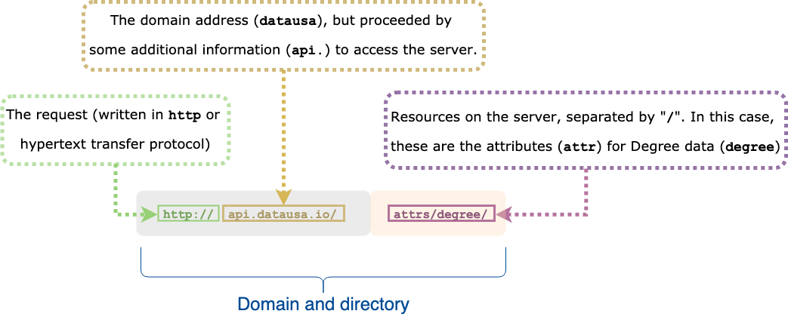
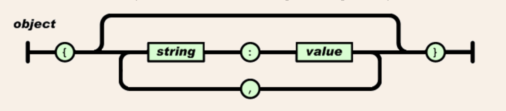
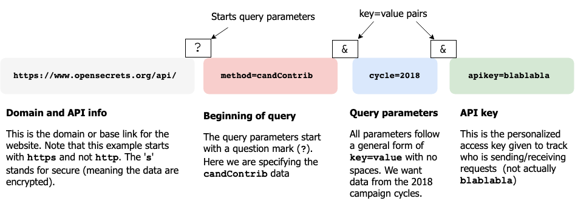
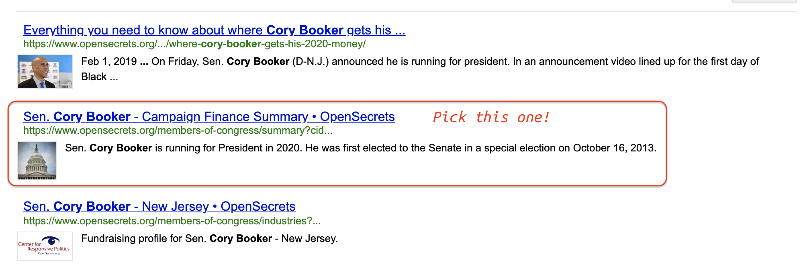
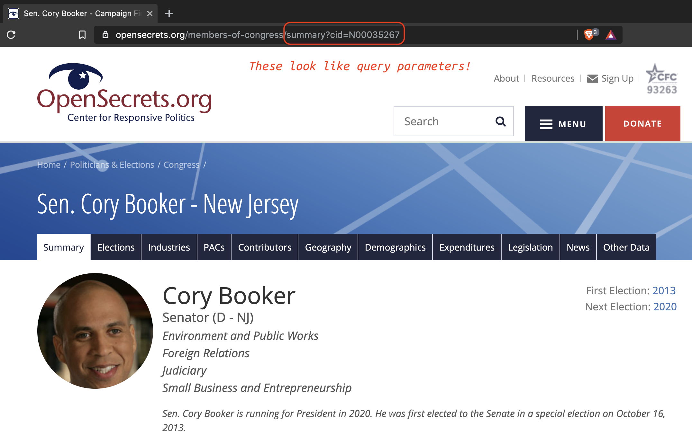
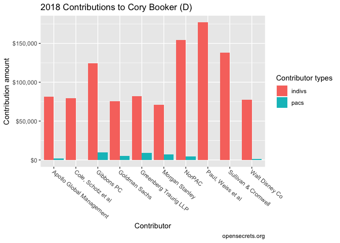

Working with API data in R
================

# Motivation

This tutorial covers collecting data from [application program
interfaces](https://en.wikipedia.org/wiki/Application_programming_interface),
or APIs. Many websites offer an API to accessing their data, like
[Twitter](https://help.twitter.com/en/rules-and-policies/twitter-api),
[Wikipedia](https://www.mediawiki.org/wiki/API:Tutorial),
[Reddit](https://www.reddit.com/dev/api/), and
[OpenSecrets](https://www.opensecrets.org/open-data/api). APIs are a way
for people to access a website’s data in a plain text format using
multiple programming languages (Python, Ruby on Rails, etc.).

## What is an API?

[Website API](https://en.wikipedia.org/wiki/Web_API)s are portals for
accessing structured data from a web server. These requests are sent in
the form of a Hypertext Transfer Protocol, or
[HTTP](https://en.wikipedia.org/wiki/Hypertext_Transfer_Protocol).

## How do we access an API?

Website addresses are constructed following the Uniform Resource Locator
(URL) standard. However, when you’re accessing an API, you’ll usually be
using the Uniform Resource Identifier (URI) standards. These two look
similar, but have a few important differences:

1.  The URIs can include things like `ports` and `query` specifications
2.  We typically use URLs to navigate the internet and render different
    websites, but URIs are used to access *specific* resources via a web
    server (or API)

### API manners and etiquette

When a website has an API, it’s very important to **read all the
documentation**. Most APIs require you to provide an email address, and
some even require a justification for requesting and using their data.
It’s also good manners to make sure you’re not overloading the server
with requests, because this means other people can’t use it.

-----

# Accessing APIs in R with httr

To access data using an API we need to 1) send the HTTP data request
with a specific set of instructions for the web server, and 2) receive
and parse the response, which typically contains the data in either JSON
or XML.

We’ll use the [`httr`
package](https://cran.r-project.org/web/packages/httr/vignettes/quickstart.html)
to access APIs and interact with data requests.

``` r
library(httr)
```

## Ask for data with GET requests

The `httr::GET()` function sends an HTTP `GET` request to a website. The
`httr` package also has a `POST` function, which allows users to
**transmit data to** a web server (provided they have sufficient
permissions). We will cover `POST` requests in a separate tutorial.

## Example 1) the DataUSA.io API

We will start with an example from the [DataUSA.io](https://datausa.io/)
API. Read the documentation
[here](https://github.com/DataUSA/datausa-api/wiki).

As we learned in the wiki, there are two three endpoints in this API:
Data, Attributes, and Search. The first table we will be accessing is
the `Attributes` table, which stores information on the variables in the
`data` table, “*such as their name and profile image*”.

Let’s look into the Degrees (`degree`) attributes by building an API
request as a string vector and placing it inside the `httr::GET()`
function.

**NOTE:** The `httr::GET()` function takes a `url` argument (not a `uri`
argument), but it’s important to know the difference because of specific
purposes they serve. More on this later…

### Putting together your `GET` request

We’ll start by combining the http standard request for APIs with some
specific information from the DataUSA website (`http://api.datausa.io`)
into a single object, `dusa_root_api`.

``` r
dusa_root_api <- "http://api.datausa.io"
```

We then specify two additional components in the API request path:

1.  The attributes (`attrs`) resource for the data we’ll be requesting  
2.  The degrees (`degree`) path or sub-resource from attributes API

These are all separated by a forward slash, `"/"`.

These two portions make up the domain and directory URI.

<!-- -->

Now we’ll combine these using `stringr::str_c()` into a
`dusa_api_attr_geo`.

``` r
# combine these elements
dusa_api_attrs_degree <- stringr::str_c(dusa_root_api,
  # add attributes
  "attrs",
  # add degree data
  "degree",
  # separate by slash (like web URL)
  sep = "/"
)
dusa_api_attrs_degree
```

    ## [1] "http://api.datausa.io/attrs/degree"

By passing the API GET request (`dusa_api_attrs_degree`) to
`httr::GET()` and assigning the output to another object
(`dusa_api_attrs_degree_GET`), we can see the following information gets
provided about our request:

``` r
dusa_api_attrs_degree_GET <- httr::GET(url = dusa_api_attrs_degree)
dusa_api_attrs_degree_GET
```

    ## Response [https://api.datausa.io/attrs/degree/]
    ##   Date: 2019-04-19 19:55
    ##   Status: 200
    ##   Content-Type: application/json
    ##   Size: 428 B

### What is in the httr::GET() results

The following elements are included in this `htrr::GET()` result:

  - `Date` = time and date for the GET request

  - `Status` = Numerical code: `200` is a ‘successful request’, `404` is
    ‘file not found’, `403` is ‘permission denied’

  - `Content-Type` = tells us the data file type from the API. In this
    case `JSON`.

  - `Size` = the size of the data file

This is a high-level overview of what is contained in the request, but
we will have to dig deeper to understand more about extracting the data.

### Check the status of the GET request with httr::http\_status()

It’s also good practice to check the status of an API request with the
`httr::http_status()` function.

``` r
httr::http_status(dusa_api_attrs_degree_GET)
```

    ## $category
    ## [1] "Success"
    ## 
    ## $reason
    ## [1] "OK"
    ## 
    ## $message
    ## [1] "Success: (200) OK"

Now that we can see the `GET` request was successful, we should
double-check the response using `httr::content()` to make sure the data
are what we’re expecting. I want to specify `as = text` to make the
output easier to read.

``` r
httr::content(dusa_api_attrs_degree_GET,
  as = "text"
)
```

    ## No encoding supplied: defaulting to UTF-8.

    ## [1] "{\"data\": [[\"19\", \"Other Doctorate\"], [\"18\", \"Professional Doctorate\"], [\"6\", \"Postbaccalaureate Certificate\"], [\"3\", \"Associate's Degree\"], [\"8\", \"Post-Master's Certificate\"], [\"17\", \"Research Doctorate\"], [\"2\", \"1 to 2 Year Postsecondary Certificate\"], [\"4\", \"2 to 4 Year Postsecondary Certificate\"], [\"5\", \"Bachelor's Degree\"], [\"7\", \"Master's Degree\"], [\"1\", \"< 1 Year Postsecondary Certificate\"]], \"headers\": [\"id\", \"name\"]}"

The message tells me the response is using the default text encoding
(`UTF-8`). The good news is that the data look like college degrees, so
we can be confident the API request is working\!

**How it works:** The `httr::content()` function uses the `Content-Type`
data from `httr::GET()` to determine the best way to parse the incoming
data. In this case, it will call the `jsonlite::fromJSON()` because we
learned the data being returned are `application/json`.

## What is ‘JavaScript Object Notation’ (JSON) data?

Most APIs return data in a [JavaScript Object
Notation](https://json.org/) (JSON) format (pronounced “Jay-son”). The
JSON format is beneficial because 1) it’s a plain text file, and 2) it
doesn’t need to be structured in a tabular data frame (i.e. is can store
‘non-rectangular’ or unstructured text easily).

Below is a schematic of a basic JSON object.



## Reading JSON data into R

We will need to pass `dusa_api_attrs_degree` directly to
`jsonlite::fromJSON()` and check it’s class, we see it is read into R as
a list ()

``` r
library(jsonlite)
degree_attributes <- jsonlite::fromJSON(dusa_api_attrs_degree)
base::class(degree_attributes)
```

    ## [1] "list"

The `degree_attributes` list has two elements, `data` and `headers`.

``` r
degree_attributes %>% str()
```

    ## List of 2
    ##  $ data   : chr [1:11, 1:2] "19" "18" "6" "3" ...
    ##  $ headers: chr [1:2] "id" "name"

We will pass the `data` to `tibble::as_tibble()` and assign the
`headers` to the column names with `magrittr::set_colnames()`.

``` r
DegreeAttr <- tibble::as_tibble(degree_attributes$data) %>%
  magrittr::set_colnames(value = degree_attributes$headers)
DegreeAttr %>% glimpse(78)
```

    ## Observations: 11
    ## Variables: 2
    ## $ id   <chr> "19", "18", "6", "3", "8", "17", "2", "4", "5", "7", "1"
    ## $ name <chr> "Other Doctorate", "Professional Doctorate", "Postbaccalaureat…

Now we’ve converted the contents of the API request to a data frame\!
Let’s repeat this process, but with a slightly more complicated request
from a different API.

# OpenSecrets data

You can send more specific requests using API requests, too. To
demonstrate this, we’ll be using the
[opensecrets.org](https://www.opensecrets.org/) API. This requires you
to sign up for an access key
[here](https://www.opensecrets.org/api/admin/index.php?function=signup).

## API queries

After you’ve signed up and have an API access key, you’ll need to read
up on the documentation for the available data. For this example, I’ll
be downloading the data from the `candContrib` table, which contains
information on the “*top contributors to specified candidate for a House
or Senate seat or member of Congress.*”.

In the documentation, an example API query is presented and I’ve
represented each component in the figure below:

<!-- -->

API queries follow a general syntax (called [query
parameters](https://en.wikipedia.org/wiki/Query_string)) for accessing
various resources on the web server. We will build a new request using
the same method as above,but with a few additional specifications.

### The base domain (API)

The first portion of this should be familiar from the previous request
we built–it contains the http and domain information.

``` r
opensec_root <- stringr::str_c("https://", "www.opensecrets.org/api/")
opensec_root
```

    ## [1] "https://www.opensecrets.org/api/"

Our query will start at the end of the domain api (`opensec_root` in our
case) with a question mark (`?`). Next we will add the data source we
are interested in `candContrib`.

``` r
opensec_candContrib <- stringr::str_c(opensec_root, "?method=candContrib")
opensec_candContrib
```

    ## [1] "https://www.opensecrets.org/api/?method=candContrib"

We will add the cycle information (`cycle`) to limit the amount of data
to the year `2018`.

``` r
opensec_candContrib18 <- stringr::str_c(opensec_candContrib, "&cycle=2018")
opensec_candContrib18
```

    ## [1] "https://www.opensecrets.org/api/?method=candContrib&cycle=2018"

Next we need to specify the kind of data we want the request to return
by including an `output=json` parameter.

``` r
opensec_candContrib18JSON <- stringr::str_c(
  opensec_candContrib18,
  "&output=json"
)
opensec_candContrib18JSON
```

    ## [1] "https://www.opensecrets.org/api/?method=candContrib&cycle=2018&output=json"

Now I will include the API key, which was given to me when I signed up
on opensecrets. This API key should be stored in a separate file, so it
doesn’t get unintentionally shared or distributed.

``` r
# fs::dir_ls("code")
source("code/api-key.R")
```

The `api-key.R` file contains my API key in a string
`opensecrets_api_key` that I can combine with
`opensec_candContrib18JSON`

``` r
opensec_candContrib18JSONapi <- stringr::str_c(
  opensec_candContrib18JSON,
  "&apikey=",
  opensecrets_api_key
)
```

Finally, I’ll include the `cid` which is the unique identifier for
candidates. These are available for download here in the [data
documentation](https://www.opensecrets.org/open-data/api-documentation).
We’ll import the 2018 candidates sheet from this file below.

``` r
library(readxl)
CRPID2018 <- read_excel("meta/CRP_IDs.xls",
  sheet = "Candidate Ids - 2018",
  range = "B14:F3676"
)
CRPID2018 %>% glimpse(78)
```

    ## Observations: 3,662
    ## Variables: 5
    ## $ CID          <chr> "N00034296", "N00040877", "N00040419", "N00041028", "N…
    ## $ CRPName      <chr> "Aalders, Tim", "Aarestad, David", "Abatecola, Bill", …
    ## $ Party        <chr> "3", "D", "R", "D", "D", "D", "R", "R", "D", "R", "D",…
    ## $ DistIDRunFor <chr> "UTS1", "CO06", "AZ03", "AZS2", "MN05", "GA06", "ND01"…
    ## $ FECCandID    <chr> "S2UT00229", "H8CO06237", "H6AZ03245", "S8AZ00122", "H…

I am interested in Cory Booker, so we’ll use this lookup table to try
and find his `cid`.

``` r
CRPID2018 %>%
  dplyr::filter(stringr::str_detect(
    string = CRPName,
    pattern = "Booker"
  ))
```

    ## # A tibble: 1 x 5
    ##   CID       CRPName        Party DistIDRunFor FECCandID
    ##   <chr>     <chr>          <chr> <chr>        <chr>    
    ## 1 N00041440 Booker, Tykiem D     DES1         S8DE00111

This shows a `Tykiem Booker`, but this isn’t who I am looking for.
Fortunately, I just learned a bit about how url’s get built. I will
return to the opensecrets website and search for Cory Booker.

``` r
# fs::dir_ls("images")
knitr::include_graphics("images/open-secrets-search.png")
```

<!-- -->

This gives us the following search results, and I want to choose the
second result down titled, “Sen. Cory Booker - Campaign Finance Summary
• OpenSecrets”.

<!-- -->

I chose this option because I can see `cid` is listed in the url. After
clicking on the link, I can see that the url contains syntax that looks
like the query parameters I’ve been building.

<!-- -->

I can include the `cid=N00035267` in my string vector.

``` r
opensecrets_candContribCall <- stringr::str_c(
  opensec_candContrib18JSONapi,
  "&cid=N00035267"
)
```

## Check the API GET request

Now I can use the `httr::http_status()` function on my
`opensecrets_candContribCall` string.

``` r
httr::http_status(httr::GET(opensecrets_candContribCall))
```

    ## $category
    ## [1] "Success"
    ## 
    ## $reason
    ## [1] "OK"
    ## 
    ## $message
    ## [1] "Success: (200) OK"

Check the status of the `GET` request with `httr::http_status()` and for
any errors with `httr::http_error()`.

``` r
httr::http_error(httr::GET(opensecrets_candContribCall))
```

    ## [1] FALSE

## Pass GET requests directly to fromJSON()

I also have the option to pass my API path to the `jsonlite::fromJSON()`
function. I will store this in the `opensec_json_query` object.

``` r
opensec_json_query <- jsonlite::fromJSON(txt = opensecrets_candContribCall)
utils::str(opensec_json_query)
```

    ## List of 1
    ##  $ response:List of 1
    ##   ..$ contributors:List of 2
    ##   .. ..$ @attributes:List of 6
    ##   .. .. ..$ cand_name: chr "Cory Booker (D)"
    ##   .. .. ..$ cid      : chr "N00035267"
    ##   .. .. ..$ cycle    : chr "2018"
    ##   .. .. ..$ origin   : chr "Center for Responsive Politics"
    ##   .. .. ..$ source   : chr "https://www.opensecrets.org/members-of-congress/contributors?cid=N00035267&cycle=2018"
    ##   .. .. ..$ notice   : chr "The organizations themselves did not donate, rather the money came from the organization's PAC, its individual "| __truncated__
    ##   .. ..$ contributor:'data.frame':   10 obs. of  1 variable:
    ##   .. .. ..$ @attributes:'data.frame':    10 obs. of  4 variables:
    ##   .. .. .. ..$ org_name: chr [1:10] "Paul, Weiss et al" "NorPAC" "Sullivan & Cromwell" "Gibbons PC" ...
    ##   .. .. .. ..$ total   : chr [1:10] "177020" "158871" "138150" "134375" ...
    ##   .. .. .. ..$ pacs    : chr [1:10] "0" "4827" "0" "10000" ...
    ##   .. .. .. ..$ indivs  : chr [1:10] "177020" "154044" "138150" "124375" ...

We can see this is a list of one, and each object inside the list has
data on Cory Booker. If I start investigating the contents of this list,
I can see the actual data are embedded inside a few layers.

This is where RStudio comes in handy. I can use `dplyr::glimpse()` in an
Rmarkdown code chunk to quickly view the multiple objects inside the
`opensec_json_query` list.

``` r
# fs::dir_ls("images")
knitr::include_graphics("images/explore-embedded-list.gif")
```

<!-- -->

As you may have seen, there are two objects with `@attributes` in the
`opensec_json_query` list. The first contains information on our
candidate and is stored in the object below.

``` r
# note the special notation for objects starting with @
opensec_json_query$response$contributors$`@attributes`
```

    ## $cand_name
    ## [1] "Cory Booker (D)"
    ## 
    ## $cid
    ## [1] "N00035267"
    ## 
    ## $cycle
    ## [1] "2018"
    ## 
    ## $origin
    ## [1] "Center for Responsive Politics"
    ## 
    ## $source
    ## [1] "https://www.opensecrets.org/members-of-congress/contributors?cid=N00035267&cycle=2018"
    ## 
    ## $notice
    ## [1] "The organizations themselves did not donate, rather the money came from the organization's PAC, its individual members or employees or owners, and those individuals' immediate families."

We can store this in a tibble using `tibble::as_tibble()`

``` r
CandAttributes <- tibble::as_tibble(opensec_json_query$response$contributors$`@attributes`)
CandAttributes %>% dplyr::glimpse(78)
```

    ## Observations: 1
    ## Variables: 6
    ## $ cand_name <chr> "Cory Booker (D)"
    ## $ cid       <chr> "N00035267"
    ## $ cycle     <chr> "2018"
    ## $ origin    <chr> "Center for Responsive Politics"
    ## $ source    <chr> "https://www.opensecrets.org/members-of-congress/contribu…
    ## $ notice    <chr> "The organizations themselves did not donate, rather the …

The other `@attributes` object is a data frame with four variables:
`org_name`, `total`, `pacs`, `indivs`. I will use the same function to
create a `tibble` from donors and call it `BookContribs`.

``` r
BookContribs <- tibble::as_tibble(opensec_json_query$response$contributors$contributor$`@attributes`)
BookContribs
```

    ## # A tibble: 10 x 4
    ##    org_name                 total  pacs  indivs
    ##    <chr>                    <chr>  <chr> <chr> 
    ##  1 Paul, Weiss et al        177020 0     177020
    ##  2 NorPAC                   158871 4827  154044
    ##  3 Sullivan & Cromwell      138150 0     138150
    ##  4 Gibbons PC               134375 10000 124375
    ##  5 Greenberg Traurig LLP    90710  9000  81710 
    ##  6 Apollo Global Management 83500  2000  81500 
    ##  7 Goldman Sachs            80400  5000  75400 
    ##  8 Cole, Schotz et al       79198  0     79198 
    ##  9 Walt Disney Co           78662  1000  77662 
    ## 10 Morgan Stanley           78120  7000  71120

I want to add a few elements from `BookAttributes` to `BookContribs` and
call it `BookerCont2018`

``` r
BookerCont2018 <- BookContribs %>%
  add_column(
    cand_name = as_vector(CandAttributes$cand_name),
    origin = as_vector(CandAttributes$origin),
    source = as_vector(CandAttributes$source)
  )
BookerCont2018 %>% dplyr::glimpse(78)
```

    ## Observations: 10
    ## Variables: 7
    ## $ org_name  <chr> "Paul, Weiss et al", "NorPAC", "Sullivan & Cromwell", "Gi…
    ## $ total     <chr> "177020", "158871", "138150", "134375", "90710", "83500",…
    ## $ pacs      <chr> "0", "4827", "0", "10000", "9000", "2000", "5000", "0", "…
    ## $ indivs    <chr> "177020", "154044", "138150", "124375", "81710", "81500",…
    ## $ cand_name <chr> "Cory Booker (D)", "Cory Booker (D)", "Cory Booker (D)", …
    ## $ origin    <chr> "Center for Responsive Politics", "Center for Responsive …
    ## $ source    <chr> "https://www.opensecrets.org/members-of-congress/contribu…

Now we can do a little tidying and visualizing to create something that
looks like data on the opensecrets page.

``` r
library(scales)
BookerCont2018 %>%
  # tidy these data
  tidyr::pivot_longer(
    cols = total:indivs,
    names_to = c("cont_type"),
    values_to = "cont_amount"
  ) %>%
  # convert to numeric
  dplyr::mutate(
      # recode missing
    cont_amount = if_else(cont_amount == "0",
      true = NA_character_,
      false = cont_amount),
    # convert to numeric
    cont_amount = as.numeric(cont_amount),
    # factor org_name
    org_name_fct = factor(org_name)
    ) %>% 
  dplyr::filter(cont_type != "total") %>%
  ggplot(data = .) +
  geom_col(aes(x = org_name_fct,
               y = cont_amount,
               fill = cont_type), position = "dodge") + 
    labs(
        title = "2018 Contributions to Cory Booker (D)",
        y = "Contribution amount",
        x = "Contributor",
        caption = "opensecrets.org",
        fill = "Contributor types") +
    theme(axis.text.x = element_text(angle = -40, 
                                     vjust = 0.7, 
                                     hjust = 0)) +
    scale_y_continuous(labels = scales::dollar_format(prefix = "$"))
```

<!-- -->

There we have it\! This looks similar to the data we see on the
[Opensecrets Cory
Booker](https://www.opensecrets.org/members-of-congress/summary?cid=N00035267)
prole page.

# Recap

We’ve walked through how to access API data using `httr` and `jsonlite`
packages. This tutorial only scratched the surface, so be sure to check
out the links below for more details.

  - [jsonlite package
    vignettes](https://cran.r-project.org/web/packages/jsonlite/vignettes/json-apis.html)

  - [httr package
    vignette](https://cran.r-project.org/web/packages/httr/vignettes/quickstart.html)

  - [twitter api data](https://rtweet.info/)

  - [great tutorial on APIs from
    earthdatascience.org](https://www.earthdatascience.org/courses/earth-analytics/get-data-using-apis/API-data-access-r/)
