Creating a static site with blogdown
================
Martin Frigaard
2019-08-02

[`blogdown`](https://bookdown.org/yihui/blogdown/) is an R package that
allows you to create websites from R markdown files using Hugo.
[Hugo](https://gohugo.io/) is an open-source static site generator
written in Go and known for being [incredibly
fast](https://opensource.com/article/17/5/hugo-vs-jekyll).

You can read more about the differences between Wordpress and Hugo (and
other static site generators)
[here](https://www.slant.co/versus/999/1016/~wordpress_vs_hugo),
[here](https://opensource.com/article/17/5/hugo-vs-jekyll), and
[here](http://lambdastack.io/blog/2017/02/01/hugo/).

## Step 1) Read up on blogdown/Hugo resources

I started the process by reading through the first few chapters of the
`blogdown` text. It has a ton of great information, and Yihui, Amber,
and Alison make the information very accessible. I dug into the
[installation
chapter](https://bookdown.org/yihui/blogdown/installation.html), it was
also helpful for me to follow [Alison Presmanes
Hill’s](https://alison.rbind.io/post/up-and-running-with-blogdown/#read-up-on-blogdown)
post.

You’ll also want to install [Homebrew](https://brew.sh/) and make sure
you’ve installed Hugo. The chapter on [using the RStudio
IDE](https://bookdown.org/yihui/blogdown/rstudio-ide.html) to create a
new Website project was also beneficial. There have been many Addins
that make posts easier, too.

## Step 2) Create a Github repository

You’ll need a Github account (it’s free\!) and repository. After you’ve
signed up, the steps for creating a new repository are below:

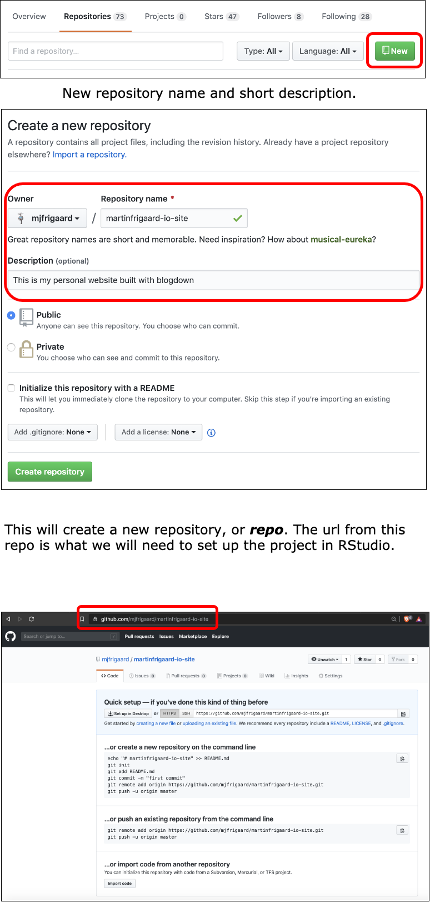<!-- -->

The [URL](https://en.wikipedia.org/wiki/URL) from our new Github repo is
what we’ll use to build our website project with version control.

In RStudio, I select **File** \> **New Project** and follow the steps
below to get this project setup.

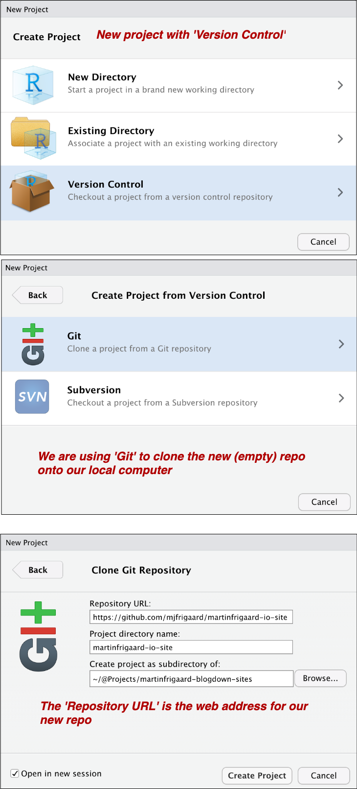<!-- -->

## Step 3) Installing blogdown (and the peripherals)

blogdown is available on CRAN, so I can install it using
`install.packages()`.

``` r
install.packages("blogdown")
```

The code chunk below loads the `blogdown` package.

``` r
library(blogdown)
```

Running `blogdown::update_hugo()` will update your version of Hugo (with
some very verbose output).

``` r
blogdown::update_hugo()
```

You can check the version with `blogdown::hugo_version()`

``` r
blogdown::hugo_version()
```

    ## [1] '0.56.3'

## Step 4) Build a new website

The command for building a website with `blogdown` is `new_site()`.

I changed the default Hugo `theme` to `blackburn` from
[yoshiharuyamashita](https://github.com/yoshiharuyamashita/blackburn).
The description of this argument is below.

> A Hugo theme on Github (a character string of the form `user/repo`,
> and you can optionally specify a GIT branch or tag name after @, i.e.,
> theme can be of the form `user/repo@branch`).

The `blogdown::new_site(theme = "yoshiharuyamashita/blackburn")`
function will create a new site using the `blackburn` theme. That will
generate the following output:

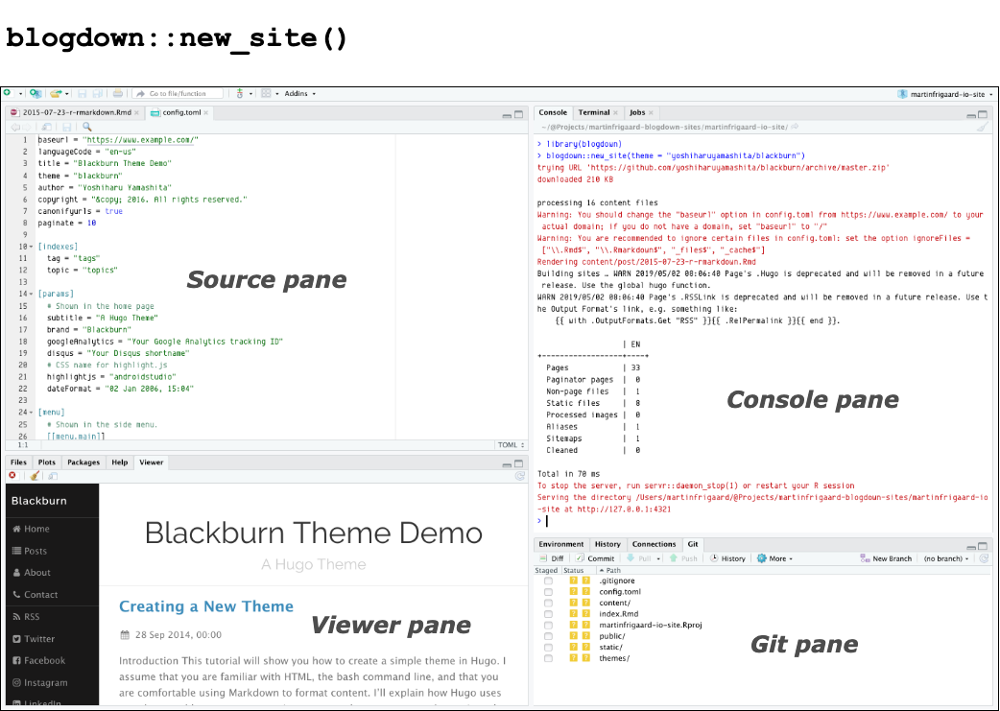<!-- -->

All this output looks like a lot going on, but none of it should
surprise us after reading the text. To recap:

  - The `config.toml` has the global settings for the site in the
    **Source pane** (upper left), read more about this file
    [here](https://bookdown.org/yihui/blogdown/a-quick-example.html)

  - The **Viewer pane** displays the new website (lower left)

  - The **Console pane** displays the commands for creating the site (in
    blue), and a few warnings (in red) and messages (in black). We will
    address these later.

  - The new files for the website are now listed in the **Git pane**
    (the yellow “?” icon shows that these haven’t been added and aren’t
    ready to be committed).

Fortunately, the warnings and messages throughout the site development
process are clear and helpful. I took the advice and changed the
`baseurl` to `"/"` and added `ignoreFiles = ["\\.Rmd$", "\\.Rmarkdown$",
"_files$", "_cache$"]` to the `config.toml` file (just under the
`paginate = 10` option).

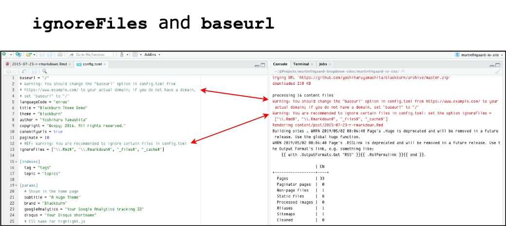<!-- -->

After adding these two options to the `config.toml` file, I changed some
additional fields about my blog (`title`, `subtitle`, and `brand`) and
the social media accounts.

Now I want to serve the site.

## Step 5) Serving the new site

To test if this new site is working, I will use the
`blogdown::serve_site()` function. After running this function, the
website displays the changes for the site in the **Viewer pane**.

``` r
blogdown::serve_site()
```

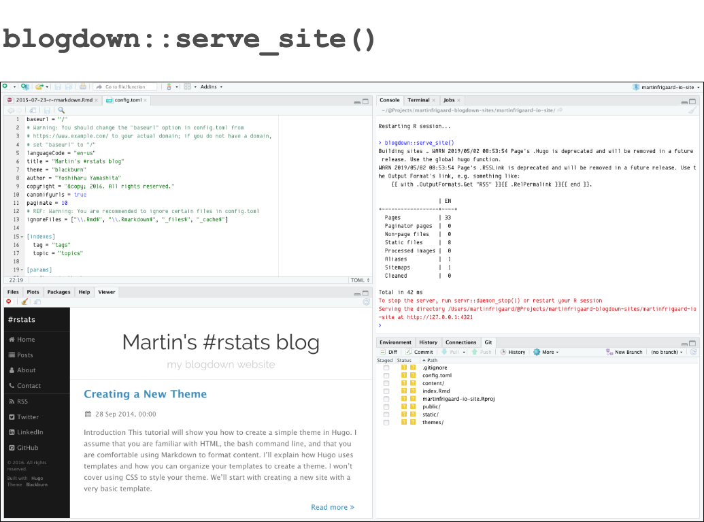<!-- -->

**WARN:** When the site gets served, you’ll see some additional warnings
about the Page’s `.Hugo` and `.RSSLink` being deprecated, but we can
ignore these for now.

``` r
Building sites … WARN 2019/05/01 22:36:50 Page's .Hugo is deprecated and will be removed in a future release. Use the global hugo function.
WARN 2019/05/01 22:36:50 Page's .RSSLink is deprecated and will be removed in a
future release. Use the Output Format's link, e.g. something like: 

    {{ with .OutputFormats.Get "RSS" }}{{ .RelPermalink }}{{ end }}.
```

We will also address these later.

Now that we can see the website is working locally, I’ll need to put
these files into a Github repository so I can deploy them to a domain
and make them discoverable on the internet.

## Step 5) Managing changes with Git

I prefer working with Git via the command line (or the **Terminal** pane
in RStudio). However, all of these steps are also available in the
**Git** pane, too.

For a full guide on using the Git pane in RStudio read this
[article](https://r-bio.github.io/intro-git-rstudio/)

Learn more about Git and reproducible research
[here](https://datacarpentry.org/rr-version-control/).

### 5.1) Check the status of the files in your project

The command you’ll use the most (if you use Git from the command line)
is `git status`. `git status` checks to see what’s going on with the
files in your repository.

``` sh
$ git status
On branch master

No commits yet

Untracked files:
  (use "git add <file>..." to include in what will be committed)

        .gitignore
        config.toml
        content/
        index.Rmd
        martinfrigaard-io-site.Rproj
        public/
        static/
        themes/

nothing added to commit but untracked files present (use "git add" to track)
```

The untracked files are the ones with a yellow question mark in the
image below.

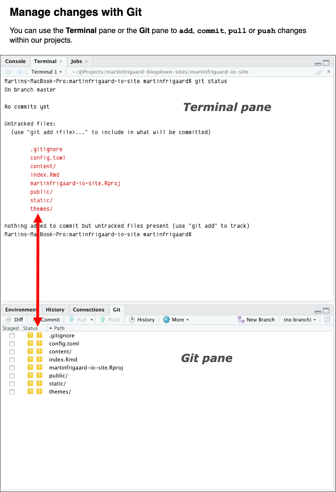<!-- -->

The output shows that Git isn’t tracking the files, and we can change
this with `git add --all`– it’s a ‘going nuclear’ option for monitoring
all of the changed files in a project.

### 5.2) Add the files to be tracked

At the command line, it looks like this:

``` sh
git add --all
```

Then I will use `git status` to check and see what is happening with the
files in this repository.

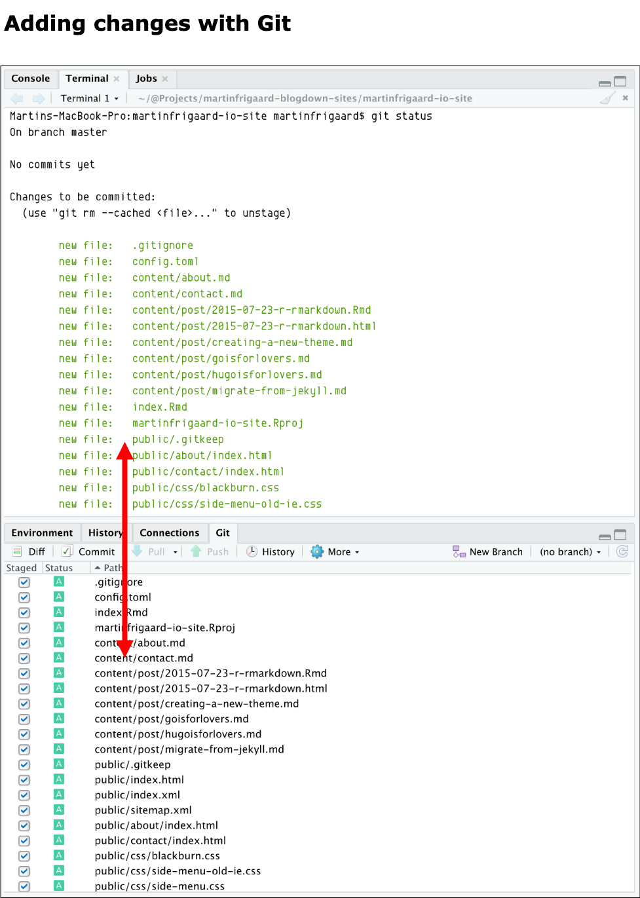<!-- -->

### 5.3) Commit file changes

After adding the files, Git can track them and any changes that happen.
The greenish “A” next to each file with a checked box indicates we’ve
added all of these files. If we want to commit these changes, we can do
that with `git commit -m "first commit "`.

This will show the following output:

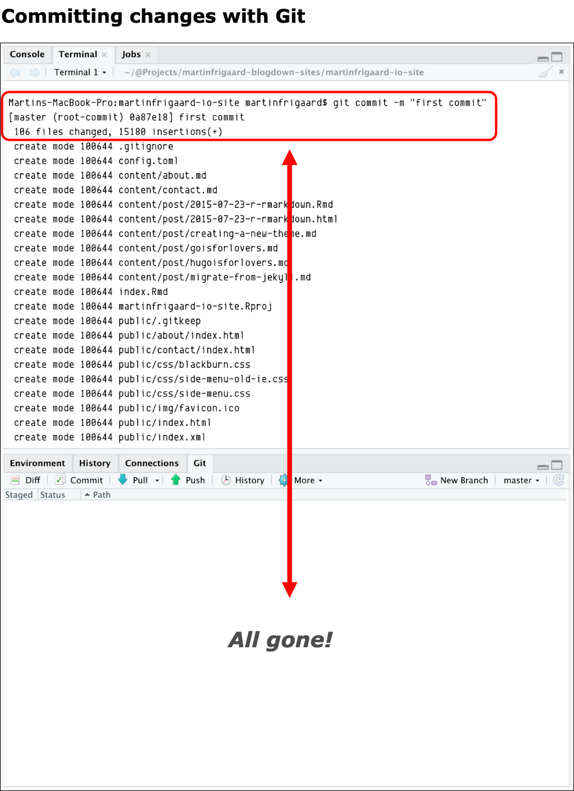<!-- -->

All of the files have been committed, but these files still need to be
pushed to Github. I will show how this is done using the Git interface
in RStudio.

### 5.4) Push files to Github

Pushing the files to Github can be done with `git push` or by using the
Git pane below.

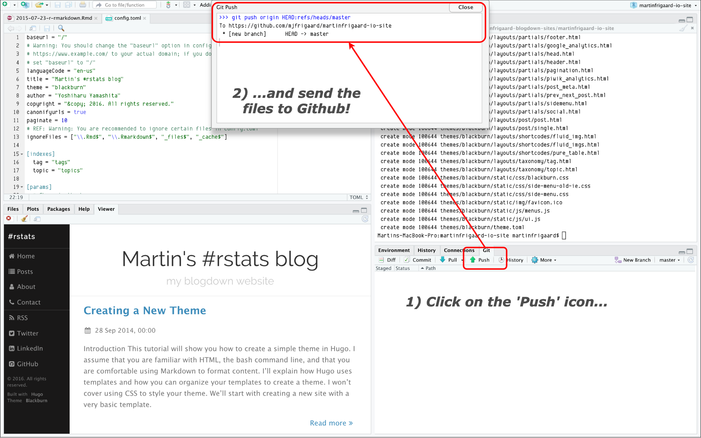<!-- -->

Great\! Now we have a version on Github and our local computer.

To learn more about working with Git in RStudio projects, check out
[Happy Git and Github for the useR](https://happygitwithr.com/).

## Step 6) Netlify

Now that all of our files are on Github, we need a way to convert these
files into a website. `blogdown` sites work with
[Netlify](https://app.netlify.com/), which allows deployed directly from
Github. You can sign up for a Netlify account (also free\!), and sync
the application to your Github account.

You want to authorize Netlify to access your repositories. On the
Netlify website, you can search and locate your website repository for
the site.

The next step is to set the build options. Most of the default options
here are correct, except for the `build` option (leave this blank).

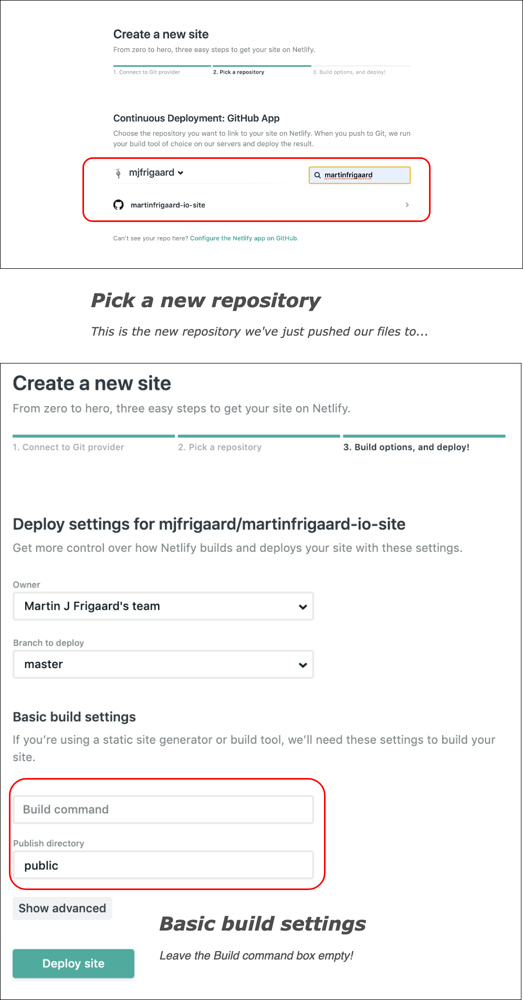<!-- -->

Click on the **Deploy site** and Netlify will put everything together
into a website.

This website gets a random Netlify address (something like
`https://random-words-blablabla.netlify.com/`). In the next section, I
will go over how to change the domain.

## Step 7) Domains

I started by purchasing my domain (`martinfrigaard.io`) from [Google
domains](https://domains.google/#/). Most domains run $12 a year, and
others can be as expensive as $60 per year. There are other options for
purchasing domains, but I went with Google because it was cheapest and
relatively easy to manage multiple websites in one place.

When setting up my domain, I followed the steps on the Netlify site to
configure the DNS.

### DNS configuration

DNS stands for [Domain Name
Servers](https://en.wikipedia.org/wiki/Domain_Name_System). These help
direct web traffic to your website, sort of like the phone book or
yellow pages. We need to change the randomly generated domain name
(`https://random-words-blabla.netlify.com/`) to the domain I’ve
purchased (`https://www.martinfrigaard.io/`).

I can do this by following the instructions on the Netlify website. The
image below shows the necessary parts from Netlify settings I needed to
enter in the DNS settings on the Google Domains dashboard.

Anywhere it says `random-words`, you’ll enter the randomly generated
domain from Netlify. Anywhere it says `###.###.##.##`, you’ll enter the
IP address for your domain.

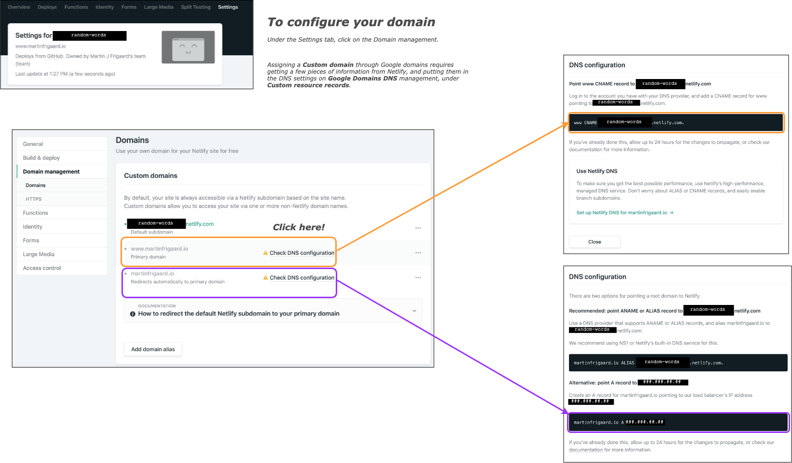<!-- -->

Both of these DNS configurations get added to the Google Domain’s
dashboard, under the **Custom resource records.** The `CNAME` type
configuration is for the primary domain (www.martinfrigaard.io), and the
`A` type is the IP address for redirecting to the primary domain
(`martinfrigaard.io`).

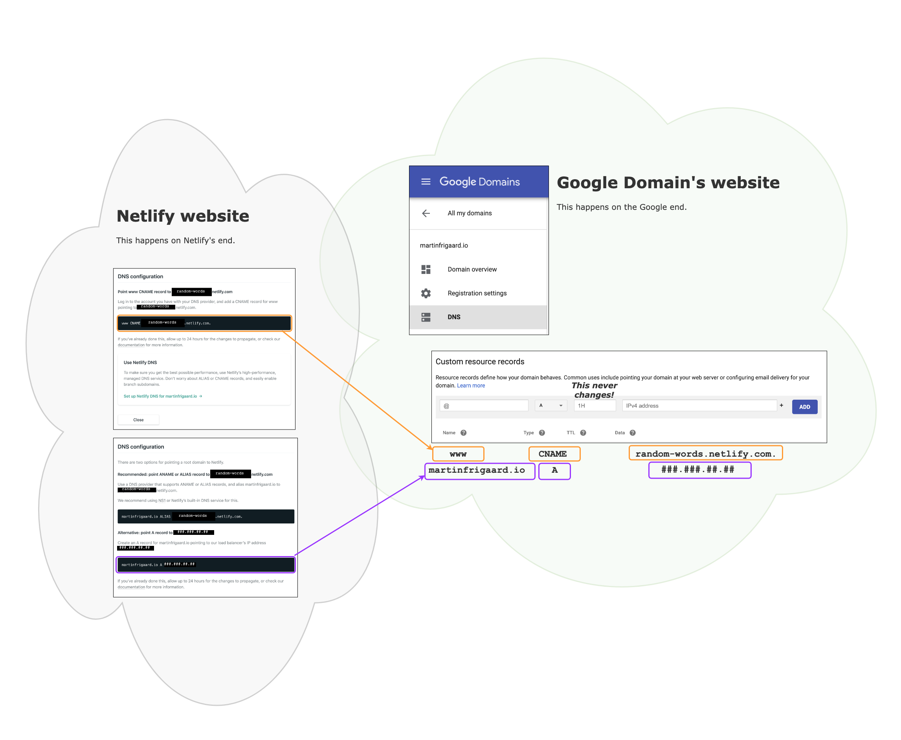<!-- -->

## Step 8) New posts

Now that I have a new website successfully deployed on Netlify and the
martinfrigaard.io domain is working, I should probably post something.
Fortunately, I have a post ready to go on
[RStudio.Cloud](https://rstudio.cloud). This project downloads a table
of World War II fighter pilots from Wikipedia.

The new posts go in the `content` folder. The structure for this folder
is organized according to the options on the sidebar.

I will start by creating a new post using the **Addins**. Clicking on
**New Post** will generate a dialogue box for me to enter the title.
After entering the **Title**, I see the file path and name get made in
the **Filename** portion–telling me where the new file is being created.

I also wanted to write in Rmarkdown, so I selected `.Rmd` in the
**Format** section.

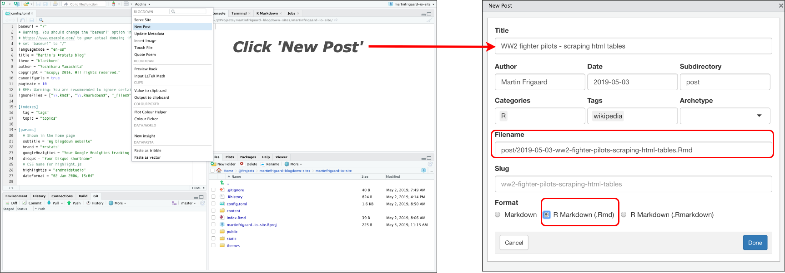<!-- -->

This opens a new .Rmd file in the RStudio source pane. After writing a
portion of my blogpost, I decide I need to insert an image. Fortunately,
`blogdown` has an option for this under the **Addins** too.

I navigate to the file on my computer, determine the display size, and
insert some text for the title of the image. All of this gets converted
into markdown in the source `.Rmd` file. If I look in the console, I see
a message telling me the image has been added to
`static/post/2019-05-03-ww2-fighter-pilots-scraping-html-tables_files/`
folder.

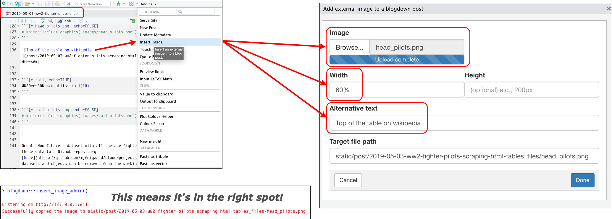<!-- -->

Next, we need to manage the changes with Git. First, we can check with
`git status` in Terminal. These files are also visible in the Git
pane–we can add the changes using the Git pane (clicking the small
checkbox and then clicking ‘Commit’).

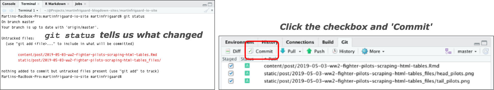<!-- -->

This opens RStudio’s Git management window. I enter a message in the
‘**Commit message**’ window, click ‘**Commit**’, and watch the changes
get tracked.

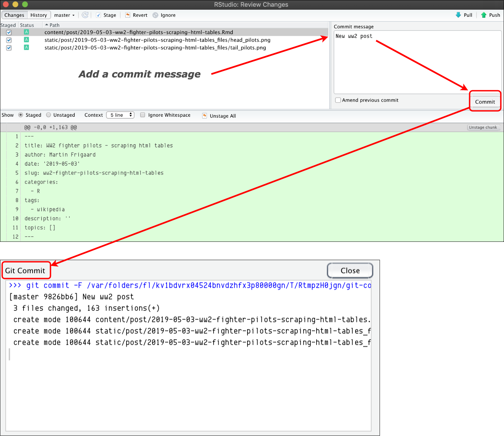<!-- -->

Now that these changes have been committed, we need to see how things
will look on the website. I can check using `blogdown::serve_site()`.

`blogdown::serve_site()` renders the following output in the
‘**Console**’ and ‘**Viewer**’,

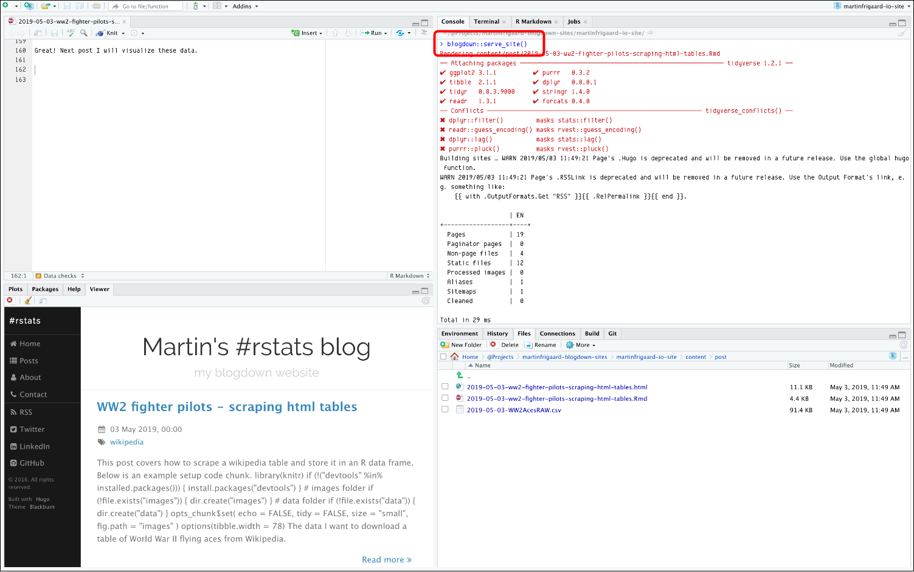<!-- -->

It worked\!

I will repeat the Git processes (adding and committing any changes
generated from `blogdown::serve_site()`), but I also want to make sure I
push these changes to the Github repository, so they end up on the
website.

I can do this by clicking on the ‘**Push**’ icon and waiting for the
message to tell me that the changes have been pushed to Github (`HEAD ->
master`)

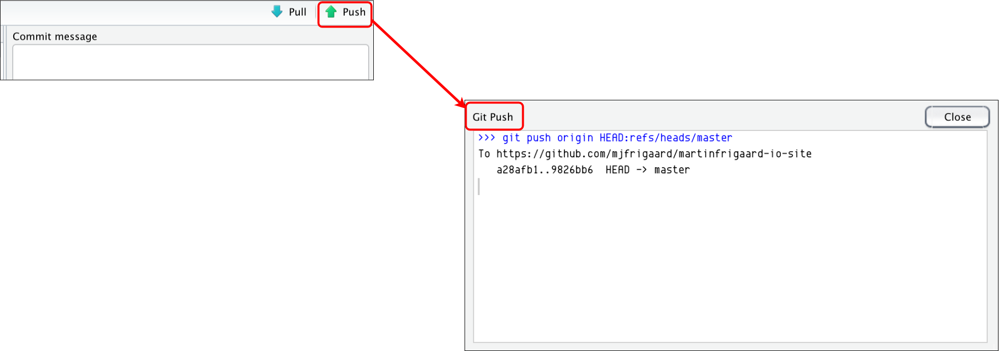<!-- -->

If I navigate to the domain I should see the new post I just created.

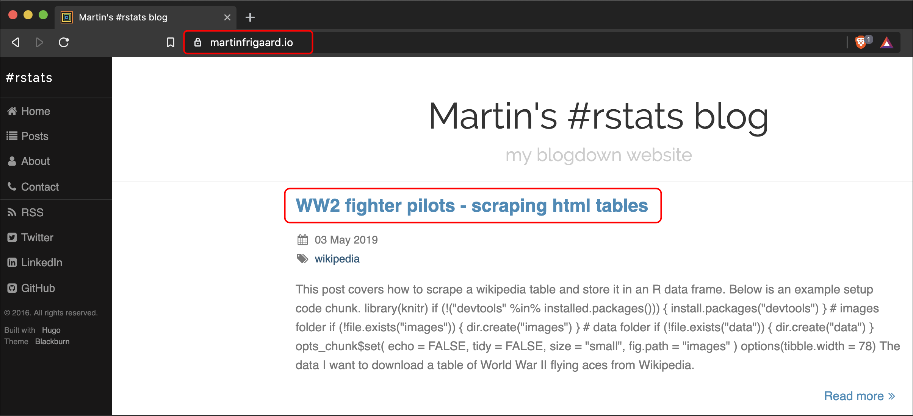<!-- -->
