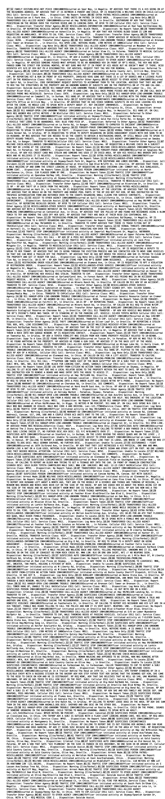

Web scraping
========


# Part 1: United States Anti-Doping Agency Sanction Data - download

## Motivation

Create a database of US anti-doping agency (USADA) data for athletes and
the sports they participate in.

## The Data

These data comes from the Sanctions table on the USADA
[website.](https://www.usada.org/testing/results/sanctions/)

-----

In order to extract data from the website, I’ll be using the `rvest`
[package](https://cran.r-project.org/web/packages/rvest/index.html)
written by Hadley Wickham to scrape the `html` code. The code chunk
below loads the packages needed to reproduce the graphics.

``` r
library(tidyverse)
library(rvest)
library(methods)
library(magrittr)
library(ggthemes)
library(extrafont)
library(ggplot2)
library(gridExtra)
library(wesanderson)
library(tidytext)
```

-----

## Scraping the USADA website

The website for these data is available
[here](https://tinyurl.com/yc346fq5). The `rvest::read_html()` and
`rvest::html_nodes()` functions extract the content from the table in
the Web page and translates it from HTML into a data frame.

``` r
USADA_url <- "https://www.usada.org/testing/results/sanctions/"
USADA_extraction <- USADA_url %>%
     read_html() %>%
     html_nodes("table")
```

> **Store and explore**\* refers to storing an output of a call to an
> object, then checking the contents of that new object. This is a great
> way to get to know R, objet-oriented programming, and how functions
> work together in packages.

### Check the structure of the extraction

Look at the structure of `USADA_extraction`.

``` r
# check the structure of the new USADA_extraction object
USADA_extraction %>% str()
```

    ## List of 1
    ##  $ :List of 2
    ##   ..$ node:<externalptr> 
    ##   ..$ doc :<externalptr> 
    ##   ..- attr(*, "class")= chr "xml_node"
    ##  - attr(*, "class")= chr "xml_nodeset"

This contains a `node` and a `doc` in the List of 2.

### Check the class of the extraction

If I check the class of the list we extracted, we find…

``` r
USADA_extraction %>% class()
```

    ## [1] "xml_nodeset"

…this is an `xml_nodeset` with 2 lists (stored within the 1 list). The
data we want from this object is in position `[[1]]` of this list. I can
subset the `USADA_extraction` list with the `rvest::html_table()`
function and store the table contents in the `UsadaRaw` object. I check
my work using the `dplyr::glimpse(70)`.

> why `dplyr::glimpse(70)`? It prints less to the screen and keeps the
> col width to \<80, which is nice for working in plain text.

``` r
UsadaRaw <- rvest::html_table(USADA_extraction[[1]])
UsadaRaw %>% dplyr::glimpse(70)
```

    ## Observations: 676
    ## Variables: 5
    ## $ Athlete              <chr> "Dillashaw, TJ", "Murzakanov, Azamat",…
    ## $ Sport                <chr> "UFC", "UFC", "UFC", "Cycling", "Paral…
    ## $ `Substance/Reason`   <chr> "Recombinant human erythropoietin (rHu…
    ## $ `Sanction Terms`     <chr> "2-Year Suspension", "2-Year Suspensio…
    ## $ `Sanction Announced` <chr> "04/09/2019", "04/08/2019", "04/01/201…

This reveals a data frame with 676 observations. The contents from the
HTML list (`USADA_extraction`) has been converted to a data frame
(`UsadaRaw`). I’m going to store this data frame as a .csv in a
`data/raw` folder (so I don’t have to scrape it every time I run this
script).

``` r
raw_data_path <- "data/raw/"
if (!file.exists(raw_data_path)) {
     dir.create(raw_data_path)
}
```

Export

``` r
UsadaRaw_outfile <- paste0(raw_data_path,
                           "UsadaRaw-",
                           base::noquote(lubridate::today()),
                           ".csv")
UsadaRaw_outfile
```

    ## [1] "data/raw/UsadaRaw-2019-04-11.csv"

Now that I have a time-stamped data set, I will export it as a .csv
file.

``` r
write_csv(as.data.frame(UsadaRaw), UsadaRaw_outfile)
# export as a .RData file, too.
save.image(file = paste0(raw_data_path,
                         "UsadaRaw", 
                         base::noquote(lubridate::today()),
                         ".RData"))
# writeLines(fs::dir_ls(raw_date_path))
```

I will wrangle these data for visualization in the next posting.

# Part 2: Scraping MMA data


## Motivation

I wanted to build a database of MMA fighters following a method similar
to [this post](http://www.fightprior.com/2016/04/29/scrapingMMA/).

## Scrape a single fighter

Before build a function that could autmate the web scraping, I wanted to
scrape a single fighter’s data and see how messy it was. The code below
scrapes the data for Jon Jones from www.sherdog.com and puts it into
data frames.

``` r
# Load packages
library(rvest)
```

    ## Loading required package: xml2

    ## 
    ## Attaching package: 'rvest'

    ## The following object is masked from 'package:purrr':
    ## 
    ##     pluck

    ## The following object is masked from 'package:readr':
    ## 
    ##     guess_encoding

``` r
library(dplyr)
library(xml2)

# read the webpage page of the fighter that we are interested in
jjones_page <- xml2::read_html("https://www.sherdog.com/fighter/Jon-Jones-27944")
jjones_page %>%
  # use CSS selector to extract relevant entries from html
  rvest::html_nodes(".nickname em , .fn") %>%
  # turn the html output into simple text fields
  html_text
```

    ## [1] "Jon Jones" "Bones"

## Extracting fight history and opponent links

Create `JonesTables` by using the `rvest::html_nodes()` function to find
the `css = "table"`.

``` r
JonesTables <- jjones_page %>%
  # use CSS selector to extract relevant entries from html
  rvest::html_nodes(css = "table")
str(JonesTables)
```

    ## List of 5
    ##  $ :List of 2
    ##   ..$ node:<externalptr> 
    ##   ..$ doc :<externalptr> 
    ##   ..- attr(*, "class")= chr "xml_node"
    ##  $ :List of 2
    ##   ..$ node:<externalptr> 
    ##   ..$ doc :<externalptr> 
    ##   ..- attr(*, "class")= chr "xml_node"
    ##  $ :List of 2
    ##   ..$ node:<externalptr> 
    ##   ..$ doc :<externalptr> 
    ##   ..- attr(*, "class")= chr "xml_node"
    ##  $ :List of 2
    ##   ..$ node:<externalptr> 
    ##   ..$ doc :<externalptr> 
    ##   ..- attr(*, "class")= chr "xml_node"
    ##  $ :List of 2
    ##   ..$ node:<externalptr> 
    ##   ..$ doc :<externalptr> 
    ##   ..- attr(*, "class")= chr "xml_node"
    ##  - attr(*, "class")= chr "xml_nodeset"

## Fighter info

The information on each fighter is in the

""

``` r
# devtools::install_github('dantonnoriega/xmltools')
library(xmltools)
JonesInfo <- jjones_page %>%
  # use CSS selector to extract relevant entries from html
  rvest::html_nodes(css = ".vcard , .count_history , .bio_graph , .birthplace , .size_info , .height , .birthday")
JonesInfo %>% str() 
```

    ## List of 9
    ##  $ :List of 2
    ##   ..$ node:<externalptr> 
    ##   ..$ doc :<externalptr> 
    ##   ..- attr(*, "class")= chr "xml_node"
    ##  $ :List of 2
    ##   ..$ node:<externalptr> 
    ##   ..$ doc :<externalptr> 
    ##   ..- attr(*, "class")= chr "xml_node"
    ##  $ :List of 2
    ##   ..$ node:<externalptr> 
    ##   ..$ doc :<externalptr> 
    ##   ..- attr(*, "class")= chr "xml_node"
    ##  $ :List of 2
    ##   ..$ node:<externalptr> 
    ##   ..$ doc :<externalptr> 
    ##   ..- attr(*, "class")= chr "xml_node"
    ##  $ :List of 2
    ##   ..$ node:<externalptr> 
    ##   ..$ doc :<externalptr> 
    ##   ..- attr(*, "class")= chr "xml_node"
    ##  $ :List of 2
    ##   ..$ node:<externalptr> 
    ##   ..$ doc :<externalptr> 
    ##   ..- attr(*, "class")= chr "xml_node"
    ##  $ :List of 2
    ##   ..$ node:<externalptr> 
    ##   ..$ doc :<externalptr> 
    ##   ..- attr(*, "class")= chr "xml_node"
    ##  $ :List of 2
    ##   ..$ node:<externalptr> 
    ##   ..$ doc :<externalptr> 
    ##   ..- attr(*, "class")= chr "xml_node"
    ##  $ :List of 2
    ##   ..$ node:<externalptr> 
    ##   ..$ doc :<externalptr> 
    ##   ..- attr(*, "class")= chr "xml_node"
    ##  - attr(*, "class")= chr "xml_nodeset"

## Fight results

Check the `JonesTables` for the fight results (stored in position
`[[1]]`),

``` r
rvest::html_table(JonesTables[[2]], fill = TRUE) %>% 
    utils::head(10)
```

    ##        X1                   X2
    ## 1  Result              Fighter
    ## 2     win        Anthony Smith
    ## 3     win Alexander Gustafsson
    ## 4      NC       Daniel Cormier
    ## 5     win     Ovince St. Preux
    ## 6     win       Daniel Cormier
    ## 7     win      Glover Teixeira
    ## 8     win Alexander Gustafsson
    ## 9     win         Chael Sonnen
    ## 10    win        Vitor Belfort
    ##                                                 X3
    ## 1                                            Event
    ## 2         UFC 235 - Jones vs. SmithMar / 02 / 2019
    ## 3  UFC 232 - Jones vs. Gustafsson 2Dec / 29 / 2018
    ## 4     UFC 214 - Cormier vs. Jones 2Jul / 29 / 2017
    ## 5     UFC 197 - Jones vs. St. PreuxApr / 23 / 2016
    ## 6       UFC 182 - Jones vs. CormierJan / 03 / 2015
    ## 7      UFC 172 - Jones vs. TeixeiraApr / 26 / 2014
    ## 8    UFC 165 - Jones vs. GustafssonSep / 21 / 2013
    ## 9        UFC 159 - Jones vs. SonnenApr / 27 / 2013
    ## 10      UFC 152 - Jones vs. BelfortSep / 22 / 2012
    ##                                        X4 X5   X6
    ## 1                          Method/Referee  R Time
    ## 2           Decision (Unanimous)Herb Dean  5 5:00
    ## 3                KO (Punches)Mike Beltran  3 2:02
    ## 4    NC (Overturned by CSAC)John McCarthy  3 3:01
    ## 5           Decision (Unanimous)Herb Dean  5 5:00
    ## 6           Decision (Unanimous)Herb Dean  5 5:00
    ## 7     Decision (Unanimous)Dan Miragliotta  5 5:00
    ## 8       Decision (Unanimous)John McCarthy  5 5:00
    ## 9  TKO (Elbows and Punches)Keith Peterson  1 4:33
    ## 10      Submission (Keylock)John McCarthy  4 0:54

Now we can use `magrittr::set_names()` to assign column names, then
filter out row 1 (they are the old column names) and store in
`JonesRecords`.

``` r
# locate tables
JonesRecordsRaw <- rvest::html_table(JonesTables[[2]], fill = TRUE) %>% 
    # col names
    magrittr::set_names(., value = c("result", "fighter", "event",
                                     "method_referee", "rounds", 
                                     "time")) %>% 
    dplyr::filter(result != "Result")
    # remove first row of values 
    
JonesRecordsRaw %>% dplyr::glimpse(78)
```

    ## Observations: 26
    ## Variables: 6
    ## $ result         <chr> "win", "win", "NC", "win", "win", "win", "win", "win…
    ## $ fighter        <chr> "Anthony Smith", "Alexander Gustafsson", "Daniel Cor…
    ## $ event          <chr> "UFC 235 - Jones vs. SmithMar / 02 / 2019", "UFC 232…
    ## $ method_referee <chr> "Decision (Unanimous)Herb Dean", "KO (Punches)Mike B…
    ## $ rounds         <chr> "5", "3", "3", "5", "5", "5", "5", "1", "4", "5", "2…
    ## $ time           <chr> "5:00", "2:02", "3:01", "5:00", "5:00", "5:00", "5:0…

Now I want to separate out the variables that are combined into a single
column.

``` r
JonesRecordsRaw %>% head()
```

    ##   result              fighter
    ## 1    win        Anthony Smith
    ## 2    win Alexander Gustafsson
    ## 3     NC       Daniel Cormier
    ## 4    win     Ovince St. Preux
    ## 5    win       Daniel Cormier
    ## 6    win      Glover Teixeira
    ##                                             event
    ## 1        UFC 235 - Jones vs. SmithMar / 02 / 2019
    ## 2 UFC 232 - Jones vs. Gustafsson 2Dec / 29 / 2018
    ## 3    UFC 214 - Cormier vs. Jones 2Jul / 29 / 2017
    ## 4    UFC 197 - Jones vs. St. PreuxApr / 23 / 2016
    ## 5      UFC 182 - Jones vs. CormierJan / 03 / 2015
    ## 6     UFC 172 - Jones vs. TeixeiraApr / 26 / 2014
    ##                         method_referee rounds time
    ## 1        Decision (Unanimous)Herb Dean      5 5:00
    ## 2             KO (Punches)Mike Beltran      3 2:02
    ## 3 NC (Overturned by CSAC)John McCarthy      3 3:01
    ## 4        Decision (Unanimous)Herb Dean      5 5:00
    ## 5        Decision (Unanimous)Herb Dean      5 5:00
    ## 6  Decision (Unanimous)Dan Miragliotta      5 5:00

I need to extract the date from the `event` column, which I can do with
a neat trick using `stringr::str_sub`.

This is a small example of the `event` column from above. I want to see
how many characters there are, and then remove the characters that
correspond to the date.

``` r
example_event <- "UFC 235 - Jones vs. SmithMar / 02 / 2019"
# nchar(example_event) # 40
stringr::str_sub(example_event, -15)
```

    ## [1] "Mar / 02 / 2019"

``` r
JonesRecords <- JonesRecordsRaw %>% 
    dplyr::mutate(event_date = stringr::str_sub(event, -15),
                  event_name = stringr::str_sub(event, end = -16)) %>% 
    dplyr::select(dplyr::contains("event"), 
                  dplyr::everything())
JonesRecords %>% utils::head()
```

    ##                                             event      event_date
    ## 1        UFC 235 - Jones vs. SmithMar / 02 / 2019 Mar / 02 / 2019
    ## 2 UFC 232 - Jones vs. Gustafsson 2Dec / 29 / 2018 Dec / 29 / 2018
    ## 3    UFC 214 - Cormier vs. Jones 2Jul / 29 / 2017 Jul / 29 / 2017
    ## 4    UFC 197 - Jones vs. St. PreuxApr / 23 / 2016 Apr / 23 / 2016
    ## 5      UFC 182 - Jones vs. CormierJan / 03 / 2015 Jan / 03 / 2015
    ## 6     UFC 172 - Jones vs. TeixeiraApr / 26 / 2014 Apr / 26 / 2014
    ##                         event_name result              fighter
    ## 1        UFC 235 - Jones vs. Smith    win        Anthony Smith
    ## 2 UFC 232 - Jones vs. Gustafsson 2    win Alexander Gustafsson
    ## 3    UFC 214 - Cormier vs. Jones 2     NC       Daniel Cormier
    ## 4    UFC 197 - Jones vs. St. Preux    win     Ovince St. Preux
    ## 5      UFC 182 - Jones vs. Cormier    win       Daniel Cormier
    ## 6     UFC 172 - Jones vs. Teixeira    win      Glover Teixeira
    ##                         method_referee rounds time
    ## 1        Decision (Unanimous)Herb Dean      5 5:00
    ## 2             KO (Punches)Mike Beltran      3 2:02
    ## 3 NC (Overturned by CSAC)John McCarthy      3 3:01
    ## 4        Decision (Unanimous)Herb Dean      5 5:00
    ## 5        Decision (Unanimous)Herb Dean      5 5:00
    ## 6  Decision (Unanimous)Dan Miragliotta      5 5:00

## Separate method and referee

The `method` for each fight result is stored in the same column with the
`referee`, so I will split these up with `tidyr::separate()`. Then I
will remove some extra text and format the date in `event_date`.

``` r
# test 
JonesRecords %>% 
    tidyr::separate(col = method_referee,
                    into = c("method", "referee"),
                    sep = "\\)",
                    remove = FALSE) %>% 
    dplyr::mutate(method = stringr::str_replace_all(method, 
                                            pattern = "\\(",
                                            replacement = "= "),
                  event_date = lubridate::mdy(event_date)) %>% 
    dplyr::select(event,
                  event_name,
                  method,
                  event,
                  event_date)
```

    ##                                                  event
    ## 1             UFC 235 - Jones vs. SmithMar / 02 / 2019
    ## 2      UFC 232 - Jones vs. Gustafsson 2Dec / 29 / 2018
    ## 3         UFC 214 - Cormier vs. Jones 2Jul / 29 / 2017
    ## 4         UFC 197 - Jones vs. St. PreuxApr / 23 / 2016
    ## 5           UFC 182 - Jones vs. CormierJan / 03 / 2015
    ## 6          UFC 172 - Jones vs. TeixeiraApr / 26 / 2014
    ## 7        UFC 165 - Jones vs. GustafssonSep / 21 / 2013
    ## 8            UFC 159 - Jones vs. SonnenApr / 27 / 2013
    ## 9           UFC 152 - Jones vs. BelfortSep / 22 / 2012
    ## 10            UFC 145 - Jones vs. EvansApr / 21 / 2012
    ## 11          UFC 140 - Jones vs. MachidaDec / 10 / 2011
    ## 12          UFC 135 - Jones vs. RampageSep / 24 / 2011
    ## 13           UFC 128 - Shogun vs. JonesMar / 19 / 2011
    ## 14          UFC 126 - Silva vs. BelfortFeb / 05 / 2011
    ## 15   UFC Live 2 - Jones vs. MatyushenkoAug / 01 / 2010
    ## 16          UFC Live 1 - Vera vs. JonesMar / 21 / 2010
    ## 17 UFC - The Ultimate Fighter 10 FinaleDec / 05 / 2009
    ## 18           UFC 100 - Lesnar vs. Mir 2Jul / 11 / 2009
    ## 19       UFC 94 - St. Pierre vs. Penn 2Jan / 31 / 2009
    ## 20            UFC 87 - Seek and DestroyAug / 09 / 2008
    ## 21         BCX 5 - Battle Cage Xtreme 5Jul / 12 / 2008
    ## 22  WCF - World Championship Fighting 3Jun / 20 / 2008
    ## 23            USFL - War in the Woods 3May / 09 / 2008
    ## 24            ICE Fighter - ICE FighterApr / 25 / 2008
    ## 25         BCX 4 - Battle Cage Xtreme 4Apr / 19 / 2008
    ## 26                     FFP - Untamed 20Apr / 12 / 2008
    ##                              event_name
    ## 1             UFC 235 - Jones vs. Smith
    ## 2      UFC 232 - Jones vs. Gustafsson 2
    ## 3         UFC 214 - Cormier vs. Jones 2
    ## 4         UFC 197 - Jones vs. St. Preux
    ## 5           UFC 182 - Jones vs. Cormier
    ## 6          UFC 172 - Jones vs. Teixeira
    ## 7        UFC 165 - Jones vs. Gustafsson
    ## 8            UFC 159 - Jones vs. Sonnen
    ## 9           UFC 152 - Jones vs. Belfort
    ## 10            UFC 145 - Jones vs. Evans
    ## 11          UFC 140 - Jones vs. Machida
    ## 12          UFC 135 - Jones vs. Rampage
    ## 13           UFC 128 - Shogun vs. Jones
    ## 14          UFC 126 - Silva vs. Belfort
    ## 15   UFC Live 2 - Jones vs. Matyushenko
    ## 16          UFC Live 1 - Vera vs. Jones
    ## 17 UFC - The Ultimate Fighter 10 Finale
    ## 18           UFC 100 - Lesnar vs. Mir 2
    ## 19       UFC 94 - St. Pierre vs. Penn 2
    ## 20            UFC 87 - Seek and Destroy
    ## 21         BCX 5 - Battle Cage Xtreme 5
    ## 22  WCF - World Championship Fighting 3
    ## 23            USFL - War in the Woods 3
    ## 24            ICE Fighter - ICE Fighter
    ## 25         BCX 4 - Battle Cage Xtreme 4
    ## 26                     FFP - Untamed 20
    ##                                     method event_date
    ## 1                     Decision = Unanimous 2019-03-02
    ## 2                             KO = Punches 2018-12-29
    ## 3                  NC = Overturned by CSAC 2017-07-29
    ## 4                     Decision = Unanimous 2016-04-23
    ## 5                     Decision = Unanimous 2015-01-03
    ## 6                     Decision = Unanimous 2014-04-26
    ## 7                     Decision = Unanimous 2013-09-21
    ## 8                 TKO = Elbows and Punches 2013-04-27
    ## 9                     Submission = Keylock 2012-09-22
    ## 10                    Decision = Unanimous 2012-04-21
    ## 11 Technical Submission = Guillotine Choke 2011-12-10
    ## 12           Submission = Rear-Naked Choke 2011-09-24
    ## 13                 TKO = Punches and Knees 2011-03-19
    ## 14           Submission = Guillotine Choke 2011-02-05
    ## 15                            TKO = Elbows 2010-08-01
    ## 16                TKO = Elbows and Punches 2010-03-21
    ## 17            DQ = Illegal Downward Elbows 2009-12-05
    ## 18           Submission = Guillotine Choke 2009-07-11
    ## 19                    Decision = Unanimous 2009-01-31
    ## 20                    Decision = Unanimous 2008-08-09
    ## 21                           TKO = Punches 2008-07-12
    ## 22                              KO = Punch 2008-06-20
    ## 23                           TKO = Punches 2008-05-09
    ## 24           Submission = Guillotine Choke 2008-04-25
    ## 25                            KO = Punches 2008-04-19
    ## 26                           TKO = Punches 2008-04-12

``` r
# assign
JonesRecords <- JonesRecords %>% 
    tidyr::separate(col = method_referee,
                    into = c("method", "referee"),
                    sep = "\\)",
                    remove = FALSE) %>% 
    dplyr::mutate(method = stringr::str_replace_all(method, 
                                            pattern = "\\(",
                                            replacement = "= "),
                  event_date = lubridate::mdy(event_date)) %>% 
    # remove old cols
                  dplyr::select(-event,
                                -method_referee)
```

``` r
JonesRecords %>% glimpse(78)
```

    ## Observations: 26
    ## Variables: 8
    ## $ event_date <date> 2019-03-02, 2018-12-29, 2017-07-29, 2016-04-23, 2015-01…
    ## $ event_name <chr> "UFC 235 - Jones vs. Smith", "UFC 232 - Jones vs. Gustaf…
    ## $ result     <chr> "win", "win", "NC", "win", "win", "win", "win", "win", "…
    ## $ fighter    <chr> "Anthony Smith", "Alexander Gustafsson", "Daniel Cormier…
    ## $ method     <chr> "Decision = Unanimous", "KO = Punches", "NC = Overturned…
    ## $ referee    <chr> "Herb Dean", "Mike Beltran", "John McCarthy", "Herb Dean…
    ## $ rounds     <chr> "5", "3", "3", "5", "5", "5", "5", "1", "4", "5", "2", "…
    ## $ time       <chr> "5:00", "2:02", "3:01", "5:00", "5:00", "5:00", "5:00", …

Now that I have a time-stamped data set, I will export it as a .csv
file.

``` r
# raw
write_csv(as.data.frame(JonesRecordsRaw), path = paste0("data/raw/",
                         "JonesRecordsRaw", 
                         base::noquote(lubridate::today()),
                         ".csv"))
writeLines(fs::dir_ls("data/raw/"))
```

    ## data/raw/ButteLogRaw2019-04-11.csv
    ## data/raw/JonesRecordsRaw2019-04-11.csv
    ## data/raw/UsadaRaw-2019-04-11.csv
    ## data/raw/UsadaRaw2019-04-11.RData

``` r
# cleaner
write_csv(as.data.frame(JonesRecords), path = paste0("data/",
                         "JonesRecords", 
                         base::noquote(lubridate::today()),
                         ".csv"))
writeLines(fs::dir_ls("data/"))
```

    ## data/ButteLog2019-04-11.csv
    ## data/JonesRecords2019-04-11.csv
    ## data/raw


# Part 3: Scraping butte co. sheriff website data


## Motivation

Collect crime data in Butte county after 2018 (i.e. after the wildfires
on November 8th)

## Website

Using the selector gadget, we scraped the html page found here:

<https://bcso.crimegraphics.com/2013/default.aspx?InitialTab=10>

``` r
library(rvest)
```

    ## Loading required package: xml2

    ## 
    ## Attaching package: 'rvest'

    ## The following object is masked from 'package:purrr':
    ## 
    ##     pluck

    ## The following object is masked from 'package:readr':
    ## 
    ##     guess_encoding

``` r
library(httr)
library(xml2)
```

## Warning

> “This website is provided as a public service by the Butte County
> Sheriff’s Office. In an effort to protect victim privacy this website
> does not provide information regarding juvenile offenders, or specific
> information regarding calls for service that are sensitive in nature.
> The Department does not guarantee the accuracy, completeness, or
> timeliness of the information contained on this website regarding
> specific incidents, crimes, or people with respect to the omission of
> information that may have not yet been filed or is pending filing with
> a court of jurisdiction relating to criminal offenses.”

## Extract data

This code will extract the data from the
html.

``` r
sheriff_url <- "https://bcso.crimegraphics.com/2013/default.aspx?InitialTab=10"
# read html
sheriff_html <- xml2::read_html("https://bcso.crimegraphics.com/2013/default.aspx?InitialTab=10")
str(sheriff_html)
```

    ## List of 2
    ##  $ node:<externalptr> 
    ##  $ doc :<externalptr> 
    ##  - attr(*, "class")= chr [1:2] "xml_document" "xml_node"

``` r
str(sheriff_html$node)
```

    ## <externalptr>

``` r
str(sheriff_html$doc)
```

    ## <externalptr>

Convert to node.

``` r
sheriff_vector <- sheriff_html %>% 
    rvest::html_nodes("#Bull") %>% 
    html_text() 
# sheriff_vector %>% head()
```

I use the `stringr::str_view_all` to find the pattern, but now I want to
split this into a data frame.

``` r
stringr::str_view_all(sheriff_vector,
                          # match number format of 00:00
                          pattern = "\\d\\d:\\d\\d")
```

<!-- -->

Now split at this point.

This was sent to RStudio
Community:

<https://community.rstudio.com/t/split-character-vector-into-tibble-using-regex-but-remove-nothing/28282>

And two options for dealing with this problem. I am using the option
found
[here](https://www.r-bloggers.com/strsplit-but-keeping-the-delimiter/).

``` r
strsplit_keep <- function(x,
                     split,
                     type = "remove",
                     perl = FALSE,
                     ...) {
  if (type == "remove") {
    # use base::strsplit
    out <- base::strsplit(x = x, split = split, perl = perl, ...)
  } else if (type == "before") {
    # split before the delimiter and keep it
    out <- base::strsplit(x = x,
                          split = paste0("(?<=.)(?=", split, ")"),
                          perl = TRUE,
                          ...)
  } else if (type == "after") {
    # split after the delimiter and keep it
    out <- base::strsplit(x = x,
                          split = paste0("(?<=", split, ")"),
                          perl = TRUE,
                          ...)
  } else {
    # wrong type input
    stop("type must be remove, after or before!")
  }
  return(out)
}
```

See if a simple look behind and keep works.

``` r
regex_pattern <- paste0("(?<=.)(?=", "(\\d\\d:\\d\\d)", ")")
regex_pattern
```

    ## [1] "(?<=.)(?=(\\d\\d:\\d\\d))"

``` r
ButteLogRaw <- strsplit_keep(x = sheriff_vector, 
              split = "(\\d\\d:\\d\\d)", 
              type = "before") %>% 
    as_tibble(.name_repair = "unique") %>% 
    dplyr::rename(time = `...1`)
```

Now I can wrangle this into shape with two variables, `call_time` and
`description`.

``` r
ButteLog <- ButteLogRaw %>% 
    tidyr::separate(col = time, 
                    into = c("call_time", "dummy"), 
                    sep = " ",
                    remove = FALSE) %>% 
    dplyr::mutate(description = stringr::str_remove_all(string = time,
                                        pattern = "(\\d\\d:\\d\\d)"))
ButteLog <- ButteLog %>% 
    select(-dummy,
           original_record = time)
ButteLog %>% head()
```

    ## # A tibble: 6 x 3
    ##   original_record                                                          
    ##   <chr>                                                                    
    ## 1 07:52    FAMILY DISTURB-MISC-NOT PC415                           1904100…
    ## 2 08:02    EXTRA PATROL-MISCELLANEOUS                              1904100…
    ## 3 08:15    TRANSFERRED CALL-ALLIED AGENCY                          1904100…
    ## 4 08:22    MISCELLANEOUS-INFORMATION                               1904100…
    ## 5 08:28    TRANSFERRED CALL-ALLIED AGENCY                          1904100…
    ## 6 08:29    TRANSFERRED CALL-ALLIED AGENCY                          1904100…
    ##   call_time description                                                    
    ##   <chr>     <chr>                                                          
    ## 1 07:52     "    FAMILY DISTURB-MISC-NOT PC415                           1…
    ## 2 08:02     "    EXTRA PATROL-MISCELLANEOUS                              1…
    ## 3 08:15     "    TRANSFERRED CALL-ALLIED AGENCY                          1…
    ## 4 08:22     "    MISCELLANEOUS-INFORMATION                               1…
    ## 5 08:28     "    TRANSFERRED CALL-ALLIED AGENCY                          1…
    ## 6 08:29     "    TRANSFERRED CALL-ALLIED AGENCY                          1…

## Separate capitalized text

But I also want to separate the capitalized text from the other text.
The regular expression for

``` r
df <- data.frame(x = c(NA, "a-b", "a-d", "b-c", "d-e"))
df
```

    ##      x
    ## 1 <NA>
    ## 2  a-b
    ## 3  a-d
    ## 4  b-c
    ## 5  d-e

``` r
df %>% tidyr::extract(col = x, into = "A")
```

    ##      A
    ## 1 <NA>
    ## 2    a
    ## 3    a
    ## 4    b
    ## 5    d

``` r
df %>% tidyr::extract(col = x, into = c("A", "B"), 
                      regex = "([[:alnum:]]+)-([[:alnum:]]+)")
```

    ##      A    B
    ## 1 <NA> <NA>
    ## 2    a    b
    ## 3    a    d
    ## 4    b    c
    ## 5    d    e

``` r
# If no match, NA:
df %>% tidyr::extract(col = x, 
                      into = c("A", "B"), 
                      regex = "([a-d]+)-([a-d]+)")
```

    ##      A    B
    ## 1 <NA> <NA>
    ## 2    a    b
    ## 3    a    d
    ## 4    b    c
    ## 5 <NA> <NA>

``` r
ButteLog %>% 
    dplyr::mutate(activity = 
                      stringr::str_match_all(string = original_record,
                                                      pattern = "[A-Z]"))
```

    ## # A tibble: 169 x 4
    ##    original_record                                                         
    ##    <chr>                                                                   
    ##  1 07:52    FAMILY DISTURB-MISC-NOT PC415                           190410…
    ##  2 08:02    EXTRA PATROL-MISCELLANEOUS                              190410…
    ##  3 08:15    TRANSFERRED CALL-ALLIED AGENCY                          190410…
    ##  4 08:22    MISCELLANEOUS-INFORMATION                               190410…
    ##  5 08:28    TRANSFERRED CALL-ALLIED AGENCY                          190410…
    ##  6 08:29    TRANSFERRED CALL-ALLIED AGENCY                          190410…
    ##  7 08:40    911 HANGUP-OPEN LINE-UNKNOWN TROUBLE                    190410…
    ##  8 08:42    TRANSFERRED CALL-ALLIED AGENCY                          190410…
    ##  9 08:52    TRANSFERRED CALL-ALLIED AGENCY                          190410…
    ## 10 08:55    TRANSFERRED CALL-ALLIED AGENCY                          190410…
    ##    call_time description                                       activity    
    ##    <chr>     <chr>                                             <list>      
    ##  1 07:52     "    FAMILY DISTURB-MISC-NOT PC415              … <chr [158 ×…
    ##  2 08:02     "    EXTRA PATROL-MISCELLANEOUS                 … <chr [64 × …
    ##  3 08:15     "    TRANSFERRED CALL-ALLIED AGENCY             … <chr [141 ×…
    ##  4 08:22     "    MISCELLANEOUS-INFORMATION                  … <chr [82 × …
    ##  5 08:28     "    TRANSFERRED CALL-ALLIED AGENCY             … <chr [114 ×…
    ##  6 08:29     "    TRANSFERRED CALL-ALLIED AGENCY             … <chr [80 × …
    ##  7 08:40     "    911 HANGUP-OPEN LINE-UNKNOWN TROUBLE       … <chr [73 × …
    ##  8 08:42     "    TRANSFERRED CALL-ALLIED AGENCY             … <chr [91 × …
    ##  9 08:52     "    TRANSFERRED CALL-ALLIED AGENCY             … <chr [59 × …
    ## 10 08:55     "    TRANSFERRED CALL-ALLIED AGENCY             … <chr [84 × …
    ## # … with 159 more rows

Export these data.

``` r
# raw
write_csv(as.data.frame(ButteLogRaw), path = paste0("data/raw/",
                         "ButteLogRaw", 
                         base::noquote(lubridate::today()),
                         ".csv"))

# cleaner
write_csv(as.data.frame(ButteLog), path = paste0("data/",
                         "ButteLog", 
                         base::noquote(lubridate::today()),
                         ".csv"))
```

``` r
writeLines(fs::dir_ls("data/raw/"))
```

    ## data/raw/ButteLogRaw2019-04-11.csv
    ## data/raw/JonesRecordsRaw2019-04-11.csv
    ## data/raw/UsadaRaw-2019-04-11.csv
    ## data/raw/UsadaRaw2019-04-11.RData

``` r
writeLines(fs::dir_ls("data/"))
```

    ## data/ButteLog2019-04-11.csv
    ## data/JonesRecords2019-04-11.csv
    ## data/raw
