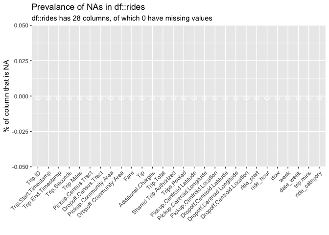
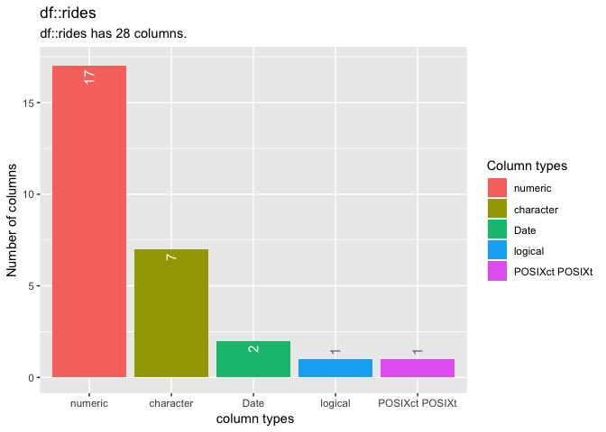
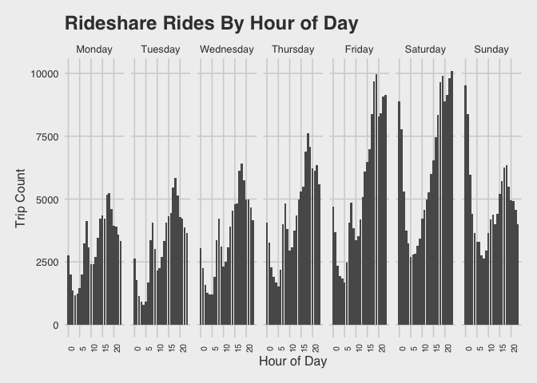
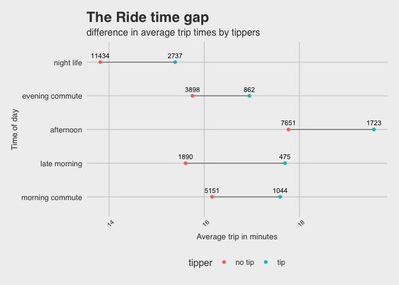
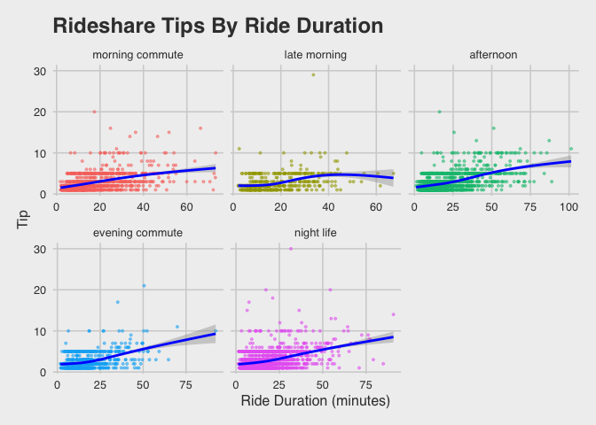
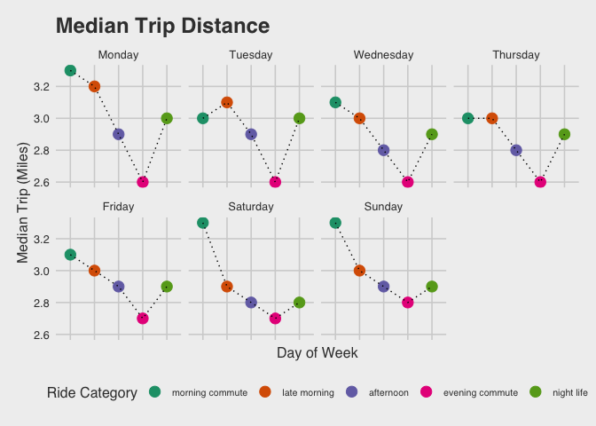

Chicago - ride share data
================
2019-05-07

## The packages

You know what day it is.

``` r
library(tidyverse)
tidyverse::tidyverse_logo()
```

    #> ⬢ __  _    __   .    ⬡           ⬢  . 
    #>  / /_(_)__/ /_ ___  _____ _______ ___ 
    #> / __/ / _  / // / |/ / -_) __(_-</ -_)
    #> \__/_/\_,_/\_, /|___/\__/_/ /___/\__/ 
    #>      ⬢  . /___/      ⬡      .       ⬢

## The data

<!-- Describe data set (high-level, minimal EDA and wrangling description (refer to scripts on Github) -->

Recently the City of Chicago released rideshare data with details at the
ride level beginning November 2018. Check out the write up on these data
[here](https://chicago.curbed.com/2019/4/15/18311340/uber-lyft-chicago-data-fares-drivers)
and download them
[here](https://data.cityofchicago.org/Transportation/Transportation-Network-Providers-Trips/m6dm-c72p).

As a former Lyftee working in data science to support engagement and
acquisition solutions, these data presents an opportunity to explore how
an analytics mindset can be leveraged to make evidence-based
recommendations to real business problems.

At the rider level, Lyft is fundamentally a service platform that
delivers transportation solutions to passengers. People use the app on
their mobile devices to order rides.

The more frequently Lyft can deliver passengers relevant messaging in
the right place and at the right time, they can gain an incremental
portion of a passenger’s total transportation budget. Being the right
app at the right time means people will use Lyft to get from A to B.

Passenger behavior–at the ride level–can reveal insights about a users
engagement with Lyft that marketers and product teams can uncouple to
build insight based marketing programs. In short, learning more about
customers to bring them a useful product.

### Import

These files are huge, so we took a 10% sample. We also removed all
missing data because some rides occured outside Chicago. Read more about
this in the data dictionary
[here](https://data.cityofchicago.org/Transportation/Transportation-Network-Providers-Trips/m6dm-c72p).

<!-- -->

``` r
# read ride data
rides <- readr::read_csv("Transportation-Network-Providers-Trips.csv.crdownload") %>% 
    dplyr::sample_frac(size = 0.1)
```

### Wrangle

The trip start and end times came into RStudio as factors, with AM and
PM in 12-hour format. These needed to be converted to dates in a 24-hour
format, in a local timezone. We also created ride hour, day of the week,
week, and date variables for the trips.

``` r
# filter for only Chicago rides
# Based on our data dictionary Pickup.Centroid.Latitude will be left blank for 
# locations outside Chicago
rides.chicago <- rides %>%
  tidyr::drop_na() 

# rides.chicago %>% dplyr::glimpse(78)

# drop original data for convenience
# rm(rides)

# convert 12 hour format to 24 hr format and extract date features of our 
# ride events
rides.chicago$ride_start <- as.POSIXct(rides.chicago$Trip.Start.Timestamp, 
                                       format = '%m/%d/%Y %I:%M:%S %p', 
                                       tz = "America/Chicago") 

# create ride_hour, dow, weekday, week, date_week, trip.mins 
rides.chicago$ride_hour <- lubridate::hour(rides.chicago$ride_start)
rides.chicago$dow <- base::weekdays(rides.chicago$ride_start)
rides.chicago$week <- lubridate::week(rides.chicago$ride_start)

rides.chicago$date_week = as.Date(cut(rides.chicago$ride_start, "week"))
rides.chicago$trip.mins = as.Date(cut(rides.chicago$ride_start, "week"))


# create category for each ride's time of day 
rides.chicago <- rides.chicago %>%
  mutate(ride_category = 
           case_when(
             ride_hour >= 5 & ride_hour <= 10 ~ "morning commute",
             ride_hour > 10 & ride_hour <= 12 ~ "late morning",
             ride_hour > 12 & ride_hour <= 17 ~ "afternoon",
             ride_hour %in% c(18,19) ~ "evening commute",
             ride_hour %in%  c(0, 1,2,3,4,20,21,22,23,24) ~ "night life")) 

# set levels for ride_category
rides.chicago$ride_category <- factor(rides.chicago$ride_category , 
                                      levels = c("morning commute", 
                                                 "late morning", 
                                                 "afternoon", 
                                                 "evening commute", 
                                                 "night life"))

# set levels for day of week
rides.chicago$dow <- factor(rides.chicago$dow , levels = c("Monday", 
                                                           "Tuesday",
                                                           "Wednesday", 
                                                           "Thursday", 
                                                           "Friday", 
                                                           "Saturday", 
                                                           "Sunday"))

# create tippers and non-tippers
rides.chicago <- rides.chicago %>%# count(Tip)
  dplyr::mutate(tipper = 
                  case_when(Tip == 0 ~ "no tip",
                            TRUE ~ "tip"),
                tipper = factor(tipper))
```

### Visualize

We like to start by visualizing the *entire* dataset to ensure there
isn’t any corruption, missing data, etc. The three packages that are
great for this are `skimr`, `visdat` and `inspectdf`. All three packages
come with a slew of functions for visualizing your data set and
underlying variable distributions.

``` r
library(skimr)
library(visdat)
library(inspectdf)
```

``` r
# check for NAs
inspectdf::inspect_na(rides, show_plot = TRUE)
```

<!-- -->

    #> # A tibble: 28 x 3
    #>    col_name                 cnt  pcnt
    #>    <chr>                  <dbl> <dbl>
    #>  1 Trip.ID                    0     0
    #>  2 Trip.Start.Timestamp       0     0
    #>  3 Trip.End.Timestamp         0     0
    #>  4 Trip.Seconds               0     0
    #>  5 Trip.Miles                 0     0
    #>  6 Pickup.Census.Tract        0     0
    #>  7 Dropoff.Census.Tract       0     0
    #>  8 Pickup.Community.Area      0     0
    #>  9 Dropoff.Community.Area     0     0
    #> 10 Fare                       0     0
    #> # … with 18 more rows

``` r
# summarize data types
inspectdf::inspect_types(rides, show_plot = TRUE)
```

<!-- -->

    #> # A tibble: 5 x 4
    #>   type             cnt  pcnt col_name  
    #>   <chr>          <int> <dbl> <list>    
    #> 1 numeric           17 60.7  <chr [17]>
    #> 2 character          7 25    <chr [7]> 
    #> 3 Date               2  7.14 <chr [2]> 
    #> 4 logical            1  3.57 <chr [1]> 
    #> 5 POSIXct POSIXt     1  3.57 <chr [1]>

## The problem

<!-- If-then statement is created from EDA and contextual knowledge about the business.  -->

Lyft can increase long term value (LTV) and share of passenger
transportation budget by targeting high intent times where passengers
are most in need of rides. For instance, these might be communting to
and from work, of going out at night on the weekend.

Meeting passengers with timely messaging and personal solutions presents
a measurable opportunity to increase LTV.

### Visualize the trips by hour of the day

We know we want to see trips across *at least* two levels (day or the
week, and time of the day). The visualization below displays the number
of trips taken per hour of the day across the days of the week.

Specifically, the `rides.chicago` data frame is piped (`%>%`) over to
the `ggplot2` functions to create histograms, and then faceted by the
days of the week to show the rides-per-hour breakdown across each day.

``` r
library(ggthemes)
# trips by hour of day
ggRideCountPerHour <- rides.chicago %>%
  
  ggplot(aes(x = ride_hour)) + 
  
  geom_bar() + 
  
  facet_grid( ~ dow) +
  
  ggthemes::theme_fivethirtyeight() +
  
  theme(axis.title = element_text()) +
  
  labs(title = "Rideshare Rides By Hour of Day",
       
       x = 'Hour of Day',
       
       y = 'Trip Count') +
  
  theme(axis.text.x  = element_text(size = 8, 
                                    
                                    angle = 90)) 

ggRideCountPerHour
```

<!-- -->

# Tips by ride duration

The scatterplot below shows the tips given at different trip durations.
We can sample our data using `dplyr::sample_frac()` function from for a
more managable data set. We group these data by the two variables of
interest (`tipper` and `ride_category`), then create a mean of the trip
duration (`mean_trip_mins`) for a more interpretable vizualization
across these groups.

``` r
rides.chicago %>%
  # create trip_mins
  mutate(trip_mins = (Trip.Seconds/60)) %>% 
  # get sample
  dplyr::sample_frac(size = .05) %>% 
  # group by two variables of interest
  group_by(tipper, ride_category) %>% 
  # 
  summarize(mean_trip_mins = mean(trip_mins),
            rides = n()) %>% 
  # ungroup
  ungroup() %>% 
  
  ggplot(aes(x = mean_trip_mins, 
             
             y = ride_category,
             
             label = rides)) +
  
        geom_line(aes(group = ride_category), 
                  color = "gray50") +
  
        geom_point(aes(color = tipper),
                   size = 1.5) + 
  
        geom_text(aes(label = rides), nudge_y = 0.2, size = 3) +
  
    ggthemes::theme_fivethirtyeight() +
  
    theme(axis.title = element_text(size = 10)) +
  
    theme(axis.text.x  = element_text(size = 8, angle = 45)) +
  
    ggplot2::labs(x = "Average trip in minutes",
                y = "Time of day",
               title = "The Ride time gap",
               subtitle = "difference in average trip times by tippers")
```

<!-- -->

## What did we learn?

Motivating passengers to engage in tipping is another source of payment
that benefits drivers. Although tipping is clearly less common than not
tipping, this is an avenue where learning more about the factors
incluencing tip behaviors could potentially be used to increase the
engagement between passengers and their rider experience.

## Tipping and Ride Duration

For riders who do tip, we want to know what the relationship is between
the amount of the tip and the duration of the ride. The graph below
displays these two variables across time of day.

``` r
# tips by ride duration
ggTipsRideDuration <- rides.chicago %>%
  # get sample
  dplyr::sample_frac(size = .05) %>% 
  # remove people who didn't tip at all
  dplyr::filter(tipper == "tip") %>% 
  # create a trip.mins for converting duration of secs to mins
  mutate(trip.mins = (Trip.Seconds/60)) %>%
  # plot Tip by trip.mins
  ggplot(aes(x = trip.mins, 
             y = Tip,
             # color = tipper,
             group = ride_category)) + 
  # points
  geom_point(aes(color = ride_category), 
             alpha = 1/2,
             size = 0.7,
             show.legend = FALSE) +
  # facet by ride_category
  facet_wrap(~ ride_category,
             ncol = 3,
             scales = "free_x") +
  # add linear smoothing line
  stat_smooth(se = TRUE, 
              col = "blue") +
  
  ggthemes::theme_fivethirtyeight() +
  
  theme(axis.title = element_text()) +
  
  labs(title = "Rideshare Tips By Ride Duration",
       x = 'Ride Duration (minutes)',
       y = 'Tip')

ggTipsRideDuration
```

<!-- -->

We can see that there isn’t much of a predictable influence of ride
duration on tipping behavior, with maybe the exception of night life
rides. This is an interesting finding, because it represents a very
distinct use cases (commuter vs. leisure time rides).

``` r
ggTripDistance <- rides.chicago %>% group_by(ride_category, dow) %>% summarize(median_trip_dist = median(Trip.Miles)) %>% 
    ggplot(aes(y = median_trip_dist, x = ride_category)) + geom_point(aes(color = ride_category), 
    size = 4, show.legend = TRUE) + geom_line(aes(group = 1), linetype = "dotted") + 
    facet_wrap(~dow, nrow = 2) + scale_color_brewer(palette = "Dark2") + theme_fivethirtyeight() + 
    
theme(axis.title = element_text(), axis.text.x = element_blank(), legend.text = element_text(size = 8)) + 
    
guides(color = guide_legend(title = "Ride Category", labels = c("morning commute", 
    "late morning", "afternoon", "evening commute", "night life"))) + # this is for the legend on the graph
ylab("Median Trip (Miles)") + xlab("Day of Week") + ggtitle("Median Trip Distance")
ggTripDistance
```

<!-- -->

Longer ride durations will generate more revenue for both drivers and
the rideshare service. This maybe a useful signal of LTV if these
passengers have a regular use case for taking these longer rides.

## Next steps

**What have we observed?**

Rideshare trips tend to be clustered around early morning commute hours
and nightlife hours. The surge in night life hours is particularly
pronounced on Fridays and Saturdays, with a sharp decline Sunday
evening. This makes sense because most people are preparing for their
next work week on Sunday evening, not going out or catching a movie.

In addition we can see that there are behavioral gaps to influence our
passenger’s engagement with both the product and their drivers. One of
those behaviors it tipping.

Tipping is infrequent overall, but the time of day appears to influence
a passenger’s willingness to tip more than the duration of the ride.
Longer rides tend to occur early in the week, which suggests a possible
passenger scenario where an initial trip is required for the week (such
as consultants who only travel early in the week to get to their
clients).

These visulizations have helped us uncover some trends and relationships
between time, frequency and behavior in the Chicago ride share data–next
time we will take a deeper look into some prediction and modeling.

At this stage we can already see that the end goal for these data is
going to be something beyond a static report, powerpoint presentation,
or PDF. Ideally, we would be able to come up with an intervention,
design and experiment, and build a dashboard that would allow real-time
data and ongoing results of our investigation.
