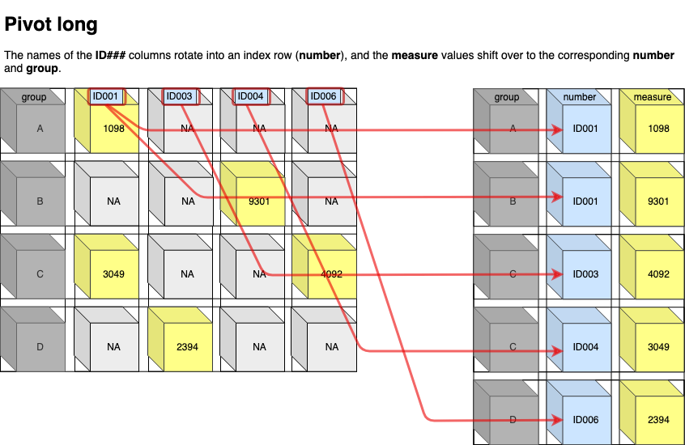

Data Journalism with R - Storybench tidyr pivoting
================
Martin Frigaard
2019-08-03

  - [Objectives](#objectives)
  - [Part one: Tidy data](#part-one-tidy-data)
      - [The tidy data principles](#the-tidy-data-principles)
          - [Indexed vs. Cartesian](#indexed-vs.-cartesian)
              - [Indexed data](#indexed-data)
              - [Cartesian data](#cartesian-data)
  - [Part two: Grouping](#part-two-grouping)
  - [Part three: Pivoting](#part-three-pivoting)
      - [Pivoting == rotating 90˚](#pivoting-rotating-90)
  - [Pivoting Example 1: Categorical/ordinal variable across multiple
    columns](#pivoting-example-1-categoricalordinal-variable-across-multiple-columns)
      - [Pivoting long](#pivoting-long)
          - [What happens in
            pivot\_longer()?](#what-happens-in-pivot_longer)
      - [Pivoting longer (with
        specifications)](#pivoting-longer-with-specifications)
          - [1) Define the arguments for reshaping the
            data](#define-the-arguments-for-reshaping-the-data)
          - [2) Format the variable(s) in the
            spec](#format-the-variables-in-the-spec)
          - [3) Supply the formatted spec object to
            pivot\_longer\_spec()
            function](#supply-the-formatted-spec-object-to-pivot_longer_spec-function)
      - [Pivoting wider](#pivoting-wider)
  - [Pivoting Example 2: Moving categorical or ordinal variables across
    columns](#pivoting-example-2-moving-categorical-or-ordinal-variables-across-columns)
      - [Pivoting wider options](#pivoting-wider-options)
      - [Read more](#read-more)

*TLDR: This tutorial was prompted by the recent changes to the `tidyr`
package (see the tweet from Hadley Wickham below). Two functions for
reshaping columns and rows (`gather()` and `spread()`) were replaced
with `tidyr::pivot_longer()` and `tidyr::pivot_wider()` functions.*

> Thanks to all 2649 (\!\!\!) people who completed my survey about table
> shapes\! I've done analysed the data at
> <a href="https://t.co/hyu1o91xRm">https://t.co/hyu1o91xRm</a> and the
> new functions will be called pivot\_longer() and pivot\_wider()
> <a href="https://twitter.com/hashtag/rstats?src=hash&amp;ref_src=twsrc%5Etfw">\#rstats</a>
> 
> </p>
> 
> — Hadley Wickham (@hadleywickham)
> <a href="https://twitter.com/hadleywickham/status/1109816130774986753?ref_src=twsrc%5Etfw">March
> 24, 2019</a>
> 
> <script async src="https://platform.twitter.com/widgets.js" charset="utf-8"></script>

``` r
# this will require the newest version of tidyr from github
# devtools::install_github("tidyverse/tidyr")
library(tidyr)
```

    TIDY⬢TIDY⬢TIDY⬢TIDY⬢TIDY⬢TIDY⬢TID⬢TIDY
     ⬢ __  _    __   .    ⬡           ⬢  . 
      / /_(_)__/ /_ ___  _____ _______ ___ 
     / __/ / _  / // / |/ / -_) __(_-</ -_)
     \__/_/\_,_/\_, /|___/\__/_/ /___/\__/ 
          ⬢  . /___/      ⬡      .       ⬢
    TIDY⬢TIDY⬢TIDY⬢TIDY⬢TIDY⬢TIDY⬢TID⬢TIDY

# Objectives

This tutorial will cover three concepts about working with data in the
`tidyverse`:

1)  tidy data,  
2)  grouping, and  
3)  the new pivoting verbs in `tidyr`

A solid understanding of these topics makes it easier to manipulate and
re-structure your data for visualizations and modeling in the
`tidyverse`.

I’ll be using examples of spreadsheets that were designed for data
entry, not necessarily statistical modeling or graphics.

My goal is that by showing the reasoning behind the data entry process,
you’ll walk away with a better understanding (and hopefully a little
less frustration) for why data are collected in so many different ways.
To follow along with this tutorial, download the data
[here](https://github.com/mjfrigaard/storybenchR/tree/master/02.1-tidyr-tidyverse).

-----

# Part one: Tidy data

[Tidy data](https://www.jstatsoft.org/article/view/v059i10) is… *“a
standardized way to link the structure of a dataset (its physical
layout) with its semantics (its meaning)”*

If you’ve worked with SQL and relational databases, you’ll recognize
most of these concepts. Hadley Wickham distilled a lot of the technical
jargon from [Edgar F. Codd’s ‘normal
form’](https://en.wikipedia.org/wiki/Third_normal_form) and applied it
to statistical terms. More importantly, he translated these essential
principles into concepts and terms a broader audience can grasp and use
for data manipulation.

## The tidy data principles

Tidy data refers to ‘rectangular’ data. These are the data we typically
see in spreadsheet software like Googlesheets, Microsoft Excel, or in a
relational database like MySQL, PostgreSQL, or Microsoft Access, The
three principles for tidy data are:

1.  Variables make up the columns  
2.  Observations (or cases) go in the rows  
3.  Values are in cells

Put them together, and these three statements make up the contents in a
tidy [data frame or tibble](https://tibble.tidyverse.org/). While these
principles might seem obvious at first, many of the data arrangements we
encounter in real life don’t adhere to this guidance.

### Indexed vs. Cartesian

I prefer to refer to tidy data as “indexed”, and wide data as
“Cartesian” (this terminology is from the
[ggplot2](https://amzn.to/2UlyNNp) text) because these terms help me
understand what is happening when the data get transformed. Two examples
are below:

#### Indexed data

In the `Indexed` data frame, the `group` and `number` variables are used
to keep track of each unique value of `measure`.

<div class="kable-table">

| group | number | measure |
| :---- | :----- | ------: |
| A     | ID001  |    1098 |
| C     | ID001  |    3049 |
| D     | ID003  |    2394 |
| B     | ID004  |    9301 |
| C     | ID006  |    4092 |

</div>

#### Cartesian data

The same data are represented in the `Cartesian` data frame, but in this
table the `measure` values are at the intersection of `group` and each
`ID###` (the `number` from the previous table).

<div class="kable-table">

| group | ID001 | ID003 | ID004 | ID006 |
| :---- | ----: | ----: | ----: | ----: |
| A     |  1098 |    NA |    NA |    NA |
| B     |    NA |    NA |  9301 |    NA |
| C     |  3049 |    NA |    NA |  4092 |
| D     |    NA |  2394 |    NA |    NA |

</div>

As you can see, the `Cartesian` orientation uses up more columns (and
fills in the gaps with missing (`NA`) values).

<!-- -->

# Part two: Grouping

Grouping produces summary data tables using functions from the `dplyr`
package. Similar to `GROUP BY` in SQL, `dplyr::group_by()` silently
groups a data frame (which means we don’t see any changes) and then
applies aggregate functions using `dplyr::summarize()`. Examples of
these are `mean()`, `median()`, `sum()`, `n()`, `sd()`, etc.

Take the data frame below, `DataTibble`, which has 5 variables:

  - `group_var` - a categorical group
  - `year` - the calendar year the measurements were collected
  - `x_measurement` and `y_measurement` - these are randomly generated
    numbers
  - `ordinal_y_var` - this is an ordinal variable corresponding to the
    values in `y_measurement` (greater than or equal to `800` is
    `"high"` or `3`, greater than or equal to `500` and less than `750`
    is `"med"` or `2`, and less than `500` is `"low"` or `1`).

<div class="kable-table">

| group\_var | year | x\_measurement | y\_measurement | ordinal\_y\_var |
| :--------- | ---: | -------------: | -------------: | :-------------- |
| A          | 2018 |          11.81 |         532.37 | med             |
| A          | 2017 |          28.46 |         116.04 | low             |
| A          | 2016 |          49.15 |         304.21 | low             |
| B          | 2018 |          87.56 |         719.38 | med             |
| B          | 2017 |          11.33 |         984.38 | high            |
| C          | 2018 |          15.87 |         959.41 | high            |
| C          | 2017 |          63.76 |         962.27 | high            |
| C          | 2016 |          96.03 |         744.52 | med             |

</div>

If I apply `dplyr::group_by()` to the `group_var` in `DataTibble`, I
will see no visible result.

``` r
DataTibble %>%
  dplyr::group_by(group_var)
```

<div class="kable-table">

| group\_var | year | x\_measurement | y\_measurement | ordinal\_y\_var |
| :--------- | ---: | -------------: | -------------: | :-------------- |
| A          | 2018 |          11.81 |         532.37 | med             |
| A          | 2017 |          28.46 |         116.04 | low             |
| A          | 2016 |          49.15 |         304.21 | low             |
| B          | 2018 |          87.56 |         719.38 | med             |
| B          | 2017 |          11.33 |         984.38 | high            |
| C          | 2018 |          15.87 |         959.41 | high            |
| C          | 2017 |          63.76 |         962.27 | high            |
| C          | 2016 |          96.03 |         744.52 | med             |

</div>

But when I combine `dplyr::group_by()` with `dplyr::summarize()`, I can
collapse `DataTibble` into a smaller table by supplying an aggregate
function to `summarize()`. Below I use `summarize()` to get the mean of
`x_measurement` and `y_measurement` and `n()` to get the total number in
each group.

``` r
DataTibble %>%
  dplyr::group_by(group_var) %>%
  dplyr::summarize(
    x_mean = mean(x_measurement),
    y_mean = mean(y_measurement),
    no = n()
  )
```

<div class="kable-table">

| group\_var |  x\_mean |  y\_mean | no |
| :--------- | -------: | -------: | -: |
| A          | 29.80667 | 317.5400 |  3 |
| B          | 49.44500 | 851.8800 |  2 |
| C          | 58.55333 | 888.7333 |  3 |

</div>

Grouping can also work with categorical/factor variables. The code below
uses `dplyr::count()` to summarize the number of `ordinal_y_var` levels
per category of `group_var`.

``` r
DataTibble %>%
  dplyr::count(group_var, ordinal_y_var)
```

<div class="kable-table">

| group\_var | ordinal\_y\_var | n |
| :--------- | :-------------- | -: |
| A          | med             | 1 |
| A          | low             | 2 |
| B          | high            | 1 |
| B          | med             | 1 |
| C          | high            | 2 |
| C          | med             | 1 |

</div>

This table isn’t as easy to read, because all of the information is
oriented vertically. I can move the values of `group_var` into
individual columns to make it easier on the eyes using
`tidyr::spread()`.

``` r
DataTibble %>%
  dplyr::count(group_var,ordinal_y_var) %>%
  tidyr::spread(key = group_var,value = n)
```

<div class="kable-table">

| ordinal\_y\_var |  A |  B |  C |
| :-------------- | -: | -: | -: |
| high            | NA |  1 |  2 |
| med             |  1 |  1 |  1 |
| low             |  2 | NA | NA |

</div>

Notice how this creates a table with different dimensions? This
arrangement can quickly be undone with the accompanying
`tidyr::gather()` function.

`tidyr::gather()` works a lot like the `tidyr::spread()` function, but
also requires us to specify that the missing values should be removed
(`na.rm = TRUE`).

*I also added a `dplyr::select()` statement to arrange these values so
they are similar to the table above*.

``` r
DataTibble %>%
  dplyr::count(group_var, ordinal_y_var) %>%
  tidyr::spread(key = group_var, value = n) %>%
  tidyr::gather(key = group_var, value = "n", 
                -ordinal_y_var, na.rm = TRUE) %>%
  dplyr::select(group_var, ordinal_y_var, n)
```

<div class="kable-table">

| group\_var | ordinal\_y\_var | n |
| :--------- | :-------------- | -: |
| A          | med             | 1 |
| A          | low             | 2 |
| B          | high            | 1 |
| B          | med             | 1 |
| C          | high            | 2 |
| C          | med             | 1 |

</div>

# Part three: Pivoting

All this data manipulation brings us to *pivoting*, the [recent
additions](https://tidyr.tidyverse.org/dev/articles/pivot.html) to the
`tidyr` package. These will be slowly replacing the functions I used
above for reshaping data frames, `tidyr::gather()` and
`tidyr::spread()`. I found it refreshing to learn that I wasn’t the only
person struggling to use these functions. Hadley Wickham, the package
developer/author, confessed he also struggles when using these
functions,

> Many people don’t find the names intuitive and find it hard to
> remember which direction corresponds to spreading and which to
> gathering. It also seems surprisingly hard to remember the arguments
> to these functions, meaning that many people (including me\!) have to
> consult the documentation every time.

Decisions like these are examples of why I appreciate the `tidyverse`,
because I can tell a lot of thought gets put into identifying language
that accurately capture the users intentions. Knowing how to reshape
data is an important skill for any data scientist, and the
`tidyr::pivot_` functions make restructuring very clear and explicit.

-----

### Pivoting == rotating 90˚

Whenever we use the `pivot_` functions, we’re changing angles between
the columns and rows. If the tables are pivoting from wide to longer,
the column names and values rotate 90˚ into an index row.

<!-- -->

When pivoting from long to wide, the index variable shifts 90˚ across
the column names, and the values slide in underneath the names.

<!-- -->

These two `tidyr::pivot_` functions give users the ability to quickly
rotate their data from columns to rows (and back), and provide many
arguments for customizing the new data orientations. Tidying data is a
great skill to start with because most of the data you’ll encounter in
the `tidyverse` is going to be in columns and rows (or you will want to
get them that way).

# Pivoting Example 1: Categorical/ordinal variable across multiple columns

Vasily Lomachenko, is currently the best [pound-for-pound
boxer](https://en.wikipedia.org/wiki/Boxing_pound_for_pound_rankings) in
the world. We’re going to start by manipulating a data set of
Lomachenko’s fights from the
[BoxRec](http://boxrec.com/en/boxer/659771) database. The fight
information is oriented in a way that makes sense for the person
entering the data, but it’s not ideal for analysis or modeling.

``` r
LomaWideSmall %>% utils::head()
```

<div class="kable-table">

| opponent               | date       | fight\_1 | fight\_2 | fight\_3 | fight\_4 | fight\_5 | fight\_6 | fight\_7 | fight\_8 | fight\_9 | fight\_10 | fight\_11 | fight\_12 | fight\_13 | fight\_14 | fight\_15 |
| :--------------------- | :--------- | :------- | :------- | :------- | :------- | :------- | :------- | :------- | :------- | :------- | :-------- | :-------- | :-------- | :-------- | :-------- | :-------- |
| José Ramírez           | 2013-10-12 | Win      | NA       | NA       | NA       | NA       | NA       | NA       | NA       | NA       | NA        | NA        | NA        | NA        | NA        | NA        |
| Orlando Salido         | 2014-03-01 | NA       | Loss     | NA       | NA       | NA       | NA       | NA       | NA       | NA       | NA        | NA        | NA        | NA        | NA        | NA        |
| Gary Russell Jr.       | 2014-06-21 | NA       | NA       | Win      | NA       | NA       | NA       | NA       | NA       | NA       | NA        | NA        | NA        | NA        | NA        | NA        |
| Chonlatarn Piriyapinyo | 2014-11-22 | NA       | NA       | NA       | Win      | NA       | NA       | NA       | NA       | NA       | NA        | NA        | NA        | NA        | NA        | NA        |
| Gamalier Rodríguez     | 2015-05-02 | NA       | NA       | NA       | NA       | Win      | NA       | NA       | NA       | NA       | NA        | NA        | NA        | NA        | NA        | NA        |
| Romulo Koasicha        | 2015-11-07 | NA       | NA       | NA       | NA       | NA       | Win      | NA       | NA       | NA       | NA        | NA        | NA        | NA        | NA        | NA        |

</div>

This data arrangement is *Cartesian*, because each fight number has it’s
own column (`fight_1` through `fight_14`), and the result (`Win`/`Loss`)
is located at the intersection between the fight numbered columns and
the corresponding `opponent` and `date`. Having the data in this
arrangement might seem odd to a data scientist, but this configuration
makes sense for a fan entering the fights into a spreadsheet **as they
happen in real time**. Consider the chronological chain of events
involved with a each fight,

1.  An `opponent` is announced, and our excited fan enters the
    information into the first two column/rows in a spreadsheet and
    titles it, ’Lomachenko\`
2.  The `date` for the first fight gets entered into the `B` column (the
    second in the table),
3.  In order to track an athlete’s win/loss record over the course of
    their career, a number is also marked for each fight (starting with
    `1`) in a column titled, `fight_1`. and the result gets put in the
    corresponding cell (`Win` or `Loss`)

As you can see, the steps above are sensible for someone wanting to
track their favorite athlete (or sports team) over time. I’ve
encountered excel tables with orientations that mirror the sequence of
events they’re capturing. This “data-entry friendly” format captures
enough information to be useful, and it has a few computational
abilities. For example, a fan could use filtering to count the number of
matches against a particular `opponent`, or sort the `date` column to
figure what Lomachenko’s late fight. Spreadsheets like these are a cross
between a timeline and a record book, and they do a good enough job at
both tasks to justify their current structure.

The [pivot
vignette](https://tidyr.tidyverse.org/dev/articles/pivot.html#wide-to-long)
conveys that ‘wide’ formats or data arrangements are common because
their primary purpose and design is centered around recording data (and
not visualization or modeling),

## Pivoting long

We are going to start by pivoting the `LomaWideSmall` data frame to a
long or ‘tidy’ format. We accomplish this using the
`tidyr::pivot_longer()` function.

``` r
LomaWideSmall %>%
    
  tidyr::pivot_longer(
      
    cols = starts_with("fight"),

    names_to = "fight_no",

    values_to = "result",

    names_prefix = "fight_",

    values_drop_na = TRUE)
```

<div class="kable-table">

| opponent               | date       | fight\_no | result |
| :--------------------- | :--------- | :-------- | :----- |
| José Ramírez           | 2013-10-12 | 1         | Win    |
| Orlando Salido         | 2014-03-01 | 2         | Loss   |
| Gary Russell Jr.       | 2014-06-21 | 3         | Win    |
| Chonlatarn Piriyapinyo | 2014-11-22 | 4         | Win    |
| Gamalier Rodríguez     | 2015-05-02 | 5         | Win    |
| Romulo Koasicha        | 2015-11-07 | 6         | Win    |
| Román Martínez         | 2016-06-11 | 7         | Win    |
| Nicholas Walters       | 2016-11-26 | 8         | Win    |
| Jason Sosa             | 2017-04-08 | 9         | Win    |
| Miguel Marriaga        | 2017-08-05 | 10        | Win    |
| Guillermo Rigondeaux   | 2017-12-09 | 11        | Win    |
| Jorge Linares          | 2018-05-12 | 12        | Win    |
| José Pedraza           | 2018-12-08 | 13        | Win    |
| Anthony Crolla         | 2019-04-12 | 14        | Win    |

</div>

### What happens in pivot\_longer()?

<!-- -->

`tidyr::pivot_longer()` extends the `tidyr::spread()` function by adding
a few arguments to make this re-structuring more deliberate:

  - The `cols` argument contains the columns we want to pivot (and it
    takes
    [`tidyselect`](https://dplyr.tidyverse.org/reference/select.html)
    helper functions). These are going to be the new index columns.

  - The `names_to` and `values_to` are the new columns we will be
    creating from all of the `fight_` variables. The `names_to` is the
    new index column, meaning how would you ‘look up’ the value in an
    adjacent column. The `values_to` are the contents of the cells that
    correspond to each value in the `names_to` variable.

  - The `names_prefix` is a regular expression pattern I can use to
    clean the old variable names as they become the values in the new
    columns. I enter `fight_` here because is will remove the text from
    the front the variable name and only enter the number into the new
    `fight_no` variable.

Unfortunately, we can see that the new `fight_no` variable is still
formatted as a character. Luckily, the new `tidyr::pivot_longer()`
function also has a `tidyr::pivot_longer_spec()`, which allows for
additional specifications on the data transformation.

## Pivoting longer (with specifications)

> A pivoting `spec` is a data frame that describes the metadata stored
> in the column name, with one row for each column, and one column for
> each variable mashed into the column name.

The `tidyr::pivot_longer_spec()` function allows even more
specifications on what to do with the data during the transformation.
Because we are still in the `tidyverse`, the output is a data fame.
Explicitly creating an object that contains data about your data is not
necessarily a novel concept in R, but it’s very handy when that object
is similar to the other objects you’re already working with (i.e. a data
frame or tibble).

Creating a `spec` for the `LomaWideSmall` data frame is a three-step
process:

#### 1\) Define the arguments for reshaping the data

I enter the same arguments I entered above in the
`tidyr::pivot_longer()` function, with the exception of the `na.rm =
TRUE` argument. These results get stored into an object I will name
`LomaSpec`, which is a data frame with three variables in it: `.name`,
`.value`, and `fight_no`.

``` r
LomaSpec <- LomaWideSmall %>%
    
  tidyr::pivot_longer_spec(
      
    cols = starts_with("fight"),

    names_to = "fight_no",

    values_to = "result",

    names_prefix = "fight_")

LomaSpec
```

<div class="kable-table">

| .name     | .value | fight\_no |
| :-------- | :----- | :-------- |
| fight\_1  | result | 1         |
| fight\_2  | result | 2         |
| fight\_3  | result | 3         |
| fight\_4  | result | 4         |
| fight\_5  | result | 5         |
| fight\_6  | result | 6         |
| fight\_7  | result | 7         |
| fight\_8  | result | 8         |
| fight\_9  | result | 9         |
| fight\_10 | result | 10        |
| fight\_11 | result | 11        |
| fight\_12 | result | 12        |
| fight\_13 | result | 13        |
| fight\_14 | result | 14        |
| fight\_15 | result | 15        |

</div>

The three columns in `LomaSpec` contain metadata (data about our data)
on the transformation I want to perform–specifically the original
columns (`.name`) and the corresponding cell values (`.value`). The
other variable (`fight_no`) gets carried over from the transformation as
well.

#### 2\) Format the variable(s) in the spec

If I want to format the `fight_no` variable, I can include those
arguments *within* the `LomaSpec` data frame.

``` r
# format the variable
LomaSpec <- LomaSpec %>%
    
  dplyr::mutate(fight_no = as.numeric(fight_no))

LomaSpec$fight_no %>% glimpse(78)
```

    ##  num [1:15] 1 2 3 4 5 6 7 8 9 10 ...

#### 3\) Supply the formatted spec object to pivot\_longer\_spec() function

Now `LomaSpec` can get supplied to the `tidyr::pivot_longer()` function
and the `fight_no` variable is properly formatted (note I still need to
provide the `na.rm = TRUE` argument).

``` r
# supply it to the pivot_longer
LomaFightsLong <- LomaWideSmall %>%
    
  tidyr::pivot_longer(
      
    spec = LomaSpec,
    
    values_drop_na = TRUE)

LomaFightsLong
```

<div class="kable-table">

| opponent               | date       | fight\_no | result |
| :--------------------- | :--------- | --------: | :----- |
| José Ramírez           | 2013-10-12 |         1 | Win    |
| Orlando Salido         | 2014-03-01 |         2 | Loss   |
| Gary Russell Jr.       | 2014-06-21 |         3 | Win    |
| Chonlatarn Piriyapinyo | 2014-11-22 |         4 | Win    |
| Gamalier Rodríguez     | 2015-05-02 |         5 | Win    |
| Romulo Koasicha        | 2015-11-07 |         6 | Win    |
| Román Martínez         | 2016-06-11 |         7 | Win    |
| Nicholas Walters       | 2016-11-26 |         8 | Win    |
| Jason Sosa             | 2017-04-08 |         9 | Win    |
| Miguel Marriaga        | 2017-08-05 |        10 | Win    |
| Guillermo Rigondeaux   | 2017-12-09 |        11 | Win    |
| Jorge Linares          | 2018-05-12 |        12 | Win    |
| José Pedraza           | 2018-12-08 |        13 | Win    |
| Anthony Crolla         | 2019-04-12 |        14 | Win    |

</div>

These data are now in a tidy (indexed) format.

-----

## Pivoting wider

It’s less common, but sometimes you’ll need to move variables from a
tidy (or indexed) column arrangement into a wide (Cartesian) format.

# Pivoting Example 2: Moving categorical or ordinal variables across columns

In order to restructure from a wide to long data frame, we need to use
the `tidyr::pivot_wider()` function. This works much like the
`pivot_longer()` function, but with a few different arguments.

Consider a data frame with the same Lomachenko fight records, but this
time arranged by date. Imagine the following events that would lead to
the creation of the `LomaDatesWide` data:

1.  It’s announced that Lomachenko will be fighting an `opponent` and
    `location` is announced, and our fan enters the information into the
    first two column/rows in her ’Lomachenko\` spreadsheet

2.  A `fight_number` column is created to document the number of fights
    (as they happen)

3.  The date for the first fight (`2013-10-12`) gets entered into the
    the fourth column in the table, and the result (`Win`) gets put in
    the corresponding cell

4.  After the scorecards are collected, the `result` is announced (see
    key below), the `fight_record` is updated (with the official outcome
    of the bout)

5.  The official round and time (`rounds` and `time`) is recorded for
    when the fight had to stop (or the total number of rounds if it went
    the distance),

6.  Titles and belts are listed in the `notes` section

7.  When the next fight happens, our fan right-clicks on the last
    recorded fight, and inserts a new column and date, and repeats steps
    1-6

*I tend to find tables like these when the data entry is done using
‘Freeze Columns’ or ‘Freeze Rows’.*


The `LomaFights` data frame has the fight records for Lomachenko from
his [wikipedia table](https://en.wikipedia.org/wiki/Vasyl_Lomachenko).
To create a spreadsheet like the one above, we can use the
`tidyr::pivot_wider()` function.

*I add a few `dplyr` functions to get the data frame to look identical
to the excel file above.*

``` r
LomaFights %>% 
    # the columns come from the dates
    tidyr::pivot_wider(names_from = date, 
                       # the values will be the result of the fight
                       values_from = result) %>% 
    # arrange by the fight number 
    dplyr::arrange(no) %>% 
    # rearrange the columns
    dplyr::select(opponent, location,
                  
                  dplyr::starts_with("20"),
                  
                  dplyr::everything())
```

<div class="kable-table">

| opponent               | location                                                          | 2013-10-12 | 2014-03-01 | 2014-06-21 | 2014-11-22 | 2015-05-02 | 2015-11-07 | 2016-06-11 | 2016-11-26 | 2017-04-08 | 2017-08-05 | 2017-12-09 | 2018-05-12 | 2018-12-08 | 2019-04-12 | 2019-08-31 | no | record | type | rounds  | time | notes                                                                                       |
| :--------------------- | :---------------------------------------------------------------- | :--------- | :--------- | :--------- | :--------- | :--------- | :--------- | :--------- | :--------- | :--------- | :--------- | :--------- | :--------- | :--------- | :--------- | :--------- | -: | :----- | :--- | :------ | :--- | :------------------------------------------------------------------------------------------ |
| José Ramírez           | Thomas & Mack Center, Paradise, Nevada, US                        | Win        | NA         | NA         | NA         | NA         | NA         | NA         | NA         | NA         | NA         | NA         | NA         | NA         | NA         | NA         |  1 | 1–0    | TKO  | 4 (10)  | 2:55 | Won WBO International featherweight title                                                   |
| Orlando Salido         | Alamodome, San Antonio, Texas, US                                 | NA         | Loss       | NA         | NA         | NA         | NA         | NA         | NA         | NA         | NA         | NA         | NA         | NA         | NA         | NA         |  2 | 1–1    | SD   | 12      | NA   | For vacant WBO featherweight title                                                          |
| Gary Russell Jr.       | StubHub Center, Carson, California, US                            | NA         | NA         | Win        | NA         | NA         | NA         | NA         | NA         | NA         | NA         | NA         | NA         | NA         | NA         | NA         |  3 | 2–1    | MD   | 12      | NA   | Won vacant WBO featherweight title                                                          |
| Chonlatarn Piriyapinyo | Cotai Arena, Macau, SAR                                           | NA         | NA         | NA         | Win        | NA         | NA         | NA         | NA         | NA         | NA         | NA         | NA         | NA         | NA         | NA         |  4 | 3–1    | UD   | 12      | NA   | Retained WBO featherweight title                                                            |
| Gamalier Rodríguez     | MGM Grand Garden Arena, Paradise, Nevada, US                      | NA         | NA         | NA         | NA         | Win        | NA         | NA         | NA         | NA         | NA         | NA         | NA         | NA         | NA         | NA         |  5 | 4–1    | KO   | 9 (12)  | 0:50 | Retained WBO featherweight title                                                            |
| Romulo Koasicha        | Thomas & Mack Center, Paradise, Nevada, US                        | NA         | NA         | NA         | NA         | NA         | Win        | NA         | NA         | NA         | NA         | NA         | NA         | NA         | NA         | NA         |  6 | 5–1    | KO   | 10 (12) | 2:35 | Retained WBO featherweight title                                                            |
| Román Martínez         | The Theater at Madison Square Garden, New York City, New York, US | NA         | NA         | NA         | NA         | NA         | NA         | Win        | NA         | NA         | NA         | NA         | NA         | NA         | NA         | NA         |  7 | 6–1    | KO   | 5 (12)  | 1:09 | Won WBO junior lightweight title                                                            |
| Nicholas Walters       | Cosmopolitan of Las Vegas, Paradise, Nevada, US                   | NA         | NA         | NA         | NA         | NA         | NA         | NA         | Win        | NA         | NA         | NA         | NA         | NA         | NA         | NA         |  8 | 7–1    | RTD  | 7 (12)  | 3:00 | Retained WBO junior lightweight title                                                       |
| Jason Sosa             | MGM National Harbor, Oxon Hill, Maryland, US                      | NA         | NA         | NA         | NA         | NA         | NA         | NA         | NA         | Win        | NA         | NA         | NA         | NA         | NA         | NA         |  9 | 8–1    | RTD  | 9 (12)  | 3:00 | Retained WBO junior lightweight title                                                       |
| Miguel Marriaga        | Microsoft Theater, Los Angeles, California, US                    | NA         | NA         | NA         | NA         | NA         | NA         | NA         | NA         | NA         | Win        | NA         | NA         | NA         | NA         | NA         | 10 | 9–1    | RTD  | 7 (12)  | 3:00 | Retained WBO junior lightweight title                                                       |
| Guillermo Rigondeaux   | The Theater at Madison Square Garden, New York City, New York, US | NA         | NA         | NA         | NA         | NA         | NA         | NA         | NA         | NA         | NA         | Win        | NA         | NA         | NA         | NA         | 11 | 10–1   | RTD  | 6 (12)  | 3:00 | Retained WBO junior lightweight title                                                       |
| Jorge Linares          | Madison Square Garden, New York City, New York, US                | NA         | NA         | NA         | NA         | NA         | NA         | NA         | NA         | NA         | NA         | NA         | Win        | NA         | NA         | NA         | 12 | 11–1   | TKO  | 10 (12) | 2:08 | Won WBA (Super) and The Ring lightweight titles                                             |
| José Pedraza           | Hulu Theater, New York City, New York, US                         | NA         | NA         | NA         | NA         | NA         | NA         | NA         | NA         | NA         | NA         | NA         | NA         | Win        | NA         | NA         | 13 | 12–1   | UD   | 12      | NA   | Retained WBA (Super) and The Ring lightweight titles;Won WBO lightweight title              |
| Anthony Crolla         | Staples Center, Los Angeles, California, US                       | NA         | NA         | NA         | NA         | NA         | NA         | NA         | NA         | NA         | NA         | NA         | NA         | NA         | Win        | NA         | 14 | 13–1   | KO   | 4 (12)  | 0:58 | Retained WBA (Super), WBO, and The Ring lightweight titles                                  |
| Luke Campbell          | The O2 Arena, London, England, UK                                 | NA         | NA         | NA         | NA         | NA         | NA         | NA         | NA         | NA         | NA         | NA         | NA         | NA         | NA         | NA         | 15 | NA     | NA   | NA      | NA   | Defending WBA (Super), WBO, and The Ring lightweight titlesFor vacant WBC lightweight title |

</div>

## Pivoting wider options

The output is *very* close to the excel sheet above, except missing
values in excel are empty (not an `NA` like R). I can use the
`tidyr::pivot_wider(x, values_fill())` to include this change to the
data.

``` r
LomaFights %>% 
    tidyr::pivot_wider(names_from = date, 
                       values_from = result,
                       values_fill = list(result = "")) %>% 
    dplyr::arrange(no) %>% 
    dplyr::select(opponent, 
                  location,
                  dplyr::starts_with("20"))
```

<div class="kable-table">

| opponent               | location                                                          | 2013-10-12 | 2014-03-01 | 2014-06-21 | 2014-11-22 | 2015-05-02 | 2015-11-07 | 2016-06-11 | 2016-11-26 | 2017-04-08 | 2017-08-05 | 2017-12-09 | 2018-05-12 | 2018-12-08 | 2019-04-12 | 2019-08-31 |
| :--------------------- | :---------------------------------------------------------------- | :--------- | :--------- | :--------- | :--------- | :--------- | :--------- | :--------- | :--------- | :--------- | :--------- | :--------- | :--------- | :--------- | :--------- | :--------- |
| José Ramírez           | Thomas & Mack Center, Paradise, Nevada, US                        | Win        |            |            |            |            |            |            |            |            |            |            |            |            |            |            |
| Orlando Salido         | Alamodome, San Antonio, Texas, US                                 |            | Loss       |            |            |            |            |            |            |            |            |            |            |            |            |            |
| Gary Russell Jr.       | StubHub Center, Carson, California, US                            |            |            | Win        |            |            |            |            |            |            |            |            |            |            |            |            |
| Chonlatarn Piriyapinyo | Cotai Arena, Macau, SAR                                           |            |            |            | Win        |            |            |            |            |            |            |            |            |            |            |            |
| Gamalier Rodríguez     | MGM Grand Garden Arena, Paradise, Nevada, US                      |            |            |            |            | Win        |            |            |            |            |            |            |            |            |            |            |
| Romulo Koasicha        | Thomas & Mack Center, Paradise, Nevada, US                        |            |            |            |            |            | Win        |            |            |            |            |            |            |            |            |            |
| Román Martínez         | The Theater at Madison Square Garden, New York City, New York, US |            |            |            |            |            |            | Win        |            |            |            |            |            |            |            |            |
| Nicholas Walters       | Cosmopolitan of Las Vegas, Paradise, Nevada, US                   |            |            |            |            |            |            |            | Win        |            |            |            |            |            |            |            |
| Jason Sosa             | MGM National Harbor, Oxon Hill, Maryland, US                      |            |            |            |            |            |            |            |            | Win        |            |            |            |            |            |            |
| Miguel Marriaga        | Microsoft Theater, Los Angeles, California, US                    |            |            |            |            |            |            |            |            |            | Win        |            |            |            |            |            |
| Guillermo Rigondeaux   | The Theater at Madison Square Garden, New York City, New York, US |            |            |            |            |            |            |            |            |            |            | Win        |            |            |            |            |
| Jorge Linares          | Madison Square Garden, New York City, New York, US                |            |            |            |            |            |            |            |            |            |            |            | Win        |            |            |            |
| José Pedraza           | Hulu Theater, New York City, New York, US                         |            |            |            |            |            |            |            |            |            |            |            |            | Win        |            |            |
| Anthony Crolla         | Staples Center, Los Angeles, California, US                       |            |            |            |            |            |            |            |            |            |            |            |            |            | Win        |            |
| Luke Campbell          | The O2 Arena, London, England, UK                                 |            |            |            |            |            |            |            |            |            |            |            |            |            |            | NA         |

</div>

Another neat part of the `pivot_wider()` function is the `values_from`
argument can take multiple columns. For example, if I wanted to see how
man `Win`s resulted in `TKO`s (technical knock-outs) or `KO`s
(knock-outs) and their corresponding rounds and time, I could use the
following to see `rounds` and `time` in separate columns.

``` r
LomaFights %>% 
    dplyr::filter(result == "Win") %>% 
    pivot_wider(names_from = c(type),
                values_from = c(rounds, time),
                values_fill = list(rounds = "",
                                   time = "")) %>% 
    dplyr::select(opponent,
                  dplyr::contains("_KO"),
                  dplyr::contains("_TKO"))
```

<div class="kable-table">

| opponent               | rounds\_KO | time\_KO | rounds\_TKO | time\_TKO |
| :--------------------- | :--------- | :------- | :---------- | :-------- |
| José Ramírez           |            |          | 4 (10)      | 2:55      |
| Gary Russell Jr.       |            |          |             |           |
| Chonlatarn Piriyapinyo |            |          |             |           |
| Gamalier Rodríguez     | 9 (12)     | 0:50     |             |           |
| Romulo Koasicha        | 10 (12)    | 2:35     |             |           |
| Román Martínez         | 5 (12)     | 1:09     |             |           |
| Nicholas Walters       |            |          |             |           |
| Jason Sosa             |            |          |             |           |
| Miguel Marriaga        |            |          |             |           |
| Guillermo Rigondeaux   |            |          |             |           |
| Jorge Linares          |            |          | 10 (12)     | 2:08      |
| José Pedraza           |            |          |             |           |
| Anthony Crolla         | 4 (12)     | 0:58     |             |           |

</div>

We can also use the `tidyr::pivot_wider()` function like
`tidyr::spread()` function above. If I want to see the fight `results`
by type, but with `Win` and `Loss` in separate columns, I can use the
following sequence.

``` r
LomaFights %>% 
    dplyr::filter(!is.na(result)) %>% 
    dplyr::count(type, result) %>% 
    tidyr::pivot_wider(
            names_from = result, 
            values_from = n,
            values_fill = list(n = 0))
```

<div class="kable-table">

| type | Win | Loss |
| :--- | --: | ---: |
| KO   |   4 |    0 |
| MD   |   1 |    0 |
| RTD  |   4 |    0 |
| SD   |   0 |    1 |
| TKO  |   2 |    0 |
| UD   |   2 |    0 |

</div>

As you can see, these new `tidyr::pivot_` functions extend
`tidyr::gather()` and `tidyr::spread()` with more options and
flexibility. I think you’ll find these are a welcome addition to the
data wrangling packages and in the `tidyverse`.

## Read more

  - Check out the [pivoting
    vignette](https://tidyr.tidyverse.org/dev/articles/pivot.html) on
    the tidyverse website.

  - Alison Presmanes Hill has some great examples in this [Github
    repo](https://github.com/apreshill/teachthat/tree/master/pivot).

  - Read the [`NEWS.md`
    file](https://github.com/tidyverse/tidyr/blob/master/NEWS.md) on the
    `tidyr` github page for new changes to these functions (and
    others\!)

  - Be sure to check out [Vasiliy Lomachenko when he fights Anthony
    Crolla](https://es.pn/2CUzPFl) on April 12\!
