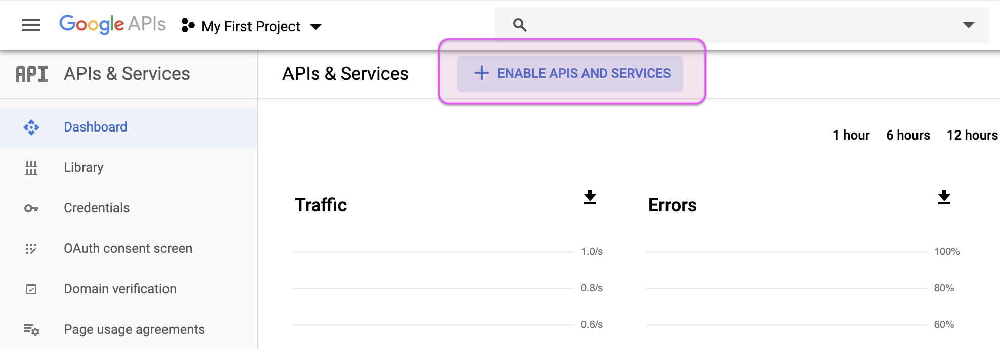
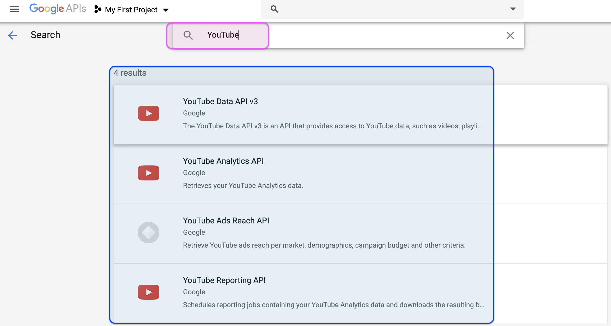
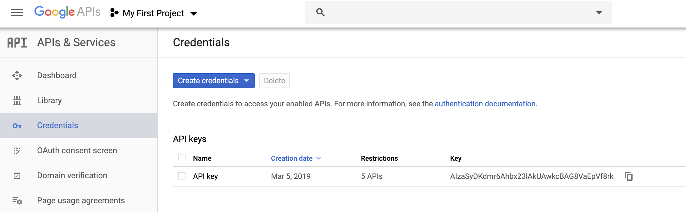
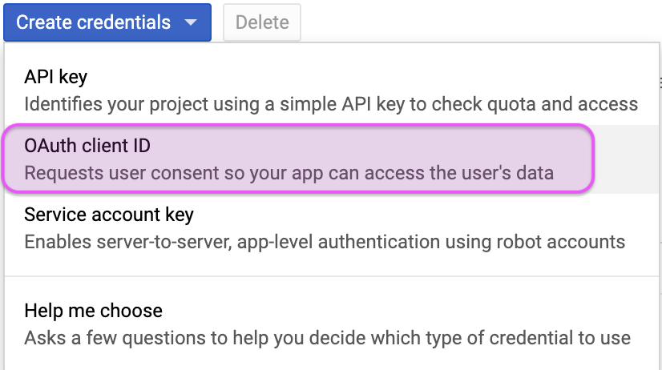
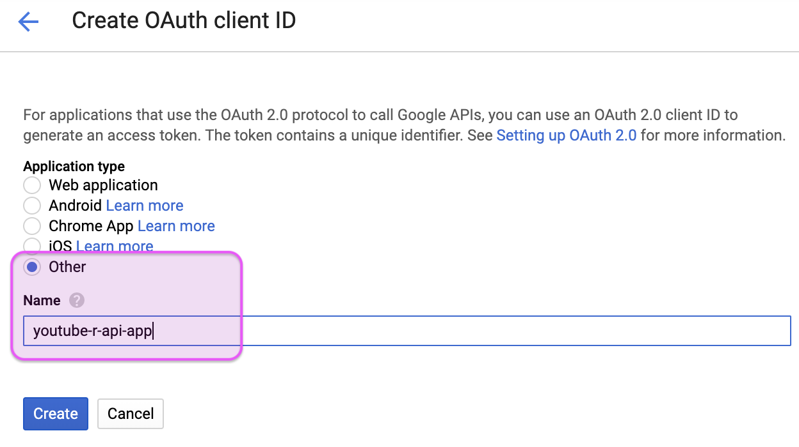
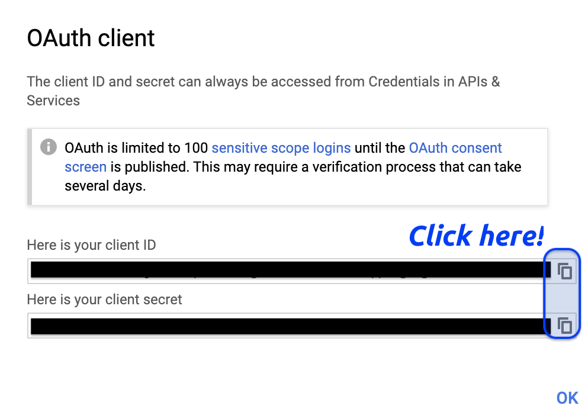
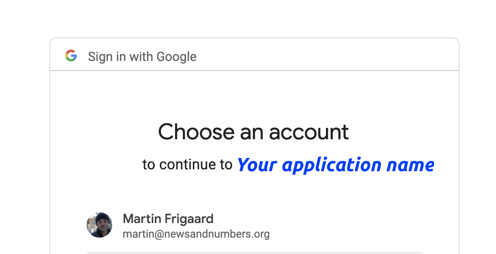
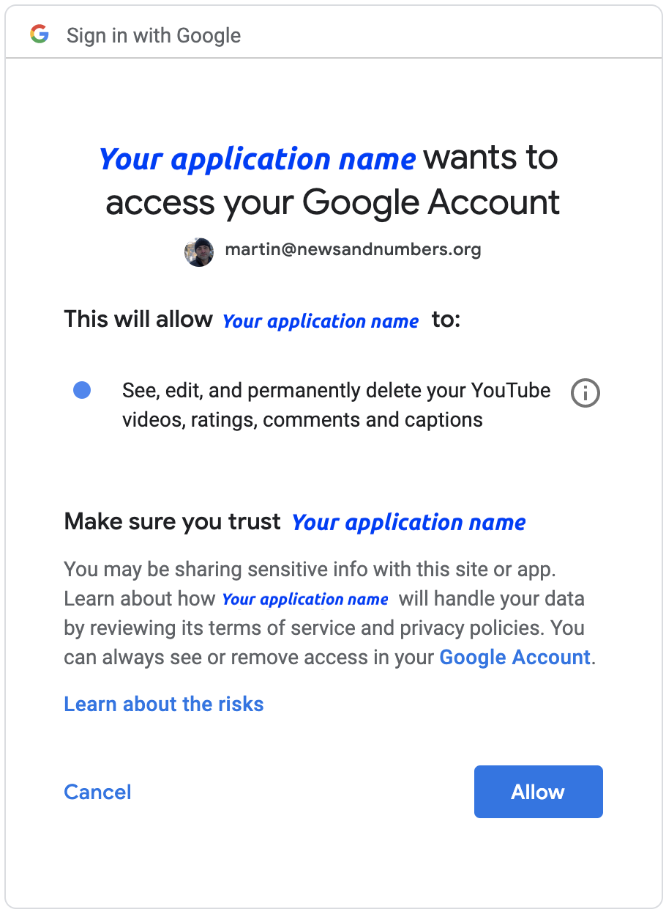

32 - tuber-licious\! setting up the YouTube API in R
================
Martin Frigaard

# Setting up access to the YouTube API

It’s even easier to access YouTube’s metadata (views, likes, dislikes,
comments, etc.) thanks to the
[`tuber`](https://soodoku.github.io/tuber/articles/tuber-ex.html)
package by [Gaurav Sood](https://www.gsood.com/).

Make sure you `install` the package and load it with `library()`

``` r
install.packages("tuber")
library(tuber) # youtube API
library(magrittr) # Pipes %>%, %T>% and equals(), extract().
library(tidyverse) # all tidyverse packages
library(hrbrthemes) # themes for graphs
```

Sood wrote an excellent, easy-to-use package for accessing the YouTube
data API. If you’re like me, you love screenshots for setting up new
tools like this. Below is a quick outline for the steps to get your
application id and password set up in R.

## 1\) Enable the APIs

First head over to your [Google APIs
dashboard](https://console.developers.google.com/apis/dashboard) (you’ll
need an account for this). Click on “ENABLE APIS AND SERVICES”.

<!-- -->

This will bring up a laundry list of APIs, but we only need the four
pertaining to YouTube (see below) and the Freebase API.

Click on the search bar and type in YouTube and you should see four
options. Enable all of them.

<!-- -->

**IMPORTANT** you’ll also have to serch for and enable the Freebase API.

## 2\) Create your credentials

After these have been enabled, you’ll need to create credentials for the
API. Click on the Credentials label on the left side of your Google
dashboard (there should be a little key icon next to it).

<!-- -->

After clicking on the Credentials icon, you’ll need to select the OAuth
client ID option.

<!-- -->

### Create your OAuth

Here is where we name our app and indicate it’s an “Other” Application
type.

<!-- -->

We’re told we’re limited to 100 sensitive scope logins until the OAuth
consent screen is published. That’s not a problem for us, so we can copy
the client ID and client secret

<!-- -->

After clicking on the copy icons, we save them into two objects in
RStudio (`client_id` and `client_secret`).

``` r
client_id <- "20939048240-snjuunf5kp1n788b4gvi84khk553u36f.apps.googleusercontent.com"
client_secret <- "O9eT8Q_ldnivnvopqkvJd32Hv"
```

## 3\) Authenticate the application

Now you can run `tuber`’s `yt_oauth()` function to authenticate your
application. I included the token as a blank string (`token = ''`)
because it kept looking for the `.httr-oauth` in my local directory (and
I didn’t create one).

``` r
# use the youtube oauth 
yt_oauth(app_id = client_id,
         app_secret = client_secret,
         token = '')
```

Provided you did everything correct, this *should* open your browser and
ask you to sign into the Google account you set everything up with (see
the images below). You’ll see the name of your application in place of
“*Your application name*”.

<!-- -->

After signing in, you’ll be asked if the YouTube application you created
can access your Google account. If you approve, click “Allow”.

<!-- -->

This should give you a blank page with a cryptic, `Authentication
complete. Please close this page and return to R.` message.

-----

# Accessing YouTube data

Great\! Now that we’re all set up, we will download some data into
RStudio. Be sure to check out the [reference
page](https://soodoku.github.io/tuber/reference/index.html) and the
[YouTube API reference
docs](https://developers.google.com/youtube/v3/docs/) on how to access
various meta data from YouTube videos.

Also check out the [previous post on using
APIs](http://www.storybench.org/how-to-access-apis-in-r/).
