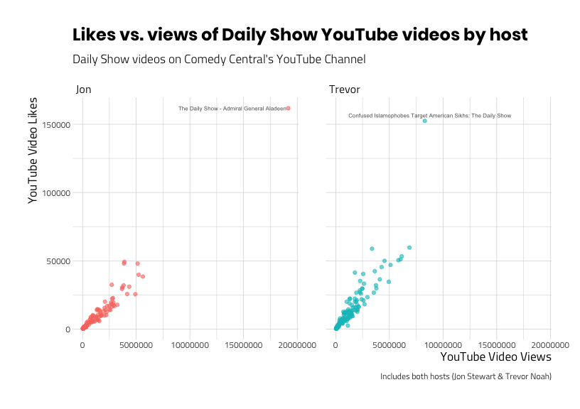

32 - Correlations with corrr
================

Load packages below.

``` r
library(magrittr) # Pipes %>%, %T>% and equals(), extract().
library(tidyverse) # all tidyverse packages
library(fs) # file management functions
library(fivethirtyeight)
library(mdsr) # modern data science with R
library(broom) # tidying models
library(modelr) # modelr package
library(ggrepel) # repel text overlay in graphs
library(gridExtra) # arrange multiple plots
library(grid) # text for graph title
library(egg) # for ggarrange
library(corrr) # correlations
library(skimr) # summaries 
library(hrbrthemes) # themes for graphs
```

# Exploring correlations with the `corrr` package

This post will cover how to measure the relationship between two numeric
variables with the [`corrr`
package](https://cran.r-project.org/web/packages/corrr/vignettes/using-corrr.html).
This tutorial will look at how to assess a variable’s distribution using
[skewness](https://en.wikipedia.org/wiki/Skewness) and
[normality](https://en.wikipedia.org/wiki/Normal_distribution). Then
we’ll examine the relationship between two variables by looking at the
[covariance](https://en.wikipedia.org/wiki/Covariance) and the
[correlation
coefficient](https://en.wikipedia.org/wiki/Correlation_coefficient).

## Load the packages

The packages we’ll be using in this tutorial is below:

``` r
library(egg) # for ggarrange
library(inspectdf) # check entire data.frame for variable types, etc.
library(visdat) # visualize missing data
library(skimr) # eda for entire data.frame
library(corrr) # correlations
library(skimr) # summaries 
library(hrbrthemes) # themes for graphs
library(tidyverse) # all tidyverse packages
library(tidymodels) # meta package for modeling
library(psych) # for skewness and kurtosis
library(socviz) # for %nin%
```

## Set a graph theme

This will give us a little customization for the graphs we’ll be
producing. If you want to learn more about `ggplot2`, check out [our
tutorial
here](http://www.storybench.org/getting-started-data-visualization-r-using-ggplot2/).

``` r
# set the theme to theme_light
ggplot2::theme_set(theme_ipsum_tw(base_family = "Titillium Web",
                         base_size = 9, 
                         plot_title_family = "Poppins",
                         axis_title_size = 13))
```

# Import the data

We covered how to access data using the
[`tuber`](https://cran.r-project.org/web/packages/tuber/vignettes/tuber-ex.html)
in a [previous
tutorial](http://www.storybench.org/how-to-download-youtube-data-in-r-using-tuber-and-purrr/).
For this tutorial, we will be using the YouTube videos in two playlists:

1.  [The Daily Show with Trevor Noah - 148
    videos](https://www.youtube.com/playlist?list=PLD7nPL1U-R5poNaQDb9HqN4eJiY1aXF6c)

2.  [The Daily Show with Jon Stewart - 117
    videos](https://www.youtube.com/playlist?list=PL084A0469320C57B1)

If you’d like to see the script for how we downloaded and imported these
data, they’re in a [gist
here](https://gist.github.com/mjfrigaard/f239619762f466ce947aabea00379e99).

``` r
# fs::dir_tree("data", regex = "DailyShow")
DailyShowYouTube <- readr::read_csv("data/2019-09-30-DailyShowYouTube.csv")
DailyShowYouTube %>% dplyr::glimpse(78)
```

    #>  Observations: 251
    #>  Variables: 9
    #>  $ published_at  <dttm> 2015-10-05 23:57:09, 2014-12-05 17:01:33, 2014-09-23…
    #>  $ dislike_count <dbl> 11184, 1065, 722, 2469, 654, 917, 547, 2846, 1449, 22…
    #>  $ url           <chr> "https://i.ytimg.com/vi/yEPSJF7BYOo/default.jpg", "ht…
    #>  $ id            <chr> "yEPSJF7BYOo", "AHO1a1kvZGo", "lPgZfhnCAdI", "9pOiOhx…
    #>  $ comment_count <dbl> 8130, 2486, 3616, 17629, 2689, 2704, 1887, 3422, 6229…
    #>  $ title         <chr> "The Daily Show - Admiral General Aladeen", "The Dail…
    #>  $ view_count    <dbl> 19159013, 5624319, 5223787, 5134669, 4920942, 4347723…
    #>  $ like_count    <dbl> 161732, 38442, 39755, 47906, 25499, 30986, 25640, 492…
    #>  $ host          <chr> "Jon", "Jon", "Jon", "Jon", "Jon", "Jon", "Jon", "Jon…

# Visualizations

The `DailyShowYouTube` contains 9 variables. Some of these are meta data
for the videos in the playlist (`id`, `url`, and `published_at`), others
contain information on the video related to viewership (`dislike_count`,
`comment_count`, `view_count`, and `like_count`). For more information
on these variables, check out the [YouTube API
documentation](https://developers.google.com/youtube/v3/getting-started).

In this section, we’re going to use visualizations to help us understand
how much two numeric variables are related, or how much they are
*correlated*. We’ll start by visualizing variables by themselves, then
move into bivariate (two-variable) graphs. The
[`skimr`](https://ropensci.github.io/skimr/) and
[`inspectdf`](https://alastairrushworth.github.io/inspectdf/) packages
allow us to take a quick look at an entire data frame or sets of
variables.

Below is a `skimr::skim()` of the `DailyShowYouTube` `data.frame`.

``` r
skimr::skim(DailyShowYouTube)
```

|                                                  |                  |
| :----------------------------------------------- | :--------------- |
| Name                                             | DailyShowYouTube |
| Number of rows                                   | 251              |
| Number of columns                                | 9                |
| \_\_\_\_\_\_\_\_\_\_\_\_\_\_\_\_\_\_\_\_\_\_\_   |                  |
| Column type frequency:                           |                  |
| character                                        | 4                |
| numeric                                          | 4                |
| POSIXct                                          | 1                |
| \_\_\_\_\_\_\_\_\_\_\_\_\_\_\_\_\_\_\_\_\_\_\_\_ |                  |
| Group variables                                  | None             |

Data summary

**Variable type: character**

| skim\_variable | n\_missing | complete\_rate | min | max | empty | n\_unique | whitespace |
| :------------- | ---------: | -------------: | --: | --: | ----: | --------: | ---------: |
| url            |          0 |              1 |  46 |  46 |     0 |       251 |          0 |
| id             |          0 |              1 |  11 |  11 |     0 |       251 |          0 |
| title          |          0 |              1 |  22 |  96 |     0 |       251 |          0 |
| host           |          0 |              1 |   3 |   6 |     0 |         2 |          0 |

**Variable type: numeric**

| skim\_variable | n\_missing | complete\_rate |       mean |         sd |    p0 |      p25 |     p50 |       p75 |     p100 | hist  |
| :------------- | ---------: | -------------: | ---------: | ---------: | ----: | -------: | ------: | --------: | -------: | :---- |
| dislike\_count |          0 |              1 |     805.33 |    1705.74 |     3 |     68.5 |     290 |     831.5 |    19236 | ▇▁▁▁▁ |
| comment\_count |          0 |              1 |    1356.73 |    2206.23 |     2 |    159.5 |     706 |    1473.0 |    17919 | ▇▁▁▁▁ |
| view\_count    |          0 |              1 | 1454472.85 | 1830174.80 | 35414 | 272979.5 | 1011540 | 2011034.5 | 19159013 | ▇▁▁▁▁ |
| like\_count    |          0 |              1 |   13113.58 |   18170.41 |   182 |   2131.5 |    8392 |   16586.0 |   161732 | ▇▁▁▁▁ |

**Variable type: POSIXct**

| skim\_variable | n\_missing | complete\_rate | min                 | max                 | median              | n\_unique |
| :------------- | ---------: | -------------: | :------------------ | :------------------ | :------------------ | --------: |
| published\_at  |          0 |              1 | 2013-04-24 10:02:53 | 2016-11-09 02:32:36 | 2015-10-23 15:39:54 |       250 |

### Variation

The amount a variable varies represents the amount of uncertainty we
have in a particular phenomena or measurement. We use numbers like
variance, standard deviation, and interquartile range to represent the
‘spread’ or the
[dispertion](https://en.wikipedia.org/wiki/Statistical_dispersion) of
values for a particular variable. In contrast to the ‘spread’, a
variable’s ‘middle’ is represented using numbers like the mean, median,
and mode. These measure the [central
tendency](https://en.wikipedia.org/wiki/Central_tendency) (i.e. the
middle) of a variable’s distribution. We’ll explore these topics further
below in visualizations.

### Skewness & Kurtosis

We want to use specific terms to describe what a variable distribution
looks like because this will give us some precision in what we’re
seeing. The `skimr::skim()` output above shows us four numeric variables
(`dislike_count`, `comment_count`, `view_count`, and `like_count`), and
the `hist` variable tells us these variables are skewed.

[Skewness refers](https://en.wikipedia.org/wiki/Skewness) to the
distribution of a variable that is not symmetrical. It’s hard to see in
the `hist` column above because it’s small, so we’ll use the
`inspectdf::inspect_num()` to look at the skewness and kurtosis of these
numeric `_count` variables.

``` r
# define labs first so we are thinking about what to expect on the graph!
hist_labs <- ggplot2::labs(
    title = "Comments, Dislikes, Likes, & Views of Daily Show videos",
    x = "Counts",
    y = "Probability distribution",
    subtitle = "Numeric variables in Daily Show YouTube meta data",
    caption = "Includes both hosts (Jon Stewart & Trevor Noah)"
)
```

``` r
# Now we plot!
inspect_num_v1 <- inspectdf::inspect_num(DailyShowYouTube) %>% 
                      inspectdf::show_plot(x = ., 
                                           high_cardinality = TRUE,
                                           plot_layout = c(2, 2)) + # this gives 
                                                                    # us a 2x2
                      hist_labs
```

    #>  [1] 1
    #>  [1] 2
    #>  [1] 3
    #>  [1] 4

``` r
inspect_num_v1
```

<!-- -->

The graphs above display variables that are ‘positively skewed’, which
means the bulk of the data are piled up near the lower values. The
compliment to skewness is
[kurtosis](https://en.wikipedia.org/wiki/Kurtosis), which is used to
measure how the data is distributed in the tail of a distribution. Both
skewness and kurtosis can be calculated using the `psych::describe()`
function. I limit the output below to the `mean`, `sd`, `min`, `median`,
`max`, `skew`, and `kurtosis`.

``` r
knitr::kable(
DailyShowYouTube %>% 
    dplyr::select(like_count, 
                  view_count) %>% 
    psych::describe(x = .) %>% 
    dplyr::select(mean, sd, min, median, 
                  max, skew, kurtosis)
)
```

|             |       mean |         sd |   min |  median |      max |     skew | kurtosis |
| ----------- | ---------: | ---------: | ----: | ------: | -------: | -------: | -------: |
| like\_count |   13113.58 |   18170.41 |   182 |    8392 |   161732 | 4.432921 | 29.75917 |
| view\_count | 1454472.85 | 1830174.80 | 35414 | 1011540 | 19159013 | 4.353605 | 34.17134 |

These numbers tell us the skewness and kurtosis are both positive, but
that doesn’t mean much until we discuss normality.

### Normality

[Normality](https://en.wikipedia.org/wiki/Normal_distribution) is
another tool we can use to help describe a variables distribution.
Normal in this case refers to how bell-shaped the distribution looks.
Normally distributed variables have a skewness and kurtosis of `0`. As
we can imagine, variables with high values for skewness and kurtosis
won’t be normal because those values are telling us the distribution
isn’t symmetrical.

*Why are we doing this?*

The more we understand about each variable’s distribution, the more
equipped we’ll be in predicting how the values in one variable
correspond to the values in another variable.

Let’s narrow our dataset down to just two variables: YouTube video views
and likes. Examine the graphs below.

``` r
# define labs first!
hist_labs_v2 <- ggplot2::labs(
    title = "Likes and Views of Daily Show YouTube videos",
    x = "Counts",
    y = "Probability distribution",
    subtitle = "Numeric variables in Daily Show YouTube meta data",
    caption = "Includes both hosts (Jon Stewart & Trevor Noah)"
)
# Now we plot!
inspect_num_v2 <-  DailyShowYouTube %>% 
    dplyr::select(like_count, 
                  view_count) %>% 
    inspectdf::inspect_num(df1 = .) %>% 
                      inspectdf::show_plot(x = .) + # this gives 
                      hist_labs_v2                  # us a 2x2
```

    #>  [1] 1
    #>  [1] 2

``` r
inspect_num_v2
```

<!-- -->

We know both `view_count` and `like_count` are have positive skewness
and kurtosis, but to what degree are these two variables related?

## The relationship between views and likes

*How do we measure relationships between variables?*

When two variables are related, that means changes in one variable
result with similar changes in the second variable. In math terms, this
is referred to as **covariance.** If variance is how much a single
variable *varies from the mean*, then covariance is how much *two
variables vary together*. I really like Hadley Wickham’s description of
[covariation in R for Data
Science](https://r4ds.had.co.nz/exploratory-data-analysis.html#covariation),

> Covariation is the tendency for the values of two or more variables to
> vary together in a related way. - Wickham and Grolemund

If you think about it, the variation of a single variable is not very
helpful by itself. But if we can *describe* or *account* for ‘spread’ in
one variable with the ‘spread’ from another, we can make estimations
about one number when we have information on the other.

So if we want to know if the videos that have a high number of views are
the same videos that also have a high number of likes? We couldn’t tell
from the histograms, but we can combine the two variables on a single
plot to answer this question.

### Scatter plots

Recall that most of the values for views and likes are low, but this
does not necessarily mean they are similar. For example, the mean value
for `view_count` is much higher than the mean value for `like_count`
(`13,113.58` vs. `1,454,472.85`). If we compare the maximum values
(i.e. the extreme values at the tails), we can see the maximum value
for `view_count` is `19,159,013` vs. a maximum value of `161,732` for
`like_count`.

The scatter plot below will show us if there is a pattern between Daily
Show YouTube video views and likes.

``` r
# labels 
point_labs_v1 <- ggplot2::labs(
    title = "Likes vs. Views of Daily Show YouTube videos",
    x = "YouTube Video Views",
    y = "YouTube Video Likes",
    subtitle = "Daily Show videos on Comedy Central's YouTube Channel",
    caption = "Includes both hosts (Jon Stewart & Trevor Noah)")
# scatter plot
ggp_scatter_v1 <- DailyShowYouTube %>% 
    ggplot2::ggplot(aes(x = view_count, 
                        y = like_count)) + 
    ggplot2::geom_point(alpha = 3/5) + 
    point_labs_v1
ggp_scatter_v1
```

<!-- -->

This pattern looks like we might be able to predict some of the values
of `like_count` with values from `view_count`, but how well? We need to
explore these data more with additional visualizations. For example,
let’s add labels to the two videos with more than 150,000 likes to
identify the extreme values on the graph.

### Outliers

First we will filter these data out, then we plot them using another
layer from `ggplot2`.

``` r
# first we create some data sets for the top views and likes 
TopDailyShowLikes <- DailyShowYouTube %>% 
    dplyr::filter(like_count >= 150000)

# then we plot the point with some text 
ggp_scatter_v2 <- ggp_scatter_v1 +
  # add labels to states
  geom_text_repel(
    data = TopDailyShowLikes, 
    aes(label = title),
    # size of text
    size = 2.1,
    # opacity of the text
    alpha = 7 / 10,
    # in case there is overplotting
    arrow = arrow(
      length = unit(0.05, "inches"),
      type = "open",
      ends = "last"
    ),
    show.legend = FALSE
  ) 
ggp_scatter_v2
```

<!-- -->

It looks like *“The Daily Show - Admiral General Aladeen”* and *Confused
Islamophobes Target American Sikhs: The Daily Show* videos are outliers
in terms of views and likes. Should we keep these videos in the data
set? Well, we can be pretty sure these data haven’t been entered
incorrectly. So if the values are legitimate, is there something about
the videos that makes them different from the population (the other
videos) we’re investigating?

Recall that we’re still including videos of the Daily Show with two
different hosts (`Jon` and `Trevor`). What happens when we facet the
scatter plot about the two `host`s?

``` r
# labels 
point_labs_v3 <- ggplot2::labs(
    title = "Likes vs. views of Daily Show YouTube videos by host",
    x = "YouTube Video Views",
    y = "YouTube Video Likes",
    subtitle = "Daily Show videos on Comedy Central's YouTube Channel",
    caption = "Includes both hosts (Jon Stewart & Trevor Noah)")
# scatter with facet
ggp_scatter_v3 <- DailyShowYouTube %>% 
    ggplot2::ggplot(aes(x = view_count, 
                        y = like_count,
                        group = host)) + 
    ggplot2::geom_point(aes(color = host), 
                        alpha = 3/5, 
                        show.legend = FALSE) + 
    # add labels to states
    geom_text_repel(
    data = TopDailyShowLikes, 
    aes(label = title),
    # size of text
    size = 2.1,
    # opacity of the text
    alpha = 7 / 10,
    # in case there is overplotting
    arrow = arrow(
      length = unit(0.05, "inches"),
      type = "open",
      ends = "last")) + 
    facet_wrap(. ~ host) + 
    point_labs_v3
ggp_scatter_v3
```

<!-- -->

Now we can see that each host has their own extreme value. We can also
see that the relationship between views and likes appear similar (as one
goes up, so does the other) for both hosts.

I think we can assume these two videos are different in a meaningful way
from the rest of the videos in the playlists (and we can explore the
details of why this might be later). But for now, we’ll remove the
videos and look at the relationship between views and likes without
them.

``` r
# labels 
point_labs_v4 <- ggplot2::labs(
    title = "Likes vs. views of Daily Show YouTube videos by host",
    x = "YouTube Video Views",
    y = "YouTube Video Likes",
    subtitle = "Daily Show videos on Comedy Central's YouTube Channel",
    caption = "Removed outlier videos (> 150,000 likes)")
# outliers
outliers <- c("yEPSJF7BYOo", "RskvZgc_s9g")
# create correlation data 
DailyShowCorr <- DailyShowYouTube %>% 
    dplyr::filter(id %nin% outliers)
# scatter
ggp_scatter_v4 <- DailyShowCorr %>% 
    ggplot2::ggplot(aes(x = view_count, 
                        y = like_count,
                        group = host)) + 
    ggplot2::geom_point(aes(color = host), 
                        alpha = 3/5, 
                        show.legend = FALSE) + 
    facet_wrap(. ~ host) + 
    point_labs_v4
ggp_scatter_v4
```

<!-- -->

This shows a pattern that indicates a positive relationship between
viewing a video and liking a video. Can we show this numerically? How
about if we calculate the covariance for each host?

### Covariance

We will calculate the level of covariation between the two variables
using `mosaic::cov()`. but after we’ve split the data frame by `host`
into two datasets.

``` r
# split these data by host
daily_split_list <- DailyShowCorr %>% 
    dplyr::group_split(host, keep = TRUE)
daily_split_list[[1]] -> JonDailyShowCorr 
daily_split_list[[2]] -> TrevorDailyShowCorr
# calculate covariance for Trevor
mosaic::cov(x = TrevorDailyShowCorr$view_count, 
            y = TrevorDailyShowCorr$like_count)
```

    #>  [1] 17812574567

``` r
# calculate covariance for Jon
mosaic::cov(x = JonDailyShowCorr$view_count, 
            y = JonDailyShowCorr$like_count)
```

    #>  [1] 14484129962

These large positive numbers tell us that as `view_count` deviates from
it’s mean, `like_count` deviates from it’s mean in the same direction.
However, using the covariance can get us into trouble because it assumes
both variables are on the same scale. In practice, we typically want to
know how two variables on *different* scales relate to one
another–that’s where calculating a correlation coefficient comes in
handy.

## Correlation coefficients

We will cover two types of correlation coefficients (there are more),
but both of these values lie between `− 1` and `+ 1`. The first measure
we’ll cover, the [Pearson correlation
coefficient](https://en.wikipedia.org/wiki/Pearson_correlation_coefficient),
is the most common, but also has some assumptions that need to be met in
order for the results to be reliable.

If the assumptions of normality are violated (as they are in our data)
the [Spearman’s correlation
coefficient](https://en.wikipedia.org/wiki/Spearman%27s_rank_correlation_coefficient)
can be used because it doesn’t have the same assumptions for both
variables.

### Using `corrr`

The [`corrr` package from
`tidymodels`](https://github.com/tidymodels/corrr) let’s us explore
correlations using `tidyverse` principles. We’ll start with the
`JonDailyShowCorr` data, which is all the videos in the playlist (minus
the *“The Daily Show - Admiral General Aladeen”* video).

``` r
JonDailyShowCorr %>% glimpse(78)
```

    #>  Observations: 110
    #>  Variables: 9
    #>  $ published_at  <dttm> 2014-12-05 17:01:33, 2014-09-23 22:12:10, 2013-04-24…
    #>  $ dislike_count <dbl> 1065, 722, 2469, 654, 917, 547, 2846, 1449, 2295, 102…
    #>  $ url           <chr> "https://i.ytimg.com/vi/AHO1a1kvZGo/default.jpg", "ht…
    #>  $ id            <chr> "AHO1a1kvZGo", "lPgZfhnCAdI", "9pOiOhxujsE", "aqzzWr3…
    #>  $ comment_count <dbl> 2486, 3616, 17629, 2689, 2704, 1887, 3422, 6229, 4522…
    #>  $ title         <chr> "The Daily Show - Spot the Africa", "The Daily Show -…
    #>  $ view_count    <dbl> 5624319, 5223787, 5134669, 4920942, 4347723, 4160610,…
    #>  $ like_count    <dbl> 38442, 39755, 47906, 25499, 30986, 25640, 49200, 4794…
    #>  $ host          <chr> "Jon", "Jon", "Jon", "Jon", "Jon", "Jon", "Jon", "Jon…

To use `corrr::correlate()`, we select only those two variables we want
to calculate a correlation coefficient for and stored the output in
`JonPearsonCorDf`

``` r
JonPearsonCorDf <- JonDailyShowCorr %>% 
    dplyr::select(c(view_count, 
                    like_count)) %>% 
    corrr::correlate(x = .) 
```

    #>  
    #>  Correlation method: 'pearson'
    #>  Missing treated using: 'pairwise.complete.obs'

The message we get from the output tells us the following:

  - `Correlation method: 'pearson'` = The reason we spent all that time
    looking at the variable distributions is because the Pearson
    correlation coefficient assumes normality. The Pearson method has
    some assumptions which we will address below.

  - `Missing treated using: 'pairwise.complete.obs'` = This is telling
    us how the missing values are going to dealt with. If we recall the
    `skimr::skim()` output, we have no missing data, so this doesn’t
    apply.

### Pearson’s correlation assumptions

The most commonly used correlation coefficient is the ‘Pearson
product-moment correlation coefficient’ or ‘Pearson correlation
coefficient’ or just *r*. One of the assumptions of this test is that
the sampling distribution is normally distributed (or that our sample is
normally distributed). Neither of these are true. Fortunately, we have
another option for calculating a correlation.

One option is to log transform both variables using `dplyr::mutate()`.
Log transforming will make positively skewed variables more normally
distributed, as we demonstrate in descriptive statistics below.

``` r
DailyShowYouTubeCorr <- DailyShowYouTube %>% 
    dplyr::mutate(log_view_count = log(view_count), 
                  log_like_count = log(like_count))
```

``` r
knitr::kable(
DailyShowYouTubeCorr %>% 
    dplyr::select(log_view_count,
                  view_count,
                  log_like_count,
                  like_count) %>% 
    psych::describe(x = .) %>% 
    dplyr::select(mean, sd, min, median, 
                  max, skew, kurtosis))
```

|                  |           mean |             sd |          min |         median |            max |        skew |    kurtosis |
| ---------------- | -------------: | -------------: | -----------: | -------------: | -------------: | ----------: | ----------: |
| log\_view\_count |      13.459371 |       1.381061 |    10.474863 |      13.826985 |       16.76828 | \-0.4486365 | \-0.7596921 |
| view\_count      | 1454472.852590 | 1830174.800671 | 35414.000000 | 1011540.000000 | 19159013.00000 |   4.3536048 |  34.1713438 |
| log\_like\_count |       8.673024 |       1.464940 |     5.204007 |       9.035034 |       11.99370 | \-0.5084212 | \-0.5494696 |
| like\_count      |   13113.577689 |   18170.413169 |   182.000000 |    8392.000000 |   161732.00000 |   4.4329210 |  29.7591664 |

Although the numbers for `skew` and `kurtosis` became negative, they are
closer to 0 (which represents a normally distributed variable). We can
see the results of this transformation when we create a scatter plot of
the transformed variables.

``` r
# labels 
point_labs_v5 <- ggplot2::labs(
    title = "Likes vs. Views of Daily Show YouTube videos",
    x = "Log Transformed YouTube Video Views",
    y = "Log Transformed YouTube Video Likes",
    subtitle = "Daily Show videos on Comedy Central's YouTube Channel",
    caption = "Log transformed variables")
# scatter plot
ggp_scatter_v5 <- DailyShowYouTubeCorr %>% 
    ggplot2::ggplot(aes(x = log_view_count, 
                        y = log_like_count)) + 
    ggplot2::geom_point(alpha = 3/5) + 
    point_labs_v5
ggp_scatter_v5
```

<!-- -->

We can see this is a much clearer pattern (the line appears more
straight), and the outliers have disappeared.

*Why shouldn’t you transform your variables?*

First off, taking the logarithm of a variable changes the question
you’re asking, and you’ll have to be very careful about interpreting
the results. Fortunately there are other options.

### Spearman’s Rho

The [Spearman’s rank correlation
coefficient](https://en.wikipedia.org/wiki/Spearman's_rank_correlation_coefficient)
or Spearman’s Rho is essentially the same calculation as the Pearson
correlation coefficient, only it ranks all of the values first. Ranking
removes some of the extreme distances between values, essentially
removing any underlying concerns of variable distributions.

We’ll apply the `corrr::correlate()` function to `view_count` and
`like_count` in the `JonDailyShowCorr` and `TrevorDailyShowCorr`
`data.frame`s and specify the `"method = spearman"`.

``` r
JonSpearmanCorDf <- JonDailyShowCorr %>% 
    dplyr::select(c(view_count, 
                    like_count)) %>% 
    corrr::correlate(x = ., 
                     method = "spearman") 
```

    #>  
    #>  Correlation method: 'spearman'
    #>  Missing treated using: 'pairwise.complete.obs'

| rowname     | view\_count | like\_count |
| :---------- | ----------: | ----------: |
| view\_count |          NA |   0.9788202 |
| like\_count |   0.9788202 |          NA |

``` r
TrevorSpearmanCorDf <- TrevorDailyShowCorr %>% 
    dplyr::select(c(view_count, 
                    like_count)) %>% 
    corrr::correlate(x = ., 
                     method = "spearman") 
```

    #>  
    #>  Correlation method: 'spearman'
    #>  Missing treated using: 'pairwise.complete.obs'

| rowname     | view\_count | like\_count |
| :---------- | ----------: | ----------: |
| view\_count |          NA |   0.9554851 |
| like\_count |   0.9554851 |          NA |

We can see there is a very high correlation between viewing and liking
videos for both hosts. It looks like the correlation between views and
likes in Jon Stewart’s videos is slightly higher (`0.9788202`) than the
correlation coefficient in Trevor Noah’s videos (`0.9554851`).

### Correlations for \> 2 variables

We just looked at bivariate correlations between views and likes, but
what if we wanted to check the correlations between *all* four numeric
variables (`dislike_count`, `comment_count`, `view_count`, and
`like_count`)?

We can do that by passing all the numeric variables to
`corrr::correlate()`, only this time we will add `quiet = TRUE` to leave
the message out. We’ll also add the `corrr::rearrange()` and sort the
table contents according to the highest correlations with (`method =
"MDS"` and `absolute = FALSE`).

``` r
JonDailyShowCorrDfAll <- JonDailyShowCorr %>% 
    dplyr::select_if(is.numeric) %>% 
    corrr::correlate(x = ., 
                     method = "spearman", 
                     quiet = TRUE) %>% 
    corrr::rearrange(x = ., 
                     method = "MDS", 
                     absolute = FALSE)
```

    #>  Registered S3 method overwritten by 'seriation':
    #>    method         from 
    #>    reorder.hclust gclus

| rowname        | view\_count | like\_count | comment\_count | dislike\_count |
| :------------- | ----------: | ----------: | -------------: | -------------: |
| view\_count    |          NA |   0.9788202 |      0.8665394 |      0.8684701 |
| like\_count    |   0.9788202 |          NA |      0.8911861 |      0.8809044 |
| comment\_count |   0.8665394 |   0.8911861 |             NA |      0.9477941 |
| dislike\_count |   0.8684701 |   0.8809044 |      0.9477941 |             NA |

``` r
TrevorDailyShowCorrDfAll <- TrevorDailyShowCorr %>% 
    dplyr::select_if(is.numeric) %>% 
    corrr::correlate(x = ., 
                     method = "spearman", 
                     quiet = TRUE) %>% 
    corrr::rearrange(x = ., 
                     method = "MDS", 
                     absolute = FALSE)
```

| rowname        | dislike\_count | comment\_count | like\_count | view\_count |
| :------------- | -------------: | -------------: | ----------: | ----------: |
| dislike\_count |             NA |      0.9574204 |   0.8981760 |   0.8657234 |
| comment\_count |      0.9574204 |             NA |   0.9330886 |   0.8767787 |
| like\_count    |      0.8981760 |      0.9330886 |          NA |   0.9554851 |
| view\_count    |      0.8657234 |      0.8767787 |   0.9554851 |          NA |

The highest correlation for Jon Stewart’s YouTube videos was between the
views and likes (`0.9788202`), while the highest correlation for Trevor
Noah’s videos was between dislikes and comments (`0.9574204`).

### Graphing correlations

The `corrr` package has a few graphing options for visualizing
correlations. These are additional to the graphs we created with
`ggplot2` above.

#### The rplot

The `rplot` plots a correlation `data.frame` using `ggplot2` (and we can
add labels to it). This graph has x and y axes, and plots the
intersection for the variables from the `cor_df` (a correlation
`data.frame`).

``` r
# labels 
rplot_labs_v1 <- ggplot2::labs(
    title = "Correlations between Jon Stewart's likes, dislikes, comments, and views",
    subtitle = "YouTube videos of The Daily Show playlist",
    caption = "Data accessed from YouTube API")
JonDailyShowCorrDfAll %>% 
  corrr::rplot(rdf = ., shape = 19,
               colors = c("yellow", 
                          "purple")) + 
    rplot_labs_v1
```

<!-- -->

As we can see, the hue of the color and the size of the point indicate
the level of the correlation. We can also remove the redundant
correlations from the table with `corrr::shave()`.

``` r
knitr::kable(
JonDailyShowCorrDfAll %>% 
    corrr::shave(x = .)
)
```

| rowname        | view\_count | like\_count | comment\_count | dislike\_count |
| :------------- | ----------: | ----------: | -------------: | -------------: |
| view\_count    |          NA |          NA |             NA |             NA |
| like\_count    |   0.9788202 |          NA |             NA |             NA |
| comment\_count |   0.8665394 |   0.8911861 |             NA |             NA |
| dislike\_count |   0.8684701 |   0.8809044 |      0.9477941 |             NA |

#### Network plot

The second graph options from `corrr` is the `corrr::network_plot()`
which takes a `cor_df` and returns a graph where “*variables that are
more highly correlated appear closer together and are joined by stronger
paths.*”

``` r
# labels 
network_labs_v1 <- ggplot2::labs(
    title = "Correlations between Trevor Noah's likes, dislikes, comments, and views",
    subtitle = "YouTube videos of The Daily Show playlist",
    caption = "Data accessed from YouTube API")
network_plot_v1 <- TrevorDailyShowCorr %>% 
    dplyr::select_if(is.numeric) %>% 
    corrr::correlate(x = ., 
                     method = "spearman", 
                     quiet = TRUE) %>% 
    corrr::network_plot(rdf = ., 
                        colors = c("firebrick", "white", "dodgerblue"),
                        min_cor = .5) + 
    network_labs_v1
network_plot_v1
```

<!-- -->

This shows us that the strongest correlations are between `view_count`s
and `like_count`s, and the `comment_count`s and `dislike_count`s. The
`corrr::fashion()` function gives us more fancy print options, too.

``` r
knitr::kable(
JonDailyShowCorrDfAll %>% 
    corrr::fashion(x = ., 
                   decimals = 3, 
                   na_print = 0)
)
```

| rowname        | view\_count | like\_count | comment\_count | dislike\_count |
| :------------- | :---------- | :---------- | :------------- | :------------- |
| view\_count    | 0           | .979        | .867           | .868           |
| like\_count    | .979        | 0           | .891           | .881           |
| comment\_count | .867        | .891        | 0              | .948           |
| dislike\_count | .868        | .881        | .948           | 0              |

<!-- # Wrangle  -->

<!-- I want to split the `DailyShowYouTube` on the `host` variable, creating a `JonDailyShow` and `TrevorDailyShow` dataset.  -->

<!-- ```{r split-DailyShowYouTube-by-host} -->

<!-- # create JonDailyShow with only Jon Stewart -->

<!-- JonDailyShow <- DailyShowYouTube %>%  -->

<!--     dplyr::filter(host == "Jon") -->

<!-- # create TrevorDailyShow with only Trevor Noah -->

<!-- TrevorDailyShow <- DailyShowYouTube %>%  -->

<!--     dplyr::filter(host == "Trevor") -->

<!-- ``` -->
