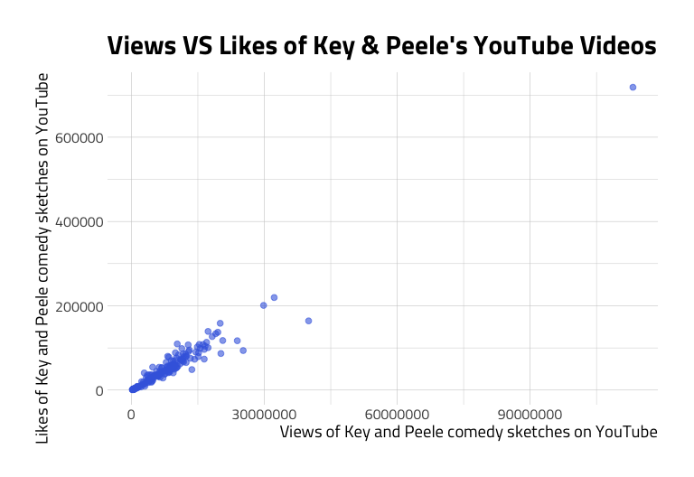

32 - Linear regression models
================

Load packages below.

``` r
library(magrittr) # Pipes %>%, %T>% and equals(), extract().
library(tidyverse) # all tidyverse packages
library(fs) # file management functions
library(fivethirtyeight)
library(mdsr) # modern data science with R
library(broom) # tidying models
library(modelr) # modelr package
library(ggrepel) # repel text overlay in graphs
library(gridExtra) # arrange multiple plots
library(grid) # text for graph title
library(egg) # for ggarrange
library(corrr) # correlations
library(skimr) # summaries 
library(hrbrthemes) # themes for graphs
```

# Linear models

Linear regression is one of the most common models used in statistics.
They’re an excellent point of entry into statistical inference because
they’re relatively easy to graph and visualize. Linear relationships are
pretty intuitive, too. You’ve probably thought of two measurements as a
having a linear relationship and didn’t realize it. In this post, we
will cover the essential elements of linear regression models and how to
use them to make predictions.

## What is a model?

In statistics and data science, the term ‘model’ is used to describe our
best attempt to represent some phenomena with numbers and math. In the
same way that LEGO models provide children a smaller version of reality
to play with, statistical models give us the ability to think about
relationships between things in the real world.

These models give us the ability to make predictions about how the world
works, which is always valuable. For example, Amazon uses machine
learning algorithms to provide you an estimate of when your order
arrives on your doorstep. Netflix and YouTube use data and statistics to
determine and recommend what movies and shows you’ll enjoy.

It’s crucial always to remember that counting and measurement are
tricky, so the models built on those numbers should be interpreted and
applied with caution. We need to remember statistical models are toy
versions of reality. That fact becomes evident when–despite the massive
amounts of data we have–a model fails to make an accurate prediction
(and your Prime order shows up two days late).

If you are wondering why there is so much dependence on statistical
modeling when it’s clear they can still lead us astray? Well, think back
to the LEGOs: children learn a lot about reality by building LEGO
models. In particular, they learn to experiment, and how to implement
trial and error, two major components of science. The quote below
summarizes these aspects quite well,

> “Science is the driving component behind all creations that a child
> has. The foundation of science is to come up with an idea and to prove
> it practically. LEGOs do this naturally through imagination. A child
> simply comes up with an idea then develops it.” - [Preschool
> inspirations](https://preschoolinspirations.com/10-important-skills-children-learn-legos/)

Statistical models are a direct analog of the lessons above. Someone
comes up with an idea, develops the concept into something they can
measure, then they use a model to see how well their idea holds up. More
importantly, statistical models don’t have to *prove* anything to help
us understand the world around us. Consider the wise words from George
Box,

> “Models, of course, are never true, but fortunately, it is only
> necessary that they be useful.” - George Box, [Some Problems of
> Statistics and Everyday
> Life](https://www.tandfonline.com/doi/abs/10.1080/01621459.1979.10481600)

Knowing which models *aren’t* a good representation of reality is as
essential for advancing science as discovering the useful models. As
Karl Popper, the philosopher of science emphasized, there are only a few
ways to get the right model and an infinite number of ways to get it
wrong. Identifying the incorrect model clarifies our thinking and helps
us move forward towards a better understanding. Building and comparing
the results from multiple models allow the best to rise to the top, and
those models that remain after many experiments often turn out to be
quite reliable.

## Visualizing relationships

We will start by visualizing a relationship between two variables.
Before looking at actual data, we should start by getting an idea of
what we should expect to see. For example, let’s consider a headline
from the data journalism site Fivethirtyeight published in 2017 titled,
[“Higher Rates Of Hate Crimes Are Tied To Income
Inequality.”](https://fivethirtyeight.com/features/higher-rates-of-hate-crimes-are-tied-to-income-inequality/).

That headline might give the impression that the article contains
anecdotal information about two fuzzy concepts. But the language is
giving us hints about what the graph of these two measurements might
look like. For instance, “*Higher Rates Of…*” and “*Are Tied To…*”
sounds like “*When this number is high*” and “*so is this number*” So if
we drew a graph of these two measurements with an `x` and `y`
coordinate, it might look like the figure below.

<!-- -->

By convention, we typical call the measurement we’re trying to predict
the **outcome** or **response** variable, and put it on the `y` axis.
The variables we’ll use for explanation or prediction are typically
called (you guessed it) **explanatory** or **predictor** variables, and
we place these numbers on the `x` axis. We agree with [Julian J.
Faraway](https://people.bath.ac.uk/jjf23/) and avoid using the terms
*independent* or *dependent* unless we’ve designed and experiment, but
we will discuss this topic more in a later post.

These could also be linear, but in the other direction:

<!-- -->

Generally, the important part about linear relationships is what the
line represents. But in order to explore this more, we will need some
actual data\!

## Download and import data

The code chunk below downloads and imports the data for this post:

Let’s graph the `outcome` on the `x`, and the `predictor_1` on the `y`,
and draw a line that passes through the mean of the outcome variable. We
can use `skimr` to summarize the `SimData` dataset.

``` r
skim(SimDat)
```

|                                                  |        |
| :----------------------------------------------- | :----- |
| Name                                             | SimDat |
| Number of rows                                   | 10000  |
| Number of columns                                | 3      |
| \_\_\_\_\_\_\_\_\_\_\_\_\_\_\_\_\_\_\_\_\_\_\_   |        |
| Column type frequency:                           |        |
| numeric                                          | 3      |
| \_\_\_\_\_\_\_\_\_\_\_\_\_\_\_\_\_\_\_\_\_\_\_\_ |        |
| Group variables                                  | None   |

Data summary

**Variable type: numeric**

| skim\_variable | n\_missing | complete\_rate | mean |   sd |      p0 |    p25 |  p50 |   p75 |  p100 | hist  |
| :------------- | ---------: | -------------: | ---: | ---: | ------: | -----: | ---: | ----: | ----: | :---- |
| outcome        |          0 |              1 | 2.02 | 3.99 | \-12.40 | \-0.73 | 2.04 |  4.76 | 16.87 | ▁▃▇▃▁ |
| predictor\_1   |          0 |              1 | 2.82 | 4.04 | \-10.77 |   0.15 | 2.80 |  5.54 | 20.45 | ▁▆▇▂▁ |
| predictor\_2   |          0 |              1 | 8.16 | 5.95 |    0.00 |   3.37 | 7.12 | 11.84 | 38.67 | ▇▅▂▁▁ |

We can see the means for the `outcome` and both `predictor_` variables.
Below we’re going to plot the means of `outcome` and `predictor_1` on a
graph using `ggplot2`. First we’ll create a custom `theme` with
`ggplot2::theme_set()` and `hrbrthemes::theme_ipsum_tw()`.

``` r
# set the theme to theme_light
ggplot2::theme_set(theme_ipsum_tw(base_family = "Titillium Web",
                         base_size = 12, 
                         plot_title_family = "Poppins",
                         axis_title_size = 15))
```

Now we can plot the means.

``` r
# define labs first
sim_labs <- ggplot2::labs(
    title = "Simulated outcome and predictor",
    x = "Predictor variable",
    y = "Outcome variable",
    caption = "outcome mean = 2.02, predictor_1 mean = 2.82"
)
# get the summary stats for predictor_1
mean_p1 <- mean(SimDat$predictor_1)
# get the mean for outcome
mean_outcome <- mean(SimDat$outcome)
# plot data 
plot_MeanOutcomePredictor1 <- SimDat %>% 
    # plot the predictor on x
    ggplot2::ggplot(aes(x = predictor_1, 
                        # plot the outcome on y
                        y = outcome)) + 
    # add the mean, min, and max for the outcome variable
    ggplot2::geom_hline(yintercept = mean_outcome, 
                color = "orange") + 
    # add the mean for the predictor_1 variable 
    ggplot2::geom_vline(xintercept = mean_p1,
                color = "green") +
    # add labels
    sim_labs
plot_MeanOutcomePredictor1
```

<!-- -->

The lines on the graph above cross each axis at the means for each
`predictor_1` and `outcome` variable. So, if the mean represents the
‘middle’ of the data points for each measure, we can begin to imagine
where the data points will be when they are added to the graph. Lets add
the actual data points now (before the lines).

``` r
plot_MeanOutcomePredictor1v2 <- plot_MeanOutcomePredictor1 +
    # add the points
    ggplot2::geom_point(alpha = 1/6)

plot_MeanOutcomePredictor1v2
```

<!-- -->

The intersection for these lines looks like it’s right in the middle of
all the points, right? Next we’ll see how well we can predict the
`outcome` with a given value of the `predictor_1`.

I like building plots like this with `ggplot2` because I can understand
how the variables relate to each other iteratively (to learn more about
ggplot2 check out our tutorial
[here](http://www.storybench.org/getting-started-data-visualization-r-using-ggplot2/)).

## Linear models

A linear model tells us how the mean of the `outcome` variable varies
with the `predictor_1` variable. Fortunately for us, `ggplot2` comes
with a `geom` that we can use to fit a linear model through our data
points. The `ggplot2::geom_smooth()` function has a `method` argument,
and we can tell it to use `"lm"`, for linear model.

``` r
plot_MeanOutcomePredictor1v3 <- plot_MeanOutcomePredictor1v2 +
    # add the points
    ggplot2::geom_smooth(method = "lm")
plot_MeanOutcomePredictor1v3
```

<!-- -->

The blue line is the best fit linear (straight line) that goes through
the mean of both the `predictor_1` and the `outcome`. The number of
points above and below this line indicate how well the predictor
variable predicts or explains the `outcome`.

But not all relationships are linear, and it’s important to know what a
non-linear relationship looks like, because assuming two variables have
a linear relationship without visualizing them can get us in trouble. If
we swap out `predictor_1` for `predictor_2` we see an example of a
non-linear relationship.

<!--
<!-- -->

–\>

``` r
# define labs first 
sim_labs2 <- ggplot2::labs(
    title = "Simulated outcome and predictor",
    x = "Predictor variable",
    y = "Outcome variable",
    caption = "outcome mean = 2.02, predictor_2 mean = 8.16"
)
# get the summary stats for predictor_1
mean_p2 <- mean(SimDat$predictor_2)
# plot data 
plot_MeanOutcomePredictor2 <- SimDat %>% 
    # plot the predictor on x
    ggplot2::ggplot(aes(x = predictor_2, 
                        # plot the outcome on y
                        y = outcome)) + 
    # add the mean, min, and max for the outcome variable
    ggplot2::geom_hline(yintercept = mean_outcome, 
                color = "orange") + 
    # add the mean for the predictor_1 variable 
    ggplot2::geom_vline(xintercept = mean_p2,
                color = "green") +
    # add the points
    ggplot2::geom_point(alpha = 1/6) + 
    # add the points
    ggplot2::geom_smooth() +
    # add labels
    sim_labs2
plot_MeanOutcomePredictor2
```

    #>  `geom_smooth()` using method = 'gam' and formula 'y ~ s(x, bs = "cs")'

<!-- -->

As we can see, the swarm of points for these two variables looks very
different than the previous graph. Linear relationships are useful for
prediction and explanation, but only if the underlying data meet the
assumptions for the model. Let’s explore linear models more with some
real life data.

## YouTube comedy sketch data

We will be looking at data from YouTube’s API for this tutorial.

[Key and Peele](https://en.wikipedia.org/wiki/Key_%26_Peele) are a
comedy duo that have been performing since about 2012. Their playlist on
[Comedy Central’s YouTube
channel](https://www.youtube.com/playlist?list=PL83DDC2327BEB616D) has
221 videos.

[Inside Amy Schumer](https://en.wikipedia.org/wiki/Inside_Amy_Schumer)
was a series that ran from April 30, 2013 until June 16, 2016. The
special is available on [Comedy Central’s YouTube
channel](https://www.youtube.com/playlist?list=PLD7nPL1U-R5o_GHb3XEx8XKCjzgCFCTuF)
and consists of 126 videos.

Now that we have an idea for what a linear relationship between these
two variable might look like, we can start graphing the data and see if
it meets our expectations. The data that we’ll be using is from this
[repository](https://github.com/richardcornish/sketch-comedy-data) on
Github. If we do a litle reading of the documentation, we discover both
datasets have the following variables:

<!--
```json
   "statistics": {
    "viewCount": "3057",
    "likeCount": "25",
    "dislikeCount": "0",
    "favoriteCount": "17",
    "commentCount": "12"
}
```
-->

  - `published_at` = date video was published
  - `dislike_count` = number of dislikes
  - `url` = url for video  
  - `id` = id for video
  - `comment_count` = number of comments per video
  - `title` = title of video
  - `view_count` = number of views per video
  - `like_count` = number of likes per video

We can check for the objects using `ls()` to make sure they imported.

``` r
ls()
```

### Wrangling steps

These data don’t need much wrangling, but I like to break out wrangling
into two separate tasks: things I do that change or create entire data
set(s), and 2) things I do that change or create new variables. I
typically have a few variables in mind when I start building
visualizations or models, but this always takes a few steps to get the
variables or data exactly how I want them.

If I frame it this way, it forces me to think about the global changes
that need to happen for me to create the variables I need. Below are two
scripts I use for the two wrangling steps I described above: 1) remove
the Private videos (there are no metrics for these) from both data sets,
2) then create a new variable that helps me identify the `comedian`. The
final step and format the variable names.

``` r
skim(AmySchumer)
```

|                                                  |            |
| :----------------------------------------------- | :--------- |
| Name                                             | AmySchumer |
| Number of rows                                   | 125        |
| Number of columns                                | 8          |
| \_\_\_\_\_\_\_\_\_\_\_\_\_\_\_\_\_\_\_\_\_\_\_   |            |
| Column type frequency:                           |            |
| character                                        | 3          |
| numeric                                          | 4          |
| POSIXct                                          | 1          |
| \_\_\_\_\_\_\_\_\_\_\_\_\_\_\_\_\_\_\_\_\_\_\_\_ |            |
| Group variables                                  | None       |

Data summary

**Variable type: character**

| skim\_variable | n\_missing | complete\_rate | min | max | empty | n\_unique | whitespace |
| :------------- | ---------: | -------------: | --: | --: | ----: | --------: | ---------: |
| url            |          0 |              1 |  43 |  43 |     0 |       125 |          0 |
| id             |          0 |              1 |  11 |  11 |     0 |       125 |          0 |
| title          |          0 |              1 |  24 |  70 |     0 |       125 |          0 |

**Variable type: numeric**

| skim\_variable | n\_missing | complete\_rate |       mean |         sd |     p0 |    p25 |    p50 |     p75 |    p100 | hist  |
| :------------- | ---------: | -------------: | ---------: | ---------: | -----: | -----: | -----: | ------: | ------: | :---- |
| dislike\_count |          0 |              1 |     347.84 |     559.28 |     17 |    107 |    200 |     365 |    4234 | ▇▁▁▁▁ |
| comment\_count |          0 |              1 |     461.66 |     546.41 |     14 |    184 |    285 |     496 |    3678 | ▇▁▁▁▁ |
| view\_count    |          0 |              1 | 1210016.58 | 1026231.20 | 157168 | 673453 | 975479 | 1403797 | 8012180 | ▇▁▁▁▁ |
| like\_count    |          0 |              1 |    5859.96 |    5625.28 |    493 |   3144 |   4436 |    6321 |   39303 | ▇▁▁▁▁ |

**Variable type: POSIXct**

| skim\_variable | n\_missing | complete\_rate | min                 | max                 | median              | n\_unique |
| :------------- | ---------: | -------------: | :------------------ | :------------------ | :------------------ | --------: |
| published\_at  |          0 |              1 | 2013-04-15 21:35:37 | 2016-06-21 18:49:57 | 2015-04-08 15:57:43 |       123 |

``` r
skim(KeyAndPeele)
```

|                                                  |             |
| :----------------------------------------------- | :---------- |
| Name                                             | KeyAndPeele |
| Number of rows                                   | 187         |
| Number of columns                                | 8           |
| \_\_\_\_\_\_\_\_\_\_\_\_\_\_\_\_\_\_\_\_\_\_\_   |             |
| Column type frequency:                           |             |
| character                                        | 3           |
| numeric                                          | 4           |
| POSIXct                                          | 1           |
| \_\_\_\_\_\_\_\_\_\_\_\_\_\_\_\_\_\_\_\_\_\_\_\_ |             |
| Group variables                                  | None        |

Data summary

**Variable type: character**

| skim\_variable | n\_missing | complete\_rate | min | max | empty | n\_unique | whitespace |
| :------------- | ---------: | -------------: | --: | --: | ----: | --------: | ---------: |
| url            |          0 |              1 |  43 |  43 |     0 |       187 |          0 |
| id             |          0 |              1 |  11 |  11 |     0 |       187 |          0 |
| title          |          0 |              1 |  20 |  96 |     0 |       187 |          0 |

**Variable type: numeric**

| skim\_variable | n\_missing | complete\_rate |       mean |         sd |     p0 |       p25 |     p50 |      p75 |      p100 | hist  |
| :------------- | ---------: | -------------: | ---------: | ---------: | -----: | --------: | ------: | -------: | --------: | :---- |
| dislike\_count |          0 |              1 |    1052.19 |    1379.61 |     23 |     326.0 |     780 |     1276 |     14674 | ▇▁▁▁▁ |
| comment\_count |          0 |              1 |    3408.37 |    3973.74 |     43 |     953.5 |    2476 |     4490 |     37367 | ▇▁▁▁▁ |
| view\_count    |          0 |              1 | 8347762.79 | 9981489.29 | 230079 | 3175006.5 | 7356481 | 10546734 | 113228674 | ▇▁▁▁▁ |
| like\_count    |          0 |              1 |   51971.99 |   62823.43 |    966 |   18960.0 |   44026 |    70130 |    718621 | ▇▁▁▁▁ |

**Variable type: POSIXct**

| skim\_variable | n\_missing | complete\_rate | min                 | max                 | median              | n\_unique |
| :------------- | ---------: | -------------: | :------------------ | :------------------ | :------------------ | --------: |
| published\_at  |          0 |              1 | 2011-11-15 22:30:33 | 2016-04-21 21:59:27 | 2012-11-29 03:46:37 |       101 |

I also bind the datasets together and add the following variable to keep
track of who’s data we’re looking at:

  - `comedian` = comedian name

<!-- end list -->

``` r
skim(YouTubeComedyData)
```

|                                                  |                   |
| :----------------------------------------------- | :---------------- |
| Name                                             | YouTubeComedyData |
| Number of rows                                   | 312               |
| Number of columns                                | 9                 |
| \_\_\_\_\_\_\_\_\_\_\_\_\_\_\_\_\_\_\_\_\_\_\_   |                   |
| Column type frequency:                           |                   |
| character                                        | 4                 |
| numeric                                          | 4                 |
| POSIXct                                          | 1                 |
| \_\_\_\_\_\_\_\_\_\_\_\_\_\_\_\_\_\_\_\_\_\_\_\_ |                   |
| Group variables                                  | None              |

Data summary

**Variable type: character**

| skim\_variable | n\_missing | complete\_rate | min | max | empty | n\_unique | whitespace |
| :------------- | ---------: | -------------: | --: | --: | ----: | --------: | ---------: |
| comedian       |          0 |              1 |  11 |  11 |     0 |         2 |          0 |
| url            |          0 |              1 |  43 |  43 |     0 |       312 |          0 |
| id             |          0 |              1 |  11 |  11 |     0 |       312 |          0 |
| title          |          0 |              1 |  20 |  96 |     0 |       312 |          0 |

**Variable type: numeric**

| skim\_variable | n\_missing | complete\_rate |       mean |         sd |     p0 |       p25 |       p50 |        p75 |      p100 | hist  |
| :------------- | ---------: | -------------: | ---------: | ---------: | -----: | --------: | --------: | ---------: | --------: | :---- |
| dislike\_count |          0 |              1 |     770.00 |    1175.82 |     17 |    130.25 |     454.5 |     990.50 |     14674 | ▇▁▁▁▁ |
| comment\_count |          0 |              1 |    2227.80 |    3413.90 |     14 |    270.25 |     812.5 |    3271.25 |     37367 | ▇▁▁▁▁ |
| view\_count    |          0 |              1 | 5488088.83 | 8501705.67 | 157168 | 854050.75 | 2261260.0 | 8467618.00 | 113228674 | ▇▁▁▁▁ |
| like\_count    |          0 |              1 |   33497.62 |   53715.01 |    493 |   3991.00 |   10908.0 |   52171.75 |    718621 | ▇▁▁▁▁ |

**Variable type: POSIXct**

| skim\_variable | n\_missing | complete\_rate | min                 | max                 | median              | n\_unique |
| :------------- | ---------: | -------------: | :------------------ | :------------------ | :------------------ | --------: |
| published\_at  |          0 |              1 | 2011-11-15 22:30:33 | 2016-06-21 18:49:57 | 2013-12-05 21:46:51 |       224 |

## Visualizing YouTube views vs. likes

I love comedy, and YouTube has tons of short clips from my favorite
comedians. I’m curious about the relationship between the number of
times a video is viewed, and how that relates to the number of times a
video receives a ‘like’ (or thumbs up). Why would I assume this
relationship is linear? Good question. I think this might be a linear
relationship because everyone can only like a YouTube video once, and my
personal assumption is most people who view comedy skits are in a happy
mood, so they’ll be more likely to ‘like’ the videos that made them
laugh.

So we’ve loaded data from two comedy acts (technically three people, so
I’ll be referring to each data set as representing an ‘act’) from
YouTube. All of the sketch acts stored in `YouTubeComedyData` data set,
and we also have a data set for each act: `AmySchumer` and
`KeyAndPeele`.

We will start by looking to see if the `YouTubeComedyData` data can help
us figure out if there is a linear relationship between views and likes.

``` r
plot_Views_Likes <- YouTubeComedyData %>% 
    ggplot2::ggplot(aes(
     # views 
    x = view_count,
     # likes
    y = like_count
  )) +
  ggplot2::geom_point(
    size = 2,
    alpha = 6 / 10,
    show.legend = FALSE
  ) +
      # add titles
  ggplot2::labs(
    x = "Views of Amy Schumer and Key & Peele comedy sketches on YouTube",
    y = "Likes of Amy Schumer and Key & Peele comedy sketches on YouTube"
  )
plot_Views_Likes
```

<!-- -->

The relationship looks linear, but this graph isn’t showing us both sets
of comedian data very well. We’ll plot each artist independently to
clear up some of the over-plotting.

``` r
# start with labels
amys_labs <- ggplot2::labs(
        title = "Views VS Likes of Amy Schumer's YouTube Videos",
            x = "Views of Amy Schumer comedy sketches",
            y = "Likes of Amy Schumer comedy sketches") 

plot_AmySchumerViewVsLikes <- AmySchumer %>%  
  ggplot2::ggplot(aes(
     # views 
    x = view_count,
     # likes
    y = like_count
  )) +
  ggplot2::geom_point(
    size = 2,
    alpha = 6 / 10,
    color = "darkred",
    show.legend = FALSE
  ) +
  # add titles
    hrbrthemes::scale_fill_ipsum() + 
    hrbrthemes::theme_ipsum_rc(base_family = "EnvyCodeR", 
                               base_size = 12,
                               axis_title_size = 15,
                               plot_title_size = 18,
                               plot_title_family = "Menlo-Regular") +
    ggplot2::theme(axis.text.x = element_text(hjust = c(0, 0.5, 0.5, 0.5, 1))) +
    ggplot2::theme(legend.position = "Bottom") + 
    amys_labs
plot_AmySchumerViewVsLikes
```

<!-- -->

``` r
# start with labs
kandp_labs <- ggplot2::labs(
  title = "Views VS Likes of Key & Peele's YouTube Videos",
    x = "Views of Key and Peele comedy sketches on YouTube",
    y = "Likes of Key and Peele comedy sketches on YouTube")
# plot 2
plot_KeyAndPeeleViewVsLikes <- KeyAndPeele %>%
  ggplot2::ggplot(aes(
      # views 
    x = view_count,
      # likes
    y = like_count
  )) +
  ggplot2::geom_point(
    size = 2,
    alpha = 6 / 10,
    color = "royalblue",
    show.legend = FALSE
  ) +
  hrbrthemes::scale_color_ipsum() +
  hrbrthemes::scale_fill_ipsum() +
  hrbrthemes::theme_ipsum_tw(base_size = 12,
                             axis_title_size = 14, 
                             plot_title_size = 22) +
  ggplot2::theme(legend.position = "none") +
  # add labs
  kandp_labs
plot_KeyAndPeeleViewVsLikes
```

<!-- -->

This is better because we can see a separate plot for each comedic act,
but we still have the issue of outliers. The relationship between views
and likes certainly looks linear for both sets of videos, but the
maximum values for `view_count` is making it hard to read. The max
`view_count` for `Amy Schumer` is 8012180, and the max `view_count` for
`Key & Peele` is 113228674. Including these max values creates a ton of
empty chart space.

Let’s take a look at the highest views for each video by comedic act,
and label those on the graph.

``` r
# first we create some data sets for the top views and likes 
TopAmyViews <- AmySchumer %>% dplyr::filter(view_count >= 3000000 | 
                                                like_count >= 30000)
plot_AmySchumerViewVsLikesV2 <- AmySchumer %>%  
  ggplot2::ggplot(aes(
     # views 
    x = view_count,
     # likes
    y = like_count
  )) +
  ggplot2::geom_point(
    size = 2,
    alpha = 6 / 10,
    show.legend = FALSE
  ) + 
  # add labels to states
  geom_text_repel(
    data = TopAmyViews, 
    aes(label = title),
    # size of text
    size = 3.5,
    # opacity of the text
    alpha = 7 / 10,
    # in case there is overplotting
    arrow = arrow(
      length = unit(0.05, "inches"),
      type = "open",
      ends = "last"
    ),
    show.legend = FALSE
  ) +
    # add some color for the points
  geom_point(
    data = TopAmyViews, 
    aes(color = title, 
        label = title), 
    show.legend = FALSE) + 
  # add titles
  amys_labs
plot_AmySchumerViewVsLikesV2
```

<!-- -->

``` r
# repeat this for K&P
TopKandPViews <- KeyAndPeele %>% dplyr::filter(view_count >= 30000000 | 
                                                   like_count >= 200000)
plot_KeyAndPeeleViewVsLikesV2 <- KeyAndPeele %>%  
  ggplot2::ggplot(aes(
     # views 
    x = view_count,
     # likes
    y = like_count
  )) +
  ggplot2::geom_point(
    size = 2,
    alpha = 6 / 10,
    show.legend = FALSE
  ) + 
  # add labels to states
  geom_text_repel(
    data = TopKandPViews, 
    aes(label = title),
    # size of text
    size = 3.5,
    # opacity of the text
    alpha = 7 / 10,
    # in case there is overplotting
    arrow = arrow(
      length = unit(0.05, "inches"),
      type = "open",
      ends = "last"
    ),
    show.legend = FALSE
  ) +
  geom_point(
    data = TopKandPViews, 
    aes(color = title, 
        label = title), 
    show.legend = FALSE) + 
  # add titles
kandp_labs
plot_KeyAndPeeleViewVsLikesV2
```

<!-- -->

Let’s remove these outliers for now, but we’ll revisit the outliers
later.  
\+ For `Amy Schumer`, we will focus on the YouTube data with a
`view_count` of less than `3,000,000` and a `like_count` of less than
`30,000`.  
\+ For the `Key & Peele`, we will be looking at YouTube data with less
than `30,000,000` views `200,000`.

``` r
amy_small_labs <- ggplot2::labs(
    title = "Views VS Likes of Amy Schumer's YouTube Videos",
    subtitle = "Limited to < 3,000,000 Views and < 30,000 Likes",
    x = "Views of comedy sketches on YouTube",
    y = "Likes of comedy sketches on YouTube")
AmySchumerSmall <- AmySchumer %>% 
    dplyr::filter(view_count < 3000000 & like_count < 30000)
plot_AmySchumerSmall <- AmySchumerSmall %>% 
    ggplot2::ggplot(aes(
     # views 
    x = view_count,
     # likes
    y = like_count)) + 
    # points
    ggplot2::geom_point(
        # change opacity
        alpha = 6/10) + 
    # labels
    amy_small_labs
plot_AmySchumerSmall
```

<!-- -->

``` r
kandp_small_labs <- ggplot2::labs(
    title = "Views VS Likes of Key & Peele's YouTube Videos",
    subtitle = "Limited to < 30,000,000 Views and < 200,000 Likes",
    x = "Views of comedy sketches on YouTube",
    y = "Likes of comedy sketches on YouTube")
KeyAndPeeleSmall <- KeyAndPeele %>% 
    dplyr::filter(view_count < 30000000 & like_count < 200000)
plot_KeyAndPeeleSmall <- KeyAndPeeleSmall %>% 
    ggplot2::ggplot(aes(
     # views 
    x = view_count,
     # likes
    y = like_count)) + 
    # points
    ggplot2::geom_point(
        # change opacity
        alpha = 6/10) + 
    # labels
    kandp_small_labs
plot_KeyAndPeeleSmall
```

<!-- -->

Great\! Now we can start understanding the linear relationship between
these variables.

## Checking for correlations with `corrr`

The [`corrr`
package](https://cran.r-project.org/web/packages/corrr/index.html) gives
us the ability to examine the correlation between to variables we assume
are related to one another. These are part of the [`tidymodels`
package](https://github.com/tidymodels/corrr), a meta package for
modeling in the `tidyverse`.

We will use `dplyr::select()` to get the two variables we’re interested
in, `view_count` and `like_count`, then pass these to the
`corrr::correlate()` function. A Pearson correlation is the best option
here because

### Interpreting correlations

``` r
AmySchumerSmallCor <- AmySchumerSmall %>% 
  dplyr::select(view_count, like_count, dislike_count, comment_count) %>% 
  corrr::correlate() 
```

    #>  
    #>  Correlation method: 'pearson'
    #>  Missing treated using: 'pairwise.complete.obs'

``` r
AmySchumerSmallCor
```

### Visualizing correlations

``` r
AmySchumerSmallCor %>%    # Create correlation data frame (cor_df)
  corrr::network_plot(curved = FALSE)  # rearrange by correlations
```

<!-- -->

## Building a linear regression model

### Model syntax

### Model object

### Interpreting model coefficients

## Making predictions

### The `broom` package

### List columns

## Visualizing residuals

## Conclusion
