34.0 - Storybench - Checking linear regression assumptions
================

  - [TLDR](#tldr)
      - [Background](#background)
      - [Getting baseball data](#getting-baseball-data)
      - [Why might you consider running a linear regression
        model?](#why-might-you-consider-running-a-linear-regression-model)
      - [The outcome variable](#the-outcome-variable)
      - [The predictor variable(s)](#the-predictor-variables)
  - [Why do statistical assumptions
    matter?](#why-do-statistical-assumptions-matter)
      - [Independence](#independence)
      - [Normally distributed error
        terms](#normally-distributed-error-terms)
      - [The ‘middle’ and the ‘spread’ in normal
        distributions](#the-middle-and-the-spread-in-normal-distributions)
      - [The quantile-quantile plot](#the-quantile-quantile-plot)
      - [Linearity](#linearity)
      - [Homogeneity of variance](#homogeneity-of-variance)
      - [Scale-location plot](#scale-location-plot)
      - [Plotting influential cases](#plotting-influential-cases)
      - [Cook’s distance plot](#cooks-distance-plot)
      - [Residuals vs. Leverage](#residuals-vs.-leverage)
      - [In closing…package it up into a function or
        package](#in-closingpackage-it-up-into-a-function-or-package)

# TLDR

In this post we’ll cover the assumptions of a linear regression model.
There are a ton of books, blog posts, and lectures covering these topics
in greater depth (and we’ll link to those in the notes at the bottom),
but we wanted to distill some of this information into a single post you
can bookmark and revisit whenever you’re considering running a linear
regression.

## Background

This tutorial is based in part on the excellent book that came out last
year, [“Analyzing Baseball Data with
R”](https://www.amazon.com/Analyzing-Baseball-Data-Chapman-Hall/dp/1466570229)
by Max Marchi, Jim Albert, and Ben Baumer. This is the second edition of
the text, and most of the changes are converting the previous edition to
tidyverse principles. And if you’ve been following along with [Data
Journalism wtih
R](http://www.storybench.org/welcome-to-data-journalism-in-r-2/), you
know that means the code in the book is easier to read and there are
some solid [underlying
principles](https://cran.r-project.org/web/packages/tidyverse/vignettes/manifesto.html).

## Getting baseball data

Baseball is one of the most quantified sports on the planet. Just about
everything gets measured, and thanks to [Sean
Lahman](http://www.seanlahman.com/), those measurements are available to
analyze. The [Lahman R
package](https://cran.r-project.org/web/packages/Lahman/index.html)
contains all the tables from the [‘Sean Lahman Baseball
Database’](http://www.seanlahman.com/baseball-archive/statistics).
Lahman is a hero for sports stats junkies, because he’s worked so hard
to make sports data freely available.

We will need `Lahman` and the `tidyverse` packages for this tutorial, so
we load them below.

``` r
library(Lahman)
library(tidyverse)
library(skimr)
library(inspectdf)
library(janitor)
library(ggrepel)
library(qqplotr)
```

The Washington Nationals just won the World Series on October 30th,
2019. The series went all seven games, and the Nationals miraculously
won all on their games while they were the away team. This is the first
World Series appearance for the Washington Nationals since
[1933](https://en.wikipedia.org/wiki/1933_World_Series) (who were then
known as the Senators).

We are going to explore the relationship between runs and wins for the
1933 Washington Senators, and for the current Washington Nationals.
We’ll extract the historical data leading up the World Series
appearance. The code chunk below identifies the `teamID` for each
Washington team.

``` r
# get the teamID
Lahman::Teams %>%
  dplyr::filter(yearID == 1933 & str_detect(name, "Senators")) %>%
  utils::head()
```

<div class="kable-table">

| yearID | lgID | teamID | franchID | divID | Rank |   G | Ghome |  W |  L | DivWin | WCWin | LgWin | WSWin |   R |   AB |    H | X2B | X3B | HR |  BB |  SO | SB | CS | HBP | SF |  RA |  ER |  ERA | CG | SHO | SV | IPouts |   HA | HRA | BBA | SOA |   E |  DP |    FP | name                | park               | attendance | BPF | PPF | teamIDBR | teamIDlahman45 | teamIDretro |
| -----: | :--- | :----- | :------- | :---- | ---: | --: | ----: | -: | -: | :----- | :---- | :---- | :---- | --: | ---: | ---: | --: | --: | -: | --: | --: | -: | -: | --: | -: | --: | --: | ---: | -: | --: | -: | -----: | ---: | --: | --: | --: | --: | --: | ----: | :------------------ | :----------------- | ---------: | --: | --: | :------- | :------------- | :---------- |
|   1933 | AL   | WS1    | MIN      | NA    |    1 | 153 |    76 | 99 | 53 | NA     | NA    | Y     | N     | 850 | 5524 | 1586 | 281 |  86 | 60 | 539 | 395 | 65 | 50 |  NA | NA | 665 | 590 | 3.82 | 68 |   5 | 26 |   4167 | 1415 |  64 | 452 | 447 | 133 | 149 | 0.978 | Washington Senators | Griffith Stadium I |     437533 |  99 |  98 | WSH      | WS1            | WS1         |

</div>

``` r
Lahman::Teams %>%
  dplyr::filter(yearID == 2018 & str_detect(name, "Nationals")) %>%
  utils::head()
```

<div class="kable-table">

| yearID | lgID | teamID | franchID | divID | Rank |   G | Ghome |  W |  L | DivWin | WCWin | LgWin | WSWin |   R |   AB |    H | X2B | X3B |  HR |  BB |   SO |  SB | CS | HBP | SF |  RA |  ER |  ERA | CG | SHO | SV | IPouts |   HA | HRA | BBA |  SOA |  E |  DP |    FP | name                 | park           | attendance | BPF | PPF | teamIDBR | teamIDlahman45 | teamIDretro |
| -----: | :--- | :----- | :------- | :---- | ---: | --: | ----: | -: | -: | :----- | :---- | :---- | :---- | --: | ---: | ---: | --: | --: | --: | --: | ---: | --: | -: | --: | -: | --: | --: | ---: | -: | --: | -: | -----: | ---: | --: | --: | ---: | -: | --: | ----: | :------------------- | :------------- | ---------: | --: | --: | :------- | :------------- | :---------- |
|   2018 | NL   | WAS    | WSN      | E     |    2 | 162 |    81 | 82 | 80 | N      | N     | N     | N     | 771 | 5517 | 1402 | 284 |  25 | 191 | 631 | 1289 | 119 | 33 |  59 | 40 | 682 | 649 | 4.04 |  2 |   7 | 40 |   4338 | 1320 | 198 | 487 | 1417 | 64 | 115 | 0.989 | Washington Nationals | Nationals Park |    2529604 | 106 | 105 | WSN      | MON            | WAS         |

</div>

Now we head over to the `Teams` table and get the Washington teams
(`WashingtonTeams`) using the `teamID`s.

``` r
washington_teams <- c("WAS", "WS1")
WashingtonTeams <- Lahman::Teams %>%
  dplyr::filter(teamID %in% washington_teams)
```

## Why might you consider running a linear regression model?

Linear regression models are typically used in one of two ways: **1)**
predicting future events given current data, **2)** measuring the effect
of predictor variables on an outcome variable.

The simplest possible mathematical model for a relationship between any
predictor variable (`x`) and an outcome (`y`) is a straight line. We
know that baseball games are won by one team outscoring the another
team, and s teams’ score is based on the number of runs. So it makes
intuitive sense that if a team sores a lot of runs over the course of a
season, it would also have a lot of wins. In the current baseball
example, we’re thinking that as the number of runs goes up, the number
of wins should also go up. Linear relationships don’t have to be
positive. For example, we could also imagine a model where the number of
errors has a negative linear relationship to the number of wins. Linear
regression models are based on the premise that there is a straight line
relationship between two measurements.

The thing we’re trying to predict is usually called the ‘outcome’ or
‘dependent’ variable, and the things we’re using for prediction are
called ‘predictors’, ‘independent’, or ‘explanatory’ variables. I’ll
stick with **outcome** and **predictors** in this tutorial, because I
like to use ‘independent’ and ‘dependent’ when I am referring to
experimentation (where the variables are under control of the
experimenter).

We’re going to be doing the second, because we’re assuming a causal
relationships between runs and wins (i.e. a team wins *because* it
outscores it’s opponent).

## The outcome variable

The **outcome** in this example is the wins, but we want to look at the
number of games each team won as a percentage. A percentage is better
because it gives us the ratio of wins (`W`) to the total games played
(`W + L`), or `wins / (wins + losses)`.

``` r
WashingtonTeams <- WashingtonTeams %>%
  dplyr::mutate(win_perc = W / (W + L))
```

## The predictor variable(s)

In order to predict winning percentage (`win_perc`) from the number of
runs a team scored, we should consider the number of runs a team has
scored against them. For example, if my team scores five runs, but
allows eight runs to be scored against them, then those five runs aren’t
contributing in a positive way to the winning percentage.

Marchi, Albert, and Baumer call this the ‘run differential’, and we can
calculate it using the following code:

``` r
WashingtonTeams <- WashingtonTeams %>%
  dplyr::mutate(run_diff = R - RA)
```

Great\! Now that we have the two variables we’ll be using in our model,
we can start exploring some of the assumptions.

**Spoiler alert:** This example is adapted from the section of the text
on linear regression, so if you’re wanting to learn how to perform
linear models and interpret the output, I suggest reading this section
of the text. Instead, we will be going over some of the assumptions for
linear regression, how to check them, and how to bundle these steps into
a single function call.

# Why do statistical assumptions matter?

Every statistical model is based on a set of assumptions about the world
(more importantly, about the measurements and data from that world).
Linear regression is one of many [parametric
tests](https://en.wikipedia.org/wiki/Parametric_statistics) that assume
the data come from a [normal
distribution](https://en.wikipedia.org/wiki/Normal_distribution).
Parametric models also have assumptions about variation and
independence, (covered below), and they rely on the mean and standard
deviation.

Checking assumptions is important because if the world we’re assuming
the data came from doesn’t track with reality, then the model we’re
using to make predictions is worse than useless–it’s misleading. Models
have no way of telling us that they’re being used incorrectly.

### Independence

Independence is an assumption we can’t really evaluate in a graph.
Independence means each value of the outcome variable comes from a
different source (like a different team). For example, if all the
outcome variables came from the same team, these would all be dependent
on each other. I like to think of this as, “*I shouldn’t be able to
compute the outcome variable using the predictor variables.*”

### Normally distributed error terms

The assumption of normality in regression refers to the errors (or
residuals) in the model, or how well the data fall along the straight
line we’re assuming we can draw between the predictor and outcome.

#### The normal distribution

Before we can assess the assumption of normality, we’ll get an idea for
what a normal distribution looks like. We can do this with `ggplot2`s
`stat_function()` by setting `fun` to `dnorm`. A normal distribution is
usually bell-shaped, and in a standard normal distribution, the mean
would be `0`, and the standard deviation would be `1`. We create this
distribution below.

``` r
NormalData <- data.frame(
  norm_x = stats::rnorm(n = 1000, mean = 0, sd = 1),
  norm_y = stats::rnorm(n = 1000, mean = 1, sd = 3)
)
NormalData %>%
  ggplot2::ggplot(aes(x = norm_x)) +
  ggplot2::stat_function(fun = dnorm) +
  ggplot2::labs(
    title = "The Normal Distribution",
    subtitle = "Mean = 0, SD = 1",
    x = "Random Variable (X)",
    y = "Density (Y)",
    color = "Group factor",
    fill = "Group factor"
  )
```

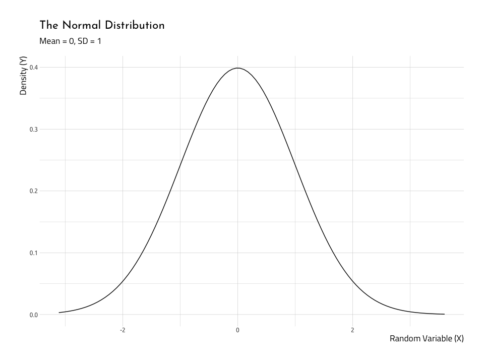<!-- -->

### The ‘middle’ and the ‘spread’ in normal distributions

Its important to point out the shape of the bell changes a lot when we
change the relationship between mean (a measure for the ‘middle’ of the
data) and the standard deviation (the ‘spread’ of the data). We can see
this relationship using [`gganimate`](https://gganimate.com/).

``` r
# fs::dir_ls("figs")
knitr::include_graphics(path = "figs/34.0-normal-means-sds.gif")
```

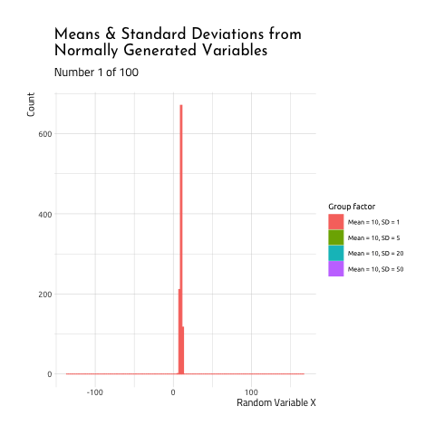<!-- -->

This graphic displays four different sets of data generated using R
[`rnorm`
function](https://stat.ethz.ch/R-manual/R-devel/library/stats/html/Normal.html).
Each number was generated with from one of the four following groups:

1.  Mean = `10`, SD = `1` (the standard deviation is 1/10th the size of
    the mean)  
2.  Mean = `10`, SD = `5` (the standard deviation is 1/2th the size of
    the mean)  
3.  Mean = `10`, SD = `20` (the standard deviation is 2X the size of the
    mean)  
4.  Mean = `10`, SD = `50` (the standard deviation is 5x the size of the
    mean)

As you can see, when the mean and standard deviation are close to each
other, the graph is tall and skinny. When the standard deviation becomes
large relative to the mean, the distribution takes on a flatter, wider
shape. If you want to see how this graphic was created, check out the
code
[here](https://gist.github.com/mjfrigaard/3a2c68e9bc1c0e02ac257b38e2e1a86d).

Ok, now that we have a better understanding of a normal distribution
should look like, we can see if our baseball data (specifically the
relationship between `win_perc` and the `run_diff`) satisfy these
assumptions.

#### But…what is a residual?

Think [residue](https://www.lexico.com/en/definition/residue): “*a small
amount of something that remains after the main part has gone or been
taken or used.*” In linear regression, we use the data to draw a
straight line, and the residuals are the bits left over (also referred
to as ‘model errors’).

In some parametric tests, normality means that the variables in the
model *came from a normal distribution*, but don’t let that confuse you.
In linear regression, we want to know if the
[residuals](https://en.wikipedia.org/wiki/Residual_\(numerical_analysis\))
are normally distributed.

Consider the horrible drawing below:

<!-- -->

We assume there’ll be a straight line relationship between the run
differential and winning percentage such that as the number run
differential increases (i.e. teams score more runs than they have scored
on them), the wins will also increase (i.e. teams will win more of their
total games).

So if we were to start adding data to this graph, we should assume they
won’t all land on that line perfectly. That would mean for every single
additional run scored (on the `x` axis), a team wins another game (on
the `y` axis). If this was true, baseball would be a very different
sport (and making money by betting on teams would be much easier).

In reality, we’re probably expecting something like the awful sketch
below:

<!-- -->

The purple points are imaginary scores for runs and wins, and we can see
that although not all of them land perfectly on the line, they have a
general positive linear trend–*as runs go up, so do wins*. The line we
drew through the points represents our ‘best attempt’ to estimate the
relationship between the two variables.

An important thing to remember about this line is that it passes through
the mean for both `x` and `y` variables, and the distance from the line
for each purple point is the error, or how far the data deviates from
our ‘best attempt’ straight line.

So, in a linear regression model, the residuals quantify the distance
each point is from the straight line. *Normally distributed residuals*
means that the differences between the predicted data and the observed
data are usually `0`, and if there are differences larger than `0` it
doesn’t happen too often.

### The quantile-quantile plot

So now we know what normality looks like, and what normally distributed
residuals are, how do we check to verify these assumptions are met? The
first way we’ll do this is with the [Quantile-Quantile
plot](https://en.wikipedia.org/wiki/Q%E2%80%93Q_plot).

Quantiles are the proportions of cases that are below a certain value.
In a qq-plot, all of the data get sorted and ranked, then each value is
given a number that corresponds to the predicted value we could expect
if they’re in a normal distribution. The normality of the residuals can
now be represented as how closely the data fall along the diagonal line.

First we are going to create a plot with data we know are normal (so we
know what the graph *should* look like), then we will plot the win
percentage and run differential.

  - Step 1: We need to create a linear model object with `lm()` and
    store this in the `linmod_y_x`. The syntax takes the form of
    `lm(norm_y ~ norm_x, data = NormalData)`.

<!-- end list -->

``` r
linmod_y_x <- lm(norm_y ~ norm_x, data = NormalData)
```

  - Step 2: We can get the fitted (`.fitted`) and residual (`.resid`)
    values with `broom::augment_columns()` and store these in a new data
    frame, `AugNormyNormx`. Learn more about the `broom` package in this
    [vignette](https://cran.r-project.org/web/packages/broom/vignettes/broom.html).
    All the new variables have a `.` prefix.

<!-- end list -->

``` r
AugNormyNormx <- broom::augment_columns(linmod_y_x, data = NormalData)
AugNormyNormx %>%
  # new added values
  dplyr::select(contains(".")) %>%
  dplyr::glimpse(78)
```

    #>  Observations: 1,000
    #>  Variables: 7
    #>  $ .fitted    <dbl> 0.9957671, 1.0732238, 0.9478991, 1.0540506, 1.2987865, 1…
    #>  $ .se.fit    <dbl> 0.15001845, 0.10786328, 0.18401547, 0.11602377, 0.181159…
    #>  $ .resid     <dbl> -0.9713237, 0.2731276, 2.7918169, 5.3450375, 1.1879154, …
    #>  $ .hat       <dbl> 0.002358908, 0.001219464, 0.003549199, 0.001410963, 0.00…
    #>  $ .sigma     <dbl> 3.090191, 3.090332, 3.089075, 3.085698, 3.090115, 3.0901…
    #>  $ .cooksd    <dbl> 0.000117187667, 0.000004779160, 0.001460104920, 0.002118…
    #>  $ .std.resid <dbl> -0.31483836, 0.08847924, 0.90546112, 1.73168209, 0.38525…

With this new data object, we can build the QQ-plot with help from the
[`qqplotr`
package](https://cran.r-project.org/web/packages/qqplotr/vignettes/introduction.html#q-q-plot).

``` r
ggNormQQPlot <- NormalData %>%
  # name the 'sample' the outcome variable (norm_y)
  ggplot(mapping = aes(sample = norm_y)) +
  # add the stat_qq_band
  qqplotr::stat_qq_band(
    bandType = "pointwise",
    mapping = aes(fill = "Normal"), alpha = 0.5,
    show.legend = FALSE
  ) +
  # add the lines
  qqplotr::stat_qq_line() +
  # add the points
  qqplotr::stat_qq_point() +
  # add labs
  ggplot2::labs(
    x = "Theoretical Quantiles",
    y = "Sample Residuals",
    title = "Normal Q-Q plot for Simulated Data"
  )
ggNormQQPlot
```

<!-- -->

Here we can see that very few points deviate from the diagonal line
going through the plot. And that makes sense, because we know these data
are normally distributed. Now we have a reference in our mind for how
this should look, we can repeat the process with the `WashingtonTeams`
data.

First we build the model with `lm()` and `broom::augment()`.

``` r
linmod_rundiff_wins <- lm(win_perc ~ run_diff, data = WashingtonTeams)
AugRundiffWins <- broom::augment_columns(linmod_rundiff_wins,
  data = WashingtonTeams
)
```

Now we use the new `AugRundiffWins` to plot the `run_diff` and see how
well they land along the quantiles.

``` r
ggWinRunsQQPlot <- WashingtonTeams %>%
  # name the 'sample' the outcome variable (norm_y)
  ggplot(mapping = aes(sample = run_diff)) +
  # add the stat_qq_band
  qqplotr::stat_qq_band(
    bandType = "pointwise",
    mapping = aes(fill = "Normal"), alpha = 0.5,
    show.legend = FALSE
  ) +
  # add the lines
  qqplotr::stat_qq_line() +
  # add the points
  qqplotr::stat_qq_point() +
  # add labs
  ggplot2::labs(
    x = "Theoretical Quantiles",
    y = "Sample Residuals",
    title = "Normal Q-Q plot for Baseball Data"
  )
ggWinRunsQQPlot
```

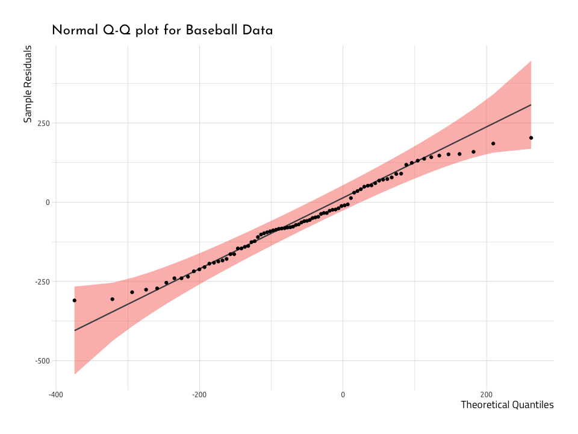<!-- -->

The graph above deviates from the diagonal towards the upper end of
the`Sample Residuals` and `Theoretical Quantiles`. This tells us the
data that are deviating from the straight line aren’t normal. We can
verify this by dropping the `dorm` function over a histogram, too.

``` r
ggHistNormResid <- AugRundiffWins %>%
  ggplot2::ggplot(aes(x = .resid)) +
  ggplot2::geom_histogram(aes(y = ..density..),
    colour = "darkred",
    fill = "firebrick",
    alpha = 0.3,
    bins = 30
  ) +
  ggplot2::stat_function(
    fun = dnorm,
    args = list(
      mean = mean(AugRundiffWins$.resid, na.rm = TRUE),
      sd = sd(AugRundiffWins$.resid, na.rm = TRUE)
    ),
    color = "darkblue",
    size = 1
  ) +
  ggplot2::labs(
    x = "Residuals",
    y = "Density",
    title = "The Residuals vs. Normal Distribution",
    subtitle = "Using Baseball Data"
  )
ggHistNormResid
```

<!-- -->

Again, we see that when we lay the normal distribution over the
histogram of the residuals, they are two humps poking out above the blue
normal distribution (i.e. the residuals have heavier tails). We will
continue to see if these data meet the assumptions.

### Linearity

It might seem redundant, but the next question we will ask ourselves is,
“*does a linear relationship makes sense?*” We can confirm linearity
with a scatterplot of the `.resid` and `.fitted` values. If data are
normally distributed, there will be more points above and below the `0`
line (which runs through the center of the plot).

#### Residuals vs. fitted values

The graph below is called the `Residual vs. Fitted Plot` and it puts the
`.fitted` on the `x` axis, and `.resid` on the `y`.

``` r
# get outliers for the data
NonNormalResid <- AugNormyNormx %>%
  dplyr::arrange(dplyr::desc(abs(.resid))) %>%
  dplyr::mutate(
    norm_x = base::round(norm_x, digits = 3),
    norm_y = base::round(norm_y, digits = 3)
  ) %>%
  utils::head(5)

ggResidVsFit <- AugNormyNormx %>%
  # fited on the x, residuals on the y
  ggplot2::ggplot(aes(
    x = .fitted,
    y = .resid
  )) +
  # add the points
  ggplot2::geom_point(
    size = 1.2,
    alpha = 3 / 4
  ) +
  # add the line for the points
  ggplot2::stat_smooth(
    method = "loess",
    color = "darkblue",
    show.legend = FALSE
  ) +
  # add the line for the zero intercept
  ggplot2::geom_hline(
    # add y intercept
    yintercept = 0,
    # add color
    color = "darkred",
    # add line type
    linetype = "dashed"
  ) +
  # add points for the outliers
  ggplot2::geom_point(
    data = NonNormalResid,
    aes(
      color = "darkred",
      size = .fitted
    ),
    show.legend = FALSE
  ) +
  # add text labels for outliers
  ggrepel::geom_text_repel(
    data = NonNormalResid,
    color = "darkblue",
    aes(label = base::paste(
      NonNormalResid$norm_x, ",",
      NonNormalResid$norm_y
    )),
    show.legend = FALSE
  ) +
  ggplot2::labs(
    x = "Fitted values",
    y = "Residuals",
    title = "Residual vs Fitted Using Simulated Data"
  )
ggResidVsFit
```

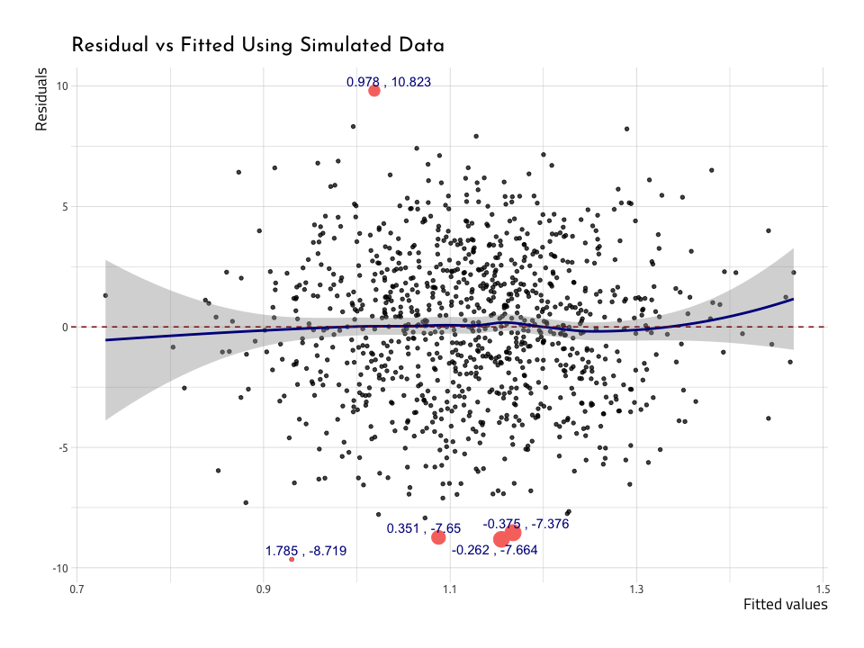<!-- -->

We’ve plotted five points with the highest `.resid`s, and we can see
they’re also the furthest from the center line. The blue `loess` line
curves above and below the zero line at the edges of the data, and the
standard error bands (the gray areas) get larger. This would be
concerning, but there are about just the same number of points above as
below the red zero line.

We’ll repeat this process for the baseball data in `AugRundiffWins`
(after creating the `NonNormResidRunsWins` data frame).

``` r
# get outliers for the data in NonNormResidRunsWins
NonNormResidRunsWins <- AugRundiffWins %>%
  dplyr::arrange(dplyr::desc(abs(.resid))) %>%
  head(5)
```

``` r
# plot ggResidVsFitRunsWins
ggResidVsFitRunsWins <- AugRundiffWins %>%
  ggplot2::ggplot(aes(
    x = .fitted,
    y = .resid
  )) +
  # add the points
  ggplot2::geom_point(show.legend = FALSE) +
  # add the line for the points
  ggplot2::stat_smooth(
    method = "loess",
    color = "darkblue",
    show.legend = FALSE
  ) +
  # add the line for the zero intercept
  ggplot2::geom_hline(
    # add y intercept
    yintercept = 0,
    # add color
    color = "darkred",
    # add line type
    linetype = "dashed"
  ) +
  # add points for the outliers
  ggplot2::geom_point(
    data = NonNormResidRunsWins,
    aes(
      color = "darkred",
      size = .fitted
    ),
    show.legend = FALSE
  ) +
  # add text labels
  ggrepel::geom_text_repel(
    data = NonNormResidRunsWins,
    color = "darkblue",
    aes(label = base::paste(
      NonNormResidRunsWins$name,
      NonNormResidRunsWins$yearID
    )),
    show.legend = FALSE
  ) +
  ggplot2::labs(
    x = "Fitted values",
    y = "Residuals",
    title = "Residual vs Fitted Using Baseball Data"
  )
ggResidVsFitRunsWins
```

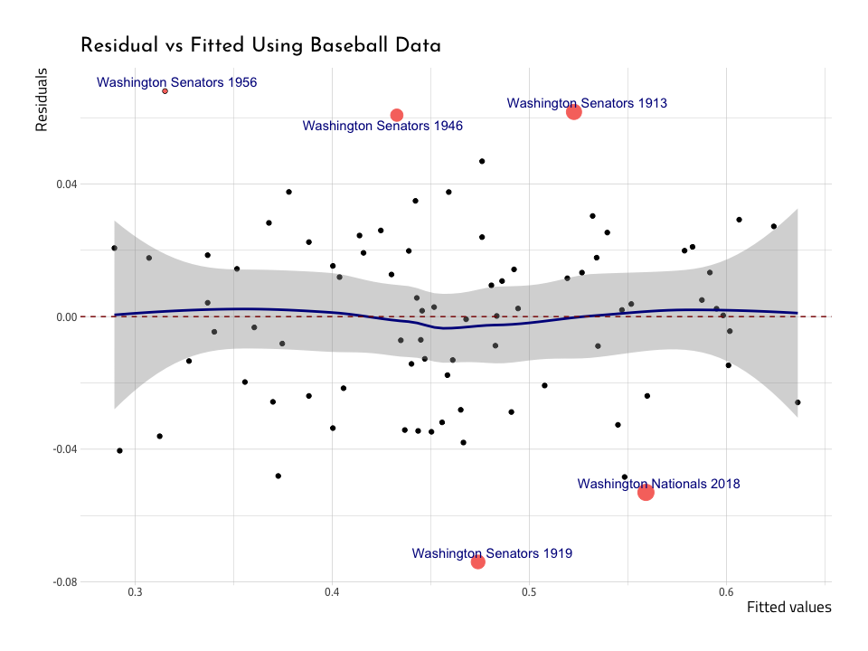<!-- -->

The plotted points are telling us where the linear model does worst in
predicting wins (`win_perc`) from runs (`run_diff`). The majority of the
outliers are from the `Washington Senators` before 1960, and only 1 (the
`2018` data point) is from the `Washington Nationals`. We’re going to
stop here and check the 2019 World Series winner a bit.

#### The outlier: 2018 Washington Nationals

Max Marchi, Jim Albert, and Ben Baumer give a great example on how to
demonstrate the utility of the linear regression model with a single
example. We’re going to repeat the method here we performed above
because we think it really ties the statistics from the
`broom::augment()` function into a practical use.

Consider below:

``` r
AugRundiffWins %>%
  dplyr::filter(yearID == 2018) %>%
  dplyr::select(win_perc:`.std.resid`)
```

<div class="kable-table">

| win\_perc | run\_diff |  .fitted |   .se.fit |      .resid |      .hat |    .sigma |   .cooksd | .std.resid |
| --------: | --------: | -------: | --------: | ----------: | --------: | --------: | --------: | ---------: |
| 0.5061728 |        89 | 0.559191 | 0.0046114 | \-0.0530182 | 0.0281048 | 0.0270113 | 0.0552673 |   \-1.9551 |

</div>

Perhaps it isn’t surprising that the 2018 Washington Nationals are an
outlier in terms of the `.resid` values, but we want to know *how* far
off they are in terms of prediction.

We can get the difference between the actual value of the winning
percentages (`win_perc = 0.5061728`) and the fitted values of the model
(`.fitted = 0.559191`), but we also need to multiply it by the number of
games in the season (`162`).

This calculation is going to give us the number of games that runs
didn’t do a good job in predicting the win.

``` r
# actual - predicted
(0.5061728 - 0.559191) * 162
```

    #>  [1] -8.588948

This results in the predictions being off by `-8.59` games (which is
more than you’d like if you’re betting in Vegas).

### Homogeneity of variance

[Wikipedia](https://en.wikipedia.org/wiki/Homogeneity_\(statistics\))
does a great job describing homogeneity (and it’s opposite,
heterogeneity),“*they relate to the validity of the often convenient
assumption that the statistical properties of any one part of an overall
dataset are the same as any other part*”

*Convenient* is aptly used here, because it’s *inconvenient* when that
statement is not true. If the variance is homogeneious, this means any
variation in the outcome variable (`wins_perc`) should be stable at all
levels of the other variable (`run_diff`).

Let’s add another term to the word-salad we’re creating:
[heteroscedasticity](https://en.wikipedia.org/wiki/Heteroscedasticity).
Data are considered heteroscedastic if the variance of their residuals
change as a function of the outcome value. Conversely, data are
[homoscedastic](https://en.wikipedia.org/wiki/Homoscedasticity) if the
variance is the same across all values of predictor variables. The graph
we use to assess these two measures is called the Scale-Location plot
(or Spread-Location plot).

We’ll build a Scale-Location graph below using the `AugNormyNormx` data.
Recall this model used `norm_x` as the predictor and `norm_y` as the
outcome.

``` r
ggScaleVSLocation <- AugNormyNormx %>%
  # here we plot the fitted and we get the squared root of the absolute value
  # of the std.resic
  ggplot2::ggplot(aes(
    x = .fitted,
    y = sqrt(abs(.std.resid))
  )) +
  # add the points
  ggplot2::geom_point(na.rm = TRUE) +
  # add stat smooth
  stat_smooth(
    method = "loess",
    color = "darkred",
    na.rm = TRUE
  ) +
  # add the labs
  ggplot2::labs(
    x = "Fitted Value",
    y = expression(sqrt("|Standardized residuals|")),
    title = "Scale-Location Using Simulated Data"
  )
ggScaleVSLocation
```

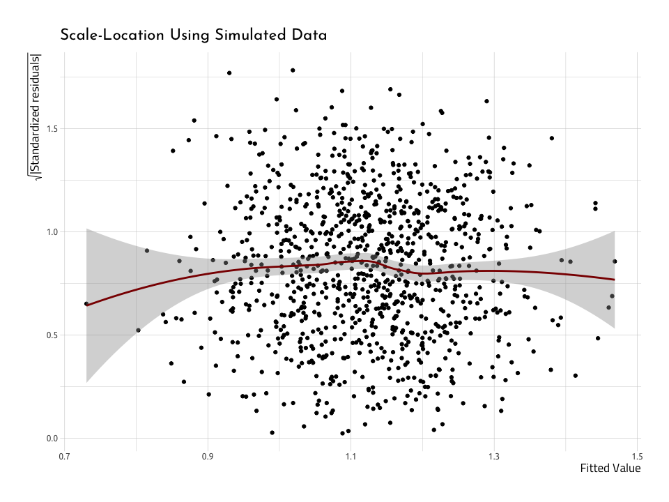<!-- -->

The Scale-Location (or Spread-Location) plot puts the squared root
(`sqrt()`) of the absolute value (`abs()`) of the standardized residuals
(`.std.resid`) on the `y` (that’s a mouthful\!). The `.fitted` values go
on the `x`. If the data are **homoscedastic**, we should see a
relatively straight line through the center of the plot, and an equal
number of points above and below the line.

### Scale-location plot

We’ll rebuild the `Scale-Location` plot, but this time use the
`AugRundiffWins` data frame.

``` r
ggScaleVSLocRundiffWins <- AugRundiffWins %>%
  # here we plot the fitted and we get the squared root of the absolute value
  # of the std.resic
  ggplot2::ggplot(aes(
    x = .fitted,
    y = sqrt(abs(.std.resid))
  )) +
  # add the points
  ggplot2::geom_point(na.rm = TRUE) +
  # add stat smooth
  stat_smooth(
    method = "loess",
    color = "darkred",
    na.rm = TRUE
  ) +
  # add the labs
  ggplot2::labs(
    x = "Fitted Value",
    y = expression(sqrt("|Standardized residuals|")),
    title = "Scale-Location"
  )
ggScaleVSLocRundiffWins
```

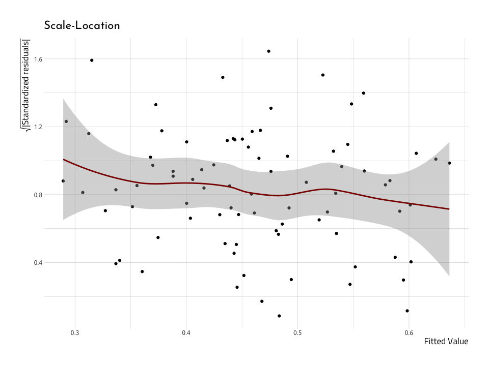<!-- -->

This doesn’t look much like the nice normally distributed data above.
First off, the gray area around the red line indicates a large standard
error. Second, the red line isn’t very straight across the horizontal
axis. But these together, and it’s not looking like these data are very
**homoscedastic**, which makes them **heteroscedastic** (which is,
indeed, inconvenient).

### Plotting influential cases

The next graph we’ll use to test the model assumptions will give us an
idea for how a single value might be affecting the overall fit of the
linear model. Before we stated the residuals give us a measure of the
overall error (i.e. how much the data points fall along the straight
line we’ve drawn). Well, Cook’s distance gives us an idea for how much a
*single value* influences the model’s ability to predict *all values*.

[Cook’s distance](https://en.wikipedia.org/wiki/Cook's_distance) is “*a
common measure of influential points in a regression model*”. If the
data are normal (like those in our `NormalData` data frame), then the
model should look like the one below.

First we check to see if there are any values with a Cook’s distance
greater than 1 (Cook and Weisberg (1982) suggested this was an
appropriate threshold) and store these in the `CooksDGTEQ1`.

``` r
CooksDGTEQ1 <- AugNormyNormx %>%
  dplyr::filter(.cooksd >= 1)
CooksDGTEQ1
```

<div class="kable-table">

| norm\_x | norm\_y | .fitted | .se.fit | .resid | .hat | .sigma | .cooksd | .std.resid |
| ------: | ------: | ------: | ------: | -----: | ---: | -----: | ------: | ---------: |

</div>

Looks like there weren’t any in the `AugNormyNormx`–but this is what
we’d expect from a dataset with normally distributed numbers like
those in `AugNormyNormx`. Instead, we will label the top 5 highest
values for `.cooksd` and put them in the `Top5CooksD` data frame.

``` r
Top5CooksD <- AugNormyNormx %>%
  dplyr::mutate(index_cooksd = seq_along(.cooksd)) %>%
  dplyr::arrange(desc(.cooksd)) %>%
  utils::head(5)
Top5CooksD %>% utils::head()
```

<div class="kable-table">

|    norm\_x |    norm\_y |   .fitted |   .se.fit |     .resid |      .hat |   .sigma |   .cooksd | .std.resid | index\_cooksd |
| ---------: | ---------: | --------: | --------: | ---------: | --------: | -------: | --------: | ---------: | ------------: |
|   1.785051 | \-8.718758 | 0.9300539 | 0.1974890 | \-9.648811 | 0.0040880 | 3.075137 | 0.0201097 | \-3.130215 |           261 |
|   2.231997 | \-6.415880 | 0.8809456 | 0.2359854 | \-7.296826 | 0.0058370 | 3.081641 | 0.0164792 | \-2.369278 |           908 |
| \-2.314562 |   7.882343 | 1.3804993 | 0.2447535 |   6.501844 | 0.0062788 | 3.083433 | 0.0140869 |   2.111617 |           128 |
|   2.301527 |   7.292411 | 0.8733059 | 0.2421163 |   6.419105 | 0.0061443 | 3.083609 | 0.0134327 |   2.084604 |           236 |
|   2.501259 | \-5.115224 | 0.8513604 | 0.2598889 | \-5.966584 | 0.0070794 | 3.084520 | 0.0133971 | \-1.938560 |           614 |

</div>

Even though none of these are above 1, we will use them to label the
five highest values of Cook’s distance.

### Cook’s distance plot

The plot puts the Cook’s distance on the `y` axis, and the observation
number on the `x` (the `x` axis will equal the number of observations
used in linear regression model). We also use the values for the
`.cooksd` as the labels (but we can adjust this in the next plot).

``` r
# create index_cooksd in AugNormyNormx
AugNormyNormx <- AugNormyNormx %>%
  dplyr::mutate(index_cooksd = seq_along(.cooksd))
# plot the new variable
ggCooksDistance <- AugNormyNormx %>%

  ggplot2::ggplot(
    data = .,
    # this goes on the x axis
    mapping = aes(
      x = index_cooksd,
      # Cook's D goes on the y
      y = .cooksd,
      # the minimum is always 0
      ymin = 0,
      # the max is the max value for .cooksd
      ymax = .cooksd
    )
  ) +
  # add the points with a size 0.8
  ggplot2::geom_point(
    size = 1.7,
    alpha = 4 / 5
  ) +
  # and the linegrange goes from the 0 on the y, to the point
  # on the y axis
  ggplot2::geom_linerange(
    size = 0.3,
    alpha = 2 / 3
  ) +
  # these are the labels for the outliers
  ggrepel::geom_label_repel(
    data = Top5CooksD,
    aes(
      label = Top5CooksD[[".cooksd"]],
      # move these over a tad
      nudge_x = 3,
      # color these with smoething nice
      color = "darkred"
    ),
    show.legend = FALSE
  ) +
  # set the ylim (y limits) for 0 and the max value for the .cooksd
  ggplot2::ylim(
    0,
    max(AugNormyNormx$.cooksd, na.rm = TRUE)
  ) +
  # the labs are added last
  ggplot2::labs(
    x = "Observation Number",
    y = "Cook's distance",
    title = "Cook's Distance"
  )
ggCooksDistance
```

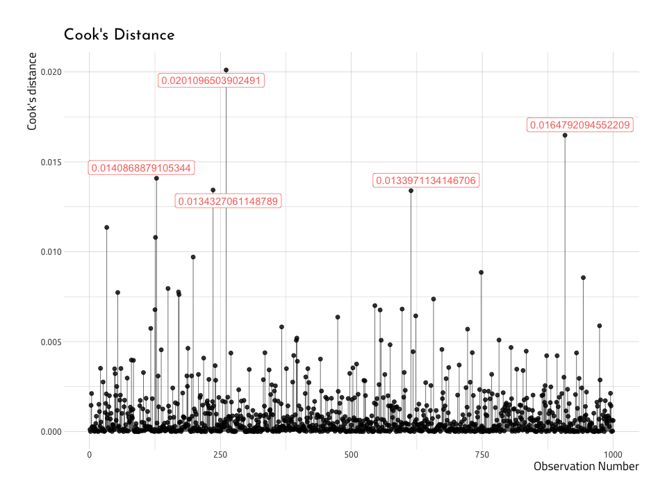<!-- -->

Now–we can create a similar plot with the baseball data
(`AugRundiffWins`), but this time we will only label the top five
`.cooksd` data points (not those with a `.cooksd` greater than 1). This
time we’ll label the `name` and `yearID` variables in the top five
`.cooksd`.

``` r
Top5CooksDRunWins <- AugRundiffWins %>%
  dplyr::mutate(index_cooksd = seq_along(.cooksd)) %>%
  dplyr::arrange(desc(.cooksd)) %>%
  dplyr::select(dplyr::starts_with("."), index_cooksd, name, yearID) %>%
  utils::head(5)
Top5CooksDRunWins %>% utils::str()
```

    #>  Classes 'tbl_df', 'tbl' and 'data.frame':   5 obs. of  10 variables:
    #>   $ .fitted     : num  0.315 0.292 0.559 0.523 0.312
    #>   $ .se.fit     : num  0.00599 0.00671 0.00461 0.00374 0.00608
    #>   $ .resid      : num  0.068 -0.0405 -0.053 0.0617 -0.0361
    #>   $ .hat        : num  0.0475 0.0595 0.0281 0.0185 0.0488
    #>   $ .sigma      : num  0.0265 0.0273 0.027 0.0268 0.0274
    #>   $ .cooksd     : num  0.16 0.0727 0.0553 0.0483 0.0464
    #>   $ .std.resid  : num  2.53 -1.52 -1.96 2.27 -1.34
    #>   $ index_cooksd: int  64 12 82 21 17
    #>   $ name        : chr  "Washington Senators" "Washington Senators" "Washington Nationals" "Washington Senators" ...
    #>   $ yearID      : int  1956 1904 2018 1913 1909

Now we will use the `Top5CooksDRunWins` to plot the top five `.cooksd`
values in the `AugRundiffWins` dataset.

``` r
# create index_cooksd in AugNormyNormx
AugRundiffWins <- AugRundiffWins %>%
  dplyr::mutate(index_cooksd = seq_along(.cooksd))
# plot the new variable
ggCooksDistRunWins <- AugRundiffWins %>%
  ggplot2::ggplot(
    data = .,
    # this goes on the x axis
    mapping = aes(
      x = index_cooksd,
      # Cook's D goes on the y
      y = .cooksd,
      # the minimum is always 0
      ymin = 0,
      # the max is the max value for .cooksd
      ymax = .cooksd
    )
  ) +
  # add the points with a size 0.8
  ggplot2::geom_point(
    size = 1.7,
    alpha = 4 / 5
  ) +
  # and the linegrange goes from the 0 on the y, to the point
  # on the y axis
  ggplot2::geom_linerange(
    size = 0.3,
    alpha = 2 / 3
  ) +
  # these are the labels for the outliers
  ggrepel::geom_label_repel(
    data = Top5CooksDRunWins,

    # combine the name and yearID
    aes(label = base::paste(
      Top5CooksDRunWins$name,
      Top5CooksDRunWins$yearID
    )),
    fill = "royalblue",
    color = "white",
    segment.color = "blue",
    nudge_y = 0.007,
    # nudge_x = 2,
    # remove the legend
    show.legend = FALSE
  ) +
  # set the ylim (y limits) for 0 and the max value for the .cooksd
  ggplot2::ylim(
    0,
    max(AugRundiffWins$.cooksd, na.rm = TRUE)
  ) +
  # the labs are added last
  ggplot2::labs(
    x = "Observation Number",
    y = "Cook's distance",
    title = "Cook's Distance"
  )
ggCooksDistRunWins
```

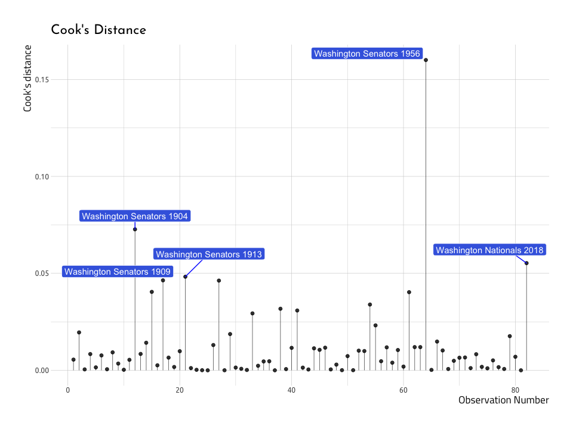<!-- -->

And what do we see on the graph? We can spot at least a few of the same
values we identified in the previous `Residual vs Fitted Plot`. Lets
overlay these points with another layer (thank you `ggplot2`\!).

``` r
Top5NonNormResid <- AugRundiffWins %>%
  dplyr::mutate(index_cooksd = seq_along(.cooksd)) %>%
  dplyr::arrange(dplyr::desc(abs(.resid))) %>%
  head(5)
# add the residuals
ggCooksDistRunWins +
  ggrepel::geom_label_repel(
    data = Top5NonNormResid,

    # combine the name and yearID
    aes(label = base::paste(
      Top5NonNormResid$name,
      Top5NonNormResid$yearID
    )),
    fill = "darkred",
    nudge_x = 5,
    segment.color = "darkred",
    color = "ivory",
    # remove the legend
    show.legend = FALSE
  )
```

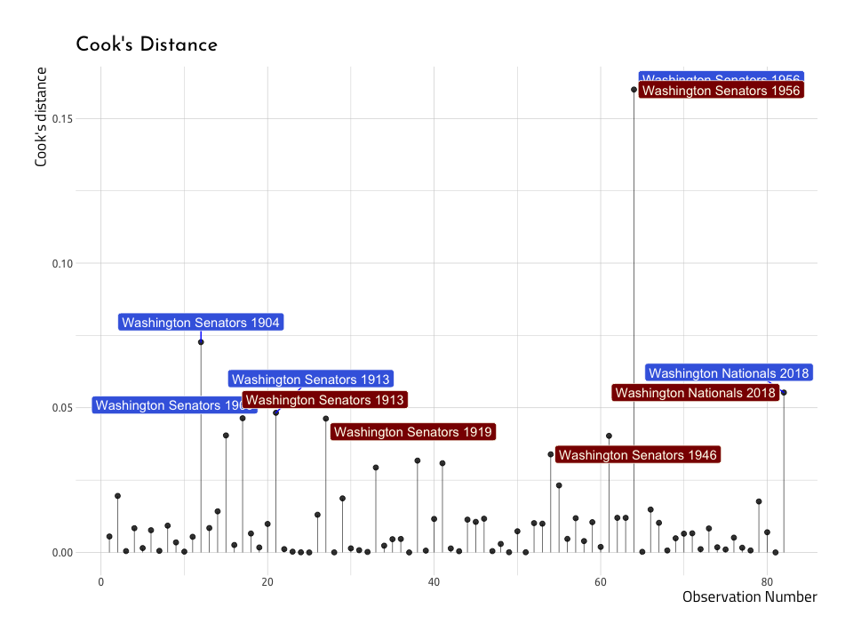<!-- -->

The graph above shows us that three out of the five teams with the
highest Cook’s distance are *also* the highest in terms of the residuals
(Washington Senators in 1913 and 1956, and the Washington Nationals in
2018). This re-enforces the notion that not all outliers are equally
influential in a model.

### Residuals vs. Leverage

As we can see from the Cook’s distance graph above, outliers aren’t all
created equal with respect to linear regression models. That means
sometimes excluding these outliers won’t make any difference on the
model’s performance (i.e. predictive ability). In this final graph, we
will graph the Leverage (stored in the `.hat` column of the
`broom::augment()` data frames) vs the standardized residuals (stored in
`.std.resid`).

``` r
ggResidLevPlot <- AugNormyNormx %>%
  ggplot2::ggplot(
    data = .,
    aes(
      x = .hat,
      y = .std.resid
    )
  ) +

  ggplot2::geom_point() +

  ggplot2::stat_smooth(
    method = "loess",
    color = "darkblue",
    na.rm = TRUE
  ) +

  ggrepel::geom_label_repel(
    data = Top5CooksD,
    mapping = aes(
      x = Top5CooksD$.hat,
      y = Top5CooksD$.std.resid,
      label = Top5CooksD$.cooksd
    ),
    label.size = 0.15
  ) +

  ggplot2::geom_point(
    data = Top5CooksD,
    mapping = aes(
      x = Top5CooksD$.hat,
      y = Top5CooksD$.std.resid
    ),
    show.legend = FALSE
  ) +

  ggplot2::labs(
    x = "Leverage",
    y = "Standardized Residuals",
    title = "Residual vs Leverage With Simulated Data"
  ) +

  scale_size_continuous("Cook's Distance", range = c(1, 5)) +

  theme(legend.position = "bottom")

ggResidLevPlot
```

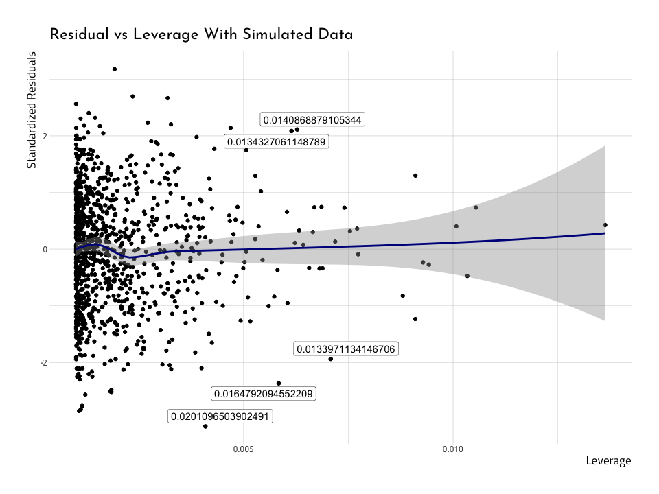<!-- -->

In regression, the leverage (`.hat`) measures the predictors distance
from those of the other observations. On this graph, we’re interested in
the points that end up in the right corners of the plot (upper or
lower). Those areas are the places where observations with a high Cook’s
distance end up. We’ve labeled them in this plot to help locate them.

Below is the same plot with the Baseball data in `AugRundiffWins`, with
the top five Cook’s distance variables labeled.

``` r
ggResidLevRunWinsPlot <- AugRundiffWins %>%
  ggplot2::ggplot(
    data = .,
    aes(
      x = .hat,
      y = .std.resid
    )
  ) +

  ggplot2::geom_point() +

  ggplot2::stat_smooth(
    method = "loess",
    color = "darkblue",
    na.rm = TRUE
  ) +

  ggrepel::geom_label_repel(
    data = Top5CooksDRunWins,
    mapping = aes(
      x = Top5CooksDRunWins$.hat,
      y = Top5CooksDRunWins$.std.resid,
      label = base::paste(
        Top5NonNormResid$name,
        Top5NonNormResid$yearID
      )
    ),
    label.size = 0.15
  ) +

  ggplot2::geom_point(
    data = Top5CooksDRunWins,
    mapping = aes(
      x = Top5CooksDRunWins$.hat,
      y = Top5CooksDRunWins$.std.resid
    ),
    show.legend = FALSE
  ) +

  ggplot2::labs(
    x = "Leverage",
    y = "Standardized Residuals",
    title = "Residual vs Leverage With Baseball Data"
  ) +

  scale_size_continuous("Cook's Distance", range = c(1, 5)) +

  theme(legend.position = "bottom")

ggResidLevRunWinsPlot
```

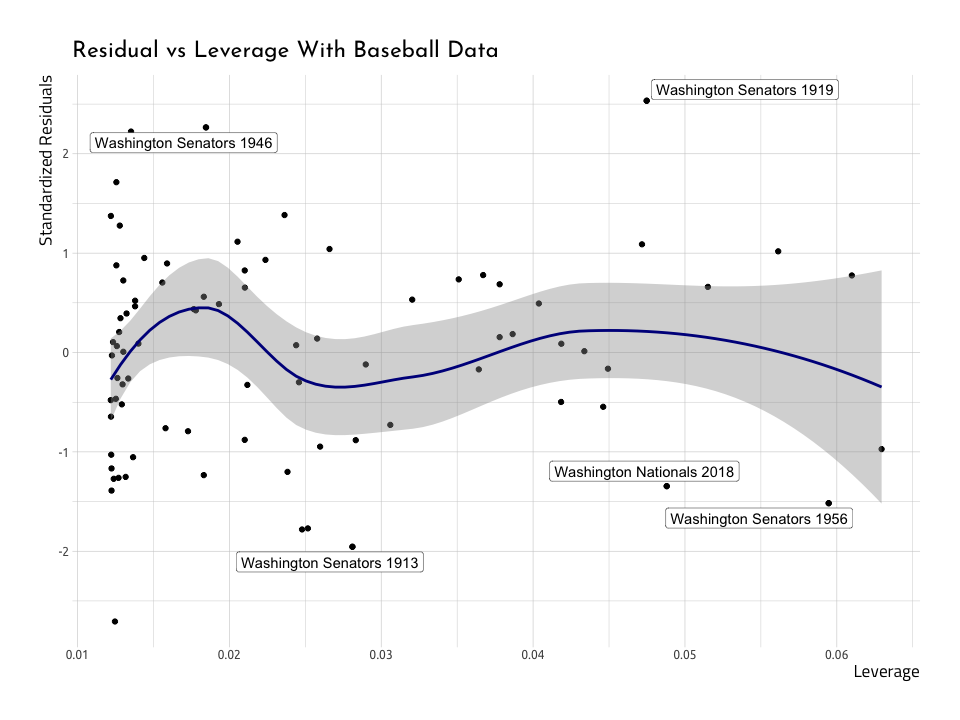<!-- -->

We can see there aren’t too far up in the corner, so we don’t need to
remove them. But there is a clear, reoccurring theme: the Washington
Senators in 1913 and 1956, and the Washington Nationals in 2018 don’t
seem to fit very well into the straight line we’re trying to predict.

## In closing…package it up into a function or package

That was a lot of typing\! Building these plot once is helpful to
understand how they work, but we definitely don’t want to re-create
these plots from scratch every time we want to diagnose a linear
regression model. We can bundle everything up into a function (like
[this one](http://bit.ly/gglm_Diagnose)), or we can use the amazing
[lindia package](https://github.com/yeukyul/lindia).

``` r
# devtools::install_github("yeukyul/lindia")
library(lindia)
lindia::gg_diagnose(linmod_y_x)
```

    #>  `stat_bin()` using `bins = 30`. Pick better value with `binwidth`.

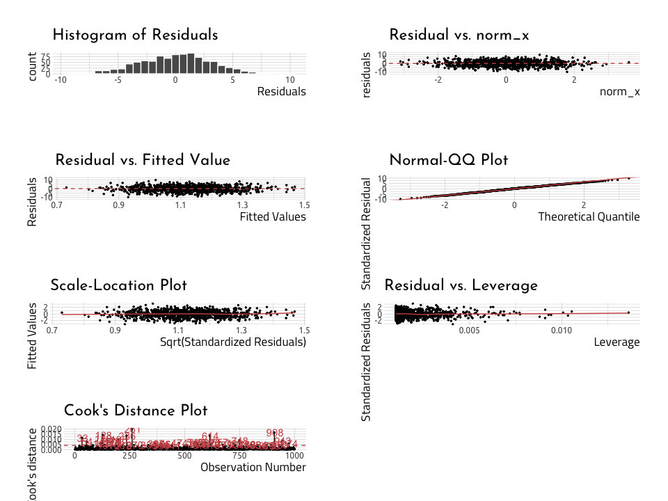<!-- -->

``` r
lindia::gg_diagnose(linmod_rundiff_wins)
```

    #>  `stat_bin()` using `bins = 30`. Pick better value with `binwidth`.

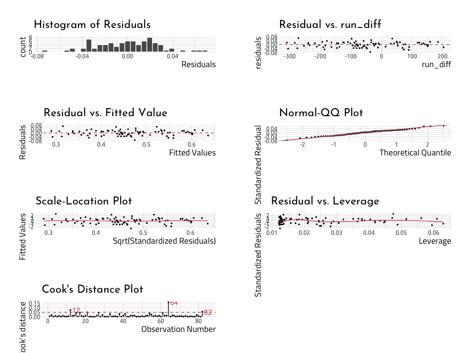<!-- -->

Read more about linear regression here:

1.  [Linear regression tutorial from the UC Business Analytics R
    Programming Guide](https://uc-r.github.io/linear_regression)  
2.  [Data Analysis Using Regression and Multilevel/Hierarchical
    Models](http://www.stat.columbia.edu/~gelman/arm/) by Andrew Gelman
    and Jennifer Hill
3.  [Linear Models in
    R](http://www.utstat.toronto.edu/~brunner/books/LinearModelsWithR.pdf)
    by Julian J.Faraway  
4.  [R regression models workshop
    notes](https://tutorials.iq.harvard.edu/R/Rstatistics/Rstatistics.html)
