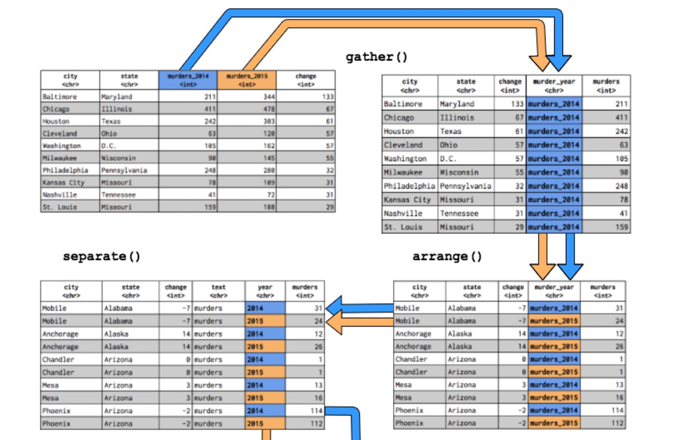
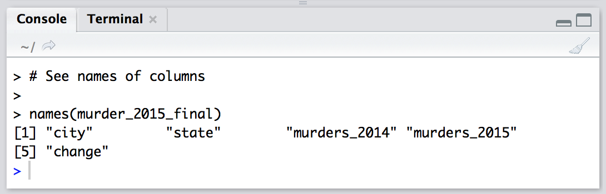
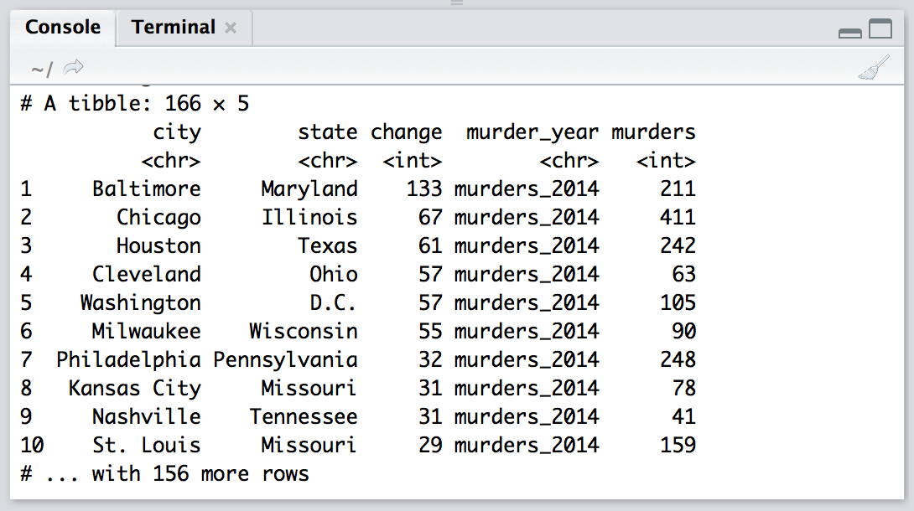
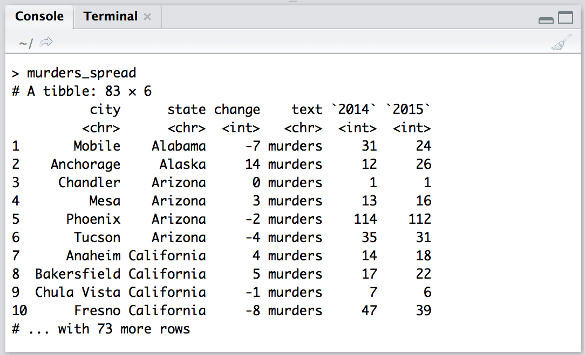
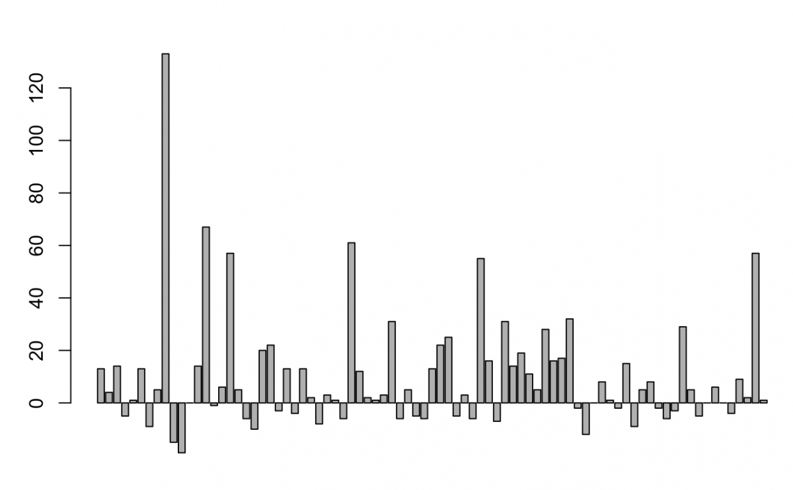
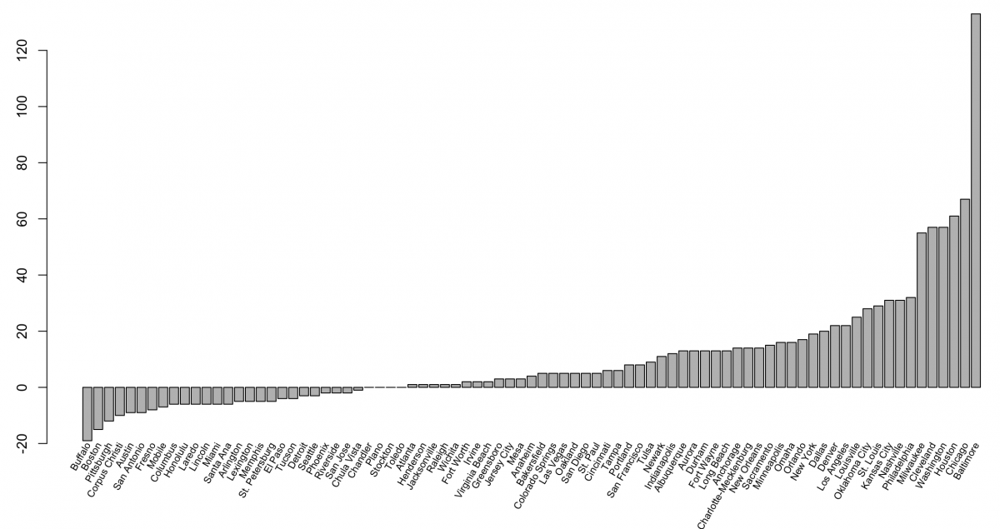

How to explore and manipulate a dataset from the fivethirtyeight package in R
================
Martin Frigaard
2017-05-12

-   [PACKAGES:](#packages)
-   [FILENAME:](#filename)
-   [HEADER:](#header)
-   [How to explore and manipulate a dataset from the fivethirtyeight package in R](#how-to-explore-and-manipulate-a-dataset-from-the-fivethirtyeight-package-in-r)
    -   [Install and load the package](#install-and-load-the-package)
    -   [Look at the dataset’s column names](#look-at-the-datasets-column-names)
    -   [Gather variables into a single column](#gather-variables-into-a-single-column)
    -   [Arrange data alphabetically by state and city](#arrange-data-alphabetically-by-state-and-city)
    -   [Separate `murder_year` column into `text` and `year`](#separate-murder_year-column-into-text-and-year)
    -   [Using unite to paste one column into another](#using-unite-to-paste-one-column-into-another)
    -   [Output the new table as a csv](#output-the-new-table-as-a-csv)
    -   [A recap of what we learned](#a-recap-of-what-we-learned)
    -   [A quick barplot](#a-quick-barplot)

#### PACKAGES:

``` r
download.file(url = "https://tinyurl.com/ya99kpcz", 
              destfile = "./F01-install_my_pkgs.R") # download my packages 
                                                    # from github
source("./F01-install_my_pkgs.R") # load them 
```

#### FILENAME:

``` r
file_number <- c("002") # version # 2
file_exten <- c(".Rmd")
file_title <- tolower(str_replace_all(
    "How to explore and manipulate a dataset from the fivethirtyeight package in R", 
    pattern = " ",
    replacement = "_"))
file_name <- paste0(file_number, "-", file_title, file_exten)
file_name
```

    ## [1] "002-how_to_explore_and_manipulate_a_dataset_from_the_fivethirtyeight_package_in_r.Rmd"

``` r
options(width = 80)
```

#### HEADER:

-   **File name:** 002-how\_to\_explore\_and\_manipulate\_a\_dataset\_from\_the\_fivethirtyeight\_package\_in\_r.Rmd
-   **Created date:** 2018-01-22
-   **R version:** R version 3.4.3 (2017-11-30)

> *this is the first in a five-part series on cleaning data to visualize it in R using the `tidyverse`*

------------------------------------------------------------------------



How to explore and manipulate a dataset from the fivethirtyeight package in R
=============================================================================

The [fivethirtyeight](https://cran.r-project.org/web/packages/fivethirtyeight/vignettes/fivethirtyeight.html) R package – released by Albert Y. Kim, Chester Ismay, and Jennifer Chunn last March – contains [dozens of datasets](https://github.com/fivethirtyeight/data) used in FiveThirtyEight news articles like " [A Handful Of Cities Are Driving 2016’s Rise In Murders](https://fivethirtyeight.com/features/a-handful-of-cities-are-driving-2016s-rise-in-murders/)", " [The Best MLB All-Star Teams Ever](https://fivethirtyeight.com/features/the-best-mlb-all-star-teams-ever/) ", and " [The Dallas Shooting Was Among The Deadliest For Police In U.S. History](https://fivethirtyeight.com/features/the-dallas-shooting-was-among-the-deadliest-for-police-in-u-s-history/)." This tutorial will explore the murder\_2015\_final dataset using tidyr principles like tibble, gather, arrange and separate from our [tidyverse](http://www.storybench.org/getting-started-with-tidyverse-in-r/) tutorial.

Install and load the package
----------------------------

Using RStudio, we’ll install and then load the `fivethirtyeight` package, as well as `tidyr`, `tibble` and `dplyr` and then call `murder_2015_final`.

``` r
library(fivethirtyeight)
library(tidyr)
library(tibble)
library(dplyr)
murder_2015_final <- fivethirtyeight::murder_2015_final %>% tbl_df()
murder_2015_final %>% glimpse()
```

    ## Observations: 83
    ## Variables: 5
    ## $ city         <chr> "Baltimore", "Chicago", "Houston", "Cleveland", "Washi...
    ## $ state        <chr> "Maryland", "Illinois", "Texas", "Ohio", "D.C.", "Wisc...
    ## $ murders_2014 <int> 211, 411, 242, 63, 105, 90, 248, 78, 41, 159, 45, 56, ...
    ## $ murders_2015 <int> 344, 478, 303, 120, 162, 145, 280, 109, 72, 188, 73, 8...
    ## $ change       <int> 133, 67, 61, 57, 57, 55, 32, 31, 31, 29, 28, 25, 22, 2...

Look at the dataset’s column names
----------------------------------

Use `names(murder_2015_final)` to list out the dataset’s column names.

``` r
# See names of columns
names(murder_2015_final)
```

    ## [1] "city"         "state"        "murders_2014" "murders_2015" "change"



Gather variables into a single column
-------------------------------------

Lets gather up the two year variables, `murders_2014` and `murders_2015` into a single year column we’ll name murder\_year. We’ll store the number of murders in a column titled murders and call this new object `murders_gathered`.

``` r
murders_gathered <- murder_2015_final %>% 
    gather(
        key = murder_year,
        value = murders,
        murders_2014:murders_2015,
        na.rm = TRUE)
murders_gathered
```



Arrange data alphabetically by state and city
---------------------------------------------

Now let’s arrange this data alphabetically by state and city. We can do this with `arrange()` from the `dplyr` package. (We’ll learn more about `dplyr` in the next tutorial!)

``` r
murders_arranged <- murders_gathered %>% 
    arrange(
        state, 
        city)
murders_arranged
```


So now we have the two years in a single column (`murder_year`), but the repeating `murder_ text` is redundant. I want to get the year in a column by itself.

Separate `murder_year` column into `text` and `year`
----------------------------------------------------

Now I want to put the murder years (2014 & 2015) back into two different columns. I’ll do this with `separate()`.

The `separate()` command uses a name of the existting column we want to separate (`murder_year`), and the names of the columns that will contain the separated values (`c("text", "year")`).

``` r
murders_separate <- murders_arranged %>%
    separate(
        murder_year,
            into = c("text", 
                     "year")
        )
murders_separate
```

Great. Now I can use `spread()` to put the year back into two different columns, `2014` & `2015`. But I will combine this with `arrange()` so the output is easier to read.

``` r
murders_spread <- murders_separate %>% 
    spread(
        year,
        murders
        ) %>% 
        arrange(
            state,
            city)
murders_spread
```



What if I want to combine `city` and `state` into a single column `city_state`?

Using unite to paste one column into another
--------------------------------------------

The final command, `unite()`, lets me paste the contents of columns onto one another. It requires the name of the new column `city_state` and the columns I want to combine `city` and `state`. But I want to sort this new tibble in descending order of change, and I want to remove the text variable.

I can combine all of these together with the pipe (`%>%`).

``` r
murders_final <- murders_spread %>%
unite(
    city_state, 
    city, 
    state) %>% 
        arrange(
            city_state
            ) %>% 
            select(
                -(text)
                )
murders_final
```

    ## # A tibble: 83 x 4
    ##    city_state             change `2014` `2015`
    ##    <chr>                   <int>  <int>  <int>
    ##  1 Albuquerque_New Mexico     13     30     43
    ##  2 Anaheim_California          4     14     18
    ##  3 Anchorage_Alaska           14     12     26
    ##  4 Arlington_Texas          -  5     13      8
    ##  5 Atlanta_Georgia             1     93     94
    ##  6 Aurora_Colorado            13     11     24
    ##  7 Austin_Texas             -  9     32     23
    ##  8 Bakersfield_California      5     17     22
    ##  9 Baltimore_Maryland        133    211    344
    ## 10 Boston_Massachusetts     - 15     53     38
    ## # ... with 73 more rows

Output the new table as a csv
-----------------------------

Use `write.csv(murders_final, file = "murders_final.csv",row.names=FALSE, na="")` and voilá, you have a csv.

``` r
write.csv(murders_final, file = "murders_final.csv",row.names = FALSE, na = "")
```


See full script here:

``` r
download.file(url = "https://tinyurl.com/yc2jtgxp", destfile = "002-how_to_explore_and_manipulate_a_dataset_from_the_fivethirtyeight_package_in_r")
source("002-how_to_explore_and_manipulate_a_dataset_from_the_fivethirtyeight_package_in_r")
```

A recap of what we learned
--------------------------

We used the pipe operator to string together various `tidyr` and `dplyr` functions for structuring our data (in tibbles). Remember that:

-   `gather()` collects data across columns and puts it into into rows
-   `arrange()` sorts the data in each column
-   `separate()` divides the contents of a column apart into new columns
-   `spread()` distributes data from rows into columns
-   `unite()` attaches the contents from one column onto the contents of another column


A quick barplot
---------------

By typing `murders_final %>% ggplot(aes(change)) + geom_bar()`, you can create a quick barplot of the change in murders by city.

``` r
barplot(murders_final$change)
```


``` r
# murders_final %>% ggplot(aes(change)) + geom_bar()
```



Obviously, the barplot is not visualizing the "change" column sorted low to high. To do that, try your hand with `arrange()`.

``` r
murders_final_sort <- murders_final %>% 
  arrange(
    change)
murders_final_sort
```

    ## # A tibble: 83 x 4
    ##    city_state              change `2014` `2015`
    ##    <chr>                    <int>  <int>  <int>
    ##  1 Buffalo_New York           -19     60     41
    ##  2 Boston_Massachusetts       -15     53     38
    ##  3 Pittsburgh_Pennsylvania    -12     69     57
    ##  4 Corpus Christi_Texas       -10     27     17
    ##  5 Austin_Texas               - 9     32     23
    ##  6 San Antonio_Texas          - 9    103     94
    ##  7 Fresno_California          - 8     47     39
    ##  8 Mobile_Alabama             - 7     31     24
    ##  9 Columbus_Ohio              - 6     83     77
    ## 10 Honolulu_Hawaii            - 6     21     15
    ## # ... with 73 more rows

Then, plotting `barplot(murders_final_sort$change)` will produce this:

``` r
barplot(murders_final_sort$change)
```


 To extend the y-axis to -20, add:

``` r
barplot(murders_final_sort$change,
        ylim = c(-20, 120))
```


Finally, we’ll add some labels. There are many different ways to add labels in R. Here’s one way:

``` r
midpts <- barplot(murders_final_sort$change,
                  cex.axis = 1.0, 
                  cex.names = 0.6,
                  ylim = c(-20, 120), 
                  main = "Change in murders from 2014 to 2015")

text(murders_gathered$city,
     x = midpts,
     offset = -0.1,
     y = -20,
     cex = 0.5,
     srt = 60,
     xpd = TRUE,
     pos = 2) 
```




